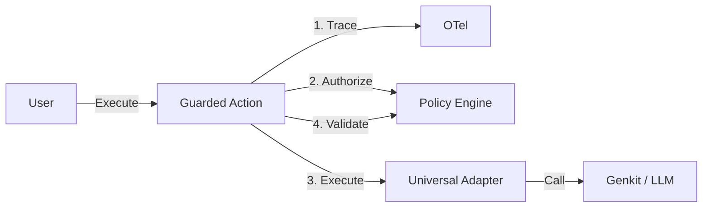

[](https://golang.org) [](LICENSE)

# Manglekit

**Manglekit** is a **Universal AI Governance Kernel** for Go. It wraps any AI operation—LLM calls, vector search, or native functions—in a secure, observable, and policy-driven **Guarded Action**.

Unlike traditional frameworks that force you into a specific "chain" or "agent" abstraction, Manglekit adopts a **"Wrap, Don't Build"** philosophy. You bring your own execution engine (Google Genkit, LangChain, or raw API calls), and Manglekit wraps it with a governance layer that enforces:

1.  **Policy Checks**: Pre- and post-execution validation using the Mangle Datalog engine.
2.  **Observability**: Automatic OpenTelemetry tracing and structured logging.
3.  **Safety**: Guaranteed authorization and output validation before data leaves the boundary.

> **📖 Architecture:** See [docs/CONTEXT.md](docs/CONTEXT.md) for the live architecture standard.

## 🚀 Key Features

-   **Universal Governance**: Wrap *any* `core.Action` (LLM, Retriever, Tool) with `client.Protect()`.
-   **Policy-as-Code**: Define authorization and validation rules in declarative Datalog (`.dl`).
-   **Zero-Config Reflection**: Automatically convert Go structs to Datalog facts for policy evaluation.
-   **OpenTelemetry Native**: Every Guarded Action emits a standardized trace span (`Action.{Name}`).
-   **Universal Adapters**: Built-in adapters for Google Genkit (`ai`, `vector`) and native Go functions.

## 🛠️ Getting Started

### Installation

```bash
go get github.com/duynguyendang/manglekit
```

### Quick Start

This example shows how to wrap a Genkit LLM model with Manglekit governance.

```go
package main

import (
    "context"
    "log"

    "github.com/duynguyendang/manglekit"
    "github.com/duynguyendang/manglekit/adapters/ai"
    "github.com/duynguyendang/manglekit/core"
    "github.com/firebase/genkit/go/ai"
    "github.com/firebase/genkit/go/plugins/googleai"
)

func main() {
    ctx := context.Background()

    // 1. Initialize Manglekit Client (The Kernel)
    // Loads policy rules from "policy.dl"
    client, err := manglekit.NewClient(ctx, "policy.dl")
    if err != nil {
        log.Fatal(err)
    }

    // 2. Initialize Genkit (The Driver)
    if err := googleai.Init(ctx, nil); err != nil {
        log.Fatal(err)
    }
    model := googleai.Model("gemini-1.5-flash")

    // 3. Create an Adapter
    // Wraps the Genkit model in a Manglekit Action
    llmAction := ai.NewLLMAction("generate-content", model)

    // 4. Protect the Action
    // Wraps the adapter in a GuardedAction (Trace -> AuthZ -> Exec -> Validate)
    safeAction := client.Protect(llmAction)

    // 5. Execute
    // The policy engine will authorize the input before Genkit is called
    input := core.NewEnvelope("Tell me a joke about security.")
    result, err := safeAction.Execute(ctx, input)
    if err != nil {
        log.Fatalf("Blocked by policy: %v", err)
    }

    log.Printf("Result: %v", result.Payload)
}
```

### Defining Policy (`policy.dl`)

Manglekit uses Datalog to define what is allowed.

```prolog
// Allow all requests by default
allow(Req) :- request(Req).

// Deny if the input contains "security" (just as an example)
deny(Req) :-
    request(Req),
    req_payload(Req, Text),
    fn:contains(Text, "security").
```

## 📦 Architecture

Manglekit v3.0.0 ("Genesis") is built on three pillars:

1.  **The Client (Kernel)**: The entry point that holds configuration, the Policy Engine, and Observability providers.
2.  **The Guard**: A decorator that enforces the `Trace -> Authorize -> Execute -> Validate` lifecycle.
3.  **The Engine**: A Datalog runtime that evaluates rules against the current state (Input/Output Envelopes).



## 📚 Documentation

-   **[AGENTS.md](AGENTS.md)**: Guide for AI agents working on this repo.
-   **[docs/CONTEXT.md](docs/CONTEXT.md)**: The architectural source of truth.
-   **[docs/TRACING.md](docs/TRACING.md)**: OpenTelemetry integration details.
-   **[docs/LOGGING.md](docs/LOGGING.md)**: Structured logging guide.

## 🤝 Contributing

Contributions are welcome! Please see [AGENTS.md](AGENTS.md) for architectural guidelines.

## 📜 License

Apache 2.0
