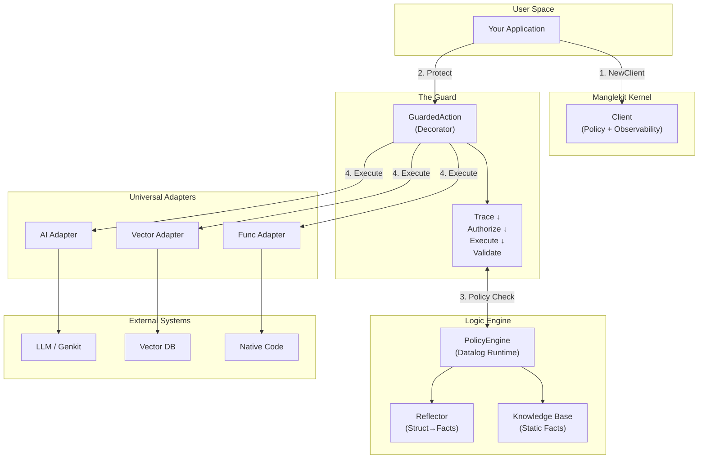

[](https://golang.org) [](LICENSE)

# Manglekit

**Manglekit** is a **Neuro-Symbolic AI Kernel** for Go. It adds a deterministic control plane to your probabilistic AI agents. 

Unlike frameworks that force you into rigid abstractions, Manglekit follows a **"Wrap, Don't Build"** philosophy. You bring your own tools (Genkit, LangChain, or raw APIs), and Manglekit wraps them in a Guarded Action—a secure, observable shell that enforces:

1. **Deterministic Safety**: Using a Datalog engine to enforce strict logic boundaries over LLM probabilities.
2. **Deep Observability**: Automatic tracing of why an agent made a decision (Logic Spans).
3. **Zero-Config Security**: Pre- and post-execution checks without pollution your business code.

> **📖 Architecture:** See [docs/CONTEXT.md](docs/CONTEXT.md) for the live architecture standard.

## 🚀 Key Features

-   🛡️ **Universal Guardrails**: Wrap *any* operation (LLM, Vector DB, Tool) in a secure `client.Protect()` shell.
-   🧠 **Deterministic Logic**: Enforce strict safety rules using Datalog (`.dl`), curbing the chaotic nature of probabilistic AI.
-   🪞 **Zero-Config Reflection**: Automatically map Go structs to Datalog facts—no manual glue code required.
-   🔭 **Deep Observability**: Native OpenTelemetry integration emits "Logical Spans" to trace *why* a decision was made.
-   🔌 **Plug-and-Play Drivers**: Built-in support for Google Genkit, MCP, and native Go functions via a modular driver system.

## 🛠️ Getting Started

### Installation

```bash
go get github.com/duynguyendang/manglekit
```

### Quick Start

This example shows how to wrap a Genkit LLM model with Manglekit governance.

```go
package main

import (
    "context"
    "log"

    "github.com/duynguyendang/manglekit"
    "github.com/duynguyendang/manglekit/adapters/ai"
    "github.com/duynguyendang/manglekit/core"
    "github.com/firebase/genkit/go/ai"
    "github.com/firebase/genkit/go/plugins/googleai"
)

func main() {
    ctx := context.Background()

    // 1. Initialize Manglekit Client (The Kernel)
    // Loads policy rules from "policy.dl"
    client, err := manglekit.NewClient(ctx, "policy.dl")
    if err != nil {
        log.Fatal(err)
    }

    // 2. Initialize Genkit (The Driver)
    if err := googleai.Init(ctx, nil); err != nil {
        log.Fatal(err)
    }
    model := googleai.Model("gemini-1.5-flash")

    // 3. Create an Adapter
    // Wraps the Genkit model in a Manglekit Action
    llmAction := ai.NewLLMAction("generate-content", model)

    // 4. Protect the Action
    // Wraps the adapter in a GuardedAction (Trace -> AuthZ -> Exec -> Validate)
    safeAction := client.Protect(llmAction)

    // 5. Execute
    // The policy engine will authorize the input before Genkit is called
    input := core.NewEnvelope("Tell me a joke about security.")
    result, err := safeAction.Execute(ctx, input)
    if err != nil {
        log.Fatalf("Blocked by policy: %v", err)
    }

    log.Printf("Result: %v", result.Payload)
}
```

### Defining Policy (`policy.dl`)

Manglekit uses Datalog to define what is allowed.

```prolog
// Allow all requests by default
allow(Req) :- request(Req).

// Deny if the input contains "security" (just as an example)
deny(Req) :-
    request(Req),
    req_payload(Req, Text),
    fn:contains(Text, "security").
```

## 📦 Architecture

Manglekit v1.0 is a **Neuro-Symbolic AI Kernel** built on three core layers:

### Layer 1: The Kernel (Client)
- **Role**: Orchestrates the entire governance flow
- **Responsibilities**: Holds configuration, manages the Policy Engine, and coordinates observability
- **Entry Point**: `manglekit.NewClient()` initializes the kernel with policy rules

### Layer 2: The Guard (GuardedAction)
- **Role**: A transparent execution wrapper that enforces deterministic governance
- **Lifecycle**: `Trace → Authorize → Execute → Validate`
  - **Trace**: Emit OpenTelemetry span for observability
  - **Authorize**: Pre-check using Datalog rules (deny unsafe inputs)
  - **Execute**: Run the inner Action (LLM, DB query, Tool)
  - **Validate**: Post-check using Datalog rules (reject unsafe outputs)
- **Pattern**: Decorator wrapping any `core.Action`

### Layer 3: The Engine (Datalog Runtime)
- **Role**: The deterministic reasoning layer
- **Components**:
  - **Solver**: Evaluates Datalog policies against facts
  - **Reflector**: Automatically converts Go structs to Datalog facts (zero-config)
  - **Knowledge Base**: Loads static RDF knowledge for reasoning
- **Guarantees**: Fast (microsecond latency), deterministic, testable

### Universal Adapters
Bridge external libraries into the kernel:
- **`ai` Adapter**: Wraps Google Genkit models and embedders
- **`vector` Adapter**: Handles semantic search and retrieval
- **`extractor` Adapter**: Semantic extraction using LLMs
- **`func` Adapter**: Wraps native Go functions
- **`mcp` Adapter**: Model Context Protocol integration

### The "Wrap, Don't Build" Philosophy
Unlike frameworks that construct your AI stack, Manglekit stays **non-intrusive**:
1. You build your application (with Genkit, LangChain, or raw APIs)
2. Manglekit wraps it in a `GuardedAction` via `client.Protect()`
3. Every execution is governed by deterministic Datalog rules

### Data Flow Diagram



## Core Concepts

| Concept | Purpose | Example |
|---------|---------|---------|
| **Action** | Universal interface for any operation | LLM call, DB query, API request |
| **Envelope** | Standardized data container | `{ID, Payload, Metadata}` |
| **GuardedAction** | Governance wrapper | `client.Protect(action)` |
| **Policy** | Datalog rules defining safety | `deny(Input) :- risk_score(Input, Score), Score > 8.` |
| **Decision** | Governance outcome | `ALLOW`, `DENY`, `RETRY` |

---

```text
.
├── adapters/           # Universal Adapters for external systems
│   ├── ai/             # Google Genkit AI models and embedders
│   ├── extractor/      # Semantic extraction adapter
│   ├── func/           # Native Go function wrapper
│   ├── mcp/            # Model Context Protocol adapter
│   └── vector/         # Vector/retrieval adapters
├── cmd/                # CLI tools and executables
│   └── mkit/           # Manglekit CLI command tools
├── config/             # Configuration loading (YAML, schema validation)
├── core/               # Core interfaces and contracts
│   ├── action.go       # Universal Action interface
│   ├── envelope.go     # Data container for all operations
│   ├── logger.go       # Structured logging interface
│   ├── tracer.go       # OpenTelemetry integration
│   └── ...             # Additional core abstractions
├── docs/               # Architecture and design documentation
├── engine/             # Datalog Policy Engine
│   ├── solver.go       # Policy evaluation runtime
│   ├── reflection.go   # Go struct to Datalog facts converter
│   ├── memory/         # Memory store implementations
│   └── resources/      # Knowledge base management
├── examples/           # Runnable examples and demos
├── guard/              # The Guard lifecycle orchestrator
│   ├── guard.go        # GuardedAction (Trace → AuthZ → Exec → Validate)
│   └── trace.go        # Tracing utilities
├── internal/           # Internal utilities (not for public import)
│   ├── logger/         # Logger implementations (zap, stdout)
│   ├── telemetry/      # OTel infrastructure
│   ├── testproviders/  # Test doubles and mocks
│   └── util/           # Helper utilities
├── policies/           # Static policy assets
├── sdk/                # SDK entry points and orchestration
│   ├── sdk.go          # Main SDK initialization
│   ├── loop.go         # RunLoop execution engine
│   └── policy_generator.go  # Policy generation tools
├── manglekit.go        # Main library entry point
└── [config files]      # go.mod, mangle.yaml, Makefile, etc.
```

## 📚 Documentation

### Architecture & Design
-   **[docs/CONTEXT.md](docs/CONTEXT.md)**: Live architecture snapshot and system contracts (source of truth)
-   **[docs/HLD.md](docs/HLD.md)**: High-level design explaining system boundaries and layering
-   **[docs/LLD.md](docs/LLD.md)**: Low-level implementation details for developers
-   **[docs/ADR.md](docs/ADR.md)**: Architecture Decision Records and design rationale

### Configuration & Deployment
-   **[docs/CONFIG.md](docs/CONFIG.md)**: Configuration guide with YAML setup and environment variables
-   **[docs/TRACING.md](docs/TRACING.md)**: OpenTelemetry integration and span hierarchy
-   **[docs/LOGGING.md](docs/LOGGING.md)**: Structured logging configuration and best practices

### Design & Philosophy
-   **[docs/CSD.md](docs/CSD.md)**: Conceptual Solution Design and core philosophy

### Contributing
-   **[AGENTS.md](AGENTS.md)**: Guide for AI agents working on this repo

## 🤝 Contributing

Contributions are welcome! Please see [AGENTS.md](AGENTS.md) for architectural guidelines.

## 📜 License

Apache 2.0
