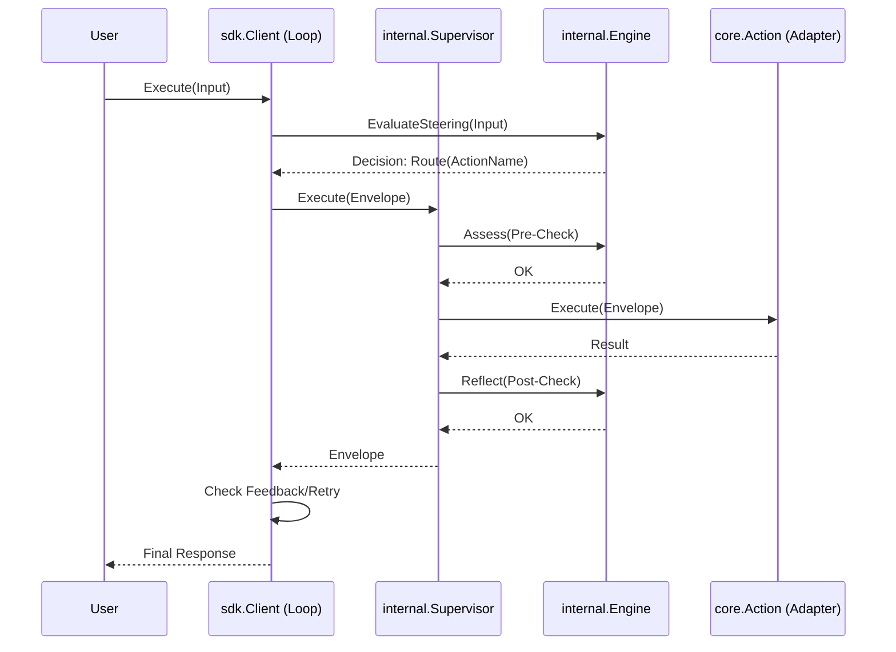

#### 2. THE COMPLETE FILE MAP

.
├── AGENTS.md
├── CONTRIBUTING.md
├── LICENSE
├── Makefile
├── README.md
├── adapters # Plugins (AI, Vector, Knowledge, MCP)
│   ├── ai
│   │   ├── adapter.go
│   │   ├── adapter_test.go
│   │   ├── genkit.go
│   │   └── utils.go
│   ├── extractor
│   │   ├── adapter.go
│   │   └── adapter_test.go
│   ├── func
│   │   └── wrapper.go
│   ├── knowledge
│   │   ├── graph_loader.go
│   │   ├── graph_loader_test.go
│   │   ├── nquads.go
│   │   ├── nquads_test.go
│   │   ├── ntriples.go
│   │   ├── rdf.go
│   │   └── rdf_stub.go
│   ├── logger
│   │   └── zap_adapter.go
│   ├── mcp
│   │   ├── action.go
│   │   ├── loader.go
│   │   └── loader_test.go
│   ├── resilience
│   │   ├── circuit_breaker.go
│   │   └── circuit_breaker_test.go
│   └── vector
│       ├── genkit_retriever.go
│       ├── retriever_adapter.go
│       └── retriever_adapter_test.go
├── cmd # CLI Entrypoints (mkit)
│   └── mkit
│       ├── README.md
│       ├── commands
│       │   ├── eval
│       │   ├── gen
│       │   ├── inspect
│       │   ├── kg
│       │   └── serve
│       └── main.go
├── config # Configuration Schemas
│   ├── loader.go
│   ├── loader_test.go
│   └── schema.go
├── core # Public Interfaces & Types (The Contract)
│   ├── context_facts.go
│   ├── context_lineage.go
│   ├── data.go
│   ├── errors.go
│   ├── governance.go
│   ├── infra.go
│   ├── logger.go
│   ├── logger_test.go
│   ├── logic.go
│   ├── memory.go
│   ├── state.go
│   ├── tracer.go
│   └── types.go
├── docs # Documentation & Specs
│   ├── ADR.md
│   ├── ARCHITECTURE_RULES.md
│   ├── CONFIG.md
│   ├── CONTEXT.md
│   ├── CSD.md
│   ├── HLD.md
│   ├── LLD.md
│   ├── LOGGING.md
│   ├── Mangle-quickstart.md
│   ├── TRACING.md
│   ├── VOCABULARY.md
│   └── reports
│       └── code-review.md
├── examples # Usage Scenarios
│   ├── AGENTS.md
│   ├── README.md
│   └── ... (omitted for brevity)
├── go.mod
├── go.sum
├── internal # Private Implementation Details
│   ├── engine # Neuro-Symbolic Core (Mangle Runtime)
│   │   ├── dual_mode_test.go
│   │   ├── evaluator.go
│   │   ├── evaluator_test.go
│   │   ├── flattener.go
│   │   ├── flattener_test.go
│   │   ├── memory
│   │   │   ├── volatile.go
│   │   │   └── volatile_test.go
│   │   ├── reflection.go
│   │   ├── reflection_test.go
│   │   ├── resources
│   │   │   ├── embed.go
│   │   │   ├── planner.dl
│   │   │   └── std.dl
│   │   ├── runtime.go
│   │   ├── solver.go
│   │   └── solver_test.go
│   ├── logger
│   │   └── std.go
│   ├── resources
│   │   └── icl
│   │       ├── embed.go
│   │       └── golden.dl
│   ├── statehelper
│   │   └── statehelper.go
│   ├── supervisor # Governance Logic (The Guard)
│   │   ├── supervisor.go
│   │   ├── supervisor_test.go
│   │   └── trace_test.go
│   ├── telemetry
│   │   └── otel.go
│   ├── testproviders
│   │   ├── mock
│   │   │   └── mock.go
│   │   ├── mocks.go
│   │   └── noop
│   │       └── noop_testhooks.go
│   ├── tools
│   │   └── rulegen
│   │       └── example_test.go
│   └── util # Stateless Utilities
│       └── schema
│           ├── generator.go
│           ├── schema_test.go
│           └── validator.go
├── main
├── mangle.yaml
├── manglekit.go
├── providers # External Service Integrations
│   ├── google
│   │   ├── factory.go
│   │   └── plugin.go
│   ├── memory
│   │   └── inmem
│   │       └── store.go
│   └── openai
│       ├── factory.go
│       └── plugin.go
└── sdk # Orchestration Layer (The Brain)
    ├── action_test.go
    ├── client.go
    ├── client_execute.go
    ├── config_loader.go
    ├── context.go
    ├── execute_typed.go
    ├── execute_typed_test.go
    ├── executor.go
    ├── generics.go
    ├── handle.go
    ├── helpers.go
    ├── integration_test.go
    ├── loader.go
    ├── loop.go
    ├── options.go
    ├── planner.go
    ├── policy_generator.go
    ├── policy_generator_test.go
    ├── reflection_test.go
    ├── registry.go
    ├── tracing.go
    └── types.go

#### 3. COMPONENTS (The Logic)

**1. Core (`core/`)**
*   **Responsibilities:** Defines the interfaces, data types, and contracts that all other components must adhere to. It is the stable center of the Hexagonal Architecture.
*   **Important Structs:**
    *   `Envelope`: The standard data container (Payload + Metadata).
    *   `Decision`: The outcome of a policy evaluation (Outcome, Target, Reasons).
    *   `ActionMetadata`: Describes an action's capability (Name, Type).
    *   `Message`: A unit of chat history.
*   **Key Functions:**
    *   `Evaluator`: Interface for the Policy Engine.
    *   `Action`: Interface for any executable unit.
    *   `StateProvider`: Interface for session persistence.

**2. Internal Engine (`internal/engine/`)**
*   **Responsibilities:** The "Brain" that executes logic. It combines Datalog reasoning (via `google/mangle`) with Go reflection to bridge the symbolic and sub-symbolic worlds.
*   **Important Structs:**
    *   `PolicyEngine` (Solver): The main reasoning component.
    *   `MangleRuntime`: Wraps the Datalog engine and fact storage.
*   **Key Functions:**
    *   `EvaluateSteering`: Determines the next step (Retry/Route).
    *   `ToFacts`: Reflects Go structs into Datalog facts.
    *   `Flatten`: Flattens generic JSON/Maps into graph facts.
    *   `LoadFromSource`: Parses and compiles Datalog rules.

**3. Internal Supervisor (`internal/supervisor/`)**
*   **Responsibilities:** The "Guard" wrapper. It intercepts execution to enforce policies (Pre-Check) and validate outputs (Post-Check).
*   **Important Structs:**
    *   `SupervisedAction`: The wrapper that implements the `Action` interface.
*   **Key Functions:**
    *   `Execute`: The intercepted execution flow (Assess -> Run -> Reflect).

**4. SDK (`sdk/`)**
*   **Responsibilities:** The "Orchestrator". It provides the high-level API for users to build agents, wiring together the Engine, Actions, and Memory.
*   **Important Structs:**
    *   `Client`: The main entry point.
    *   `RunLoop` (in loop.go): The semantic state machine that drives the conversation.
*   **Key Functions:**
    *   `ExecuteByName`: Runs an action with governance.
    *   `Plan`: Generates a sequence of steps to achieve a goal.
    *   `NewClientWithConfig`: Factory for creating clients.

**5. Adapters (`adapters/`)**
*   **Responsibilities:** The "Limbs". They adapt external libraries and services (Genkit, MCP, Function calls) to the `core.Action` interface.
*   **Important Structs:**
    *   `LLMAction` (ai): Adapts Genkit models.
    *   `MCPAction` (mcp): Adapts Model Context Protocol tools.
    *   `CircuitBreaker` (resilience): Adds fault tolerance.

**6. Providers (`providers/`)**
*   **Responsibilities:** Specific implementations of external services (e.g., Google Gemini, OpenAI).
*   **Key Functions:**
    *   `Register`: Registers the provider with the SDK.

#### 4. CRITICAL PATH & DATA (The Flow)

**Wiring Flow**
```mermaid
graph TD
    Config[config.Config] -->|Hydrates| SDK[sdk.Client]
    SDK -->|Initializes| Engine[internal/engine.PolicyEngine]
    SDK -->|Registers| Registry[Action Registry]
    Registry -->|Contains| Adapters[Adapters (AI, MCP, Func)]
    Engine -->|Loads| Rules[Datalog Rules]
```

**Execution Flow**


*   **Execution Flow Detail:** A request enters via `Client.Execute`. The Engine determines the initial `route`. The `RunLoop` manages the execution. It wraps the target action in a `SupervisedAction`. The Supervisor calls `Assess` (Pre-Check). If allowed, the underlying Adapter executes. The output is validated via `Reflect` (Post-Check). The loop checks for `retry` signals or new `route` instructions.
*   **Data Structures:**
    *   **Envelope:** The universal carrier. `Payload` holds the business data (struct or map). `Metadata` holds side-channel info (TraceID, UserID, Feedback). `SecurityLabels` track taint.
    *   **Facts:** Datalog atoms derived from the Envelope. E.g., `input_arg("req", "amount", 100)`, `label("pii")`.
    *   **Decision:** The authoritative command from the Engine to the SDK.

#### 5. SOURCE CODE DUMP

---
## internal/engine/resources/std.dl
```dlog
% --- Manglekit Standard Library (v2.0) ---
% Auto-loaded on engine startup.

% ==========================================
% 1. DATA REFLECTION (DO NOT REMOVE)
% These predicates allow the engine to read JSON inputs and Graph data.
% ==========================================

% JSON Primitives (Flattened)
Decl json_str(Parent, Key, Val).
Decl json_num(Parent, Key, Val).
Decl json_bool(Parent, Key, Val).
Decl json_link(Parent, Key, Child).
Decl json_null(Parent, Key).

% Knowledge Graph Primitives (N-Quads/Triples)
Decl quad(S, P, O, G).
Decl triple(S, P, O).
triple(S, P, O) :- quad(S, P, O, _).

% ==========================================
% 2. SYSTEM CONTROL (Standard Vocabulary)
% ==========================================

% Arity 1: Global/Single-Context (JSON)
Decl deny(Reason).
Decl halt(Reason).
Decl route(NextStep).
Decl retry(Feedback).

% Arity 2: Entity-Specific (Graph/Batch)
% Allows pinning the decision to a specific node (Entity).
Decl deny(Entity, Reason).
Decl halt(Entity, Reason).
Decl route(Entity, NextStep).
Decl retry(Entity, Feedback).

% Config is always Key-Value (Arity 2) or Entity-Key-Value (Arity 3)
Decl config(Key, Value).
Decl config(Entity, Key, Value).

% Semantic Alias for backward compatibility
halt(Reason) :- deny(Reason).
halt(Entity, Reason) :- deny(Entity, Reason).

% ==========================================
% 3. CONTEXT INJECTION
% These predicates are injected by the runtime environment.
% ==========================================

Decl attempt(N).            % Current retry count (0, 1, 2...).
Decl meta(Key, Value).      % Envelope metadata (e.g., user_id, session_id).
Decl label(Tag).            % Security taint labels (e.g., "pii", "unsafe").

% Telemetry Predicate (Arity 2: Entity, RuleID)
Decl violation_rule(Entity, RuleID).
```
---
## internal/engine/resources/planner.dl
```dlog
Decl goal(Name) .
Decl subgoal(Parent, Child, Order) .
Decl plan_step(Action, Order) .

plan_step(Action, Order) :- goal(G), subgoal(G, Action, Order).
```
---
## internal/engine/reflection.go
```go
package engine

import (
	"fmt"
	"reflect"
	"strings"
)

// ToFacts converts an arbitrary struct into a set of Datalog facts.
// It uses reflection to traverse the struct and generate facts of the form:
// predicate("id", "field", value)
//
// Parameters:
//   - id: The unique identifier for the root object.
//   - input: The struct to reflect.
//
// Returns:
//   - A slice of Datalog fact strings.
//   - An error if reflection fails.
func ToFacts(id string, input any) ([]string, error) {
	var facts []string
	if input == nil {
		return facts, nil
	}

	// [ADD] Cycle Detection Map
	visited := make(map[uintptr]bool)

	// Start recursive traversal
	// We pass an empty path initially.
	if err := toFactsRecursive(id, "", reflect.ValueOf(input), &facts, visited); err != nil {
		return nil, err
	}

	return facts, nil
}

func toFactsRecursive(id, path string, v reflect.Value, facts *[]string, visited map[uintptr]bool, args ...string) error {
	// Dereference pointers/interfaces
	for v.Kind() == reflect.Ptr || v.Kind() == reflect.Interface {
		if v.IsNil() {
			return nil
		}
		// Cycle Check
		if v.Kind() == reflect.Ptr {
			ptr := v.Pointer()
			if visited[ptr] {
				return nil
			}
			visited[ptr] = true
		}
		v = v.Elem()
	}

	switch v.Kind() {
	case reflect.Struct:
		t := v.Type()
		for i := 0; i < v.NumField(); i++ {
			field := v.Field(i)
			structField := t.Field(i)

			// Skip unexported fields
			if structField.PkgPath != "" {
				continue
			}

			// Handle JSON tags
			tag := structField.Tag.Get("mangle")
			fieldName := tag
			if fieldName == "" {
				jsonTag := structField.Tag.Get("json")
				if jsonTag != "" {
					parts := strings.Split(jsonTag, ",")
					fieldName = parts[0]
				}
			}
			if fieldName == "" {
				fieldName = strings.ToLower(structField.Name)
			}

			// Handle Embedded (Anonymous) Fields
			// Strategy: Flatten if anonymous AND untagged
			newPath := path
			isAnonymousUntagged := structField.Anonymous && tag == "" && structField.Tag.Get("json") == ""

			if !isAnonymousUntagged {
				if newPath != "" {
					newPath = newPath + "_" + fieldName
				} else {
					newPath = fieldName
				}
			}

			if err := toFactsRecursive(id, newPath, field, facts, visited, args...); err != nil {
				return err
			}
		}

	case reflect.Map:
		for _, key := range v.MapKeys() {
			val := v.MapIndex(key)
			keyStr := fmt.Sprintf("%v", key.Interface())

			// Append key to args
			newArgs := make([]string, len(args)+1)
			copy(newArgs, args)
			newArgs[len(args)] = keyStr

			if err := toFactsRecursive(id, path, val, facts, visited, newArgs...); err != nil {
				return err
			}
		}

	case reflect.Slice, reflect.Array:
		for i := 0; i < v.Len(); i++ {
			// Include index to preserve association and order
			idxStr := fmt.Sprintf("%d", i)
			newArgs := make([]string, len(args)+1)
			copy(newArgs, args)
			newArgs[len(args)] = idxStr

			if err := toFactsRecursive(id, path, v.Index(i), facts, visited, newArgs...); err != nil {
				return err
			}
		}

	default:
		// primitive handling
		generatePrimitiveFact(id, path, v, facts, args...)
	}
	return nil
}

// generatePrimitiveFact creates the final Datalog string: predicate("id", "arg", value).
func generatePrimitiveFact(id, path string, v reflect.Value, facts *[]string, args ...string) {
	var strVal string
	var isNumeric bool

	switch v.Kind() {
	case reflect.Int, reflect.Int8, reflect.Int16, reflect.Int32, reflect.Int64:
		strVal = fmt.Sprintf("%d", v.Int())
		isNumeric = true
	case reflect.Uint, reflect.Uint8, reflect.Uint16, reflect.Uint32, reflect.Uint64:
		strVal = fmt.Sprintf("%d", v.Uint())
		isNumeric = true
	case reflect.Float32, reflect.Float64:
		strVal = fmt.Sprintf("%g", v.Float()) // Use %g to preserve significant digits
		isNumeric = true
	case reflect.Bool:
		strVal = fmt.Sprintf("%v", v.Bool())
	default:
		strVal = fmt.Sprintf("%v", v.Interface())
	}

	predicate := path
	if predicate == "" {
		predicate = "value"
	}

	// Helper to escape strings (Must ensure this exists in file)
	safeID := escapeString(id)

	var sb strings.Builder
	sb.WriteString(predicate)
	sb.WriteByte('(')
	sb.WriteByte('"')
	sb.WriteString(safeID)
	sb.WriteByte('"')

	for _, arg := range args {
		sb.WriteString(", \"")
		sb.WriteString(escapeString(arg))
		sb.WriteByte('"')
	}

	sb.WriteString(", ")
	if isNumeric {
		sb.WriteString(strVal)
	} else {
		sb.WriteByte('"')
		sb.WriteString(escapeString(strVal))
		sb.WriteByte('"')
	}
	sb.WriteByte(')')

	*facts = append(*facts, sb.String())
}

func escapeString(s string) string {
	return strings.ReplaceAll(strings.ReplaceAll(s, "\\", "\\\\"), "\"", "\\\"")
}
```
---
## internal/engine/flattener.go
```go
package engine

import (
	"fmt"
	"reflect"
	"strconv"
	"strings"
)

// Flatten converts ANY dynamic structure (maps, slices of any type) into graph facts.
func Flatten(rootID string, input any) ([]string, error) {
	var facts []string
	if input == nil {
		return facts, nil
	}

	counter := 0
	// [ADD] Visited map to prevent infinite recursion
	visited := make(map[uintptr]bool)

	if err := flattenRecursive(rootID, reflect.ValueOf(input), &facts, &counter, visited); err != nil {
		return nil, err
	}
	return facts, nil
}

func flattenRecursive(nodeID string, v reflect.Value, facts *[]string, counter *int, visited map[uintptr]bool) error {
	// Dereference pointers/interfaces
	for v.Kind() == reflect.Ptr || v.Kind() == reflect.Interface {
		if v.IsNil() {
			return nil
		}
		// Cycle check for Pointers
		if v.Kind() == reflect.Ptr {
			ptr := v.Pointer()
			if visited[ptr] {
				return nil
			}
			visited[ptr] = true
		}
		v = v.Elem()
	}

	switch v.Kind() {
	case reflect.Map:
		// [IMPROVEMENT] Use Reflection to handle map[string]int, map[string]string, etc.
		// iterating generic map keys
		iter := v.MapRange()
		for iter.Next() {
			key := iter.Key()
			val := iter.Value()

			// Convert key to string (JSON keys are always strings)
			keyStr := fmt.Sprintf("%v", key.Interface())
			safeKey := escapeString(keyStr)

			// Unwrap interface to check actual type
			effVal := val
			for effVal.Kind() == reflect.Interface || effVal.Kind() == reflect.Ptr {
				if effVal.IsNil() {
					break
				}
				effVal = effVal.Elem()
			}

			if isComplexKind(effVal.Kind()) {
				*counter++
				childID := fmt.Sprintf("node_%d", *counter)

				// Fact: json_link(Parent, Key, Child)
				fact := fmt.Sprintf("json_link(\"%s\", \"%s\", \"%s\")", escapeString(nodeID), safeKey, childID)
				*facts = append(*facts, fact)

				if err := flattenRecursive(childID, val, facts, counter, visited); err != nil {
					return err
				}
			} else {
				addPrimitiveReflect(nodeID, safeKey, effVal, facts)
			}
		}

	case reflect.Slice, reflect.Array:
		for i := 0; i < v.Len(); i++ {
			val := v.Index(i)
			keyStr := strconv.Itoa(i) // Index is the key

			// Unwrap interface to check actual type
			effVal := val
			for effVal.Kind() == reflect.Interface || effVal.Kind() == reflect.Ptr {
				if effVal.IsNil() {
					break
				}
				effVal = effVal.Elem()
			}

			if isComplexKind(effVal.Kind()) {
				*counter++
				childID := fmt.Sprintf("node_%d", *counter)

				fact := fmt.Sprintf("json_link(\"%s\", \"%s\", \"%s\")", escapeString(nodeID), keyStr, childID)
				*facts = append(*facts, fact)

				if err := flattenRecursive(childID, val, facts, counter, visited); err != nil {
					return err
				}
			} else {
				addPrimitiveReflect(nodeID, keyStr, effVal, facts)
			}
		}
	default:
		// Base case if root input is primitive (unlikely but possible)
		// Usually handled by parent loop, but safeguard here
	}
	return nil
}

// Helper to check complexity based on Kind (faster than interface check)
func isComplexKind(k reflect.Kind) bool {
	// Ptr/Interface should be unwrapped before calling this
	return k == reflect.Map || k == reflect.Slice || k == reflect.Array
}

// addPrimitiveReflect uses reflect.Value to handle types precisely
func addPrimitiveReflect(nodeID, key string, v reflect.Value, facts *[]string) {
	// Dereference again just to be sure
	for v.Kind() == reflect.Ptr || v.Kind() == reflect.Interface {
		if v.IsNil() {
			return
		}
		v = v.Elem()
	}

	nodeID = escapeString(nodeID)
	// Key is already escaped by caller

	switch v.Kind() {
	case reflect.String:
		fact := fmt.Sprintf("json_str(\"%s\", \"%s\", \"%s\")", nodeID, key, escapeString(v.String()))
		*facts = append(*facts, fact)

	case reflect.Bool:
		sVal := "false"
		if v.Bool() {
			sVal = "true"
		}
		fact := fmt.Sprintf("json_bool(\"%s\", \"%s\", \"%s\")", nodeID, key, sVal)
		*facts = append(*facts, fact)

	case reflect.Int, reflect.Int8, reflect.Int16, reflect.Int32, reflect.Int64:
		fact := fmt.Sprintf("json_num(\"%s\", \"%s\", %d)", nodeID, key, v.Int())
		*facts = append(*facts, fact)

	case reflect.Uint, reflect.Uint8, reflect.Uint16, reflect.Uint32, reflect.Uint64:
		fact := fmt.Sprintf("json_num(\"%s\", \"%s\", %d)", nodeID, key, v.Uint())
		*facts = append(*facts, fact)

	case reflect.Float32, reflect.Float64:
		// [IMPROVEMENT] Use %g for better formatting
		fact := fmt.Sprintf("json_num(\"%s\", \"%s\", %g)", nodeID, key, v.Float())
		*facts = append(*facts, fact)

	default:
		// Fallback for structs that are strictly not map/slice but treated as leaf here?
		// Or other types like Complex64. Treat as string.
		sVal := fmt.Sprintf("%v", v.Interface())
		fact := fmt.Sprintf("json_str(\"%s\", \"%s\", \"%s\")", nodeID, key, escapeString(sVal))
		*facts = append(*facts, fact)
	}
}
```
---
## internal/supervisor/supervisor.go
```go
package supervisor

import (
	"context"
	"fmt"
	"time"

	"github.com/duynguyendang/manglekit/core"
)

// SupervisedAction wraps a core.Action with policy enforcement (Pre-Check) and validation (Post-Check).
// It acts as the "Guard" in the Universal Guarded Action (UGA) architecture.
type SupervisedAction struct {
	action    core.Action
	evaluator core.Evaluator
	tracer    core.Tracer
	failMode  string
}

// NewSupervisedAction creates a new SupervisedAction.
func NewSupervisedAction(action core.Action, evaluator core.Evaluator, tracer core.Tracer, failMode string) *SupervisedAction {
	return &SupervisedAction{
		action:    action,
		evaluator: evaluator,
		tracer:    tracer,
		failMode:  failMode,
	}
}

// Execute enforces the governance loop: Assess -> Execute -> Reflect.
func (s *SupervisedAction) Execute(ctx context.Context, input core.Envelope) (core.Envelope, error) {
	var span core.Span
	if s.tracer != nil {
		ctx, span = s.tracer.Start(ctx, core.SpanSupervisor)
		defer span.End()
	}

	meta := s.action.Metadata()

	// 1. Pre-Check (Assess)
	if err := s.evaluator.Assess(ctx, meta, input); err != nil {
		// Log and Handle Rejection
		if span != nil {
			span.RecordError(err)
			span.SetAttribute("policy.outcome", "denied")
		}
		if core.IsAlignmentError(err) {
			return core.Envelope{}, err // Always block Alignment Errors
		}
		// For system errors, check Fail Mode
		if s.failMode == "open" {
			// Log warning but proceed
			// In a real logger we would log here.
		} else {
			return core.Envelope{}, fmt.Errorf("action %s blocked by policy: %w", meta.Name, err)
		}
	}

	// 2. Execution (Run)
	start := time.Now()
	output, err := s.action.Execute(ctx, input)
	duration := time.Since(start)

	if err != nil {
		if span != nil {
			span.RecordError(err)
		}
		return core.Envelope{}, err
	}

	// Taint Propagation: Merge input labels into output
	output.MergeLabels(input.SecurityLabels)

	// 3. Post-Check (Reflect)
	validatedOutput, err := s.evaluator.Reflect(ctx, meta, output)
	if err != nil {
		if span != nil {
			span.RecordError(err)
			span.SetAttribute("policy.outcome", "validation_failed")
		}
		if core.IsAlignmentError(err) {
			return core.Envelope{}, err
		}
		if s.failMode == "open" {
			// Fail Open: Return original output
			return output, nil
		}
		return core.Envelope{}, fmt.Errorf("action %s result failed validation: %w", meta.Name, err)
	}

	if span != nil {
		span.SetAttribute("policy.outcome", "allowed")
		span.SetAttribute("duration_ms", duration.Milliseconds())
	}

	return validatedOutput, nil
}

func (s *SupervisedAction) Metadata() core.ActionMetadata {
	return s.action.Metadata()
}
```
---
## sdk/loop.go
```go
package sdk

import (
	"context"
	"errors"
	"fmt"
	"time"

	"github.com/duynguyendang/manglekit/core"
)

// RunLoopParams encapsulates the state for the execution loop.
type RunLoopParams struct {
	ActionName      string
	Payload         any
	Metadata        map[string]any
	RetryCount      int
	LastFeedback    string
	SessionID       string
	Store           core.MemoryStore
	MemoryMode      core.MemoryMode
	CurrentHistory  []core.Message
	FeedbackHistory []string
}

// runLoopInternal implements the Semantic State Machine.
// It handles: Steering -> Pre-Check -> Execution -> Post-Check -> Feedback/Retry.
func (c *Client) runLoopInternal(ctx context.Context, params *RunLoopParams) (core.Envelope, error) {
	// Re-resolve action (Dynamic Dispatch)
	actionName := params.ActionName
	action := c.registry.Get(actionName)
	if action == nil {
		return core.Envelope{}, fmt.Errorf("action not found: %s", actionName)
	}

	// 1. Construct Envelope
	env := core.NewEnvelope(params.Payload)
	env.Metadata = make(map[string]string) // Reset meta for clean slate, or merge?
	// Inject standard metadata
	for k, v := range params.Metadata {
		env.SetMeta(k, safelyStringify(v))
	}
	if params.SessionID != "" {
		env.SetMeta(core.KeySessionID, params.SessionID)
	}
	if params.LastFeedback != "" {
		env.SetFeedback(params.LastFeedback)
	}
	env.SetMeta("attempt", fmt.Sprintf("%d", params.RetryCount))

	// 2. Semantic Memory Retrieval (RAG)
	c.recallContext(ctx, params.Payload, &env)

	// Inject Chat History if persistent
	if params.Store != nil && params.SessionID != "" && params.MemoryMode == core.MemoryModePersist {
		history, err := params.Store.Read(ctx, params.SessionID)
		if err != nil && c.logger != nil {
			c.logger.Warn("Failed to read history", "err", err)
		} else {
			params.CurrentHistory = history
			env.SetHistory(history)
		}
	}

	// --- Phase 2: Check (Pre-check) & Phase 3: Execution (Intuition) ---
	// The Action.Execute wrapper handles the Pre-check (Blueprint) and the actual Genkit Execution.
	result, err := action.Execute(ctx, env)
	if err != nil {
		var pve *core.AlignmentError
		if errors.As(err, &pve) {
			if params.RetryCount >= DefaultMaxRetries {
				return core.Envelope{}, fmt.Errorf("max retries exceeded: %w", err)
			}
			params.RetryCount++
			params.LastFeedback = pve.Message

			if c.logger != nil {
				c.logger.Warn("RunLoop: Blueprint Alignment Issue", "feedback", params.LastFeedback, "attempt", params.RetryCount)
			}

			// Context-aware Backoff
			if err := c.backoff(ctx, params.RetryCount); err != nil {
				return core.Envelope{}, err
			}

			// Return a mock result to signal RETRY to caller
			res := core.NewEnvelope(params.Payload)
			res.Metadata[core.KeyDecision] = core.DecisionRetry
			return res, nil
		}
		return core.Envelope{}, err
	}

	params.LastFeedback = ""

	// 4. Update History
	if params.MemoryMode != core.MemoryModeNone {
		userContent := safelyStringify(params.Payload)
		assistContent := safelyStringify(result.Payload)

		newExchange := []core.Message{
			{Role: "user", Content: userContent},
			{Role: "assistant", Content: assistContent},
		}
		params.CurrentHistory = append(params.CurrentHistory, newExchange...)
	}

	// 5. Persist
	if params.Store != nil && params.SessionID != "" && params.MemoryMode == core.MemoryModePersist {
		if err := params.Store.Write(ctx, params.SessionID, params.CurrentHistory); err != nil && c.logger != nil {
			c.logger.Warn("RunLoop failed to persist history", "error", err)
		}
	}

	// --- Phase 4: Evaluation & Correction (Post-check) ---
	// The Engine evaluates the result against the Blueprint and decides next steps (Retry/Route/Allow).
	decision := result.Metadata[core.KeyDecision]

	// --- HOOK: MEMORIZE ---
	// Only learn if no error and Decision is PROCEED (or empty/legacy)
	if err == nil && (decision == "" || decision == core.DecisionProceed) {
		c.asyncMemorize(params.Payload, result.Payload)
	}

	if c.logger != nil {
		c.logger.Debug("RunLoop decision", "decision", decision, "action", actionName)
	}

	switch decision {
	case core.DecisionRetry:
		if params.RetryCount >= DefaultMaxRetries {
			return core.Envelope{}, fmt.Errorf("max retries exceeded for action %s", actionName)
		}
		params.RetryCount++
		hint := result.GetFeedback()
		params.LastFeedback = hint
		params.FeedbackHistory = append(params.FeedbackHistory, hint)

		if c.logger != nil {
			c.logger.Warn("RunLoop: RETRY triggered", "feedback", hint)
		}

		// Context-aware Backoff
		if err := c.backoff(ctx, params.RetryCount); err != nil {
			return core.Envelope{}, err
		}
		// Return result so caller loops
		return result, nil

	case core.DecisionRoute:
		// Reset retry count for new action
		params.RetryCount = 0
		params.FeedbackHistory = nil

		if c.logger != nil {
			c.logger.Info("RunLoop: Feedback history cleared for new action route")
		}
		// Return result so caller loops
		return result, nil

	case core.DecisionProceed, "":
		return result, nil

	case core.DecisionHalt:
		reason := result.Metadata["reason"]
		if reason == "" {
			reason = result.Metadata["violation_msg"]
		}
		if reason == "" {
			reason = "blueprint violation"
		}
		return core.Envelope{}, fmt.Errorf("action halted by blueprint: %s", reason)
	}

	// Should not reach here for standard decisions
	return result, nil
}

// backoff handles the sleep and context cancellation check
func (c *Client) backoff(ctx context.Context, retryCount int) error {
	sleepDuration := time.Duration(retryCount) * BackoffBase
	select {
	case <-ctx.Done():
		return ctx.Err()
	case <-time.After(sleepDuration):
		return nil
	}
}

// ---------------------------------------------------------
// PRIVATE HELPERS (Memory & Context)
// ---------------------------------------------------------

// safelyStringify converts any payload to string for embedding.
func safelyStringify(v any) string {
	if v == nil {
		return ""
	}
	if s, ok := v.(string); ok {
		return s
	}
	// Fallback to generic formatting
	return fmt.Sprintf("%v", v)
}

// recallContext handles the RAG lookup logic.
// It fails silently (logs only) to not break the main flow.
func (c *Client) recallContext(ctx context.Context, payload any, env *core.Envelope) {
	if c.agentMemory == nil {
		return
	}

	// [GATE] Check if memory is required
	if c.engine != nil {
		// Ask: requires(Req, "memory") ?
		needed, err := c.engine.CheckRequirement(ctx, *env, "memory")
		if err != nil {
			if c.logger != nil {
				c.logger.Warn("Engine check failed, skipping memory", "err", err)
			}
			return
		}
		if !needed {
			return // Skip RAG if not required
		}
	}

	// Start Span for Observability
	var span core.Span
	if c.tracer != nil {
		ctx, span = c.tracer.Start(ctx, core.SpanMemory)
		defer span.End()
	}

	inputStr := safelyStringify(payload)

	// Call Memory Provider
	contextData, err := c.agentMemory.Recall(ctx, inputStr)
	if err != nil {
		if c.logger != nil {
			c.logger.Warn("Memory Recall failed", "error", err)
		}
		if span != nil {
			span.RecordError(err)
		}
		return
	}

	// Inject if found
	if contextData != "" {
		env.SetMeta(core.KeyContext, contextData)
		if c.logger != nil {
			c.logger.Debug("Injected memory context", "len", len(contextData))
		}
	}
}

// asyncMemorize handles the Fire-and-Forget storage logic.
func (c *Client) asyncMemorize(input any, output any) {
	if c.agentMemory == nil {
		return
	}

	inputStr := safelyStringify(input)
	outputStr := safelyStringify(output)

	// Launch Goroutine to not block response latency
	go func(q, a string) {
		// Create a detached context with timeout to prevent leaks
		ctx, cancel := context.WithTimeout(context.Background(), 5*time.Second)
		defer cancel()

		if err := c.agentMemory.Memorize(ctx, q, a); err != nil {
			if c.logger != nil {
				c.logger.Warn("Memory Memorize failed", "error", err)
			}
		}
	}(inputStr, outputStr)
}
```
---
## core/types.go
```go
package core

import (
	"encoding/json"
	"fmt"
)

// ContentType defines the nature of the envelope payload.
type ContentType string

const (
	TypeStruct ContentType = "struct" // Reflection-ready Go Struct
	TypeJSON   ContentType = "json"   // Map/Slice requiring flattening
	TypeText   ContentType = "text"   // Raw String
)

// Envelope: The Universal Data Carrier.
type Envelope struct {
	ID             string            `json:"id"`
	Payload        any               `json:"data"` // Business Logic Data
	Metadata       map[string]string `json:"meta"` // Side-Channel Data
	SecurityLabels []string          `json:"labels"`
	ContentType    ContentType       `json:"content_type"`
}

// NewEnvelope creates a standard envelope.
func NewEnvelope(payload any) Envelope {
	ct := TypeStruct
	if _, ok := payload.(map[string]any); ok {
		ct = TypeJSON
	} else if _, ok := payload.(string); ok {
		ct = TypeText
	}

	return Envelope{
		ID:          "req", // Default ID
		Payload:     payload,
		Metadata:    make(map[string]string),
		ContentType: ct,
	}
}

// --- Metadata Constants ---
const (
	KeySessionID     = "session_id"
	KeyTraceID       = "trace_id"
	KeyFeedback      = "mangle_feedback"
	KeyDecision      = "policy_decision"
	KeyNextStep      = "next_step" // Route target
	KeyContext       = "context"   // RAG data
	KeyHistory       = "history"   // Chat history
	KeyPrevFeedback  = "prev_feedback"
	KeyRiskScore     = "risk_score"
)

// --- Decision Constants ---
const (
	DecisionProceed = "PROCEED"
	DecisionHalt    = "HALT"
	DecisionRetry   = "RETRY"
	DecisionRoute   = "ROUTE"
)

// SetMeta sets a metadata key-value pair.
func (e *Envelope) SetMeta(k, v string) {
	if e.Metadata == nil {
		e.Metadata = make(map[string]string)
	}
	e.Metadata[k] = v
}

// GetMeta retrieves a metadata value.
func (e *Envelope) GetMeta(k string) string {
	if e.Metadata == nil {
		return ""
	}
	return e.Metadata[k]
}

// GetMetaAny retrieves a metadata value from the source map (if available) or string map.
// This is a helper for when the envelope is constructed from a map with mixed types.
func (e *Envelope) GetMetaAny(k string) any {
	if v, ok := e.Metadata[k]; ok {
		return v
	}
	return nil
}

// Helper to stringify generic values
func (e *Envelope) GetMetaString(k string) string {
	return e.GetMeta(k)
}

// SetFeedback injects the "Teacher's" feedback into metadata
func (e *Envelope) SetFeedback(msg string) {
	e.SetMeta(KeyFeedback, msg)
}

// GetFeedback retrieves the feedback for the "Student" (AI/Logic)
func (e *Envelope) GetFeedback() string {
	return e.GetMeta(KeyFeedback)
}

// AddLabel adds a security label to the envelope if it does not already exist.
func (e *Envelope) AddLabel(label string) {
	if !e.HasLabel(label) {
		e.SecurityLabels = append(e.SecurityLabels, label)
	}
}

// HasLabel checks for the existence of a specific security label on the envelope.
func (e *Envelope) HasLabel(label string) bool {
	for _, l := range e.SecurityLabels {
		if l == label {
			return true
		}
	}
	return false
}

// MergeLabels appends distinct labels from another source to this one.
func (e *Envelope) MergeLabels(other []string) {
	for _, l := range other {
		e.AddLabel(l)
	}
}

// SetHistory serializes a list of chat messages into the envelope's metadata.
func (e *Envelope) SetHistory(msgs []Message) {
	b, err := json.Marshal(msgs)
	if err == nil {
		e.SetMeta(KeyHistory, string(b))
	}
}

// Decision: Structured result from the Policy Engine.
type Decision struct {
	Outcome string            // Matches DecisionProceed, DecisionHalt, etc.
	Target  string            // Used if Outcome == DecisionRoute
	Reasons []string          // Explanations
	Meta    map[string]string // Side-channel data (risk scores, latency budget)
}

// ConfigEvent: For Hot-Swap mechanisms.
type ConfigEvent struct {
	Key     string
	Content []byte
	Type    string
}

// ActionMetadata provides metadata about an action.
type ActionMetadata struct {
	// Name is the unique identifier for the action.
	Name string
	// Type describes the category of the action.
	Type string
	// InputContentType specifies the expected input format.
	InputContentType ContentType
	// InputType is the string name of the Go input type.
	InputType string
	// OutputType is the string name of the Go output type.
	OutputType string
	// IsDynamic indicates if the input type is generic.
	IsDynamic bool
}

// Message represents a single message in a conversation flow.
type Message struct {
	// Role indicates the sender of the message.
	Role string `json:"role"`
	// Content is the textual body of the message.
	Content string `json:"content"`
}

// ConversationHistory represents a sequence of messages in a conversation.
type ConversationHistory struct {
	// Messages is the ordered list of messages in the conversation.
	Messages []Message `json:"messages"`
}
```
---
## core/governance.go
```go
package core

import "context"

// Evaluator: The Mangle Logic Engine.
// It defines the contract for policy execution, validation, and steering.
type Evaluator interface {
	// AssessPlan evaluates the policy for a given input (General purpose).
	// It returns a Decision struct with the outcome.
	// Formerly: Assess
	AssessPlan(ctx context.Context, input Envelope) (Decision, error)

	// Assess performs the Pre-Check phase (input validation).
	// Formerly: Authorize
	Assess(ctx context.Context, actionMeta ActionMetadata, input Envelope) error

	// Reflect evaluates the outcome of an action (Post-Check).
	// Formerly: Validate
	Reflect(ctx context.Context, actionMeta ActionMetadata, output Envelope) (Envelope, error)

	// EvaluateSteering determines the next step (Retry/Route) based on the output.
	EvaluateSteering(ctx context.Context, input Envelope) (string, map[string]string, error)

	// GetActionConfig queries the engine for dynamic configuration parameters.
	GetActionConfig(ctx context.Context, input Envelope) (map[string]string, error)

	// CheckRequirement checks if a capability is needed. e.g., requires(Req, "memory").
	CheckRequirement(ctx context.Context, input Envelope, reqName string) (bool, error)

	// LoadPolicy loads policy rules from a source string or file content.
	LoadPolicy(ctx context.Context, source string) error

	// LoadFacts injects dynamic facts into the engine.
	LoadFacts(facts []string) error

	// RegisterAction registers action metadata for discovery/planning.
	RegisterAction(meta ActionMetadata) error

	// Logger returns the engine's logger.
	Logger() Logger
}

// PreProcessor: Fast/Stateless checks (CEL/Expr).
type PreProcessor interface {
	Process(ctx context.Context, input Envelope) (map[string]any, error)
}

// RiskEngine: specialized interface for calculating risk.
type RiskEngine interface {
	CalculateRisk(ctx context.Context, input Envelope) (float64, error)
}
```
---
## core/logic.go
```go
package core

import "context"

// Action defines the interface for a unit of work in the Manglekit system.
type Action interface {
	// Execute performs the action's logic.
	Execute(ctx context.Context, input Envelope) (Envelope, error)

	// Metadata returns the action's metadata.
	Metadata() ActionMetadata
}

// GenerateOption is a functional option for text generation.
type GenerateOption func(o *GenerationConfig)

// LLMResponse contains the generated text and token usage metadata.
type LLMResponse struct {
	Text  string
	Usage map[string]int
}

// TextGenerator abstracts the LLM.
type TextGenerator interface {
	// Complete generates text from a prompt.
	Complete(ctx context.Context, prompt string) (string, error)

	// Generate generates text with options.
	Generate(ctx context.Context, prompt string, opts ...GenerateOption) (*LLMResponse, error)

	// Stream generates a stream of text.
	Stream(ctx context.Context, prompt string) (<-chan string, error)
}
```
---
## config/schema.go
```go
package config

// Config is the root configuration structure for Manglekit.
type Config struct {
	// Policy configuration for the Datalog engine.
	Policy PolicyConfig `yaml:"policy" mapstructure:"policy"`

	// FailureMode determines how the system behaves when the policy engine or guard fails.
	FailureMode string `yaml:"failure_mode" mapstructure:"failure_mode"`

	// Observability configuration (Logging and Tracing).
	Observability ObservabilityConfig `yaml:"observability" mapstructure:"observability"`

	// Actions defines pre-configured actions that can be referenced by name.
	Actions map[string]ActionConfig `yaml:"actions" mapstructure:"actions"`

	// MCP defines a list of Model Context Protocol servers to connect to.
	MCP []MCPServerConfig `yaml:"mcp" mapstructure:"mcp"`

	// Knowledge configuration for static RDF facts.
	Knowledge KnowledgeConfig `yaml:"knowledge" mapstructure:"knowledge"`

	// Memory configuration for Semantic Memory (RAG).
	Memory MemoryConfig `yaml:"memory" mapstructure:"memory"`
}

const (
	FailureModeClosed = "closed"
	FailureModeOpen   = "open"
)

type KnowledgeConfig struct {
	Path string `yaml:"path" mapstructure:"path"`
}

type MemoryConfig struct {
	Provider string `yaml:"provider" mapstructure:"provider"`
	Path     string `yaml:"path" mapstructure:"path"`
	Options  map[string]interface{} `yaml:"options" mapstructure:"options"`
}

type PolicyConfig struct {
	Path              string `yaml:"path" mapstructure:"path"`
	EvaluationTimeout int    `yaml:"evaluation_timeout,omitempty" mapstructure:"evaluation_timeout"`
}

type ObservabilityConfig struct {
	Enabled      bool   `yaml:"enabled" mapstructure:"enabled"`
	ServiceName  string `yaml:"service_name,omitempty" mapstructure:"service_name"`
	LogLevel     string `yaml:"log_level,omitempty" mapstructure:"log_level"`
	OTLPEndpoint string `yaml:"otlp_endpoint,omitempty" mapstructure:"otlp_endpoint"`
}

type ActionConfig struct {
	Type          string                 `yaml:"type" mapstructure:"type"`
	Provider      string                 `yaml:"provider" mapstructure:"provider"`
	FailOnStartup bool                   `yaml:"fail_on_startup" mapstructure:"fail_on_startup"`
	Options       map[string]interface{} `yaml:"options" mapstructure:"options"`
}

type MCPServerConfig struct {
	Name          string   `yaml:"name" mapstructure:"name"`
	Transport     string   `yaml:"transport" mapstructure:"transport"`
	Command       string   `yaml:"command" mapstructure:"command"`
	Args          []string `yaml:"args" mapstructure:"args"`
	Env           []string `yaml:"env" mapstructure:"env"`
	FailOnStartup bool     `yaml:"fail_on_startup" mapstructure:"fail_on_startup"`
	Tools         []string `yaml:"tools" mapstructure:"tools"`
}
```

#### 6. CHANGELOG

*   2025-05-18: Kernel Resync. Added Datalog StdLib and Reflection Logic.
