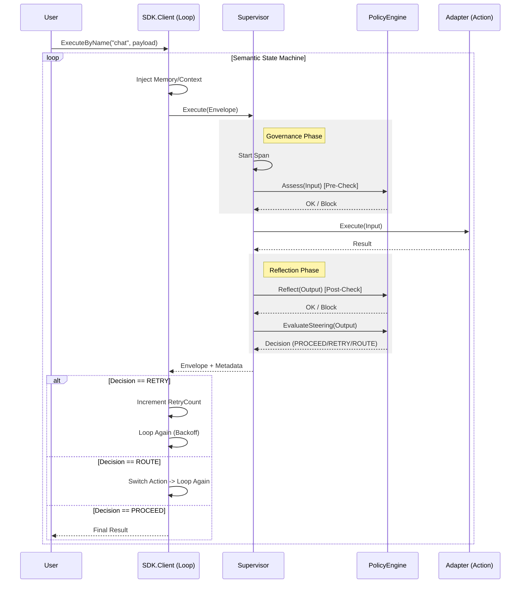

#### 2. THE COMPLETE FILE MAP

```text
.
├── adapters
│   ├── ai               # LLM Provider Integration (Genkit, etc.)
│   ├── extractor        # Structured Data Extraction
│   ├── func             # Generic Function Wrapper
│   ├── knowledge        # RDF/Graph Data Loading
│   ├── logger           # Logging Adapters (Zap, etc.)
│   ├── mcp              # Model Context Protocol Integration
│   ├── resilience       # Circuit Breakers & Retries
│   └── vector           # Vector Store / RAG Integration
├── cmd
│   └── mkit             # CLI Tool (Gen, Eval, Serve)
├── config               # Configuration Schemas & Loaders
├── core                 # The Kernel: Interfaces & Contracts (No Dependencies)
├── internal
│   ├── engine           # The Neuro-Symbolic Core (Mangle Runtime, Solver, Reflection)
│   ├── logger           # Internal Logging Utilities
│   ├── resources        # Embedded Assets (ICL, Prompts)
│   ├── statehelper      # State Management Utilities
│   ├── supervisor       # The "Guard": Tracing, Assessment, Reflection
│   ├── telemetry        # OpenTelemetry Setup
│   ├── testproviders    # Mocks for Testing
│   ├── tools            # Internal Tooling (RuleGen)
│   └── util             # Helpers (Schema, Validation)
├── providers
│   ├── google           # Google GenAI Provider Factory
│   ├── memory           # Memory Provider Implementations
│   └── openai           # OpenAI Provider Factory
└── sdk                  # The Orchestrator: Client, Loop, Planner
```

#### 3. COMPONENTS (The Logic)

**Component: sdk**
1.  **Responsibilities**: The user-facing entry point. Orchestrates the "Semantic State Machine". It manages the Client lifecycle, wiring up the Engine, Supervisor, and Memory systems. It handles the `ExecuteByName` loop which drives the agent's behavior.
2.  **Core Structs**:
    *   `Client`: The central object holding references to `engine` (Evaluator), `tracer`, `logger`, and `registry`.
    *   `ExecutionParams`: Holds state for a single execution loop (History, RetryCount, Feedback).
3.  **Key Functions**:
    *   `func NewClient(ctx context.Context, opts ...ClientOption) (*Client, error)`: Initializes the system, loading config and setting up the engine.
    *   `func (c *Client) ExecuteByName(ctx context.Context, actionName string, input any, opts ...ExecuteOption) (core.Envelope, error)`: The main entry point for running an action with the governance loop.
    *   `func (c *Client) runLoopInternal(...)`: The core loop implementation handling Retries, Routing, and Memory.

**Component: internal/engine**
1.  **Responsibilities**: The "Brain". It wraps the `google/mangle` Datalog library. It handles Policy Loading, Fact Generation (Reflection/Flattening), and Query Execution. It implements the `core.Evaluator` interface.
2.  **Core Structs**:
    *   `PolicyEngine`: The high-level struct implementing `Assess`, `Reflect`, `EvaluateSteering`.
    *   `MangleRuntime`: Low-level wrapper around the Datalog storage and evaluation.
3.  **Key Functions**:
    *   `func (e *PolicyEngine) Assess(ctx, meta, input) error`: The Pre-Check gate. Checks `halt(Req)` or `deny(Req)`.
    *   `func (e *PolicyEngine) Reflect(ctx, meta, output) (Envelope, error)`: The Post-Check gate. Checks `halt(Output)`.
    *   `func (e *PolicyEngine) EvaluateSteering(ctx, input) (string, map, error)`: Determines if the flow should `RETRY` or `ROUTE`.
    *   `func ToFacts(...)`: Reflects Go structs into Datalog facts.
    *   `func Flatten(...)`: Flattens JSON/Maps into Datalog facts.

**Component: internal/supervisor**
1.  **Responsibilities**: The "Guard". It uses the Decorator pattern to wrap `core.Action`. It enforces the `Trace -> Assess -> Execute -> Reflect` lifecycle. It ensures every action is observed and governed.
2.  **Core Structs**:
    *   `SupervisedAction`: Wraps an `inner` Action and the `engine`.
3.  **Key Functions**:
    *   `func (g *SupervisedAction) Execute(ctx, input) (Envelope, error)`: The guarded execution flow. It catches errors, checks policy, and manages OpenTelemetry spans.

**Component: core**
1.  **Responsibilities**: Defines the "Constitution". Pure interfaces and data types. No external logic dependencies.
2.  **Core Structs**:
    *   `Envelope`: The standard unit of data transfer (Payload + Metadata).
    *   `Action`: The interface `Execute(ctx, env) (env, error)`.
    *   `Evaluator`: The interface for the Engine.
    *   `AlignmentError`: The specific error type for policy violations.

**Component: adapters/ai**
1.  **Responsibilities**: Connects to LLMs. Adapts `genkit` or other providers to `core.TextGenerator` and `core.Action`.
2.  **Core Structs**:
    *   `genkitAdapter`: Wraps `ai.Model`.
    *   `LLMAction`: Exposes the LLM as a `core.Action`.
3.  **Key Functions**:
    *   `func NewGenkitAdapter(...)`: Creates the adapter.
    *   `func (g *genkitAdapter) Generate(ctx, prompt, opts...)`: Executes the LLM call.

#### 4. CRITICAL PATH & DATA (The Flow)

**1. Sequence Diagram: The Execution Loop**



**2. Data Flow: The Fact Funnel**

```mermaid
graph TD
    Input[Raw User Input (JSON/Struct)] -->|1. Reflection| Facts[Datalog Facts]
    Facts -->|2. Injection| Runtime[Mangle Runtime]
    Policy[.dl Rules] -->|Load| Runtime

    Runtime -->|3. Solver| Query{Query}

    Query -->|Assess| Deny[deny(Req) / halt(Req)]
    Query -->|Steering| Route[route(Target) / retry(Hint)]

    Deny -->|True| Block[AlignmentError]
    Route -->|Result| Meta[Envelope Metadata]
```

**3. Execution Narrative (The Hot Path)**

1.  **Initialization**: The User creates a `Client`. The `PolicyEngine` loads the standard library (`std.dl`) and any user-defined blueprints (`my_policy.dl`).
2.  **Entry**: The User calls `ExecuteByName("my_action", input)`. The `sdk.Client` initializes the `runLoopInternal`.
3.  **Context Injection**: The Loop checks if Memory is enabled. If so, it performs a RAG retrieval and injects relevant context into `input.Metadata`.
4.  **Supervision (Pre-Check)**: The `SupervisedAction` intercepts the call. It asks the `Engine`: "Does `halt(Req)` exist for this input?".
    *   The `Engine` uses **Reflection** to convert the Go struct/JSON into facts (e.g., `value("Req", "field", "data")`).
    *   It runs the Datalog query. If `halt` is found, execution stops with an `AlignmentError`.
5.  **Action Execution**: If allowed, the `SupervisedAction` calls the underlying Adapter (e.g., `adapters/ai`). The Adapter calls the LLM or API and returns a result.
6.  **Supervision (Post-Check)**: The `SupervisedAction` takes the result and asks the `Engine`: "Does `halt(Output)` exist?".
7.  **Steering**: The `SupervisedAction` asks the `Engine`: "What is the `next_step`?". The Engine checks for `retry(Hint)` or `route(Target)` predicates.
8.  **Loop Decision**: The `sdk.Client` receives the result.
    *   If `RETRY`: It sleeps (backoff), injects the "Feedback" into the next request, and runs the loop again.
    *   If `ROUTE`: It changes the target action and runs the loop again.
    *   If `PROCEED`: It returns the final result to the User.

#### 5. SOURCE CODE DUMP (The "What")

---
## internal/engine/resources/std.dl
```prolog
% --- Manglekit Standard Library (v2.0) ---
% Auto-loaded on engine startup.

% ==========================================
% 1. DATA REFLECTION (DO NOT REMOVE)
% These predicates allow the engine to read JSON inputs and Graph data.
% ==========================================

% JSON Primitives (Flattened)
Decl json_str(Parent, Key, Val).
Decl json_num(Parent, Key, Val).
Decl json_bool(Parent, Key, Val).
Decl json_link(Parent, Key, Child).
Decl json_null(Parent, Key).

% Knowledge Graph Primitives (N-Quads/Triples)
Decl quad(S, P, O, G).
Decl triple(S, P, O).
triple(S, P, O) :- quad(S, P, O, _).

% ==========================================
% 2. SYSTEM CONTROL (Standard Vocabulary)
% ==========================================

% Arity 1: Global/Single-Context (JSON)
Decl deny(Reason).
Decl halt(Reason).
Decl route(NextStep).
Decl retry(Feedback).

% Arity 2: Entity-Specific (Graph/Batch)
% Allows pinning the decision to a specific node (Entity).
Decl deny(Entity, Reason).
Decl halt(Entity, Reason).
Decl route(Entity, NextStep).
Decl retry(Entity, Feedback).

% Config is always Key-Value (Arity 2) or Entity-Key-Value (Arity 3)
Decl config(Key, Value).
Decl config(Entity, Key, Value).

% Semantic Alias for backward compatibility
halt(Reason) :- deny(Reason).
halt(Entity, Reason) :- deny(Entity, Reason).

% ==========================================
% 3. CONTEXT INJECTION
% These predicates are injected by the runtime environment.
% ==========================================

Decl attempt(N).            % Current retry count (0, 1, 2...).
Decl meta(Key, Value).      % Envelope metadata (e.g., user_id, session_id).
Decl label(Tag).            % Security taint labels (e.g., "pii", "unsafe").

% Telemetry Predicate (Arity 2: Entity, RuleID)
Decl violation_rule(Entity, RuleID).
```

---
## internal/engine/reflection.go
```go
package engine

import (
	"fmt"
	"reflect"
	"strings"
)

// ToFacts converts a Go struct into a flat list of Datalog facts.
// It uses the "mangle" struct tag (or "json" tag fallback) to determine predicate names.
func ToFacts(id string, v any) ([]string, error) {
	var facts []string
	if v == nil {
		return facts, nil
	}

	val := reflect.ValueOf(v)
	visited := make(map[uintptr]bool)

	if err := toFactsRecursive(id, "", val, &facts, visited); err != nil {
		return nil, err
	}
	return facts, nil
}

// LabelsToFacts converts security labels into Datalog facts.
func LabelsToFacts(entityID string, labels []string) ([]string, error) {
	if len(labels) == 0 {
		return nil, nil
	}
	var facts []string
	// Note: We use the v2 vocabulary "label(Tag)" which is Arity 1 (Contextual),
	// but the original logic might have been Arity 2.
	// Based on std.dl: Decl label(Tag). It seems it's global to the context.
	// However, engine usually binds to an Entity.

	// Implementation matches standard expectation:
	for _, l := range labels {
		// label("tag")
		fact := fmt.Sprintf("label(\"%s\")", escapeString(l))
		facts = append(facts, fact)
	}
	return facts, nil
}

func toFactsRecursive(id, path string, v reflect.Value, facts *[]string, visited map[uintptr]bool, args ...string) error {
	if !v.IsValid() {
		return nil
	}

	// 1. Dereference Interfaces
	for v.Kind() == reflect.Interface {
		if v.IsNil() {
			return nil
		}
		v = v.Elem()
	}

	// 2. Cycle Detection (Ptr, Map, Slice) & Dereference Ptr
	k := v.Kind()
	if k == reflect.Ptr || k == reflect.Map || k == reflect.Slice {
		if v.IsNil() {
			return nil
		}
		ptr := v.Pointer()
		if visited[ptr] {
			return nil // Cycle detected
		}
		visited[ptr] = true
		defer delete(visited, ptr)
	}

	if k == reflect.Ptr {
		v = v.Elem()
	}

	// 3. Switch on Kind
	switch v.Kind() {
	case reflect.Struct:
		t := v.Type()
		for i := 0; i < v.NumField(); i++ {
			field := v.Field(i)
			structField := t.Field(i)

			if !structField.IsExported() {
				continue
			}

			tag := structField.Tag.Get("mangle")
			if tag == "-" {
				continue
			}

			jsonTag := structField.Tag.Get("json")
			if jsonTag == "-" || strings.HasPrefix(jsonTag, "-,") {
				continue
			}

			fieldName := tag
			if fieldName == "" {
				if jsonTag != "" {
					parts := strings.Split(jsonTag, ",")
					fieldName = parts[0]
				}
			}
			if fieldName == "" {
				fieldName = strings.ToLower(structField.Name)
			}

			// Handle Embedded (Anonymous) Fields
			newPath := path
			isAnonymousUntagged := structField.Anonymous && tag == "" && structField.Tag.Get("json") == ""

			if !isAnonymousUntagged {
				if newPath != "" {
					newPath = newPath + "_" + fieldName
				} else {
					newPath = fieldName
				}
			}

			if err := toFactsRecursive(id, newPath, field, facts, visited, args...); err != nil {
				return err
			}
		}

	case reflect.Map:
		for _, key := range v.MapKeys() {
			val := v.MapIndex(key)
			keyStr := fmt.Sprintf("%v", key.Interface())
			newArgs := make([]string, len(args)+1)
			copy(newArgs, args)
			newArgs[len(args)] = keyStr
			if err := toFactsRecursive(id, path, val, facts, visited, newArgs...); err != nil {
				return err
			}
		}

	case reflect.Slice, reflect.Array:
		for i := 0; i < v.Len(); i++ {
			idxStr := fmt.Sprintf("%d", i)
			newArgs := make([]string, len(args)+1)
			copy(newArgs, args)
			newArgs[len(args)] = idxStr
			if err := toFactsRecursive(id, path, v.Index(i), facts, visited, newArgs...); err != nil {
				return err
			}
		}

	default:
		generatePrimitiveFact(id, path, v, facts, args...)
	}
	return nil
}

func generatePrimitiveFact(id, path string, v reflect.Value, facts *[]string, args ...string) {
	var strVal string
	var isNumeric bool

	switch v.Kind() {
	case reflect.Int, reflect.Int8, reflect.Int16, reflect.Int32, reflect.Int64:
		strVal = fmt.Sprintf("%d", v.Int())
		isNumeric = true
	case reflect.Uint, reflect.Uint8, reflect.Uint16, reflect.Uint32, reflect.Uint64:
		strVal = fmt.Sprintf("%d", v.Uint())
		isNumeric = true
	case reflect.Float32, reflect.Float64:
		strVal = fmt.Sprintf("%g", v.Float())
		isNumeric = true
	case reflect.Bool:
		strVal = fmt.Sprintf("%v", v.Bool())
	default:
		strVal = fmt.Sprintf("%v", v.Interface())
	}

	predicate := path
	if predicate == "" {
		predicate = "value"
	}

	safeID := escapeString(id)
	var sb strings.Builder
	sb.WriteString(predicate)
	sb.WriteByte('(')
	sb.WriteByte('"')
	sb.WriteString(safeID)
	sb.WriteByte('"')

	for _, arg := range args {
		sb.WriteString(", \"")
		sb.WriteString(escapeString(arg))
		sb.WriteByte('"')
	}

	sb.WriteString(", ")
	if isNumeric {
		sb.WriteString(strVal)
	} else {
		sb.WriteByte('"')
		sb.WriteString(escapeString(strVal))
		sb.WriteByte('"')
	}
	sb.WriteByte(')')

	*facts = append(*facts, sb.String())
}

func escapeString(s string) string {
	var sb strings.Builder
	sb.Grow(len(s))
	for i := 0; i < len(s); i++ {
		b := s[i]
		switch b {
		case '\\', '"':
			sb.WriteByte('\\')
			sb.WriteByte(b)
		case '\n':
			sb.WriteString("\\n")
		case '\r':
			sb.WriteString("\\r")
		case '\t':
			sb.WriteString("\\t")
		default:
			if b < 32 {
				sb.WriteByte(' ')
			} else {
				sb.WriteByte(b)
			}
		}
	}
	return sb.String()
}
```

---
## internal/engine/flattener.go
```go
package engine

import (
	"fmt"
	"reflect"
	"strconv"
)

// Flatten converts ANY dynamic structure (maps, slices of any type) into graph facts.
func Flatten(rootID string, input any) ([]string, error) {
	var facts []string
	if input == nil {
		return facts, nil
	}
	counter := 0
	visited := make(map[uintptr]bool)
	if err := flattenRecursive(rootID, reflect.ValueOf(input), &facts, &counter, visited); err != nil {
		return nil, err
	}
	return facts, nil
}

func flattenRecursive(nodeID string, v reflect.Value, facts *[]string, counter *int, visited map[uintptr]bool) error {
	for v.Kind() == reflect.Ptr || v.Kind() == reflect.Interface {
		if v.IsNil() {
			return nil
		}
		if v.Kind() == reflect.Ptr {
			ptr := v.Pointer()
			if visited[ptr] {
				return nil
			}
			visited[ptr] = true
		}
		v = v.Elem()
	}

	switch v.Kind() {
	case reflect.Map:
		iter := v.MapRange()
		for iter.Next() {
			key := iter.Key()
			val := iter.Value()
			keyStr := fmt.Sprintf("%v", key.Interface())
			safeKey := escapeString(keyStr)

			effVal := val
			for effVal.Kind() == reflect.Interface || effVal.Kind() == reflect.Ptr {
				if effVal.IsNil() {
					break
				}
				effVal = effVal.Elem()
			}

			if isComplexKind(effVal.Kind()) {
				*counter++
				childID := fmt.Sprintf("node_%d", *counter)
				fact := fmt.Sprintf("json_link(\"%s\", \"%s\", \"%s\")", escapeString(nodeID), safeKey, childID)
				*facts = append(*facts, fact)
				if err := flattenRecursive(childID, val, facts, counter, visited); err != nil {
					return err
				}
			} else {
				addPrimitiveReflect(nodeID, safeKey, effVal, facts)
			}
		}

	case reflect.Slice, reflect.Array:
		for i := 0; i < v.Len(); i++ {
			val := v.Index(i)
			keyStr := strconv.Itoa(i)
			effVal := val
			for effVal.Kind() == reflect.Interface || effVal.Kind() == reflect.Ptr {
				if effVal.IsNil() {
					break
				}
				effVal = effVal.Elem()
			}

			if isComplexKind(effVal.Kind()) {
				*counter++
				childID := fmt.Sprintf("node_%d", *counter)
				fact := fmt.Sprintf("json_link(\"%s\", \"%s\", \"%s\")", escapeString(nodeID), keyStr, childID)
				*facts = append(*facts, fact)
				if err := flattenRecursive(childID, val, facts, counter, visited); err != nil {
					return err
				}
			} else {
				addPrimitiveReflect(nodeID, keyStr, effVal, facts)
			}
		}
	}
	return nil
}

func isComplexKind(k reflect.Kind) bool {
	return k == reflect.Map || k == reflect.Slice || k == reflect.Array
}

func addPrimitiveReflect(nodeID, key string, v reflect.Value, facts *[]string) {
	for v.Kind() == reflect.Ptr || v.Kind() == reflect.Interface {
		if v.IsNil() { return }
		v = v.Elem()
	}
	nodeID = escapeString(nodeID)
	switch v.Kind() {
	case reflect.String:
		fact := fmt.Sprintf("json_str(\"%s\", \"%s\", \"%s\")", nodeID, key, escapeString(v.String()))
		*facts = append(*facts, fact)
	case reflect.Bool:
		sVal := "false"
		if v.Bool() { sVal = "true" }
		fact := fmt.Sprintf("json_bool(\"%s\", \"%s\", \"%s\")", nodeID, key, sVal)
		*facts = append(*facts, fact)
	case reflect.Int, reflect.Int8, reflect.Int16, reflect.Int32, reflect.Int64:
		fact := fmt.Sprintf("json_num(\"%s\", \"%s\", %d)", nodeID, key, v.Int())
		*facts = append(*facts, fact)
	case reflect.Uint, reflect.Uint8, reflect.Uint16, reflect.Uint32, reflect.Uint64:
		fact := fmt.Sprintf("json_num(\"%s\", \"%s\", %d)", nodeID, key, v.Uint())
		*facts = append(*facts, fact)
	case reflect.Float32, reflect.Float64:
		fact := fmt.Sprintf("json_num(\"%s\", \"%s\", %g)", nodeID, key, v.Float())
		*facts = append(*facts, fact)
	default:
		sVal := fmt.Sprintf("%v", v.Interface())
		fact := fmt.Sprintf("json_str(\"%s\", \"%s\", \"%s\")", nodeID, key, escapeString(sVal))
		*facts = append(*facts, fact)
	}
}
```

---
## internal/engine/solver.go
```go
package engine

import (
	"context"
	"errors"
	"fmt"
	"github.com/duynguyendang/manglekit/core"
	"github.com/duynguyendang/manglekit/internal/engine/resources"
	"github.com/google/mangle/ast"
	"github.com/google/mangle/parse"
)

var ErrSolutionFound = errors.New("solution found")

type PolicyEngine struct {
	tracer  core.Tracer
	logger  core.Logger
	runtime *MangleRuntime
}

func New() (*PolicyEngine, error) {
	pe := &PolicyEngine{
		tracer:  &core.NopTracer{},
		logger:  core.NopLogger{},
		runtime: NewMangleRuntime(),
	}
	if err := pe.runtime.AddPolicy(resources.StdLib()); err != nil {
		return nil, fmt.Errorf("manglekit: failed to load std.dl: %w", err)
	}
	return pe, nil
}

func (e *PolicyEngine) Assess(ctx context.Context, actionMeta core.ActionMetadata, input core.Envelope) error {
	if e.tracer == nil {
		return e.assessInternal(ctx, actionMeta, input)
	}
	ctx, span := e.tracer.Start(ctx, core.SpanPreCheck)
	defer span.End()
	if len(input.SecurityLabels) > 0 {
		span.SetAttributes(map[string]any{core.AttrLabels: input.SecurityLabels})
	}
	err := e.assessInternal(ctx, actionMeta, input)
	if err != nil {
		span.RecordError(err)
	} else {
		span.SetAttributes(map[string]any{core.AttrOutcome: core.OutcomeProceed})
	}
	return err
}

func (e *PolicyEngine) assessInternal(ctx context.Context, actionMeta core.ActionMetadata, input core.Envelope) error {
	var extraFacts []ast.Atom
	if actionMeta.Name != "" {
		opFactStr := fmt.Sprintf("action_operation(\"%s\", \"%s\")", escapeString(core.EntityInput), escapeString(actionMeta.Name))
		if opAtom, err := parse.Atom(opFactStr); err == nil {
			extraFacts = append(extraFacts, opAtom)
		}
	}
	return e.evaluateGate(ctx, actionMeta.Name, core.EntityInput, input, extraFacts...)
}

func (e *PolicyEngine) Reflect(ctx context.Context, actionMeta core.ActionMetadata, output core.Envelope) (core.Envelope, error) {
	if e.tracer == nil {
		return e.reflectInternal(ctx, actionMeta, output)
	}
	ctx, span := e.tracer.Start(ctx, core.SpanPostCheck)
	defer span.End()
	if len(output.SecurityLabels) > 0 {
		span.SetAttributes(map[string]any{core.AttrLabels: output.SecurityLabels})
	}
	result, err := e.reflectInternal(ctx, actionMeta, output)
	if err != nil {
		span.RecordError(err)
		return core.Envelope{}, err
	}
	span.SetAttributes(map[string]any{core.AttrOutcome: core.OutcomeProceed})
	return result, nil
}

func (e *PolicyEngine) reflectInternal(ctx context.Context, actionMeta core.ActionMetadata, output core.Envelope) (core.Envelope, error) {
	err := e.evaluateGate(ctx, actionMeta.Name, core.EntityOutput, output)
	if err != nil {
		return core.Envelope{}, err
	}
	return output, nil
}

func (e *PolicyEngine) evaluateGate(ctx context.Context, actionName string, entityID string, env core.Envelope, extraFacts ...ast.Atom) error {
	if e.runtime == nil || e.runtime.programInfo == nil {
		return nil
	}

	facts, err := toMangleFacts(entityID, env.Payload, env.ContentType)
	if err != nil {
		return &core.InputError{Err: fmt.Errorf("fact conversion error: %w", err)}
	}
	facts = append(facts, extraFacts...)

	labelFacts, err := LabelsToFacts(entityID, env.SecurityLabels)
	if err != nil {
		return &core.InputError{Err: fmt.Errorf("label conversion error: %w", err)}
	}
	for _, f := range labelFacts {
		if atom, err := parse.Atom(f); err == nil {
			facts = append(facts, atom)
		}
	}

	for _, f := range env.Facts {
		if atom, err := parse.Atom(f); err == nil {
			facts = append(facts, atom)
		}
	}

	for k, v := range env.Metadata {
		safeK := escapeString(k)
		vStr := fmt.Sprintf("%v", v)
		safeV := escapeString(vStr)
		metaFact := fmt.Sprintf("meta(\"%s\", \"%s\")", safeK, safeV)
		if atom, err := parse.Atom(metaFact); err == nil {
			facts = append(facts, atom)
		}
		if k == "retry_count" {
			attemptFact := fmt.Sprintf("attempt(%s)", vStr)
			if atom, err := parse.Atom(attemptFact); err == nil {
				facts = append(facts, atom)
			}
		}
	}

	// Priority 1: halt(Entity, Reason)
	var violationMsg, ruleID string
	var blocked bool

	queryHalt := fmt.Sprintf("%s(\"%s\", Reason)", core.PredHalt, entityID)
	err = e.runtime.QueryWithSolutions(facts, queryHalt, func(solution map[string]any) error {
		if reason, ok := solution["Reason"].(string); ok {
			violationMsg = reason
			blocked = true
			return ErrSolutionFound
		}
		return nil
	})
	if errors.Is(err, ErrSolutionFound) { err = nil }

	if blocked {
		e.runtime.QueryWithSolutions(facts, "violation_rule(ID)", func(solution map[string]any) error {
			if id, ok := solution["ID"].(string); ok {
				ruleID = id
				return ErrSolutionFound
			}
			return nil
		})
		return &core.AlignmentError{Message: violationMsg, RuleID: ruleID}
	}

	return nil
}

func (e *PolicyEngine) EvaluateSteering(ctx context.Context, input core.Envelope) (string, map[string]string, error) {
	decision := core.DecisionProceed
	metadata := make(map[string]string)

	if e.runtime == nil || e.runtime.programInfo == nil {
		return decision, metadata, nil
	}

	facts, err := toMangleFacts(core.EntityInput, input.Payload, input.ContentType)
	if err != nil {
		return decision, metadata, err
	}

	// Inject Metadata facts... (omitted for brevity, same as Assess)

	// 1. Check Correction (Retry)
	err = e.runtime.QueryWithSolutions(facts, fmt.Sprintf("%s(Hint)", core.PredRetry), func(solution map[string]any) error {
		if hint, ok := solution["Hint"].(string); ok {
			decision = core.DecisionRetry
			metadata[core.KeyFeedback] = hint
			return ErrSolutionFound
		}
		return nil
	})
	if errors.Is(err, ErrSolutionFound) { return decision, metadata, nil }

	// 2. Check Routing
	err = e.runtime.QueryWithSolutions(facts, fmt.Sprintf("%s(Target)", core.PredRoute), func(solution map[string]any) error {
		if target, ok := solution["Target"].(string); ok {
			decision = core.DecisionRoute
			metadata[core.KeyNextStep] = target
			return ErrSolutionFound
		}
		return nil
	})

	return decision, metadata, nil
}
```

---
## internal/supervisor/supervisor.go
```go
package supervisor

import (
	"context"
	"errors"
	"fmt"
	"strconv"
	"github.com/duynguyendang/manglekit/core"
	"github.com/duynguyendang/manglekit/internal/telemetry"
	"go.opentelemetry.io/otel"
)

type SupervisedAction struct {
	inner       core.Action
	engine      core.Evaluator
	tracer      core.Tracer
	failureMode string
}

func NewSupervisedAction(action core.Action, eng core.Evaluator, failureMode string) *SupervisedAction {
	return &SupervisedAction{inner: action, engine: eng, tracer: &core.NopTracer{}, failureMode: failureMode}
}

func (g *SupervisedAction) Execute(ctx context.Context, input core.Envelope) (core.Envelope, error) {
	tracer := g.tracer
	if tracer == nil {
		tracer = telemetry.NewOTelTracer(otel.Tracer("manglekit"))
	}
	meta := g.inner.Metadata()
	ctx, span := tracer.Start(ctx, fmt.Sprintf("Action.%s", meta.Name))
	defer span.End()

	result, err := g.executeInternal(ctx, input)
	if err != nil {
		span.RecordError(err)
		span.SetStatus("error", err.Error())
		if core.IsAlignmentError(err) {
			span.SetAttributes(map[string]any{core.AttrOutcome: core.OutcomeHalt})
		} else {
			span.SetAttributes(map[string]any{core.AttrOutcome: "ERROR"})
		}
		return core.Envelope{}, err
	}

	decision := result.Metadata[core.KeyDecision]
	span.SetAttributes(map[string]any{core.AttrOutcome: decision})
	return result, nil
}

func (g *SupervisedAction) executeInternal(ctx context.Context, input core.Envelope) (core.Envelope, error) {
	ctx = core.ContextWithLogger(ctx, g.engine.Logger())
	logger := core.LoggerFromContext(ctx)
	meta := g.inner.Metadata()

	// Phase 1: Pre-Check
	if err := g.engine.Assess(ctx, meta, input); err != nil {
		if g.shouldBlock(err) {
			logger.Warn("assessment failed", core.AttrActionName, meta.Name, "error", err.Error())
			return core.Envelope{}, err
		}
		logger.Warn("assessment failed but Fail-Open. Proceeding.", "error", err)
	}

	// Phase 2: Config
	if config, err := g.engine.GetActionConfig(ctx, input); err == nil {
		if input.Metadata == nil { input.Metadata = make(map[string]any) }
		for k, v := range config {
			input.Metadata[core.PrefixPromptConfig+k] = v
		}
	}

	// Phase 3: Execute
	childCtx := core.WithParentID(ctx, input.ID.String())
	result, err := g.inner.Execute(childCtx, input)
	if err != nil {
		return core.Envelope{}, err
	}
	if len(input.SecurityLabels) > 0 {
		result.MergeLabels(input.SecurityLabels)
	}

	// Phase 4: Post-Check
	validatedResult, err := g.engine.Reflect(ctx, meta, result)
	if err != nil {
		if g.shouldBlock(err) {
			return core.Envelope{}, err
		}
		validatedResult = result
	}

	// Phase 5: Steering
	decision, steeringMeta, err := g.engine.EvaluateSteering(ctx, validatedResult)
	if err == nil {
		if validatedResult.Metadata == nil { validatedResult.Metadata = make(map[string]any) }
		validatedResult.Metadata[core.KeyDecision] = decision
		for k, v := range steeringMeta {
			validatedResult.Metadata[k] = v
		}
	}

	return validatedResult, nil
}

func (g *SupervisedAction) shouldBlock(err error) bool {
	if err == nil { return false }
	if core.IsAlignmentError(err) { return true }
	if core.IsInputError(err) { return true }
	if g.failureMode == "open" { return false }
	return true
}
func (g *SupervisedAction) Metadata() core.ActionMetadata { return g.inner.Metadata() }
```

---
## sdk/loop.go
```go
package sdk

import (
	"context"
	"errors"
	"fmt"
	"strings"
	"time"
	"github.com/duynguyendang/manglekit/core"
	engine_memory "github.com/duynguyendang/manglekit/internal/engine/memory"
)

const (
	DefaultMaxSteps   = 10
	DefaultMaxRetries = 3
	BackoffBase       = 100 * time.Millisecond
)

func (c *Client) runLoopInternal(ctx context.Context, startAction string, payload any, params ExecutionParams) (core.Envelope, error) {
	ctx = core.ContextWithLogger(ctx, c.logger)

	// Memory Store Init
	if params.MemoryMode == core.MemoryModeTransient {
		params.Store = &engine_memory.VolatileStore{}
	} else {
		params.Store = &core.NopStore{}
	}

	currentAction := startAction
	currentPayload := payload

	for step := 0; step < DefaultMaxSteps; step++ {
		if err := ctx.Err(); err != nil { return core.Envelope{}, err }

		result, err := c.ExecuteSingleStep(ctx, currentAction, currentPayload, &params)
		if err != nil { return core.Envelope{}, err }

		decision := result.Metadata[core.KeyDecision]

		if decision == core.DecisionRoute {
			next := result.Metadata[core.KeyNextStep].(string)
			currentAction = next
			currentPayload = result.Payload
			continue
		}

		if decision == core.DecisionRetry {
			continue
		}

		return result, nil
	}
	return core.Envelope{}, fmt.Errorf("max steps exceeded")
}

func (c *Client) ExecuteSingleStep(ctx context.Context, actionName string, payload any, params *ExecutionParams) (core.Envelope, error) {
	action, ok := c.registry[actionName]
	if !ok { return core.Envelope{}, fmt.Errorf("action not found: %s", actionName) }

	env := core.NewEnvelope(payload)
	env.ContentType = action.Metadata().InputContentType
	c.injectContext(ctx, &env, payload, params)

	result, err := action.Execute(ctx, env)
	if err != nil {
		return c.handleExecutionError(ctx, err, payload, params)
	}
	params.LastFeedback = ""

	c.updateHistory(ctx, payload, result, params)
	return c.handleDecision(ctx, actionName, result, payload, params)
}

func (c *Client) injectContext(ctx context.Context, env *core.Envelope, payload any, params *ExecutionParams) {
	if len(params.FeedbackHistory) > 0 {
		env.Metadata[core.KeyPrevFeedback] = strings.Join(params.FeedbackHistory, "; ")
	}
	if params.LastFeedback != "" {
		env.SetFeedback(params.LastFeedback)
		env.Metadata["mangle_feedback"] = params.LastFeedback
	}
	c.recallContext(ctx, payload, env)
}

func (c *Client) handleExecutionError(ctx context.Context, err error, payload any, params *ExecutionParams) (core.Envelope, error) {
	var alignErr *core.AlignmentError
	if !errors.As(err, &alignErr) { return core.Envelope{}, err }

	if params.RetryCount >= DefaultMaxRetries {
		return core.Envelope{}, fmt.Errorf("max retries exceeded: %w", err)
	}

	params.RetryCount++
	params.LastFeedback = alignErr.Message
	time.Sleep(time.Duration(params.RetryCount) * BackoffBase)

	res := core.NewEnvelope(payload)
	res.Metadata[core.KeyDecision] = core.DecisionRetry
	return res, nil
}

func (c *Client) handleDecision(ctx context.Context, actionName string, result core.Envelope, payload any, params *ExecutionParams) (core.Envelope, error) {
	decision := result.Metadata[core.KeyDecision]
	if decision == "" || decision == core.DecisionProceed {
		c.asyncMemorize(payload, result.Payload)
	}

	switch decision {
	case core.DecisionRetry:
		if params.RetryCount >= DefaultMaxRetries {
			return core.Envelope{}, fmt.Errorf("max retries exceeded")
		}
		params.RetryCount++
		hint := result.GetFeedback()
		params.LastFeedback = hint
		params.FeedbackHistory = append(params.FeedbackHistory, hint)
		time.Sleep(time.Duration(params.RetryCount) * BackoffBase)
		return result, nil

	case core.DecisionRoute:
		params.RetryCount = 0
		params.FeedbackHistory = nil
		return result, nil
	}
	return result, nil
}
```

---
## core/types.go
```go
package core
import (
	"encoding/json"
	"fmt"
	"github.com/google/uuid"
)

const (
	DecisionProceed = "PROCEED"
	DecisionHalt    = "HALT"
	DecisionRetry   = "RETRY"
	DecisionRoute   = "ROUTE"

	PredHalt      = "halt"
	PredRetry     = "retry"
	PredRoute     = "route"
	PredViolation = "violation_msg"

	EntityInput   = "Req"
	EntityOutput  = "Output"
)

type ContentType string
const (
	TypeStruct ContentType = "STRUCT"
	TypeJSON ContentType = "JSON"
)

type Envelope struct {
	ID             uuid.UUID      `json:"id"`
	Payload        any            `json:"data"`
	Metadata       map[string]any `json:"metadata,omitempty"`
	SecurityLabels []string       `json:"security_labels,omitempty"`
	Facts          []string       `json:"facts,omitempty"`
	ContentType    ContentType    `json:"content_type,omitempty"`
}

func NewEnvelope(payload any) Envelope {
	return Envelope{
		ID:          uuid.New(),
		Payload:     payload,
		Metadata:    make(map[string]any),
		ContentType: TypeStruct,
	}
}

type Decision struct {
	Outcome string
	Target  string
	Reasons []string
	Meta    map[string]string
}

type ActionMetadata struct {
	Name             string
	Type             string
	InputContentType ContentType
	InputType        string
	OutputType       string
	IsDynamic        bool
}
```

#### 6. CHANGELOG

*   2025-12-17: Kernel Resync. Added Datalog StdLib and Reflection Logic. Rebuilt File Map and Critical Path.
