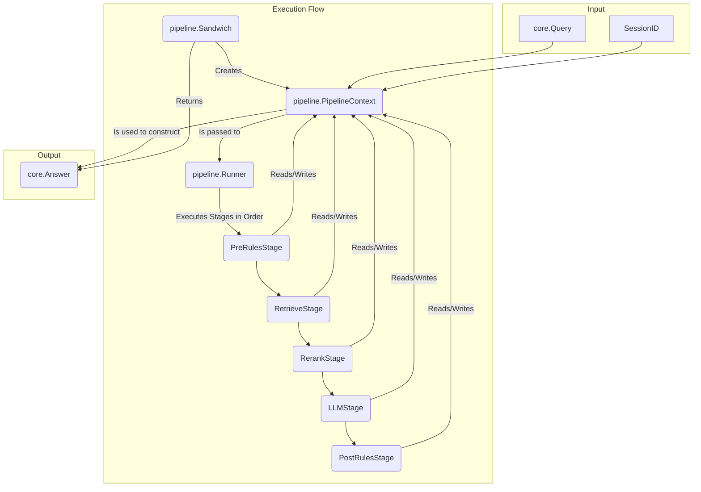

### 0. Implementation Snapshot (Current State)

The Manglekit SDK's architecture is based on a decoupled configuration system, a fluent builder, and a central registry for dependency injection.

-   **Configuration (`config` package)**: All configuration loading and schema definition is encapsulated within the dedicated `config` package. It handles loading from YAML/env vars, setting defaults, and performing validation. It has no knowledge of the builder.
-   **Bridge (`from_config.go`)**: The `NewBuilderFromConfig` function is the sole entry point for translating a validated `config.Config` struct into a series of fluent builder calls. It uses the registry to map provider names to their option types.
-   **Builder (`builder.go`)**: A fluent `Builder` provides `With...` methods for programmatic component configuration. A key inconsistency exists in `WithEmbedder`, which accepts pre-built instances unlike other methods. The `Build()` method assembles the final orchestrator but **hard-codes the "sandwich" pipeline**, preventing programmatic selection of other orchestrators.
-   **Registry (`registry.go`)**: An instance-based catalog of component factories. It maps provider names to factory functions and option types.
-   **Pipelines**:
    -   **`Sandwich` (`pipeline/sandwich.go`)**: The default and only programmatically selectable orchestrator. It is implemented using a typed, stage-based architecture.
    -   **`Declarative` (`pipeline/declarative/orchestrator.go`)**: Exists but is currently a disabled stub and cannot be selected via the builder.

### 1. Architectural Overview

Manglekit is a modular Go framework for building verifiable, rule-based RAG applications. The architecture separates configuration from construction, allowing developers to compose pipelines from pluggable components programmatically or via static configuration.

```mermaid
graph TD
    subgraph "Configuration Phase"
        A[config.yaml / Env Vars] -->|Loaded by| B(config Package);
        B --> C[config.Config Struct];
        C -->|Translated by| D(NewBuilderFromConfig);
    end

    subgraph "Build Phase"
        P[Programmatic Code] -->|Calls With...()| E{Builder};
        D -->|Calls With...()| E;
        GK[genkit.Genkit Instance] --> E;
        E -- Build() calls --> F[Registry];
        F -- Returns Factory --> G(Component Factory);
        E -- Provides Deps (diapi) --> G;
        G -- Creates --> H[Provider Instance];
        E -- Collects --> I[ResourceClosers];
    end

    subgraph "Runtime Phase"
        J[Orchestrator] -- Contains --> H;
        J -- Contains --> I;
        K[Application] -- Calls Execute() --> J;
        L[Application] -- Calls Close() --> J;
    end

    H --> J;
    I --> J;
```

### 2. Pipeline Stage Architecture

The `Sandwich` orchestrator is implemented using a typed, stage-based pipeline architecture. This design promotes the Single Responsibility Principle (SRP), testability, and clear data flow.

The core components of this architecture are:

-   **`PipelineContext`**: A typed struct that acts as a mutable data carrier through the pipeline.
-   **`Stage`**: A simple interface (`interface { Name(); Execute(*PipelineContext) error }`) that represents a single, discrete step in the pipeline.
-   **`Runner`**: A component that composes and executes a sequence of `Stage`s.



### 3. Dependency Rules (Non-Negotiable)

| Package                       | Allowed Dependencies                                     | Forbidden Dependencies                               | Rationale                                                                |
| ----------------------------- | -------------------------------------------------------- | ---------------------------------------------------- | ------------------------------------------------------------------------ |
| `core`                        | Go standard library                                      | All other project packages                           | Must be the foundational, dependency-free base.                          |
| `config`                      | Go standard library                                      | `builder`, `pipeline`, `internal/providers`          | Configuration must be independent of the application logic.              |
| `retrieve`, `llm`, `rerank`... | `core`                                                   | `builder`, `config`, `pipeline`, `internal/providers` | Defines component contracts; must not know about implementations. |
| `internal/providers/*`        | `core`, its corresponding contract package (e.g., `llm`) | `builder`, `config`, other `internal/providers`      | Implementations depend on contracts, not the builder. |
| `pipeline`                    | `core`, contract packages (`retrieve`, `llm`, etc.)      | `builder`, `config`, `internal/providers`            | Orchestrates contracts, but does not build them.                         |
| `manglekit` (root)            | All other packages                                       | N/A                                                  | The root package acts as the assembler.                                  |

**Key Rule**: There must be **no import cycles**.

### 4. Core Contracts

-   **Builder (`BuilderAPI`)**: The builder's responsibility is to collect configuration for components and orchestrate their construction via factories. It must not contain business logic or file I/O.
-   **Orchestrator (`core.Orchestrator`)**: A pure behavioral interface (`Execute`, `Close`). It must not expose its internal components via accessors.
-   **Registry (`Registry`)**: A service locator for component factories, mapping string names to factory functions.
-   **Factory (e.g., `retrieve.Factory`)**: A function that creates a component instance, receiving dependencies via a typed `diapi` struct.

### 5. Provider Composition

Composition of providers (e.g., a hybrid retriever) must occur inside the parent provider's factory, which receives a `SubRetrieverBuilder` to build its children. This adheres to the Interface Segregation Principle.

### 6. Configuration Flow

`config.Load()` parses YAML into a `config.Config` struct. `NewBuilderFromConfig` receives this struct, looks up provider option types in the registry, unmarshals the options, and calls the corresponding `builder.With...` method.

### 7. Observability & Resource Lifecycle

-   **Observability**: An `core.Observability` struct can be passed to the builder via `WithObservability()`.
-   **Resource Lifecycle**: Component factories can return a `core.ResourceCloser`. The builder collects all closers, and `Orchestrator.Close()` invokes them in reverse order.

### 8. Testing & Replaceability

Components should be tested in isolation using mock dependencies registered with a test-specific registry.

### 9. Anti-Patterns (Red Lines)

-   **Dependency on Builder**: A component factory must **never** take a dependency on the `BuilderAPI`.
-   **Type Erasure**: Using `any` in core interfaces or for factory registries is forbidden.
-   **Provider Branching**: Logic like `if provider.Name == "google"` inside the framework is forbidden.
-   **Global State**: The registry and all components must be fully encapsulated in instances.

### 10. Known Gaps

This table summarizes open architectural issues identified in the latest code review. These items represent deviations from the architectural standard.

| Severity | Issue                                  | File(s)                                 | Description                                                                                             | Status |
| :------- | :------------------------------------- | :-------------------------------------- | :------------------------------------------------------------------------------------------------------ | :----- |
| Medium   | **Inconsistent Builder API**           | `builder.go` (`WithEmbedder` method)    | The `WithEmbedder` method accepts pre-built instances, making it inconsistent with other `With...` methods. | Open   |
| Low      | **Hard-coded Orchestrator Selection**  | `builder.go` (`Build` method)           | The builder hard-codes the `"sandwich"` orchestrator, preventing programmatic selection of other pipelines. | Open   |

### 11. Provider Families

| Type            | Registered Providers        |
| :-------------- | :-------------------------- |
| **LLM**         | `google`, `openai`, `mock-llm` |
| **Embedder**    | `google`, `openai`, `mock-embedder` |
| **Retriever**   | `bm25`, `dense`, `hybrid`, `in-memory` |
| **Reranker**    | `cosine`                    |
| **VectorStore** | `localvec`                  |
| **StateProvider**| `in-memory`, `redis`       |
| **RuleSet**     | `mangle`                    |

### 12. Versioning & Compatibility Policy

The project adheres to Semantic Versioning 2.0.0. This `CONTEXT.md` document must be updated to reflect any MINOR or MAJOR changes.

### 13. Machine Appendix (JSON Snapshot v1)

```json
{
  "version": "1",
  "capabilities": [
    "llm",
    "embedder",
    "retriever",
    "reranker",
    "vectorstore",
    "stateprovider",
    "ruleset",
    "orchestrator"
  ],
  "factories": {
    "retriever": {
      "bm25": { "options_type": "retrieve.BM25Options", "deps_type": "diapi.RetrieverDeps" },
      "dense": { "options_type": "retrieve.DenseOptions", "deps_type": "diapi.RetrieverDeps" },
      "hybrid": { "options_type": "retrieve.HybridOptions", "deps_type": "diapi.RetrieverDeps" }
    },
    "llm": {
      "google": { "options_type": "llm.GoogleOptions", "deps_type": "diapi.LLMDeps" },
      "openai": { "options_type": "llm.OpenAIOptions", "deps_type": "diapi.LLMDeps" }
    }
  },
  "registry_keys": [
    "google", "openai", "mock-llm", "mock-embedder",
    "bm25", "dense", "hybrid", "in-memory",
    "cosine", "localvec", "redis", "mangle",
    "sandwich", "declarative"
  ],
  "metrics": [
    "manglekit.rules_pre_ms",
    "manglekit.retrieve_ms",
    "manglekit.rerank_ms",
    "manglekit.llm_ms",
    "manglekit.rules_post_ms"
  ],
  "errors": [
    "core.ErrInvalidOptions",
    "core.ErrNoEvidence",
    "core.ErrDenied"
  ]
}
```

### 14. Changelog

-   **2025-10-16**: Performed a deep-dive code review and updated documentation to reflect the current architectural state. Confirmed and documented two open architectural gaps in `builder.go`: the inconsistent `WithEmbedder` API and the hard-coded orchestrator selection. No code was modified. Updated `docs/code-review.md` and regenerated `docs/CONTEXT.md` to align with these findings.
-   **2025-10-16 (previous)**: Regenerated `CONTEXT.md` to the canonical "Live Standard" format. Updated the implementation snapshot, dependency rules, and all other sections to match the current codebase reality, reflecting the new decoupled configuration. Synchronized the "Known Gaps" section with the findings in the new `docs/code-review.md`. Added a machine-readable JSON appendix.