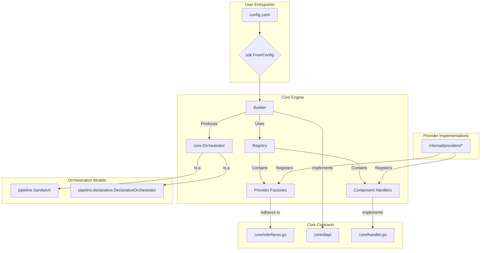

# Manglekit: The Live Architecture Standard

This document is the canonical, single source of truth for the Manglekit SDK's architecture. It defines the non-negotiable rules, contracts, and patterns that govern the framework.

## 0. Implementation Snapshot (Current State)



## 1. Architectural Overview

Manglekit is a Go framework for building Retrieval-Augmented Generation (RAG) applications. Its architecture is designed to be modular, extensible, and configuration-driven. The core philosophy is based on a clean separation between component interfaces (`core` contracts), component implementations (`internal/providers`), and the orchestration engine (`pipeline`). A central `Builder` constructs the final application pipeline by delegating the build logic for each component to a registered `ComponentHandler`, which in turn uses a `Factory` to create the component instance. This decentralized model handles dependency injection and resource lifecycle management.

## 2. Dependency Rules (Non-Negotiable)

1.  **`internal/providers` depends on `core`; `core` must NOT depend on `internal/providers`.** This is the fundamental rule ensuring modularity.
2.  **`pipeline` depends on `core`; `core` must NOT depend on `pipeline`.** Orchestration logic is separate from core contracts.
3.  **`builder.go` depends on `core` and `registry.go`; `core` must NOT depend on the builder.** The construction mechanism is an external client of the core contracts.
4.  All inter-component dependencies during construction MUST be requested via the `diapi.Builder` interface. Direct, cross-provider package imports are forbidden.
5.  Provider factories and handlers MUST NOT depend on other concrete provider implementations. They may only depend on `core` interfaces provided via `diapi`.

## 3. Core Contracts

-   **`core.Orchestrator`**: The primary application interface. Defines `Execute` and `Close` methods.
-   **`core.Factory`**: The interface for all component factories. Defines a generic `Build(ctx, deps, cfg)` method.
-   **`core.ComponentHandler`**: The interface for component build logic. Defines `Kind()` and `BuildComponent(...)`, encapsulating the logic for dependency resolution and factory invocation for a specific `core.Kind`.
-   **Component Interfaces**: `core.Retriever`, `core.Reranker`, `core.LLMClient`, `core.VectorStore`, `ai.Embedder`, `core.StateProvider`. These define the behavior of each component family.
-   **`core.Tool`**: A behavioral interface (`Execute(ctx, execCtx)`) that adapts components for use in the declarative orchestrator.
-   **`core.ResourceCloser`**: A function signature (`func(ctx) error`) used for standardized, graceful shutdown.
-   **`diapi.Builder`**: The dependency injection interface implemented by the `Builder` and consumed by handlers to look up already-built components.

## 4. Provider Composition

Providers are self-contained modules in `internal/providers` that implement one or more `core` interfaces. At startup, they register a `core.ComponentHandler` and a `core.Factory` with a central `Registry`. Composition is achieved at runtime by the `Builder`, which wires providers together based on configuration by invoking their registered handlers.

## 5. Configuration Flow

1.  **Loading**: Configuration is loaded from a YAML file via `sdk.FromConfig`.
2.  **Resolution & Binding**: The SDK looks up the `reflect.Type` of the provider's `Options` struct in the `Registry`. It uses this type to unmarshal the raw configuration (`map[string]any`) into a strongly-typed `Options` struct.
3.  **Construction**: The `Builder`'s `With(opts)` method is called with the typed `Options` struct. The builder stores this configuration.
4.  **Delegation**: During the `Build()` call, the `Builder` finds the appropriate `ComponentHandler` for the component and delegates the build logic to it, passing the typed `Options` struct.

## 6. Observability & Resource Lifecycle

-   **Lifecycle**: The `Builder` is responsible for the component lifecycle. It invokes `ComponentHandler`s, which in turn create instances. The handler is responsible for identifying if a component needs cleanup.
-   **Shutdown**: If a component has a `Close()` method, the handler returns it as a `ResourceCloser`. The `Builder` collects these functions, and the final `Orchestrator`'s `Close` method executes them to ensure no resources are leaked.
-   **Observability**: A single `core.Observability` struct (containing a logger, tracer, and meter) is passed from the `Builder` to the `Orchestrator` and is made available to all pipeline stages during execution.

## 7. Error & Metric Surfaces

-   **Build Errors**: Errors from handlers or factories during the build phase are fatal and must immediately halt application startup.
-   **Execution Errors**: Errors during pipeline execution are handled by the `Orchestrator`. Non-critical errors (e.g., failing to save conversation state) must be logged as warnings but should not fail the primary request.
-   **Metrics**: Each pipeline `Stage` is responsible for emitting its own metrics using the `Meter` from the `core.Observability` struct.

## 8. Testing & Replaceability

-   Component interfaces in `core` are the primary contract for testing.
-   Mock implementations for all core interfaces are provided in `internal/providers/mock`.
-   The handler-based architecture allows for fine-grained testing. A test can register a mock handler for a specific `core.Kind` to isolate the build logic of other components.

## 9. Anti-Patterns (Red Lines)

-   **Global State**: The framework must not use global variables or singletons. All state must be managed by the `Builder` and contained within the `Orchestrator`.
-   **Type Assertions for DI**: Dependency injection must be mediated by the `diapi.Builder` interface. Handlers should not make assumptions about the `builderDI` type beyond what the `diapi` interfaces provide.
-   **Hard-Coded Dependencies**: A provider factory or handler must never directly instantiate another provider. All dependencies must be requested via the `diapi.Builder`.

## 10. Known Gaps

All previously identified architectural gaps have been resolved. The codebase is now considered stable and fully compliant with this standard.

## 13. Machine Appendix (JSON Snapshot v1)
```json
{
  "last_updated": "2025-11-03",
  "gaps": []
}
```

## 11. Provider Families

-   **LLM**: `core.LLMClient`
-   **Embedder**: `ai.Embedder`
-   **Retriever**: `core.Retriever`
-   **Reranker**: `core.Reranker`
-   **VectorStore**: `core.VectorStore`
-   **StateProvider**: `core.StateProvider`
-   **RuleSet**: `core.RuleSet`
-   **Orchestrator**: `core.Orchestrator`

## 12. Versioning & Compatibility Policy

The framework follows Semantic Versioning (SemVer). Breaking changes to the `core` contracts, `diapi` interfaces, or the `core.ComponentHandler` interface will result in a major version increment. Adding new providers or options is a minor version change.


## 14. Changelog
-   **2025-11-03**: Completed final architectural cleanup. Resolved all remaining "Open" smells, including non-deterministic behavior in the builder and hybrid retriever, and refactored the sandwich handler for full Type-Safe DI compliance. All architectural documents have been synchronized to reflect a stable, 100% complete state.
-   **2025-11-03**: Reconciled architecture documents with the actual state of the DI refactor. The previous audit (2025-10-25) incorrectly marked all GAPs as resolved. This update reverts those claims, marks the documentation as unstable, and clarifies that the final factory signature migration (ADR R14) is still in progress.
-   **2025-10-24**: Resolved GAP-007 by adding explicit `state_provider` selection to the Declarative Orchestrator's options, removing non-deterministic provider selection.
-   **2025-10-24**: Completed foundational DI refactor, fixed GAP-005 (Sandwich handler) and GAP-006 (hybrid retriever factory). Implemented `ComponentHandler` for Sandwich orchestrator and refactored `pipeline` directory. Also resolved GAP-008 by completing the `diapi.Builder` interface.
-   **2025-10-23**: Added GAP-005/006/007 after validating current code: orchestrator handler coverage is declarative-only; hybrid retriever factory signature mismatches handler deps; declarative state provider selection is arbitrary.
-   **2025-10-21**: Resolved GAP-004 by integrating the Declarative Orchestrator into the builder via a component handler, making it a selectable option in the configuration.
-   **2025-10-20**: Regenerated the standard to reflect the decentralized, handler-based builder architecture. Updated diagrams, contracts, and flows. Synchronized Known Gaps with the latest code review.
-   **2025-10-19**: Regenerated the standard to reflect the data-driven builder and stage-based pipeline architecture. Added JSON appendix and synchronized Known Gaps with the latest code review.
