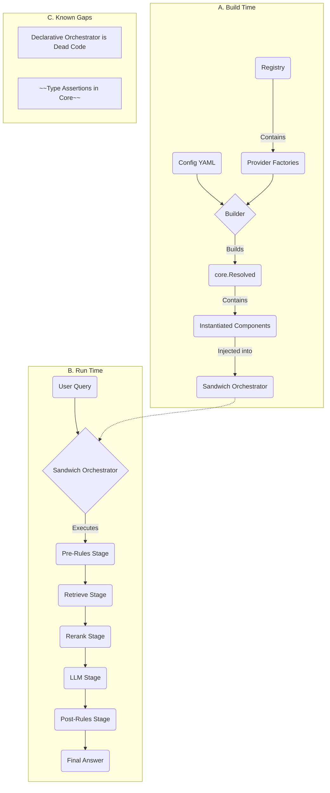

### 0. Implementation Snapshot (Current State)

The Manglekit SDK is a Go framework for building Retrieval-Augmented Generation (RAG) applications. The current architecture is centered around a type-safe, spec-driven `Builder` (`builder.go`) that constructs pipelines. Components are registered via a generic `Registry` (`registry.go`) and instantiated via factories.

The primary, and only functional, orchestrator is the `Sandwich` (`pipeline/sandwich.go`), which executes a fixed, linear sequence of stages (Rules -> Retrieve -> Rerank -> LLM -> Rules). A `Declarative` orchestrator exists but is unreachable dead code. Dependency injection is managed through typed `diapi` structs, though some providers bypass this. Resource management is handled via `core.ResourceCloser` callbacks.



### 1. Architectural Overview

Manglekit is designed as a modular, extensible framework for building verifiable, rule-based RAG pipelines. Its architecture emphasizes loose coupling between components and a clear separation between the configuration of a pipeline (`Builder`, `Registry`) and its execution (`Orchestrator`). The core abstraction is the `Orchestrator`, which executes a flow to transform a user `Query` into a final `Answer` with verifiable `Citations`.

### 2. Dependency Rules (Non-Negotiable)

- **`core` is Central:** All packages may depend on `core`, but `core` must not depend on any other package in the project.
- **Providers are Isolated:** Provider implementations (in `internal/providers/`) must not depend on each other. They depend on `core`, `diapi`, and their respective interface packages (e.g., `llm`, `retrieve`).
- **Orchestrators Depend on Interfaces:** Orchestrators (`pipeline/`) must depend only on the component *interfaces* defined in `llm`, `retrieve`, etc., not on concrete provider implementations.
- **DI is Mandatory:** Components must receive their dependencies (e.g., shared clients, loggers) via the `diapi` structs passed to their factories. Direct instantiation of shared clients is forbidden.

### 3. Core Contracts

- **`core.Orchestrator`**: The primary behavioral interface. Has `Execute` and `Close` methods. Does not expose its internal components.
- **`core.ProviderOptions`**: The interface for all provider configuration structs. It enables type-safe, string-free registration by requiring providers to self-identify their `Kind` and `Name`.
- **`manglekit.Registry`**: The central, generic registry. Uses `Register[T, D, O]` to store strongly-typed component factories.
- **`manglekit.Builder`**: The fluent API for pipeline construction. Uses a spec-table to manage the build order and dependency injection.
- **`core.ResourceCloser`**: The function signature (`func(ctx context.Context) error`) for all component cleanup logic.

### 4. Provider Composition

Providers are composed at build time. The `Builder` is responsible for instantiating each configured provider in the correct order (e.g., Embedder -> VectorStore -> Retriever). More complex providers, like the `hybrid` retriever, can be composed of other providers, but this composition should be defined in configuration, not hard-coded in factories.

### 5. Configuration Flow

1.  **YAML/Code:** Configuration is supplied either programmatically via the `Builder`'s `With(opts)` method or loaded from a YAML file via `from_config.go`.
2.  **Builder Population:** The builder collects `configItem`s for each component.
3.  **Ordered Build:** The builder walks a hard-coded dependency order (`specTable`), looks up the appropriate factory in the `Registry`, creates the dependency struct (`diapi.Deps`), and invokes the factory.
4.  **Orchestrator Injection:** The final collection of built components is packaged into a `core.Resolved` struct and injected into the orchestrator's factory.

### 6. Observability & Resource Lifecycle

- **Observability**: A `core.Observability` struct containing `Logger`, `Tracer`, and `Meter` interfaces is passed via `diapi` structs to all components.
- **Resource Lifecycle**: Components requiring cleanup must return a `core.ResourceCloser` function from their factory. The `Builder` collects these and passes them to the `Sandwich` orchestrator, which executes them when its `Close()` method is called.

### 7. Error & Metric Surfaces

- **Errors**: The framework defines sentinel errors in `core/types.go` (`ErrInvalidOptions`, `ErrNoEvidence`, `ErrDenied`).
- **Metrics**: The `core.Meter` interface provides a `Record` method for capturing key performance indicators like latency and token usage. Standardized metrics should follow the `manglekit.<component>.<event>` convention.

### 8. Testing & Replaceability

The architecture is designed for testability. Since components depend on interfaces, they can be easily tested with mocks. The `Builder` itself allows for the programmatic construction of test pipelines with mock components. Each provider should have its own unit tests.

### 9. Anti-Patterns (Red Lines)

- **Do Not Use `init()` for Registration:** All provider registration must happen explicitly via the `providers/all/all.go` package to ensure a clear and predictable registration flow.
- **No Global State:** The framework is stateless. All state must be managed explicitly through the `core.StateProvider`.
- **No Runtime Type Assertions in Orchestrators:** Orchestrators must receive their dependencies via the strongly-typed `core.Resolved` struct.
- **No Direct Client Instantiation:** Providers must not create their own HTTP or gRPC clients. They must be injected via the DI system.

### 10. Known Gaps

| ID  | Smell                                      | Location                               | Status |
| --- | ------------------------------------------ | -------------------------------------- | ------ |
| 1   | Type Assertions in Core Component Factory  | `pipeline/sandwich.go`                 | Fixed   |
| 2   | Broken Resource Cleanup Lifecycle          | `pipeline/sandwich.go`, `builder.go`     | Fixed   |
| 3   | Dead Code - Declarative Orchestrator       | `pipeline/declarative/*`               | Resolved   |
| 4   | Magic Strings for Execution Context        | `pipeline/declarative/orchestrator.go` | Open   |
| 5   | Violation of Open/Closed Principle         | `pipeline/declarative/orchestrator.go` | Open   |
| 6   | Dependency Injection Bypass                | `internal/providers/llm/openai.go`     | Fixed   |
| 7   | Hard-coded Dependencies in Factory         | `internal/providers/hybrid/hybrid.go`  | Open   |
| 8   | Hard-coded Magic Number                    | `internal/providers/hybrid/hybrid.go`  | Open   |

### 11. Provider Families

- **`Orchestrator`**: `sandwich` (functional), `declarative` (non-functional).
- **`LLM`**: `openai`, `google`.
- **`Retriever`**: `dense`, `bm25`, `hybrid`.
- **`VectorStore`**: `localvec`, `redis`.
- **`Reranker`**: `passthrough`.
- **`StateProvider`**: `in-memory`, `redis`.
- **`Embedder`**: `openai`, `google`.

### 12. Versioning & Compatibility Policy

The project adheres to Semantic Versioning 2.0.0. Minor version bumps may introduce new provider interfaces or builder features in a backward-compatible way. Breaking changes (e.g., modification of core interfaces) will result in a major version bump.

### 13. Machine Appendix (JSON Snapshot v1)

```json
{
  "project": "manglekit",
  "version": "0.4.0",
  "last_updated": "2025-10-19",
  "schema_version": "1.0",
  "core_contracts": [
    "core.Orchestrator",
    "core.ProviderOptions",
    "manglekit.Registry",
    "manglekit.Builder",
    "core.ResourceCloser"
  ],
  "functional_orchestrator": "sandwich",
  "known_gaps": [
    {
      "id": 1,
      "description": "Type Assertions in Core Component Factory",
      "status": "Fixed"
    },
    {
      "id": 2,
      "description": "Broken Resource Cleanup Lifecycle",
      "status": "Fixed"
    },
    {
      "id": 3,
      "description": "Dead Code - Declarative Orchestrator",
      "status": "Resolved"
    },
    {
      "id": 4,
      "description": "Magic Strings for Execution Context",
      "status": "Open"
    },
    {
      "id": 5,
      "description": "Violation of Open/Closed Principle",
      "status": "Open"
    },
    {
      "id": 6,
      "description": "Dependency Injection Bypass",
      "status": "Fixed"
    },
    {
      "id": 7,
      "description": "Hard-coded Dependencies in Factory",
      "status": "Open"
    },
    {
      "id": 8,
      "description": "Hard-coded Magic Number",
      "status": "Open"
    }
  ]
}
```

### 14. Changelog

- **2025-10-19**: Implemented the `DeclarativeOrchestrator` factory and integrated it with the builder. The orchestrator is no longer dead code and can be configured and used in a pipeline.
- **2025-10-19**: Fixed the broken resource cleanup lifecycle. The `Builder` now correctly passes `ResourceCloser` functions to the `Sandwich` orchestrator, which are executed on `Close()`.
- **2025-10-17**: Full architectural review. Synchronized document with the state of the v0.4.0 codebase. Identified and documented 8 major architectural gaps, including dead code in the declarative pipeline and a broken resource cleanup lifecycle. Regenerated all 14 sections to conform to the Live Standard format.
