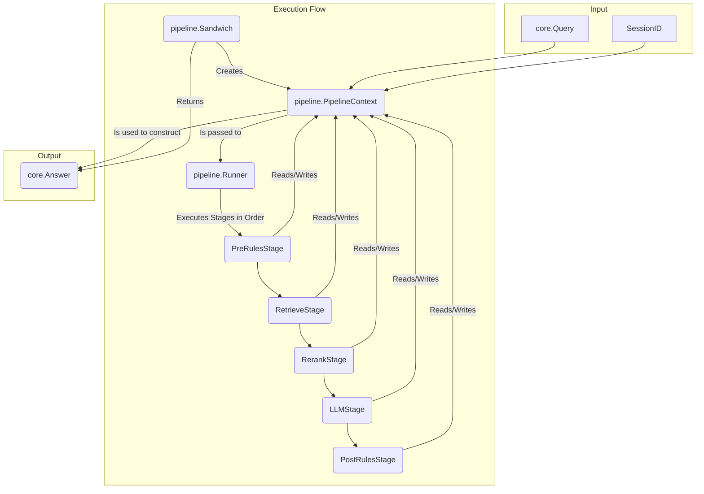

### 0. Implementation Snapshot (Current State)

The Manglekit SDK's architecture is based on a decoupled configuration system, a fluent builder, and a central registry for dependency injection.

-   **Configuration (`config` package)**: All configuration loading and schema definition is now encapsulated within the dedicated `config` package. It handles loading from YAML/env vars, setting defaults, and performing validation. It has no knowledge of the builder.
-   **Bridge (`from_config.go`)**: The `NewBuilderFromConfig` function is the sole entry point for translating a validated `config.Config` struct into a series of fluent builder calls. It uses the registry to map provider names to their option types.
-   **Builder (`builder.go`)**: A fluent `Builder` provides `With...` methods for programmatic component configuration. It uses a `Registry` to look up component factories and injects typed dependencies (e.g., `Embedder`, `VectorStore`) via `diapi` structs. The `Build()` method assembles the final orchestrator but currently hard-codes the "sandwich" pipeline.
-   **Registry (`registry.go`)**: An instance-based catalog of component factories. Most factories are strongly typed, but a notable exception is `ClientFactories`, which uses `map[string]any` and returns `any`, creating a type-safety hole.
-   **Pipelines**:
    -   **`Sandwich` (`pipeline/sandwich.go`)**: The default orchestrator. Its `Execute` method is a "god method" that monolithically handles the entire RAG pipeline, from state loading to rule evaluation. It uses a `map[string]any` with "magic strings" to pass metadata between stages.
    -   **`Declarative` (`pipeline/declarative/orchestrator.go`)**: Exists but is currently a disabled stub.

### 1. Architectural Overview

Manglekit is a modular Go framework for building verifiable, rule-based RAG applications. The architecture separates configuration from construction, allowing developers to compose pipelines from pluggable components programmatically or via static configuration.

```mermaid
graph TD
    subgraph "Configuration Phase"
        A[config.yaml / Env Vars] -->|Loaded by| B(config Package);
        B --> C[config.Config Struct];
        C -->|Translated by| D(NewBuilderFromConfig);
    end

    subgraph "Build Phase"
        P[Programmatic Code] -->|Calls With...()| E{Builder};
        D -->|Calls With...()| E;
        E -- Build() calls --> F[Registry];
        F -- Returns Factory --> G(Component Factory);
        E -- Provides Deps (diapi) --> G;
        G -- Creates --> H[Provider Instance];
        E -- Collects --> I[ResourceClosers];
    end

    subgraph "Runtime Phase"
        J[Orchestrator] -- Contains --> H;
        J -- Contains --> I;
        K[Application] -- Calls Execute() --> J;
        L[Application] -- Calls Close() --> J;
    end

    H --> J;
    I --> J;
```

### 2. Pipeline Stage Architecture

The `Sandwich` orchestrator is implemented using a typed, stage-based pipeline architecture. This design replaces the previous monolithic "god method" and eliminates the use of `map[string]any` and "magic strings" for passing data between pipeline steps. It promotes the Single Responsibility Principle (SRP), testability, and clear data flow.

The core components of this architecture are:

-   **`PipelineContext`**: A typed struct that acts as a mutable data carrier. It flows through the entire pipeline, holding all inputs (query, history), intermediate artifacts (retrieved documents, reranked documents), and final results (response text, citations). It also tracks metrics like component latencies.
-   **`Stage`**: A simple interface (`interface { Name(); Execute(*PipelineContext) error }`) that represents a single, discrete step in the pipeline (e.g., retrieving documents, calling the LLM). Each stage is responsible for a specific task, reading its required data from the `PipelineContext` and writing its output back into it.
-   **`Runner`**: A component that composes and executes a sequence of `Stage`s. It iterates through the stages in the order they are added, executes them, and provides short-circuiting error handling. If any stage returns an error, the runner immediately stops and propagates the error.

This architecture makes the orchestration logic explicit, easier to test in isolation, and more extensible for future modifications.



### 3. Dependency Rules (Non-Negotiable)

| Package                       | Allowed Dependencies                                     | Forbidden Dependencies                               | Rationale                                                                |
| ----------------------------- | -------------------------------------------------------- | ---------------------------------------------------- | ------------------------------------------------------------------------ |
| `core`                        | Go standard library                                      | All other project packages                           | Must be the foundational, dependency-free base.                          |
| `config`                      | Go standard library                                      | `builder`, `pipeline`, `internal/providers`          | Configuration must be independent of the application logic.              |
| `retrieve`, `llm`, `rerank`... | `core`                                                   | `builder`, `config`, `pipeline`, `internal/providers` | Defines component contracts; must not know about implementations. |
| `internal/providers/*`        | `core`, its corresponding contract package (e.g., `llm`) | `builder`, `config`, other `internal/providers`      | Implementations depend on contracts, not the builder. |
| `pipeline`                    | `core`, contract packages (`retrieve`, `llm`, etc.)      | `builder`, `config`, `internal/providers`            | Orchestrates contracts, but does not build them.                         |
| `manglekit` (root)            | All other packages                                       | N/A                                                  | The root package acts as the assembler.                                  |

**Key Rule**: There must be **no import cycles**.

### 3. Core Contracts

-   **Builder (`BuilderAPI`)**: The builder's responsibility is to collect configuration for components and orchestrate their construction via factories. It must not contain business logic or file I/O. Its `Build(ctx)` method is the terminal operation that assembles the final `Orchestrator` and any typed, updatable components.
-   **Orchestrator (`core.Orchestrator`)**: The orchestrator is a pure behavioral interface (`Execute`, `Close`). It is responsible for running a pipeline but must not expose its internal components via accessors.
-   **Registry (`Registry`)**: The registry acts as a service locator for component factories. It maps a string name (e.g., `"openai"`) to a strongly-typed factory function. It is responsible for providing the correct factory but not for invoking it.
-   **Factory (e.g., `retrieve.Factory`)**: A factory is a function that creates a component instance. The signature is `func(ctx context.Context, deps DEPS_STRUCT, opts any) (INTERFACE, error)`. It is responsible for checking for its required dependencies in the `DEPS_STRUCT` and returning a clear error if they are missing or of the wrong type.

### 4. Provider Composition

Composition of providers (e.g., a complex retriever that uses other retrievers) must occur inside the parent provider's factory. The parent's factory receives a `SubRetrieverBuilder` in its dependency struct, which it can use to build its children. This prevents the factory from needing a dependency on the full `BuilderAPI`, adhering to the Interface Segregation Principle.

### 5. Configuration Flow

Configuration is fully decoupled from the builder. The `config` package produces a `config.Config` struct, which is then passed to `NewBuilderFromConfig`.

**YAML Example**:
```yaml
llm:
  provider: "openai"
  options:
    model: "gpt-4-turbo"
retriever:
  provider: "hybrid"
  options:
    bm25:
      path: "corpus/"
```
1.  `config.Load()` parses the YAML into a `config.Config` struct.
2.  `NewBuilderFromConfig` receives this struct.
3.  It looks up `"openai"` in the registry to find the `*llm.OpenAIOptions` type.
4.  It unmarshals the `options` map into a new `OpenAIOptions` struct.
5.  It calls `builder.WithLLM(&llm.OpenAIOptions{...})`.
6.  This process repeats for all configured components.

### 6. Observability & Resource Lifecycle

-   **Observability**: An `core.Observability` struct (`Logger`, `Tracer`, `Meter`) can be passed to the builder via `WithObservability()`. This is propagated to components.
-   **Resource Lifecycle**: Components managing external resources (e.g., API clients) can have their factories return a `core.ResourceCloser`. The builder collects all closers, and the `Orchestrator.Close()` method invokes them in reverse order of creation.

### 7. Error & Metric Surfaces

-   **Sentinel Errors**:
    -   `core.ErrInvalidOptions`: Invalid configuration.
    -   `core.ErrNoEvidence`: Retriever found no documents.
    -   `core.ErrDenied`: A rule explicitly blocked the request.
-   **Metrics (emitted by Sandwich pipeline)**:
    -   `manglekit.rules_pre_ms`
    -   `manglekit.retrieve_ms`
    -   `manglekit.rerank_ms`
    -   `manglekit.llm_ms`
    -   `manglekit.rules_post_ms`

### 8. Testing & Replaceability

Components should be tested in isolation using mock dependencies.

**Example Unit Test**:
```go
func TestMyPipeline(t *testing.T) {
    // 1. Register mock providers
    reg := manglekit.NewRegistry()
    providers.NewSet(providers.WithMockLLM(&mock.LLMOptions{})).Register(reg)

    // 2. Use the fluent builder with mock options
    builder := manglekit.NewBuilder(reg)
    builder.WithLLM(&mock.LLMOptions{ExpectedResponse: "mocked"})

    // 3. Build and test
    orch, err := builder.Build(context.Background())
    require.NoError(t, err)

    answer, err := orch.Execute(context.Background(), "s1", core.Query{Text: "test"})
    assert.Equal(t, "mocked", answer.Text)
}
```

### 9. Anti-Patterns (Red Lines)

-   **Dependency on Builder**: A component factory must **never** take a dependency on the `BuilderAPI`.
-   **Type Erasure**: Using `any` in core interfaces (`core.Orchestrator`) or for factory registries is forbidden.
-   **Provider Branching**: Logic like `if provider.Name == "google"` inside the framework is forbidden.
-   **Global State**: The registry and all components must be fully encapsulated in instances.
-   **Direct Builder Modification from `config`**: The `config` package must not import or modify the `builder`.

### 10. Known Gaps

This table summarizes open architectural issues identified in the latest code review.

| Severity | Issue                                  | File(s)                                 | Description                                                                                             |
| :------- | :------------------------------------- | :-------------------------------------- | :------------------------------------------------------------------------------------------------------ |
| Medium   | **Inconsistent Factory Signatures**    | `registry.go`                           | The `ClientFactories` map uses `any`, creating a type-safety hole in the registry and dependency injection. |
| Medium   | **Inconsistent Builder API**           | `builder.go`                            | The `WithEmbedder` method accepts pre-built instances, making it inconsistent with other `With...` methods. |
| Low      | **Hard-coded Orchestrator Selection**  | `builder.go`                            | The builder hard-codes the `"sandwich"` orchestrator, preventing programmatic selection of other pipelines. |

### 11. Provider Families

| Type            | Registered Providers        |
| :-------------- | :-------------------------- |
| **LLM**         | `google`, `openai`, `mock-llm` |
| **Embedder**    | `google`, `openai`, `mock-embedder` |
| **Retriever**   | `bm25`, `dense`, `hybrid`, `in-memory` |
| **Reranker**    | `cosine`                    |
| **VectorStore** | `localvec`                  |
| **StateProvider**| `in-memory`, `redis`       |
| **RuleSet**     | `mangle`                    |

### 12. Versioning & Compatibility Policy

The project adheres to Semantic Versioning 2.0.0. This `CONTEXT.md` document must be updated to reflect any MINOR or MAJOR changes.

### 13. Machine Appendix (JSON Snapshot v1)

```json
{
  "version": "1",
  "capabilities": [
    "llm",
    "embedder",
    "retriever",
    "reranker",
    "vectorstore",
    "stateprovider",
    "ruleset",
    "orchestrator"
  ],
  "factories": {
    "retriever": {
      "bm25": { "options_type": "retrieve.BM25Options", "deps_type": "diapi.RetrieverDeps" },
      "dense": { "options_type": "retrieve.DenseOptions", "deps_type": "diapi.RetrieverDeps" },
      "hybrid": { "options_type": "retrieve.HybridOptions", "deps_type": "diapi.RetrieverDeps" }
    },
    "llm": {
      "google": { "options_type": "llm.GoogleOptions", "deps_type": "diapi.LLMDeps" },
      "openai": { "options_type": "llm.OpenAIOptions", "deps_type": "diapi.LLMDeps" }
    }
  },
  "registry_keys": [
    "google", "openai", "mock-llm", "mock-embedder",
    "bm25", "dense", "hybrid", "in-memory",
    "cosine", "localvec", "redis", "mangle",
    "sandwich", "declarative"
  ],
  "metrics": [
    "manglekit.rules_pre_ms",
    "manglekit.retrieve_ms",
    "manglekit.rerank_ms",
    "manglekit.llm_ms",
    "manglekit.rules_post_ms"
  ],
  "errors": [
    "core.ErrInvalidOptions",
    "core.ErrNoEvidence",
    "core.ErrDenied"
  ]
}
```

### 14. Changelog

-   **2025-10-16**: Performed a full, deep-dive code review. Regenerated `CONTEXT.md` to the canonical "Live Standard" format. Updated the implementation snapshot, dependency rules, and all other sections to match the current codebase reality, reflecting the new decoupled configuration. Synchronized the "Known Gaps" section with the findings in the new `docs/code-review.md`. Added a machine-readable JSON appendix.