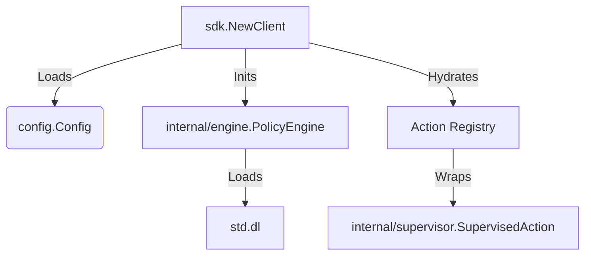
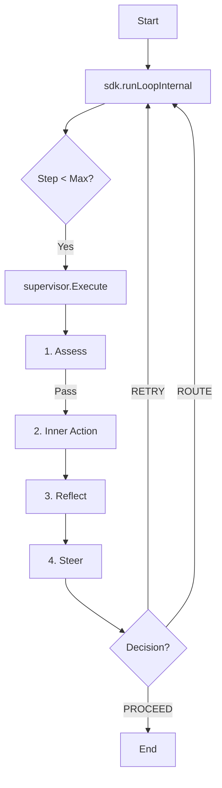

## 2. THE COMPLETE FILE MAP

```
.
|____.env.example
|____.gitignore
|____AGENTS.md # Instructions for AI agents.
|____CONTRIBUTING.md
|____LICENSE
|____Makefile # Build/Test commands.
|____README.md
|____adapters # Connects external systems to core.Action.
| |____ai # AI Adapters (Genkit).
| |____extractor # Structured Data Extraction.
| |____func # Go Function Wrapper.
| |____knowledge # RDF Knowledge Graph.
| |____logger # Logger Adapters.
| |____mcp # Model Context Protocol.
| |____resilience # Circuit Breakers/Retries.
| |____vector # Vector Store Retrieval.
|____cmd # CLI Entry Points.
| |____mkit # The Manglekit CLI.
|____config # Configuration Loading.
|____core # The Kernel Contracts (Interfaces & Types).
|____docs # Documentation.
|____examples # Runnable Examples.
|____go.mod
|____go.sum
|____internal # Internal Implementation Details.
| |____engine # The Neuro-Symbolic Core (Mangle Runtime).
| |____logger # Internal Logging.
| |____supervisor # The "Action Sandwich" (Trace->Assess->Exec->Reflect).
| |____telemetry # Observability Utilities.
| |____util # Common Utilities.
|____manglekit.go # Public Facade.
|____providers # Concrete Service Providers.
| |____google
| |____openai
|____sdk # The Orchestration Layer (State Machine).
```

## 3. COMPONENTS (The Logic)

### core
*   **Responsibilities:** Defines the essential contracts (interfaces) and data structures that decouple all other components. It is the abstract core of the framework, containing no concrete implementations.
*   **Structs:**
    *   `Envelope`: The universal data wrapper containing Payload, Metadata, SecurityLabels, and Facts.
    *   `Decision`: Structured output from the Evaluator (Outcome, Target, Reasons).
    *   `ActionMetadata`: Describes an Action's properties (Name, Type, I/O Schema).
*   **Key Functions:**
    *   `Action`: Interface for any unit of work (`Execute(ctx, env)`).
    *   `Evaluator`: Interface for the policy engine (`Assess`, `Reflect`, `EvaluateSteering`).

### internal/engine
*   **Responsibilities:** Implements `core.Evaluator`. Wraps the Mangle Datalog engine, manages runtime state, and translates Go objects/JSON into Datalog facts.
*   **Structs:**
    *   `PolicyEngine`: Main `Evaluator` implementation.
    *   `MangleRuntime`: Thread-safe wrapper for the Datalog interpreter.
*   **Key Functions:**
    *   `ToFacts`: Converts Go structs to Datalog facts via reflection.
    *   `Flatten`: Converts JSON/Maps to graph facts (`json_link`).
    *   `Assess/Reflect`: Enforces Pre/Post-check policies.
    *   `EvaluateSteering`: Determines `RETRY`/`ROUTE` decisions.

### internal/supervisor
*   **Responsibilities:** Implements the "Action Sandwich" pattern (`SupervisedAction`). Decorates `core.Action` to enforce governance.
*   **Structs:**
    *   `SupervisedAction`: Wraps `core.Action` + `core.Evaluator`.
*   **Key Functions:**
    *   `Execute`: Orchestrates `Trace -> Assess -> Execute -> Reflect -> Steer`. Propagates taint labels.

### sdk
*   **Responsibilities:** User-facing API and Orchestration. Manages the execution loop (Semantic State Machine).
*   **Structs:**
    *   `Client`: Main entry point. Holds registry, engine, memory.
*   **Key Functions:**
    *   `runLoopInternal`: The Semantic State Machine loop. Handles Retries, Routing, and Memory persistence.
    *   `ExecuteByName`: Public entry point for execution.

### adapters, providers, config
*   **Responsibilities:** Wiring and connectivity.
    *   `adapters`: Bridges external systems (Genkit, Functions) to `core.Action`.
    *   `providers`: Specific service implementations (Google, OpenAI).
    *   `config`: YAML configuration loading.

## 4. CRITICAL PATH & DATA (The Flow)

### Wiring Flow


### Execution Flow


### Data Structures
*   **Envelope:** `ID`, `Payload` (any), `Metadata` (Map), `SecurityLabels` ([]string), `Facts` ([]string).
*   **Facts:** Dynamic Datalog predicates generated from Payload (e.g., `json_num("Req", "age", 30)`).

## 5. SOURCE CODE DUMP

---
## [internal/engine/resources/std.dl]
```datalog
% --- Manglekit Standard Library (v2.0) ---
% Auto-loaded on engine startup.

% ==========================================
% 1. DATA REFLECTION (DO NOT REMOVE)
% These predicates allow the engine to read JSON inputs and Graph data.
% ==========================================

% JSON Primitives (Flattened)
Decl json_str(Parent, Key, Val).
Decl json_num(Parent, Key, Val).
Decl json_bool(Parent, Key, Val).
Decl json_link(Parent, Key, Child).
Decl json_null(Parent, Key).

% Knowledge Graph Primitives (N-Quads/Triples)
Decl quad(S, P, O, G).
Decl triple(S, P, O).
triple(S, P, O) :- quad(S, P, O, _).

% ==========================================
% 2. SYSTEM CONTROL (Standard Vocabulary)
% ==========================================

% Arity 1: Global/Single-Context (JSON)
Decl deny(Reason).
Decl halt(Reason).
Decl route(NextStep).
Decl retry(Feedback).

% Arity 2: Entity-Specific (Graph/Batch)
% Allows pinning the decision to a specific node (Entity).
Decl deny(Entity, Reason).
Decl halt(Entity, Reason).
Decl route(Entity, NextStep).
Decl retry(Entity, Feedback).

% Config is always Key-Value (Arity 2) or Entity-Key-Value (Arity 3)
Decl config(Key, Value).
Decl config(Entity, Key, Value).

% Semantic Alias for backward compatibility
halt(Reason) :- deny(Reason).
halt(Entity, Reason) :- deny(Entity, Reason).

% ==========================================
% 3. CONTEXT INJECTION
% These predicates are injected by the runtime environment.
% ==========================================

Decl attempt(N).            % Current retry count (0, 1, 2...).
Decl meta(Key, Value).      % Envelope metadata (e.g., user_id, session_id).
Decl label(Tag).            % Security taint labels (e.g., "pii", "unsafe").

% Telemetry Predicate (Arity 2: Entity, RuleID)
Decl violation_rule(Entity, RuleID).
```
---
## [internal/engine/reflection.go]
```go
package engine

import (
	"fmt"
	"reflect"
	"strings"
)

// ToFacts converts a Go data structure into Mangle Datalog facts.
func ToFacts(id string, input any) ([]string, error) {
	if input == nil {
		return nil, nil
	}
	var facts []string
	v := reflect.ValueOf(input)

	// Track visited pointers to prevent infinite recursion (Cycles)
	visited := make(map[uintptr]bool)

	if err := toFactsRecursive(id, "", v, &facts, visited); err != nil {
		return nil, err
	}
	return facts, nil
}

// LabelsToFacts converts a slice of security label strings into Mangle Datalog facts.
func LabelsToFacts(entityID string, labels []string) ([]string, error) {
	var facts []string
	if len(labels) > 0 {
		facts = make([]string, 0, len(labels))
	}

	for _, l := range labels {
		var sb strings.Builder
		sb.WriteString("label(\"")
		sb.WriteString(escapeString(l))
		sb.WriteString("\")")
		facts = append(facts, sb.String())
	}
	return facts, nil
}

func escapeString(s string) string {
	var sb strings.Builder
	sb.Grow(len(s))
	for i := 0; i < len(s); i++ {
		b := s[i]
		switch b {
		case '\\', '"':
			sb.WriteByte('\\')
			sb.WriteByte(b)
		case '\n':
			sb.WriteString("\\n")
		case '\r':
			sb.WriteString("\\r")
		case '\t':
			sb.WriteString("\\t")
		default:
			if b < 32 {
				sb.WriteByte(' ')
			} else {
				sb.WriteByte(b)
			}
		}
	}
	return sb.String()
}

func toFactsRecursive(id, path string, v reflect.Value, facts *[]string, visited map[uintptr]bool, args ...string) error {
	if !v.IsValid() {
		return nil
	}

	for v.Kind() == reflect.Interface {
		if v.IsNil() {
			return nil
		}
		v = v.Elem()
	}

	k := v.Kind()
	if k == reflect.Ptr || k == reflect.Map || k == reflect.Slice {
		if v.IsNil() {
			return nil
		}
		ptr := v.Pointer()
		if visited[ptr] {
			return nil
		}
		visited[ptr] = true
		defer delete(visited, ptr)
	}

	if k == reflect.Ptr {
		v = v.Elem()
	}

	switch v.Kind() {
	case reflect.Struct:
		t := v.Type()
		for i := 0; i < v.NumField(); i++ {
			field := v.Field(i)
			structField := t.Field(i)

			if !structField.IsExported() {
				continue
			}

			tag := structField.Tag.Get("mangle")
			if tag == "-" {
				continue
			}

			jsonTag := structField.Tag.Get("json")
			if jsonTag == "-" || strings.HasPrefix(jsonTag, "-,") {
				continue
			}

			fieldName := tag
			if fieldName == "" {
				if jsonTag != "" {
					parts := strings.Split(jsonTag, ",")
					fieldName = parts[0]
				}
			}
			if fieldName == "" {
				fieldName = strings.ToLower(structField.Name)
			}

			newPath := path
			isAnonymousUntagged := structField.Anonymous && tag == "" && structField.Tag.Get("json") == ""

			if !isAnonymousUntagged {
				if newPath != "" {
					newPath = newPath + "_" + fieldName
				} else {
					newPath = fieldName
				}
			}

			if err := toFactsRecursive(id, newPath, field, facts, visited, args...); err != nil {
				return err
			}
		}

	case reflect.Map:
		for _, key := range v.MapKeys() {
			val := v.MapIndex(key)
			keyStr := fmt.Sprintf("%v", key.Interface())

			newArgs := make([]string, len(args)+1)
			copy(newArgs, args)
			newArgs[len(args)] = keyStr

			if err := toFactsRecursive(id, path, val, facts, visited, newArgs...); err != nil {
				return err
			}
		}

	case reflect.Slice, reflect.Array:
		for i := 0; i < v.Len(); i++ {
			idxStr := fmt.Sprintf("%d", i)
			newArgs := make([]string, len(args)+1)
			copy(newArgs, args)
			newArgs[len(args)] = idxStr

			if err := toFactsRecursive(id, path, v.Index(i), facts, visited, newArgs...); err != nil {
				return err
			}
		}

	default:
		generatePrimitiveFact(id, path, v, facts, args...)
	}
	return nil
}

func generatePrimitiveFact(id, path string, v reflect.Value, facts *[]string, args ...string) {
	var strVal string
	var isNumeric bool

	switch v.Kind() {
	case reflect.Int, reflect.Int8, reflect.Int16, reflect.Int32, reflect.Int64:
		strVal = fmt.Sprintf("%d", v.Int())
		isNumeric = true
	case reflect.Uint, reflect.Uint8, reflect.Uint16, reflect.Uint32, reflect.Uint64:
		strVal = fmt.Sprintf("%d", v.Uint())
		isNumeric = true
	case reflect.Float32, reflect.Float64:
		strVal = fmt.Sprintf("%g", v.Float())
		isNumeric = true
	case reflect.Bool:
		strVal = fmt.Sprintf("%v", v.Bool())
	default:
		strVal = fmt.Sprintf("%v", v.Interface())
	}

	predicate := path
	if predicate == "" {
		predicate = "value"
	}

	safeID := escapeString(id)

	var sb strings.Builder
	sb.WriteString(predicate)
	sb.WriteByte('(')
	sb.WriteByte('"')
	sb.WriteString(safeID)
	sb.WriteByte('"')

	for _, arg := range args {
		sb.WriteString(", \"")
		sb.WriteString(escapeString(arg))
		sb.WriteByte('"')
	}

	sb.WriteString(", ")
	if isNumeric {
		sb.WriteString(strVal)
	} else {
		sb.WriteByte('"')
		sb.WriteString(escapeString(strVal))
		sb.WriteByte('"')
	}
	sb.WriteByte(')')

	*facts = append(*facts, sb.String())
}
```
---
## [internal/engine/flattener.go]
```go
package engine

import (
	"fmt"
	"reflect"
	"strconv"
)

// Flatten converts ANY dynamic structure (maps, slices of any type) into graph facts.
func Flatten(rootID string, input any) ([]string, error) {
	var facts []string
	if input == nil {
		return facts, nil
	}

	counter := 0
	visited := make(map[uintptr]bool)

	if err := flattenRecursive(rootID, reflect.ValueOf(input), &facts, &counter, visited); err != nil {
		return nil, err
	}
	return facts, nil
}

func flattenRecursive(nodeID string, v reflect.Value, facts *[]string, counter *int, visited map[uintptr]bool) error {
	for v.Kind() == reflect.Ptr || v.Kind() == reflect.Interface {
		if v.IsNil() {
			return nil
		}
		if v.Kind() == reflect.Ptr {
			ptr := v.Pointer()
			if visited[ptr] {
				return nil
			}
			visited[ptr] = true
		}
		v = v.Elem()
	}

	switch v.Kind() {
	case reflect.Map:
		iter := v.MapRange()
		for iter.Next() {
			key := iter.Key()
			val := iter.Value()

			keyStr := fmt.Sprintf("%v", key.Interface())
			safeKey := escapeString(keyStr)

			effVal := val
			for effVal.Kind() == reflect.Interface || effVal.Kind() == reflect.Ptr {
				if effVal.IsNil() {
					break
				}
				effVal = effVal.Elem()
			}

			if isComplexKind(effVal.Kind()) {
				*counter++
				childID := fmt.Sprintf("node_%d", *counter)
				fact := fmt.Sprintf("json_link(\"%s\", \"%s\", \"%s\")", escapeString(nodeID), safeKey, childID)
				*facts = append(*facts, fact)
				if err := flattenRecursive(childID, val, facts, counter, visited); err != nil {
					return err
				}
			} else {
				addPrimitiveReflect(nodeID, safeKey, effVal, facts)
			}
		}

	case reflect.Slice, reflect.Array:
		for i := 0; i < v.Len(); i++ {
			val := v.Index(i)
			keyStr := strconv.Itoa(i)

			effVal := val
			for effVal.Kind() == reflect.Interface || effVal.Kind() == reflect.Ptr {
				if effVal.IsNil() {
					break
				}
				effVal = effVal.Elem()
			}

			if isComplexKind(effVal.Kind()) {
				*counter++
				childID := fmt.Sprintf("node_%d", *counter)

				fact := fmt.Sprintf("json_link(\"%s\", \"%s\", \"%s\")", escapeString(nodeID), keyStr, childID)
				*facts = append(*facts, fact)

				if err := flattenRecursive(childID, val, facts, counter, visited); err != nil {
					return err
				}
			} else {
				addPrimitiveReflect(nodeID, keyStr, effVal, facts)
			}
		}
	}
	return nil
}

func isComplexKind(k reflect.Kind) bool {
	return k == reflect.Map || k == reflect.Slice || k == reflect.Array
}

func addPrimitiveReflect(nodeID, key string, v reflect.Value, facts *[]string) {
	for v.Kind() == reflect.Ptr || v.Kind() == reflect.Interface {
		if v.IsNil() {
			return
		}
		v = v.Elem()
	}

	nodeID = escapeString(nodeID)

	switch v.Kind() {
	case reflect.String:
		fact := fmt.Sprintf("json_str(\"%s\", \"%s\", \"%s\")", nodeID, key, escapeString(v.String()))
		*facts = append(*facts, fact)

	case reflect.Bool:
		sVal := "false"
		if v.Bool() {
			sVal = "true"
		}
		fact := fmt.Sprintf("json_bool(\"%s\", \"%s\", \"%s\")", nodeID, key, sVal)
		*facts = append(*facts, fact)

	case reflect.Int, reflect.Int8, reflect.Int16, reflect.Int32, reflect.Int64:
		fact := fmt.Sprintf("json_num(\"%s\", \"%s\", %d)", nodeID, key, v.Int())
		*facts = append(*facts, fact)

	case reflect.Uint, reflect.Uint8, reflect.Uint16, reflect.Uint32, reflect.Uint64:
		fact := fmt.Sprintf("json_num(\"%s\", \"%s\", %d)", nodeID, key, v.Uint())
		*facts = append(*facts, fact)

	case reflect.Float32, reflect.Float64:
		fact := fmt.Sprintf("json_num(\"%s\", \"%s\", %g)", nodeID, key, v.Float())
		*facts = append(*facts, fact)

	default:
		sVal := fmt.Sprintf("%v", v.Interface())
		fact := fmt.Sprintf("json_str(\"%s\", \"%s\", \"%s\")", nodeID, key, escapeString(sVal))
		*facts = append(*facts, fact)
	}
}
```
---
## [internal/supervisor/supervisor.go]
```go
package supervisor

import (
	"context"
	"errors"
	"fmt"
	"strconv"

	"github.com/duynguyendang/manglekit/core"
	"github.com/duynguyendang/manglekit/internal/telemetry"

	"go.opentelemetry.io/otel"
)

type SupervisedAction struct {
	inner       core.Action
	engine      core.Evaluator
	tracer      core.Tracer
	failureMode string
}

func NewSupervisedAction(action core.Action, eng core.Evaluator, failureMode string) *SupervisedAction {
	return &SupervisedAction{
		inner:       action,
		engine:      eng,
		tracer:      &core.NopTracer{},
		failureMode: failureMode,
	}
}

func (g *SupervisedAction) Execute(ctx context.Context, input core.Envelope) (core.Envelope, error) {
	tracer := g.tracer
	if tracer == nil {
		tracer = telemetry.NewOTelTracer(otel.Tracer("manglekit"))
	}
	meta := g.inner.Metadata()

	ctx, span := tracer.Start(ctx, fmt.Sprintf("Action.%s", meta.Name))
	defer span.End()

	span.SetAttributes(map[string]any{
		"mangle.action_name": meta.Name,
		"mangle.action_type": string(meta.Type),
		"mangle.input_id":    input.ID.String(),
	})

	result, err := g.executeInternal(ctx, input)
	if err != nil {
		span.RecordError(err)
		span.SetStatus("error", err.Error())
		if core.IsAlignmentError(err) {
			span.SetAttributes(map[string]any{core.AttrOutcome: core.OutcomeHalt})
			var alignErr *core.AlignmentError
			if errors.As(err, &alignErr) {
				attrs := map[string]any{core.KeyFeedback: alignErr.Message}
				if alignErr.RuleID != "" {
					attrs[core.AttrRuleID] = alignErr.RuleID
				}
				span.SetAttributes(attrs)
			} else {
				span.SetAttributes(map[string]any{core.KeyFeedback: err.Error()})
			}
		} else {
			span.SetAttributes(map[string]any{core.AttrOutcome: "ERROR"})
		}
		return core.Envelope{}, err
	}

	decision := result.Metadata[core.KeyDecision]
	switch decision {
	case core.DecisionRetry:
		span.SetAttributes(map[string]any{core.AttrOutcome: "retry"})
		if hint, ok := result.Metadata[core.KeyFeedback]; ok {
			if s, ok := hint.(string); ok {
				span.SetAttributes(map[string]any{core.KeyFeedback: s})
			}
		}
	case core.DecisionRoute:
		span.SetAttributes(map[string]any{core.AttrOutcome: "route"})
		if target, ok := result.Metadata[core.KeyNextStep]; ok {
			if s, ok := target.(string); ok {
				span.SetAttributes(map[string]any{core.AttrActionName: s})
			}
		}
	default:
		span.SetAttributes(map[string]any{core.AttrOutcome: core.OutcomeProceed})
	}

	if attemptVal, ok := input.Metadata["retry_count"]; ok {
		if s, ok := attemptVal.(string); ok {
			if n, err := strconv.Atoi(s); err == nil {
				span.SetAttributes(map[string]any{core.AttrAttempt: n})
			}
		} else if n, ok := attemptVal.(int); ok {
			span.SetAttributes(map[string]any{core.AttrAttempt: n})
		}
	}

	span.SetAttributes(map[string]any{
		core.AttrOutcome:     core.OutcomeProceed,
		"mangle.output_id":   result.ID.String(),
	})
	return result, nil
}

func (g *SupervisedAction) Metadata() core.ActionMetadata {
	return g.inner.Metadata()
}

func (g *SupervisedAction) shouldBlock(err error) bool {
	if err == nil {
		return false
	}
	if core.IsAlignmentError(err) {
		return true
	}
	if g.failureMode == "open" {
		return false
	}
	return true
}

func (g *SupervisedAction) executeInternal(ctx context.Context, input core.Envelope) (core.Envelope, error) {
	ctx = core.ContextWithLogger(ctx, g.engine.Logger())
	logger := core.LoggerFromContext(ctx)
	meta := g.inner.Metadata()
	logger.Info("Action started", "action", meta.Name, "input_id", input.ID.String())

	if err := g.engine.Assess(ctx, g.inner.Metadata(), input); err != nil {
		if g.shouldBlock(err) {
			logger.Warn("assessment failed", core.AttrActionName, meta.Name, "error", err.Error())
			return core.Envelope{}, fmt.Errorf("assessment failed: %w", err)
		}
		logger.Warn("engine assessment failed but Fail-Open active. Proceeding.", "error", err)
	}

	config, err := g.engine.GetActionConfig(ctx, input)
	if err != nil {
		logger.Warn("failed to retrieve action config", "error", err)
	} else if len(config) > 0 {
		if input.Metadata == nil {
			input.Metadata = make(map[string]any)
		}
		for k, v := range config {
			input.Metadata[core.PrefixPromptConfig+k] = v
		}
	}

	childCtx := core.WithParentID(ctx, input.ID.String())
	result, err := g.inner.Execute(childCtx, input)
	if err != nil {
		logger.Error("action execution failed", core.AttrActionName, meta.Name, "error", err.Error())
		return core.Envelope{}, fmt.Errorf("action execution failed: %w", err)
	}

	if len(input.SecurityLabels) > 0 {
		result.MergeLabels(input.SecurityLabels)
	}

	if result.Metadata == nil {
		result.Metadata = make(map[string]any)
	}
	result.Metadata["derived_from"] = input.ID.String()

	validatedResult, err := g.engine.Reflect(ctx, g.inner.Metadata(), result)
	if err != nil {
		if g.shouldBlock(err) {
			logger.Warn("reflection failed", "action", meta.Name, "error", err.Error())
			return core.Envelope{}, fmt.Errorf("reflection failed: %w", err)
		}
		logger.Warn("engine reflection failed but Fail-Open active. Proceeding.", "error", err)
		validatedResult = result
	}

	decision, steeringMeta, err := g.engine.EvaluateSteering(ctx, validatedResult)
	if err != nil {
		logger.Warn("steering evaluation failed", "action", meta.Name, "error", err.Error())
		return core.Envelope{}, fmt.Errorf("steering evaluation failed: %w", err)
	}

	if validatedResult.Metadata == nil {
		validatedResult.Metadata = make(map[string]any)
	}
	validatedResult.Metadata[core.KeyDecision] = decision
	for k, v := range steeringMeta {
		validatedResult.Metadata[k] = v
	}

	logger.Info("Action completed", "action", meta.Name, "result", "success")

	return validatedResult, nil
}
```
---
## [sdk/loop.go]
```go
package sdk

import (
	"context"
	"errors"
	"fmt"
	"strings"
	"time"

	"github.com/duynguyendang/manglekit/core"
	engine_memory "github.com/duynguyendang/manglekit/internal/engine/memory"
)

const (
	DefaultMaxSteps   = 10
	DefaultMaxRetries = 3
	BackoffBase       = 100 * time.Millisecond
)

func (c *Client) runLoopInternal(ctx context.Context, startAction string, payload any, params ExecutionParams) (core.Envelope, error) {
	if c.logger != nil {
		ctx = core.ContextWithLogger(ctx, c.logger)
	}

	switch params.MemoryMode {
	case core.MemoryModePersist:
		params.Store = c.memory
		if params.SessionID != "" {
			var err error
			params.CurrentHistory, err = params.Store.Read(ctx, params.SessionID)
			if err != nil && c.logger != nil {
				c.logger.Warn("RunLoop failed to hydrate history", "error", err)
			}
		}
	case core.MemoryModeTransient:
		params.Store = &engine_memory.VolatileStore{}
	default:
		params.Store = &core.NopStore{}
	}

	currentAction := startAction
	currentPayload := payload

	for step := 0; step < DefaultMaxSteps; step++ {
		if err := ctx.Err(); err != nil {
			return core.Envelope{}, err
		}

		if c.logger != nil {
			c.logger.Info("RunLoop step", "step", step, "action", currentAction)
		}

		result, err := c.ExecuteSingleStep(ctx, currentAction, currentPayload, &params)
		if err != nil {
			return core.Envelope{}, err
		}

		decision := result.Metadata[core.KeyDecision]
		if decision == core.DecisionRoute {
			next, ok := result.Metadata[core.KeyNextStep].(string)
			if !ok || next == "" {
				return core.Envelope{}, fmt.Errorf("route decision missing next_step")
			}
			if c.logger != nil {
				c.logger.Info("RunLoop: Routing to next action", "from", currentAction, "to", next, "payload_type", fmt.Sprintf("%T", result.Payload))
			}
			currentAction = next
			currentPayload = result.Payload
			continue
		}

		if decision == core.DecisionRetry {
			continue
		}

		return result, nil
	}
	return core.Envelope{}, fmt.Errorf("max steps exceeded")
}

func (c *Client) ExecuteSingleStep(ctx context.Context, actionName string, payload any, params *ExecutionParams) (core.Envelope, error) {
	action, ok := c.registry[actionName]
	if !ok {
		return core.Envelope{}, fmt.Errorf("action not found: %s", actionName)
	}

	env := core.NewEnvelope(payload)
	env.ContentType = action.Metadata().InputContentType

	if len(params.FeedbackHistory) > 0 {
		env.Metadata[core.KeyPrevFeedback] = strings.Join(params.FeedbackHistory, "; ")
	}
	if params.LastFeedback != "" {
		env.SetFeedback(params.LastFeedback)
		env.Metadata["mangle_feedback"] = params.LastFeedback
	}
	if len(params.CurrentHistory) > 0 && params.MemoryMode != core.MemoryModeNone {
		env.SetHistory(params.CurrentHistory)
	}

	c.recallContext(ctx, payload, &env)

	if params.Metadata != nil {
		for k, v := range params.Metadata {
			env.Metadata[k] = v
		}
	}
	if facts := core.ContextFacts(ctx); facts != nil {
		for k, v := range facts {
			env.Metadata[k] = v
		}
	}

	result, err := action.Execute(ctx, env)
	if err != nil {
		var pve *core.AlignmentError
		if errors.As(err, &pve) {
			if params.RetryCount >= DefaultMaxRetries {
				return core.Envelope{}, fmt.Errorf("max retries exceeded: %w", err)
			}
			params.RetryCount++
			params.LastFeedback = pve.Message

			if c.logger != nil {
				c.logger.Warn("RunLoop: Blueprint Alignment Issue", "feedback", params.LastFeedback, "attempt", params.RetryCount)
			}

			if err := c.backoff(ctx, params.RetryCount); err != nil {
				return core.Envelope{}, err
			}

			res := core.NewEnvelope(payload)
			res.Metadata[core.KeyDecision] = core.DecisionRetry
			return res, nil
		}
		return core.Envelope{}, err
	}

	params.LastFeedback = ""

	if params.MemoryMode != core.MemoryModeNone {
		userContent := safelyStringify(payload)
		assistContent := safelyStringify(result.Payload)
		newExchange := []core.Message{
			{Role: "user", Content: userContent},
			{Role: "assistant", Content: assistContent},
		}
		params.CurrentHistory = append(params.CurrentHistory, newExchange...)
	}

	if params.Store != nil && params.SessionID != "" && params.MemoryMode == core.MemoryModePersist {
		if err := params.Store.Write(ctx, params.SessionID, params.CurrentHistory); err != nil && c.logger != nil {
			c.logger.Warn("RunLoop failed to persist history", "error", err)
		}
	}

	decision := result.Metadata[core.KeyDecision]
	if err == nil && (decision == "" || decision == core.DecisionProceed) {
		c.asyncMemorize(payload, result.Payload)
	}

	switch decision {
	case core.DecisionRetry:
		if params.RetryCount >= DefaultMaxRetries {
			return core.Envelope{}, fmt.Errorf("max retries exceeded for action %s", actionName)
		}
		params.RetryCount++
		hint := result.GetFeedback()
		params.LastFeedback = hint
		params.FeedbackHistory = append(params.FeedbackHistory, hint)
		if c.logger != nil {
			c.logger.Warn("RunLoop: RETRY triggered", "feedback", hint)
		}
		if err := c.backoff(ctx, params.RetryCount); err != nil {
			return core.Envelope{}, err
		}
		return result, nil

	case core.DecisionRoute:
		params.RetryCount = 0
		params.FeedbackHistory = nil
		if c.logger != nil {
			c.logger.Info("RunLoop: Feedback history cleared for new action route")
		}
		return result, nil

	case core.DecisionProceed, "":
		return result, nil

	case core.DecisionHalt:
		reason := result.Metadata["reason"]
		if reason == "" {
			reason = result.Metadata["violation_msg"]
		}
		if reason == "" {
			reason = "blueprint violation"
		}
		return core.Envelope{}, fmt.Errorf("action halted by blueprint: %s", reason)
	}

	return result, nil
}

func (c *Client) backoff(ctx context.Context, retryCount int) error {
	sleepDuration := time.Duration(retryCount) * BackoffBase
	select {
	case <-ctx.Done():
		return ctx.Err()
	case <-time.After(sleepDuration):
		return nil
	case <-time.After(sleepDuration):
		return nil
	}
}
```
---
## [core/types.go]
```go
package core

import (
	"encoding/json"
	"fmt"
	"github.com/google/uuid"
)

const (
	KeyDecision     = "manglekit.decision"
	KeyFeedback     = "manglekit.feedback"
	KeyPrevFeedback = "prev_feedback"
	KeyNextStep     = "manglekit.next_step"
	KeyRiskScore    = "manglekit.risk_score"
	KeyTraceID      = "manglekit.trace_id"
	KeyContext      = "manglekit.context"
)

const (
	DecisionProceed = "PROCEED"
	DecisionHalt    = "HALT"
	DecisionRetry   = "RETRY"
	DecisionRoute   = "ROUTE"
)

const (
	EntityInput   = "Req"
	EntityOutput  = "Output"
	PredHalt      = "halt"
	PredRetry     = "retry"
	PredRoute     = "route"
	PredViolation = "violation_msg"
)

const (
	AttrPolicyOutcome = "policy.outcome"
	AttrActionName    = "action.name"
	AttrRuleID        = "mangle.rule_id"
	AttrAttempt       = "mangle.attempt"
	OutcomeProceed    = "PROCEED"
	OutcomeHalt       = "HALT"
)

type ContentType string

const (
	TypeStruct ContentType = "STRUCT"
	TypeJSON   ContentType = "JSON"
)

type Envelope struct {
	ID             uuid.UUID `json:"id"`
	Payload        any `json:"data"`
	Metadata       map[string]any `json:"metadata,omitempty"`
	Error          error `json:"error,omitempty"`
	SecurityLabels []string `json:"security_labels,omitempty"`
	Facts          []string `json:"facts,omitempty"`
	ContentType    ContentType `json:"content_type,omitempty"`
}

func NewEnvelope(payload any) Envelope {
	return Envelope{
		ID:             uuid.New(),
		Payload:        payload,
		Metadata:       make(map[string]any),
		SecurityLabels: []string{},
		ContentType:    TypeStruct,
	}
}

func (e *Envelope) SetMeta(k string, v any) {
	if e.Metadata == nil {
		e.Metadata = make(map[string]any)
	}
	e.Metadata[k] = v
}

func (e *Envelope) GetFeedback() string {
	if e.Metadata == nil {
		return ""
	}
	v, ok := e.Metadata[KeyFeedback]
	if !ok {
		return ""
	}
	if s, ok := v.(string); ok {
		return s
	}
	return fmt.Sprintf("%v", v)
}

func (e *Envelope) SetFeedback(msg string) {
	e.SetMeta(KeyFeedback, msg)
}

func (e *Envelope) MergeLabels(other []string) {
	for _, l := range other {
		e.AddLabel(l)
	}
}

func (e *Envelope) AddLabel(label string) {
	if !e.HasLabel(label) {
		e.SecurityLabels = append(e.SecurityLabels, label)
	}
}

func (e *Envelope) HasLabel(label string) bool {
	for _, l := range e.SecurityLabels {
		if l == label {
			return true
		}
	}
	return false
}

func (e *Envelope) SetHistory(msgs []Message) {
	b, err := json.Marshal(msgs)
	if err == nil {
		e.SetMeta("manglekit_history", string(b))
	}
}

type Decision struct {
	Outcome string
	Target  string
	Reasons []string
	Meta    map[string]string
}

type ActionMetadata struct {
	Name             string
	Type             string
	InputContentType ContentType
	InputType        string
	OutputType       string
	IsDynamic        bool
}

type Message struct {
	Role    string `json:"role"`
	Content string `json:"content"`
}
```
---
## [core/governance.go]
```go
package core

import "context"

type Evaluator interface {
	AssessPlan(ctx context.Context, input Envelope) (Decision, error)
	Assess(ctx context.Context, actionMeta ActionMetadata, input Envelope) error
	Reflect(ctx context.Context, actionMeta ActionMetadata, output Envelope) (Envelope, error)
	EvaluateSteering(ctx context.Context, input Envelope) (string, map[string]string, error)
	GetActionConfig(ctx context.Context, input Envelope) (map[string]string, error)
	CheckRequirement(ctx context.Context, input Envelope, reqName string) (bool, error)
	LoadPolicy(ctx context.Context, source string) error
	LoadFacts(facts []string) error
	RegisterAction(meta ActionMetadata) error
	Logger() Logger
}

type PreProcessor interface {
	Process(ctx context.Context, input Envelope) (map[string]any, error)
}

type RiskEngine interface {
	CalculateRisk(ctx context.Context, input Envelope) (float64, error)
}
```

## 6. CHANGELOG
*   [2025-12-17]: Kernel Resync. Added Datalog StdLib and Reflection Logic.
