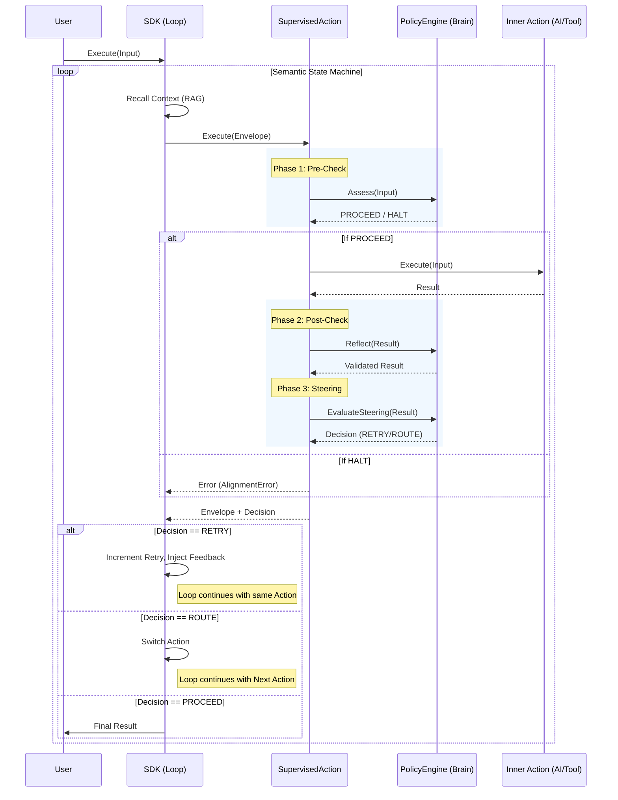

#### 2. THE COMPLETE FILE MAP

```text
.
├── adapters/             # Integration with external worlds (AI, HTTP, MCP)
├── cmd/                  # CLI Tools (mkit) - Omitted
├── config/               # Configuration Schema & Loading
├── core/                 # The Spine: Interfaces, Types, Contracts
├── docs/                 # Documentation & Architecture Rules
├── examples/             # Runnable Usage Examples - Omitted
├── internal/
│   ├── engine/           # The Brain: Neuro-Symbolic Runtime & Solvers
│   │   ├── resources/    # The Law: Datalog Standard Library & Rules
│   │   └── runtime/      # Low-level Mangle wrapper
│   ├── supervisor/       # The Guard: Action Sandwich Implementation
│   └── util/             # Utilities (Schema, etc.)
├── providers/            # Plugin Implementations
├── sdk/                  # The Nerves: Client Logic & State Machine
├── AGENTS.md             # Operational Manual for AI Agents
├── manglekit.go          # Public Facade
└── go.mod
```

#### 3. COMPONENTS (The Logic)

**1. Core (The Spine)**
*   **Role:** Defines the immutable contracts and ubiquitous language of the system.
*   **Responsibilities:** Defines `Action` interface, `Envelope` data structure, `Evaluator` contract, and Control Plane constants (`PROCEED`, `HALT`).
*   **Key Mechanics:** Interface-based polymorphism, Context propagation (`context.Context`), Ubiquitous Language via consts.
*   **Key Structs:** `Envelope` (Data Container), `Decision` (Policy Outcome), `ActionMetadata`.
*   **Key Functions:** `NewEnvelope`, `Evaluator.Assess`, `Evaluator.Reflect`.

**2. Engine (The Brain)**
*   **Role:** The Neuro-Symbolic Runtime that enforces "The Law".
*   **Responsibilities:** Executes Datalog rules, converts Go structs/JSON to facts (`Reflection`), evaluates policies (`Assess`, `Reflect`), and determines next steps (`EvaluateSteering`).
*   **Key Mechanics:** Mangle Datalog Engine, Zero-cost Reflection (Struct->Facts), Fact Funnel (JSON Flattening), Semantic Feedback Loop.
*   **Key Structs:** `PolicyEngine` (Orchestrator), `Evaluator` (Single-Rule Check).
*   **Key Functions:** `Assess` (Pre-Check), `Reflect` (Post-Check), `EvaluateSteering` (Routing), `toMangleFacts` (Data Ingestion).

**3. Supervisor (The Guard)**
*   **Role:** The "Action Sandwich" decorator ensuring no action runs unchecked.
*   **Responsibilities:** Wraps every `core.Action` with `Trace -> Assess -> Execute -> Reflect` lifecycle.
*   **Key Mechanics:** Decorator Pattern, OpenTelemetry Tracing, Fail-Safe/Fail-Open logic.
*   **Key Structs:** `SupervisedAction`.
*   **Key Functions:** `Execute` (The Guarded Path).

**4. SDK (The Nerves)**
*   **Role:** The Orchestrator and Semantic State Machine.
*   **Responsibilities:** Manages the execution loop (`runLoopInternal`), handles Memory (RAG + History), and executes the "Plan" via dynamic routing.
*   **Key Mechanics:** Semantic State Machine (Loop), Feedback Loop (Retry/Correction), Backoff Strategy, Dependency Injection.
*   **Key Functions:** `ExecuteByName`, `runLoopInternal`, `ExecuteSingleStep` (The Atomic Unit).

#### 4. CRITICAL PATH & DATA (The Flow)

**Execution Flow (The Semantic Loop):**



**Data Structures:**

*   **Envelope:** The universal container (`ID`, `Payload`, `Metadata`, `SecurityLabels`).
*   **Facts:** Datalog predicates derived from Payload (`value(ID, Key, Val)` or `json_str(ID, Key, Val)`).
*   **Decision:** The engine's command (`Outcome`, `Target`, `Meta`).

#### 5. SOURCE CODE DUMP (The "What" - CRITICAL)

---
## internal/engine/resources/std.dl
```datalog
% --- Manglekit Standard Library (v2.0) ---
% Auto-loaded on engine startup.

% ==========================================
% 1. DATA REFLECTION (DO NOT REMOVE)
% These predicates allow the engine to read JSON inputs and Graph data.
% ==========================================

% JSON Primitives (Flattened)
Decl json_str(Parent, Key, Val).
Decl json_num(Parent, Key, Val).
Decl json_bool(Parent, Key, Val).
Decl json_link(Parent, Key, Child).
Decl json_null(Parent, Key).

% Knowledge Graph Primitives (N-Quads/Triples)
Decl quad(S, P, O, G).
Decl triple(S, P, O).
triple(S, P, O) :- quad(S, P, O, _).

% ==========================================
% 2. SYSTEM CONTROL (Standard Vocabulary)
% ==========================================

% Arity 1: Global/Single-Context (JSON)
Decl deny(Reason).
Decl halt(Reason).
Decl route(NextStep).
Decl retry(Feedback).

% Arity 2: Entity-Specific (Graph/Batch)
% Allows pinning the decision to a specific node (Entity).
Decl deny(Entity, Reason).
Decl halt(Entity, Reason).
Decl route(Entity, NextStep).
Decl retry(Entity, Feedback).

% Config is always Key-Value (Arity 2) or Entity-Key-Value (Arity 3)
Decl config(Key, Value).
Decl config(Entity, Key, Value).

% Semantic Alias for backward compatibility
halt(Reason) :- deny(Reason).
halt(Entity, Reason) :- deny(Entity, Reason).

% ==========================================
% 3. CONTEXT INJECTION
% These predicates are injected by the runtime environment.
% ==========================================

Decl attempt(N).            % Current retry count (0, 1, 2...).
Decl meta(Key, Value).      % Envelope metadata (e.g., user_id, session_id).
Decl label(Tag).            % Security taint labels (e.g., "pii", "unsafe").

% Telemetry Predicate (Arity 2: Entity, RuleID)
Decl violation_rule(Entity, RuleID).

% --- Helper: String Matching ---

% input_contains(Req, Keyword)
% Checks if the input text payload contains the keyword (case-insensitive if supported).
% NOTE: fn:contains is not supported in Mangle v0.3.0, so this helper is currently disabled.
% input_contains(Req, Keyword) :-
%    value(Req, "text", Text),
%    fn:contains(Text, Keyword).
```
---
## internal/engine/resources/planner.dl
```datalog
Decl goal(Name) .
Decl subgoal(Parent, Child, Order) .
Decl plan_step(Action, Order) .

plan_step(Action, Order) :- goal(G), subgoal(G, Action, Order).
```
---
## internal/engine/reflection.go
```go
package engine

import (
	"fmt"
	"reflect"
	"strings"
)

// ToFacts converts a Go data structure into Mangle Datalog facts.
// It is the entry point for turning runtime objects into logic predicates.
func ToFacts(id string, input any) ([]string, error) {
	if input == nil {
		return nil, nil
	}
	var facts []string
	v := reflect.ValueOf(input)

	// Track visited pointers to prevent infinite recursion (Cycles)
	visited := make(map[uintptr]bool)

	if err := toFactsRecursive(id, "", v, &facts, visited); err != nil {
		return nil, err
	}
	return facts, nil
}

// LabelsToFacts converts a slice of security label strings into Mangle Datalog facts.
// This is used for propagating taint information (e.g., "secret", "pii") into the policy engine.
//
// Format:
//
//	label("label_value")
//  Note: In v2.0, we simplified this to just the label, as context is implied by the execution scope.
//  Wait, the original was has_label(ID, Label). The instruction says `label(Tag)`.
//  Usually context injection like `label(Tag)` means `label(Tag)` is a fact about the current context.
//  But `LabelsToFacts` takes an EntityID.
//  If I change it to `label(Tag)`, I lose the EntityID association unless `label` is arity 1.
//  The instruction says `Decl label(Tag).`. Arity 1.
//  So it seems we are moving to context-implicit predicates for the current entity?
//  Or maybe `label(Tag)` is just for the current input?
//  The `Authorize` function checks `deny(Req)`. Rules like `deny(Req) :- label("secret").` work if `label` is global/contextual.
//  So I will produce `label("val")` instead of `has_label("id", "val")`.
//
// Parameters:
//   - entityID: The unique identifier for the entity. (Ignored in v2 vocabulary for label, but kept for API compat)
//   - labels: A slice of security label strings.
//
// Returns:
//   - A slice of Datalog fact strings.
//   - An error if conversion fails (unlikely, mostly wrapper around string formatting).
func LabelsToFacts(entityID string, labels []string) ([]string, error) {
	var facts []string
	if len(labels) > 0 {
		facts = make([]string, 0, len(labels))
	}

	// entityID is ignored in v2 vocabulary
	// safeID := escapeString(entityID)

	for _, l := range labels {
		var sb strings.Builder
		sb.WriteString("label(\"")
		sb.WriteString(escapeString(l))
		sb.WriteString("\")")
		facts = append(facts, sb.String())
	}
	return facts, nil
}

// escapeString escapes special characters to ensure the resulting string
// is a valid Mangle string constant.
func escapeString(s string) string {
	var sb strings.Builder
	sb.Grow(len(s))
	for i := 0; i < len(s); i++ {
		b := s[i]
		switch b {
		case '\\', '"':
			sb.WriteByte('\\')
			sb.WriteByte(b)
		case '\n':
			sb.WriteString("\\n")
		case '\r':
			sb.WriteString("\\r")
		case '\t':
			sb.WriteString("\\t")
		default:
			if b < 32 {
				// Replace other control characters to avoid breaking the parser
				sb.WriteByte(' ')
			} else {
				sb.WriteByte(b)
			}
		}
	}
	return sb.String()
}

func toFactsRecursive(id, path string, v reflect.Value, facts *[]string, visited map[uintptr]bool, args ...string) error {
	if !v.IsValid() {
		return nil
	}

	// 1. Dereference Interfaces
	for v.Kind() == reflect.Interface {
		if v.IsNil() {
			return nil
		}
		v = v.Elem()
	}

	// 2. Cycle Detection (Ptr, Map, Slice) & Dereference Ptr
	k := v.Kind()
	if k == reflect.Ptr || k == reflect.Map || k == reflect.Slice {
		if v.IsNil() {
			return nil
		}
		ptr := v.Pointer()
		if visited[ptr] {
			return nil // Cycle detected
		}
		visited[ptr] = true
		defer delete(visited, ptr) // Stack-based tracking to allow DAGs but prevent loops
	}

	if k == reflect.Ptr {
		v = v.Elem()
	}

	// 3. Switch on Kind
	switch v.Kind() {
	case reflect.Struct:
		t := v.Type()
		for i := 0; i < v.NumField(); i++ {
			field := v.Field(i)
			structField := t.Field(i)

			// Skip unexported fields
			if !structField.IsExported() {
				continue
			}

			// [CRITICAL FIX] Explicitly handle ignore tags first
			tag := structField.Tag.Get("mangle")
			if tag == "-" {
				continue // Ignore immediately
			}

			jsonTag := structField.Tag.Get("json")
			// Check json:"-" or json:"-,omitempty"
			if jsonTag == "-" || strings.HasPrefix(jsonTag, "-,") {
				continue // Ignore immediately
			}

			// Determine Field Name
			fieldName := tag
			if fieldName == "" {
				if jsonTag != "" {
					parts := strings.Split(jsonTag, ",")
					fieldName = parts[0]
				}
			}
			if fieldName == "" {
				fieldName = strings.ToLower(structField.Name)
			}

			// Handle Embedded (Anonymous) Fields
			// Strategy: Flatten if anonymous AND untagged
			newPath := path
			isAnonymousUntagged := structField.Anonymous && tag == "" && structField.Tag.Get("json") == ""

			if !isAnonymousUntagged {
				if newPath != "" {
					newPath = newPath + "_" + fieldName
				} else {
					newPath = fieldName
				}
			}

			if err := toFactsRecursive(id, newPath, field, facts, visited, args...); err != nil {
				return err
			}
		}

	case reflect.Map:
		for _, key := range v.MapKeys() {
			val := v.MapIndex(key)
			keyStr := fmt.Sprintf("%v", key.Interface())

			// Append key to args
			newArgs := make([]string, len(args)+1)
			copy(newArgs, args)
			newArgs[len(args)] = keyStr

			if err := toFactsRecursive(id, path, val, facts, visited, newArgs...); err != nil {
				return err
			}
		}

	case reflect.Slice, reflect.Array:
		for i := 0; i < v.Len(); i++ {
			// Include index to preserve association and order
			idxStr := fmt.Sprintf("%d", i)
			newArgs := make([]string, len(args)+1)
			copy(newArgs, args)
			newArgs[len(args)] = idxStr

			if err := toFactsRecursive(id, path, v.Index(i), facts, visited, newArgs...); err != nil {
				return err
			}
		}

	default:
		// primitive handling
		generatePrimitiveFact(id, path, v, facts, args...)
	}
	return nil
}

// generatePrimitiveFact creates the final Datalog string: predicate("id", "arg", value).
func generatePrimitiveFact(id, path string, v reflect.Value, facts *[]string, args ...string) {
	var strVal string
	var isNumeric bool

	switch v.Kind() {
	case reflect.Int, reflect.Int8, reflect.Int16, reflect.Int32, reflect.Int64:
		strVal = fmt.Sprintf("%d", v.Int())
		isNumeric = true
	case reflect.Uint, reflect.Uint8, reflect.Uint16, reflect.Uint32, reflect.Uint64:
		strVal = fmt.Sprintf("%d", v.Uint())
		isNumeric = true
	case reflect.Float32, reflect.Float64:
		strVal = fmt.Sprintf("%g", v.Float()) // Use %g to preserve significant digits
		isNumeric = true
	case reflect.Bool:
		strVal = fmt.Sprintf("%v", v.Bool())
	default:
		strVal = fmt.Sprintf("%v", v.Interface())
	}

	predicate := path
	if predicate == "" {
		predicate = "value"
	}

	// Helper to escape strings (Must ensure this exists in file)
	safeID := escapeString(id)

	var sb strings.Builder
	sb.WriteString(predicate)
	sb.WriteByte('(')
	sb.WriteByte('"')
	sb.WriteString(safeID)
	sb.WriteByte('"')

	for _, arg := range args {
		sb.WriteString(", \"")
		sb.WriteString(escapeString(arg))
		sb.WriteByte('"')
	}

	sb.WriteString(", ")
	if isNumeric {
		sb.WriteString(strVal)
	} else {
		sb.WriteByte('"')
		sb.WriteString(escapeString(strVal))
		sb.WriteByte('"')
	}
	sb.WriteByte(')')

	*facts = append(*facts, sb.String())
}
```
---
## internal/engine/flattener.go
```go
package engine

import (
	"fmt"
	"reflect"
	"strconv"
)

// Flatten converts ANY dynamic structure (maps, slices of any type) into graph facts.
func Flatten(rootID string, input any) ([]string, error) {
	var facts []string
	if input == nil {
		return facts, nil
	}

	counter := 0
	// [ADD] Visited map to prevent infinite recursion
	visited := make(map[uintptr]bool)

	if err := flattenRecursive(rootID, reflect.ValueOf(input), &facts, &counter, visited); err != nil {
		return nil, err
	}
	return facts, nil
}

func flattenRecursive(nodeID string, v reflect.Value, facts *[]string, counter *int, visited map[uintptr]bool) error {
	// Dereference pointers/interfaces
	for v.Kind() == reflect.Ptr || v.Kind() == reflect.Interface {
		if v.IsNil() {
			return nil
		}
		// Cycle check for Pointers
		if v.Kind() == reflect.Ptr {
			ptr := v.Pointer()
			if visited[ptr] {
				return nil
			}
			visited[ptr] = true
		}
		v = v.Elem()
	}

	switch v.Kind() {
	case reflect.Map:
		// [IMPROVEMENT] Use Reflection to handle map[string]int, map[string]string, etc.
		// iterating generic map keys
		iter := v.MapRange()
		for iter.Next() {
			key := iter.Key()
			val := iter.Value()

			// Convert key to string (JSON keys are always strings)
			keyStr := fmt.Sprintf("%v", key.Interface())
			safeKey := escapeString(keyStr)

			// Unwrap interface to check actual type
			effVal := val
			for effVal.Kind() == reflect.Interface || effVal.Kind() == reflect.Ptr {
				if effVal.IsNil() {
					break
				}
				effVal = effVal.Elem()
			}

			if isComplexKind(effVal.Kind()) {
				*counter++
				childID := fmt.Sprintf("node_%d", *counter)

				// Fact: json_link(Parent, Key, Child)
				fact := fmt.Sprintf("json_link(\"%s\", \"%s\", \"%s\")", escapeString(nodeID), safeKey, childID)
				*facts = append(*facts, fact)

				if err := flattenRecursive(childID, val, facts, counter, visited); err != nil {
					return err
				}
			} else {
				addPrimitiveReflect(nodeID, safeKey, effVal, facts)
			}
		}

	case reflect.Slice, reflect.Array:
		for i := 0; i < v.Len(); i++ {
			val := v.Index(i)
			keyStr := strconv.Itoa(i) // Index is the key

			// Unwrap interface to check actual type
			effVal := val
			for effVal.Kind() == reflect.Interface || effVal.Kind() == reflect.Ptr {
				if effVal.IsNil() {
					break
				}
				effVal = effVal.Elem()
			}

			if isComplexKind(effVal.Kind()) {
				*counter++
				childID := fmt.Sprintf("node_%d", *counter)

				fact := fmt.Sprintf("json_link(\"%s\", \"%s\", \"%s\")", escapeString(nodeID), keyStr, childID)
				*facts = append(*facts, fact)

				if err := flattenRecursive(childID, val, facts, counter, visited); err != nil {
					return err
				}
			} else {
				addPrimitiveReflect(nodeID, keyStr, effVal, facts)
			}
		}
	default:
		// Base case if root input is primitive (unlikely but possible)
		// Usually handled by parent loop, but safeguard here
	}
	return nil
}

// Helper to check complexity based on Kind (faster than interface check)
func isComplexKind(k reflect.Kind) bool {
	// Ptr/Interface should be unwrapped before calling this
	return k == reflect.Map || k == reflect.Slice || k == reflect.Array
}

// addPrimitiveReflect uses reflect.Value to handle types precisely
func addPrimitiveReflect(nodeID, key string, v reflect.Value, facts *[]string) {
	// Dereference again just to be sure
	for v.Kind() == reflect.Ptr || v.Kind() == reflect.Interface {
		if v.IsNil() {
			return
		}
		v = v.Elem()
	}

	nodeID = escapeString(nodeID)
	// Key is already escaped by caller

	switch v.Kind() {
	case reflect.String:
		fact := fmt.Sprintf("json_str(\"%s\", \"%s\", \"%s\")", nodeID, key, escapeString(v.String()))
		*facts = append(*facts, fact)

	case reflect.Bool:
		sVal := "false"
		if v.Bool() {
			sVal = "true"
		}
		fact := fmt.Sprintf("json_bool(\"%s\", \"%s\", \"%s\")", nodeID, key, sVal)
		*facts = append(*facts, fact)

	case reflect.Int, reflect.Int8, reflect.Int16, reflect.Int32, reflect.Int64:
		fact := fmt.Sprintf("json_num(\"%s\", \"%s\", %d)", nodeID, key, v.Int())
		*facts = append(*facts, fact)

	case reflect.Uint, reflect.Uint8, reflect.Uint16, reflect.Uint32, reflect.Uint64:
		fact := fmt.Sprintf("json_num(\"%s\", \"%s\", %d)", nodeID, key, v.Uint())
		*facts = append(*facts, fact)

	case reflect.Float32, reflect.Float64:
		// [IMPROVEMENT] Use %g for better formatting
		fact := fmt.Sprintf("json_num(\"%s\", \"%s\", %g)", nodeID, key, v.Float())
		*facts = append(*facts, fact)

	default:
		// Fallback for structs that are strictly not map/slice but treated as leaf here?
		// Or other types like Complex64. Treat as string.
		sVal := fmt.Sprintf("%v", v.Interface())
		fact := fmt.Sprintf("json_str(\"%s\", \"%s\", \"%s\")", nodeID, key, escapeString(sVal))
		*facts = append(*facts, fact)
	}
}
```
---
## internal/engine/evaluator.go
```go
package engine

import (
	"fmt"
	"reflect"
	"strings"

	mangleanalysis "github.com/google/mangle/analysis"
	mangleast "github.com/google/mangle/ast"
	mangleengine "github.com/google/mangle/engine"
	manglefactstore "github.com/google/mangle/factstore"
	mangleparse "github.com/google/mangle/parse"
)

// Evaluator provides capabilities for evaluating a single Datalog rule against a Go struct.
// It is primarily used for ad-hoc rule checking or dynamic policy evaluation where a full
// rule set management overhead is not required.
type Evaluator struct {
	rule     string
	clause   mangleast.Clause
	ruleHead string // e.g., "deny", "allow", "route"
}

// NewEvaluator creates a new Evaluator instance from a Datalog rule string.
// The rule must be a valid Datalog clause (e.g., "deny(Req) :- ...").
//
// Parameters:
//   - rule: The Datalog rule string to parse and prepare.
//
// Returns:
//   - A pointer to a configured Evaluator, or an error if the rule is invalid.
func NewEvaluator(rule string) (*Evaluator, error) {
	if rule == "" {
		return nil, fmt.Errorf("rule cannot be empty")
	}

	clause, err := mangleparse.Clause(rule)
	if err != nil {
		return nil, fmt.Errorf("failed to parse rule: %w", err)
	}

	// Extract the rule head predicate name (e.g., "deny" from "deny(Req)")
	ruleHead := ""
	if clause.Head.Predicate.Symbol != "" {
		ruleHead = clause.Head.Predicate.Symbol
	}

	return &Evaluator{
		rule:     rule,
		clause:   clause,
		ruleHead: ruleHead,
	}, nil
}

// EvaluateResult encapsulates the outcome of a rule evaluation.
type EvaluateResult struct {
	// Matched indicates whether the rule's head predicate was derived (i.e., the rule triggered).
	Matched bool
	// EntityID is the unique identifier of the entity that was evaluated.
	EntityID string
	// RuleHead is the name of the predicate that was checked (e.g., "deny").
	RuleHead string
}

// Evaluate executes the configured Datalog rule against a provided Go struct.
// It automatically converts the struct fields into Datalog facts using reflection.
//
// Parameters:
//   - entityID: A unique string identifier for the entity (e.g., request ID).
//   - entity: The Go struct to evaluate. Fields can be customized with `mangle` struct tags.
//
// Returns:
//   - An EvaluateResult indicating whether the rule matched, or an error if evaluation failed.
func (e *Evaluator) Evaluate(entityID string, entity any) (EvaluateResult, error) {
	result := EvaluateResult{
		EntityID: entityID,
		RuleHead: e.ruleHead,
	}

	// Convert entity to Mangle facts
	facts, err := structToFacts(entityID, entity)
	if err != nil {
		return result, fmt.Errorf("failed to convert entity to facts: %w", err)
	}

	// Set up the fact store and add initial facts
	store := manglefactstore.NewSimpleInMemoryStore()
	knownPredicates := make(map[mangleast.PredicateSym]mangleast.Decl)

	for _, atom := range facts {
		store.Add(atom)
		if _, ok := knownPredicates[atom.Predicate]; !ok {
			knownPredicates[atom.Predicate] = mangleast.NewSyntheticDeclFromSym(atom.Predicate)
		}
	}

	// Analyze the program
	program := []mangleast.Clause{e.clause}
	programInfo, err := mangleanalysis.AnalyzeOneUnit(mangleparse.SourceUnit{Clauses: program}, knownPredicates)
	if err != nil {
		return result, fmt.Errorf("failed to analyze program: %w", err)
	}

	// Evaluate - this materializes all consequences into the store
	if err := mangleengine.EvalProgram(programInfo, store); err != nil {
		return result, fmt.Errorf("failed to evaluate program: %w", err)
	}

	// Check if the rule head was derived for this entity
	queryStr := fmt.Sprintf(`%s("%s")`, e.ruleHead, entityID)
	queryAtom, err := mangleparse.Atom(queryStr)
	if err != nil {
		return result, fmt.Errorf("failed to parse query: %w", err)
	}

	result.Matched = store.Contains(queryAtom)
	return result, nil
}

// structToFacts converts a Go struct into Mangle Datalog atoms.
// It maps struct fields to predicates in the format: predicate("entityID", value).
//
// Rules:
//   - Exported fields are converted.
//   - `mangle` struct tag controls the predicate name.
//   - If no tag is present, the field name (lowercased) is used.
//   - Supports basic types: int, uint, float (as string), string, bool.
func structToFacts(entityID string, entity any) ([]mangleast.Atom, error) {
	val := reflect.ValueOf(entity)
	if val.Kind() == reflect.Ptr {
		if val.IsNil() {
			return nil, fmt.Errorf("entity cannot be nil")
		}
		val = val.Elem()
	}
	if val.Kind() != reflect.Struct {
		return nil, fmt.Errorf("entity must be a struct, got %v", val.Kind())
	}

	typ := val.Type()
	var atoms []mangleast.Atom

	for i := 0; i < typ.NumField(); i++ {
		field := typ.Field(i)
		fieldVal := val.Field(i)

		// Skip unexported fields
		if !field.IsExported() {
			continue
		}

		// Get predicate name from tag or field name
		tag := field.Tag.Get("mangle")
		if tag == "-" {
			continue // Skip fields marked with mangle:"-"
		}
		if tag == "" {
			tag = strings.ToLower(field.Name)
		}

		// Create the atom based on field type
		var atom mangleast.Atom
		switch fieldVal.Kind() {
		case reflect.Int, reflect.Int64, reflect.Int32, reflect.Int16, reflect.Int8:
			atom = mangleast.NewAtom(tag, mangleast.String(entityID), mangleast.Number(fieldVal.Int()))
		case reflect.Uint, reflect.Uint64, reflect.Uint32, reflect.Uint16, reflect.Uint8:
			atom = mangleast.NewAtom(tag, mangleast.String(entityID), mangleast.Number(int64(fieldVal.Uint())))
		case reflect.Float32, reflect.Float64:
			// Mangle doesn't have float, convert to string
			atom = mangleast.NewAtom(tag, mangleast.String(entityID), mangleast.String(fmt.Sprintf("%f", fieldVal.Float())))
		case reflect.String:
			atom = mangleast.NewAtom(tag, mangleast.String(entityID), mangleast.String(fieldVal.String()))
		case reflect.Bool:
			boolStr := "false"
			if fieldVal.Bool() {
				boolStr = "true"
			}
			atom = mangleast.NewAtom(tag, mangleast.String(entityID), mangleast.String(boolStr))
		default:
			// Skip unsupported types
			continue
		}
		atoms = append(atoms, atom)
	}

	if len(atoms) == 0 {
		return nil, fmt.Errorf("no valid facts could be extracted from entity")
	}

	return atoms, nil
}
```
---
## internal/engine/solver.go
```go
package engine

import (
	"context"
	"errors"
	"fmt"

	"github.com/duynguyendang/manglekit/core"
	"github.com/duynguyendang/manglekit/internal/engine/resources"
	"github.com/google/mangle/ast"
	"github.com/google/mangle/parse"
)

var ErrSolutionFound = errors.New("solution found")

// PolicyEngine is the core decision-making component of Manglekit.
// It orchestrates the loading of policies, maintaining the Datalog runtime,
// and executing authorization (Pre-Check) and validation (Post-Check) logic.
// It also integrates with observability (Tracing/Logging) to provide transparent governance.
type PolicyEngine struct {
	tracer  core.Tracer
	logger  core.Logger
	runtime *MangleRuntime
}

// New creates a new PolicyEngine with default no-op observability.
// This is suitable for basic usage where tracing and structured logging are not required.
//
// Returns:
//   - A pointer to a new PolicyEngine instance.
func New() (*PolicyEngine, error) {
	pe := &PolicyEngine{
		tracer:  &core.NopTracer{},
		logger:  core.NopLogger{},
		runtime: NewMangleRuntime(),
	}

	// Auto-load Standard Library
	if err := pe.runtime.AddPolicy(resources.StdLib()); err != nil {
		return nil, fmt.Errorf("manglekit: failed to load std.dl: %w", err)
	}

	return pe, nil
}

// NewWithTracer creates a new PolicyEngine with tracing enabled.
//
// Deprecated: Use NewWithObservability instead.
//
// Parameters:
//   - tracer: The tracer implementation to use.
//
// Returns:
//   - A pointer to a new PolicyEngine instance.
func NewWithTracer(tracer core.Tracer) *PolicyEngine {
	if tracer == nil {
		tracer = &core.NopTracer{}
	}
	return &PolicyEngine{
		tracer:  tracer,
		logger:  core.NopLogger{},
		runtime: NewMangleRuntime(),
	}
}

// NewWithObservability creates a new PolicyEngine with both tracing and logging enabled.
// This is the recommended constructor for production use.
//
// Parameters:
//   - tracer: The tracer implementation (e.g., OpenTelemetry).
//   - logger: The logger implementation.
//
// Returns:
//   - A pointer to a new PolicyEngine instance.
func NewWithObservability(tracer core.Tracer, logger core.Logger) (*PolicyEngine, error) {
	if tracer == nil {
		tracer = &core.NopTracer{}
	}
	if logger == nil {
		logger = core.NopLogger{}
	}

	pe := &PolicyEngine{
		tracer:  tracer,
		logger:  logger,
		runtime: NewMangleRuntime(),
	}

	// Load Planner Core Rules
	if err := pe.runtime.AddPolicy(resources.GetPlannerRules()); err != nil {
		if logger != nil {
			logger.Error("failed to load planner core schema", "error", err)
		}
	}

	// Load Manglekit Standard Library (std.dl)
	if err := pe.runtime.AddPolicy(resources.StdLib()); err != nil {
		if logger != nil {
			logger.Error("failed to load standard library", "error", err)
		}
		// Failure to load stdlib is critical for dynamic features
		return nil, fmt.Errorf("manglekit: failed to load std.dl: %w", err)
	}

	return pe, nil
}

// RecordLineage records a data lineage relationship between a child and a parent.
// Note: In the current architecture, lineage is primarily handled via context propagation
// and tracing spans rather than explicit in-memory storage.
//
// Parameters:
//   - ctx: The context.
//   - childID: The ID of the derived data.
//   - parentID: The ID of the source data.
func (e *PolicyEngine) RecordLineage(ctx context.Context, childID, parentID string) {
	if e.tracer != nil {
		// Lineage linking is handled via context propagation in GuardedAction.
		// If explicit linking span events are needed, they can be added here.
	}
}

// Logger returns the engine's configured Logger instance.
// This allows other components (like GuardedAction) to reuse the engine's logger.
//
// Returns:
//   - The configured Logger, or a NopLogger if none was set.
func (e *PolicyEngine) Logger() core.Logger {
	if e.logger == nil {
		return core.NopLogger{}
	}
	return e.logger
}

// LoadFacts injects a list of raw Datalog fact strings into the runtime's base knowledge.
// This allows adding dynamic context or configuration at runtime (e.g., feature flags).
//
// Parameters:
//   - facts: A slice of Datalog fact strings.
//
// Returns:
//   - An error if parsing or evaluation fails.
func (e *PolicyEngine) LoadFacts(facts []string) error {
	return e.runtime.LoadFacts(facts)
}

// RegisterAction injects metadata about a registered action into the Datalog runtime.
// It generates facts that describe the action's interface, enabling the Planner to reason about it.
//
// Generated Facts:
//   - action("name")
//   - has_input("name", "InputType")
//   - has_output("name", "OutputType")
//
// Parameters:
//   - meta: The metadata of the action.
//
// Returns:
//   - An error if fact loading fails.
func (e *PolicyEngine) RegisterAction(meta core.ActionMetadata) error {
	var facts []string
	safeName := escapeString(meta.Name)

	facts = append(facts, fmt.Sprintf("action(\"%s\")", safeName))

	if meta.InputType != "" {
		facts = append(facts, fmt.Sprintf("has_input(\"%s\", \"%s\")", safeName, escapeString(meta.InputType)))
	}

	if meta.OutputType != "" {
		facts = append(facts, fmt.Sprintf("has_output(\"%s\", \"%s\")", safeName, escapeString(meta.OutputType)))
	}

	return e.LoadFacts(facts)
}

// LoadPolicy loads policy rules from a raw Datalog string.
// This decouples the engine from file I/O.
//
// Parameters:
//   - ctx: The execution context (unused in current implementation but required by interface).
//   - policy: The Datalog rules as a string.
//
// Returns:
//   - An error if parsing or loading fails.
func (e *PolicyEngine) LoadPolicy(ctx context.Context, policy string) error {
	if policy == "" {
		return nil
	}

	// Load the rules into the Mangle runtime
	if err := e.runtime.AddPolicy(policy); err != nil {
		return fmt.Errorf("failed to load policy: %w", err)
	}

	// Log successful load
	if e.logger != nil {
		e.logger.Debug("policy loaded from string", "length", len(policy))
	}

	return nil
}

// AssessPlan implements the core.Evaluator interface.
// It performs a high-level assessment of the input, mapping Assess logic to a Decision.
// Formerly: Assess
func (e *PolicyEngine) AssessPlan(ctx context.Context, input core.Envelope) (core.Decision, error) {
	// Simple mapping: use empty metadata for generic assessment
	err := e.Assess(ctx, core.ActionMetadata{}, input)
	if err != nil {
		// If authorization fails, it's a DENY
		var alignErr *core.AlignmentError
		if errors.As(err, &alignErr) {
			return core.Decision{
				Outcome: core.DecisionHalt,
				Reasons: []string{alignErr.Message},
				Meta:    map[string]string{"rule_id": alignErr.RuleID},
			}, nil
		}
		return core.Decision{Outcome: core.DecisionHalt, Reasons: []string{err.Error()}}, err
	}
	return core.Decision{Outcome: core.DecisionProceed}, nil
}

// GetActionConfig queries the engine for dynamic configuration parameters.
// It executes the query `action_config(Key, Value)` and returns a map of results.
//
// Parameters:
//   - ctx: The execution context.
//   - input: The input envelope.
//
// Returns:
//   - A map of configuration keys and values.
//   - An error if execution fails.
func (e *PolicyEngine) GetActionConfig(ctx context.Context, input core.Envelope) (map[string]string, error) {
	config := make(map[string]string)

	if e.runtime == nil || e.runtime.programInfo == nil {
		return config, nil
	}

	// Convert input to facts
	facts, err := toMangleFacts(core.EntityInput, input.Payload, input.ContentType)
	if err != nil {
		if e.logger != nil {
			e.logger.Debug("failed to convert input to facts for config", "error", err)
		}
		// Return empty config on fact conversion failure to avoid blocking
		return config, nil
	}

	// Inject Envelope Facts
	for _, factStr := range input.Facts {
		atom, err := parse.Atom(factStr)
		if err != nil {
			if e.logger != nil {
				e.logger.Error("failed to parse envelop fact", "fact", factStr, "error", err)
			}
			// Continue without this fact
			continue
		}
		facts = append(facts, atom)
	}

	// Inject Metadata facts: meta(Key, Value) and attempt(N)
	for k, v := range input.Metadata {
		// Ensure k is string
		safeK := escapeString(k)
		// Ensure v is string or convertible to string
		vStr := fmt.Sprintf("%v", v)
		safeV := escapeString(vStr)

		// meta("key", "val")
		metaFact := fmt.Sprintf("meta(\"%s\", \"%s\")", safeK, safeV)
		if atom, err := parse.Atom(metaFact); err == nil {
			facts = append(facts, atom)
		}

		// attempt(N) from retry_count
		if k == "retry_count" {
			attemptFact := fmt.Sprintf("attempt(%s)", vStr)
			if atom, err := parse.Atom(attemptFact); err == nil {
				facts = append(facts, atom)
			}
		}
	}

	// Execute query: config(Key, Value)
	err = e.runtime.QueryWithSolutions(facts, "config(Key, Value)", func(solution map[string]any) error {
		key, kOk := solution["Key"].(string)
		val, vOk := solution["Value"].(string)
		if kOk && vOk {
			config[key] = val
		}
		return nil
	})

	if err != nil && e.logger != nil {
		e.logger.Debug("failed to query action config", "error", err)
	}

	return config, nil
}

// Assess performs the Pre-Check phase of governance.
// It checks if the input is allowed to proceed based on the loaded policies.
// If the `infeasible(Req, Reason)` or `deny(Req)` predicate is derived, it returns `core.ErrAlignment`.
//
// It automatically starts a tracing span (`Datalog.Assess`) and logs attributes.
//
// Parameters:
//   - ctx: The execution context.
//   - actionMeta: Metadata about the action being authorized.
//   - input: The input envelope containing the payload and security labels.
//
// Returns:
//   - core.ErrAlignment if blocked, or nil if allowed.
// Formerly: Authorize
func (e *PolicyEngine) Assess(ctx context.Context, actionMeta core.ActionMetadata, input core.Envelope) error {
	if e.tracer == nil {
		return e.assessInternal(ctx, actionMeta, input)
	}

	ctx, span := e.tracer.Start(ctx, core.SpanPreCheck)
	defer span.End()

	// Log security labels to span attributes for audit
	if len(input.SecurityLabels) > 0 {
		span.SetAttributes(map[string]any{core.AttrLabels: input.SecurityLabels})
	}

	err := e.assessInternal(ctx, actionMeta, input)
	if err != nil {
		span.RecordError(err)
	} else {
		span.SetAttributes(map[string]any{core.AttrOutcome: core.OutcomeProceed})
	}
	return err
}

// assessInternal executes the core authorization logic.
func (e *PolicyEngine) assessInternal(ctx context.Context, actionMeta core.ActionMetadata, input core.Envelope) error {
	var extraFacts []ast.Atom

	// Inject Action Metadata facts: action_operation("Req", "Name")
	if actionMeta.Name != "" {
		safeName := core.EntityInput
		safeOp := actionMeta.Name
		opFactStr := fmt.Sprintf("action_operation(\"%s\", \"%s\")", escapeString(safeName), escapeString(safeOp))
		opAtom, err := parse.Atom(opFactStr)
		if err == nil {
			extraFacts = append(extraFacts, opAtom)
		}
	}

	// Use infeasible(Req, Reason) with fallback to deny(Req)
	return e.evaluateGate(ctx, actionMeta.Name, core.EntityInput, input, extraFacts...)
}

// Reflect performs the Post-Check phase of governance.
// It checks if the output is allowed to be returned to the caller.
// If the `infeasible(Output, Reason)` predicate is derived, it returns `core.ErrAlignment`.
//
// It automatically starts a tracing span (`Datalog.Reflect`) and logs attributes.
//
// Parameters:
//   - ctx: The execution context.
//   - actionMeta: Metadata about the action being validated.
//   - output: The output envelope containing the result.
//
// Returns:
//   - The validated envelope (potentially modified, though currently pass-through), or an error.
// Formerly: Validate
func (e *PolicyEngine) Reflect(ctx context.Context, actionMeta core.ActionMetadata, output core.Envelope) (core.Envelope, error) {
	if e.tracer == nil {
		return e.reflectInternal(ctx, actionMeta, output)
	}

	ctx, span := e.tracer.Start(ctx, core.SpanPostCheck)
	defer span.End()

	// Log security labels to span attributes for audit
	if len(output.SecurityLabels) > 0 {
		span.SetAttributes(map[string]any{core.AttrLabels: output.SecurityLabels})
	}

	result, err := e.reflectInternal(ctx, actionMeta, output)
	if err != nil {
		span.RecordError(err)
		return core.Envelope{}, err
	}
	span.SetAttributes(map[string]any{core.AttrOutcome: core.OutcomeProceed})
	return result, nil
}

// reflectInternal executes the core validation logic.
func (e *PolicyEngine) reflectInternal(ctx context.Context, actionMeta core.ActionMetadata, output core.Envelope) (core.Envelope, error) {
	err := e.evaluateGate(ctx, actionMeta.Name, core.EntityOutput, output)
	if err != nil {
		return core.Envelope{}, err
	}
	return output, nil
}

// evaluateGate centralizes the logic for "Check -> Deny -> Explain".
// It is used by both Assess (Pre-Check) and Reflect (Post-Check).
// Updated to check `infeasible(Entity, Reason)` first, then `deny(Entity)`.
func (e *PolicyEngine) evaluateGate(ctx context.Context, actionName string, entityID string, env core.Envelope, extraFacts ...ast.Atom) error {
	if e.runtime == nil || e.runtime.programInfo == nil {
		return nil // No runtime or program loaded, allow by default
	}

	// 1. ToFacts: Convert Payload
	facts, err := toMangleFacts(entityID, env.Payload, env.ContentType)
	if err != nil {
		if e.logger != nil {
			e.logger.Debug("failed to convert payload to facts", "error", err)
		}
		// Return actual error to allow Fail-Open handling if configured upstream
		return fmt.Errorf("fact conversion error: %w", err)
	}

	// 2. Inject Extra Facts (e.g. Action Operation)
	facts = append(facts, extraFacts...)

	// 3. Inject Labels
	labelFacts, err := LabelsToFacts(entityID, env.SecurityLabels)
	if err != nil {
		if e.logger != nil {
			e.logger.Error("failed to generate label facts", "error", err)
		}
		return fmt.Errorf("label conversion error: %w", err)
	}
	for _, f := range labelFacts {
		atom, err := parse.Atom(f)
		if err != nil {
			if e.logger != nil {
				e.logger.Error("failed to parse label fact", "fact", f, "error", err)
			}
			return fmt.Errorf("label parsing error: %w", err)
		}
		facts = append(facts, atom)
	}

	// 4. Inject Explicit Facts from Envelope
	for _, f := range env.Facts {
		atom, err := parse.Atom(f)
		if err != nil {
			if e.logger != nil {
				e.logger.Error("failed to parse envelop fact", "fact", f, "error", err)
			}
			return fmt.Errorf("envelope fact parsing error: %w", err)
		}
		facts = append(facts, atom)
	}

	// 5. Inject Metadata
	for k, v := range env.Metadata {
		safeK := escapeString(k)
		vStr := fmt.Sprintf("%v", v)
		safeV := escapeString(vStr)
		// meta("key", "val")
		metaFact := fmt.Sprintf("meta(\"%s\", \"%s\")", safeK, safeV)
		if atom, err := parse.Atom(metaFact); err == nil {
			facts = append(facts, atom)
		}
		// attempt(N) from retry_count
		if k == "retry_count" {
			attemptFact := fmt.Sprintf("attempt(%s)", vStr)
			if atom, err := parse.Atom(attemptFact); err == nil {
				facts = append(facts, atom)
			}
		}
	}

	// 6. Run Query
	// Priority 1: halt(Entity, Reason)
	var violationMsg, ruleID string
	var blocked bool

	// Query: halt(Entity, Reason)
	queryHalt := fmt.Sprintf("%s(\"%s\", Reason)", core.PredHalt, entityID)
	err = e.runtime.QueryWithSolutions(facts, queryHalt, func(solution map[string]any) error {
		if reason, ok := solution["Reason"].(string); ok {
			violationMsg = reason
			blocked = true
			return ErrSolutionFound // Stop searching
		}
		return nil
	})

	// Check if search was stopped due to finding a solution
	if errors.Is(err, ErrSolutionFound) {
		err = nil // Clear sentinel error
	}
	if err != nil {
		if e.logger != nil {
			e.logger.Debug("failed to execute halt query", "error", err)
		}
		return fmt.Errorf("halt query error: %w", err)
	}

	if blocked {
		// Try to find rule ID if available (optional)
		// Query: violation_rule(ID)
		qErr := e.runtime.QueryWithSolutions(facts, "violation_rule(ID)", func(solution map[string]any) error {
			if id, ok := solution["ID"].(string); ok {
				ruleID = id
				return ErrSolutionFound
			}
			return nil
		})
		if errors.Is(qErr, ErrSolutionFound) {
			qErr = nil
		}
		// Log but do not block on metadata query failure
		if qErr != nil && e.logger != nil {
			e.logger.Warn("failed to query violation rule ID", "error", qErr)
		}

		if e.logger != nil {
			e.logger.Debug("gate violation detected (halt)", "action", actionName, "msg", violationMsg, "rule_id", ruleID)
		}
		return &core.AlignmentError{Message: violationMsg, RuleID: ruleID}
	}

	// Priority 2: deny(Entity) (Backward Compatibility)
	// Map legacy "deny" to core.PredHalt ("halt")
	queryDeny := fmt.Sprintf("%s(\"%s\")", core.PredHalt, entityID)
	denied, err := e.runtime.ExecuteQuery(facts, queryDeny)
	if err != nil {
		if e.logger != nil {
			e.logger.Debug("policy evaluation failed (deny check)", "error", err)
		}
		return fmt.Errorf("policy evaluation error: %w", err)
	}

	if denied {
		// Query: violation_msg(Msg)
		qErr := e.runtime.QueryWithSolutions(facts, fmt.Sprintf("%s(Msg)", core.PredViolation), func(solution map[string]any) error {
			if msg, ok := solution["Msg"].(string); ok {
				violationMsg = msg
				return ErrSolutionFound
			}
			return nil
		})
		if errors.Is(qErr, ErrSolutionFound) {
			qErr = nil
		}
		if qErr != nil && e.logger != nil {
			e.logger.Warn("failed to query violation message", "error", qErr)
		}

		// Query: violation_rule(ID)
		qErr = e.runtime.QueryWithSolutions(facts, "violation_rule(ID)", func(solution map[string]any) error {
			if id, ok := solution["ID"].(string); ok {
				ruleID = id
				return ErrSolutionFound
			}
			return nil
		})
		if errors.Is(qErr, ErrSolutionFound) {
			qErr = nil
		}
		if qErr != nil && e.logger != nil {
			e.logger.Warn("failed to query violation rule ID", "error", qErr)
		}

		if e.logger != nil {
			e.logger.Debug("gate violation detected (deny)", "action", actionName, "msg", violationMsg, "rule_id", ruleID)
		}
		return &core.AlignmentError{Message: violationMsg, RuleID: ruleID}
	}

	return nil
}

// CheckRequirement queries: requires("req_id", "capability")
func (e *PolicyEngine) CheckRequirement(ctx context.Context, input core.Envelope, reqName string) (bool, error) {
	if e.runtime == nil {
		return false, nil
	}

	// 1. Convert Input to Facts using the PRIVATE helper
	// Signature: toMangleFacts(entityID, payload, contentType)
	facts, err := toMangleFacts(core.EntityInput, input.Payload, input.ContentType)
	if err != nil {
		return false, fmt.Errorf("fact conversion failed: %w", err)
	}

	// 2. Construct Query
	// Query format: requires("Req", "memory")
	query := fmt.Sprintf(`requires("%s", "%s")`, core.EntityInput, reqName)

	// 3. Execute Query
	// Returns (bool, error) directly as per current engine design
	return e.ExecuteQuery(ctx, facts, query)
}

// EvaluateSteering executes "Steering Policies" which determine what to do next.
// Unlike Assess/Reflect (which are binary Proceed/Infeasible), Steering returns decisions like "Retry" or "Route".
//
// Logic Priority:
//  1. Correction (Retry): If `retry(Hint)` is derived, we return `RETRY` with the hint.
//  2. Routing (Route): If `route(Target)` is derived, we return `ROUTE` with the target.
//  3. Default: `PROCEED` (Proceed as normal).
//
// Parameters:
//   - ctx: The execution context.
//   - input: The input envelope.
//
// Returns:
//   - decision: The decision string (e.g., "RETRY", "ROUTE", "PROCEED").
//   - metadata: A map containing steering details (e.g., {"feedback": "hint"}).
//   - error: An error if evaluation fails.
func (e *PolicyEngine) EvaluateSteering(ctx context.Context, input core.Envelope) (string, map[string]string, error) {
	decision := core.DecisionProceed
	metadata := make(map[string]string)

	if e.runtime == nil || e.runtime.programInfo == nil {
		return decision, metadata, nil
	}

	// Convert the input payload to Mangle facts
	// We use "Req" as the entity ID, consistent with Assess
	facts, err := toMangleFacts(core.EntityInput, input.Payload, input.ContentType)
	if err != nil {
		if e.logger != nil {
			e.logger.Debug("failed to convert input to facts for steering", "error", err)
		}
		return decision, metadata, fmt.Errorf("failed to convert input to facts: %w", err)
	}

	// [NEW] Inject Explicit Facts from Envelope
	for _, factStr := range input.Facts {
		atom, err := parse.Atom(factStr)
		if err != nil {
			if e.logger != nil {
				e.logger.Error("failed to parse envelop fact", "fact", factStr, "error", err)
			}
			return decision, metadata, fmt.Errorf("envelope fact parsing error: %w", err)
		}
		facts = append(facts, atom)
	}

	// Inject Metadata facts: meta(Key, Value) and attempt(N)
	for k, v := range input.Metadata {
		safeK := escapeString(k)
		vStr := fmt.Sprintf("%v", v)
		safeV := escapeString(vStr)
		// meta("key", "val")
		metaFact := fmt.Sprintf("meta(\"%s\", \"%s\")", safeK, safeV)
		if atom, err := parse.Atom(metaFact); err == nil {
			facts = append(facts, atom)
		}

		// attempt(N) from retry_count
		if k == "retry_count" {
			attemptFact := fmt.Sprintf("attempt(%s)", vStr)
			if atom, err := parse.Atom(attemptFact); err == nil {
				facts = append(facts, atom)
			}
		}
	}

	// 1. Check Correction (Retry)
	// Query: retry(Hint)
	err = e.runtime.QueryWithSolutions(facts, fmt.Sprintf("%s(Hint)", core.PredRetry), func(solution map[string]any) error {
		if hint, ok := solution["Hint"].(string); ok {
			decision = core.DecisionRetry
			metadata[core.KeyFeedback] = hint
			// Stop searching after first match
			return ErrSolutionFound // Use error to break early
		}
		return nil
	})

	if errors.Is(err, ErrSolutionFound) {
		err = nil
	}
	if err != nil {
		if e.logger != nil {
			e.logger.Debug("failed to query retry", "error", err)
		}
	}

	if decision == core.DecisionRetry {
		return decision, metadata, nil
	}

	// 2. Check Routing
	// Query: route(Target)
	err = e.runtime.QueryWithSolutions(facts, fmt.Sprintf("%s(Target)", core.PredRoute), func(solution map[string]any) error {
		if target, ok := solution["Target"].(string); ok {
			decision = core.DecisionRoute
			metadata[core.KeyNextStep] = target
			return ErrSolutionFound // Use error to break early
		}
		return nil
	})

	if errors.Is(err, ErrSolutionFound) {
		err = nil
	}
	if err != nil {
		if e.logger != nil {
			e.logger.Debug("failed to query route", "error", err)
		}
	}

	return decision, metadata, nil
}

// ExecuteQuery executes a raw Datalog query against the current program state.
// It wraps the underlying runtime execution with observability (tracing).
//
// Parameters:
//   - ctx: The execution context.
//   - facts: Temporary facts to include in this specific query execution.
//   - queryStr: The Datalog query atom.
//
// Returns:
//   - true if derived, false otherwise.
//   - error if execution fails.
func (e *PolicyEngine) ExecuteQuery(ctx context.Context, facts []ast.Atom, queryStr string) (bool, error) {
	if e.tracer == nil {
		return e.runtime.ExecuteQuery(facts, queryStr)
	}

	ctx, span := e.tracer.Start(ctx, "Datalog.ExecuteQuery")
	defer span.End()

	span.SetAttributes(map[string]any{"datalog.query": queryStr})

	res, err := e.runtime.ExecuteQuery(facts, queryStr)
	if err != nil {
		span.RecordError(err)
		return false, err
	}

	span.SetAttributes(map[string]any{"datalog.result": res})
	return res, nil
}

// Query executes a Datalog query and returns all matching solutions.
// Each solution is a map where keys are variable names (e.g., "Action") and values are stringified constants.
//
// Parameters:
//   - ctx: The execution context.
//   - facts: Temporary facts (strings) to include.
//   - queryStr: The Datalog query with variables (e.g., 'plan_step(Action, Order)').
//
// Returns:
//   - A list of solution maps.
//   - An error if execution fails.
func (e *PolicyEngine) Query(ctx context.Context, facts []string, queryStr string) ([]map[string]string, error) {
	var results []map[string]string

	if e.runtime == nil {
		return nil, fmt.Errorf("runtime not initialized")
	}

	// Parse temporary facts
	var atomFacts []ast.Atom
	for _, f := range facts {
		atom, err := parse.Atom(f)
		if err != nil {
			return nil, fmt.Errorf("failed to parse fact '%s': %w", f, err)
		}
		atomFacts = append(atomFacts, atom)
	}

	if e.tracer != nil {
		var span core.Span
		ctx, span = e.tracer.Start(ctx, "Datalog.Query")
		defer span.End()
		span.SetAttributes(map[string]any{"datalog.query": queryStr})
	}

	err := e.runtime.QueryWithSolutions(atomFacts, queryStr, func(solution map[string]any) error {
		// Convert map[string]any to map[string]string
		strMap := make(map[string]string)
		for k, v := range solution {
			if s, ok := v.(string); ok {
				strMap[k] = s
			} else {
				strMap[k] = fmt.Sprintf("%v", v)
			}
		}
		results = append(results, strMap)
		return nil
	})

	if err != nil {
		return nil, err
	}

	return results, nil
}

// toMangleFacts helper converts a Go struct to Mangle atoms via the Reflection API.
func toMangleFacts(entityID string, input any, contentType core.ContentType) ([]ast.Atom, error) {
	if input == nil {
		return nil, nil
	}

	var atoms []ast.Atom
	var facts []string
	var err error

	// Choose strategy based on ContentType
	if contentType == core.TypeJSON {
		facts, err = Flatten(entityID, input)
	} else {
		// Default to Reflection (Struct)
		facts, err = ToFacts(entityID, input)
	}

	if err != nil {
		return nil, err
	}

	// Parse each fact string back into an ast.Atom
	for _, factStr := range facts {
		atom, err := parse.Atom(factStr)
		if err != nil {
			return nil, fmt.Errorf("failed to parse fact '%s': %w", factStr, err)
		}
		atoms = append(atoms, atom)
	}

	return atoms, nil
}
```
---
## internal/supervisor/supervisor.go
```go
package supervisor

import (
	"context"
	"errors"
	"fmt"
	"strconv"

	"github.com/duynguyendang/manglekit/core"
	"github.com/duynguyendang/manglekit/internal/telemetry"

	"go.opentelemetry.io/otel"
)

// SupervisedAction is a decorator that wraps any `core.Action` to enforce governance blueprints.
// It implements the standard "Trace -> Assess -> Execute -> Reflect" lifecycle.
//
// Lifecycle:
//  1. Trace: Starts an OpenTelemetry span for the operation.
//  2. Assess: Checks Pre-Check blueprints (e.g., "infeasible(Req)").
//  3. Execute: Runs the inner action (e.g., calls the LLM).
//  4. Reflect: Checks Post-Check blueprints (e.g., "infeasible(Output)").
//  5. Steering: Evaluates steering blueprints for routing or correction.
type SupervisedAction struct {
	inner       core.Action
	engine      core.Evaluator
	tracer      core.Tracer
	failureMode string
}

// NewSupervisedAction creates a new SupervisedAction with default settings (no tracing).
//
// Parameters:
//   - action: The inner action to supervise.
//   - eng: The policy engine (evaluator) to use for governance.
//   - failureMode: The resilience strategy ("open" or "closed").
//
// Returns:
//   - A new SupervisedAction instance.
func NewSupervisedAction(action core.Action, eng core.Evaluator, failureMode string) *SupervisedAction {
	return &SupervisedAction{
		inner:       action,
		engine:      eng,
		tracer:      &core.NopTracer{},
		failureMode: failureMode,
	}
}

// NewSupervisedActionWithTracer creates a new SupervisedAction with tracing enabled.
//
// Parameters:
//   - action: The inner action to supervise.
//   - eng: The policy engine (evaluator).
//   - tracer: The tracer implementation.
//   - failureMode: "open" (log only on system error) or "closed" (block on system error).
//
// Returns:
//   - A new SupervisedAction instance.
func NewSupervisedActionWithTracer(action core.Action, eng core.Evaluator, tracer core.Tracer, failureMode string) *SupervisedAction {
	if tracer == nil {
		tracer = &core.NopTracer{}
	}
	return &SupervisedAction{
		inner:       action,
		engine:      eng,
		tracer:      tracer,
		failureMode: failureMode,
	}
}

// Execute runs the supervised action, orchestrating the full governance lifecycle.
//
// It performs the following steps:
//  1. Starts a span.
//  2. Injects the logger into the context.
//  3. Runs Assess(). If it fails, execution halts (unless Fail-Open).
//  4. Runs the inner Action.Execute().
//  5. Propagates taint labels from input to output.
//  6. Runs Reflect(). If it fails, the result is blocked.
//  7. Runs EvaluateSteering() to determine next steps (Retry/Route).
//
// Parameters:
//   - ctx: The execution context.
//   - input: The data envelope.
//
// Returns:
//   - The result envelope (possibly modified by blueprint), or an error.
func (g *SupervisedAction) Execute(ctx context.Context, input core.Envelope) (core.Envelope, error) {
	// Auto-Tracing (Phase 5)
	// We use the injected core.Tracer if available, otherwise fallback to global OTel.
	tracer := g.tracer
	if tracer == nil {
		tracer = telemetry.NewOTelTracer(otel.Tracer("manglekit"))
	}
	meta := g.inner.Metadata()

	ctx, span := tracer.Start(ctx, fmt.Sprintf("Action.%s", meta.Name))
	defer span.End()

	span.SetAttributes(map[string]any{
		"mangle.action_name": meta.Name,
		"mangle.action_type": string(meta.Type),
		"mangle.input_id":    input.ID.String(),
	})

	result, err := g.executeInternal(ctx, input)
	if err != nil {
		span.RecordError(err)
		span.SetStatus("error", err.Error())
		// Distinguish between Blueprint HALT and System ERROR
		if g.isAlignmentIssue(err) {
			span.SetAttributes(map[string]any{core.AttrOutcome: core.OutcomeHalt})
			var alignErr *core.AlignmentError
			if errors.As(err, &alignErr) {
				attrs := map[string]any{core.KeyFeedback: alignErr.Message}
				if alignErr.RuleID != "" {
					attrs[core.AttrRuleID] = alignErr.RuleID
				}
				span.SetAttributes(attrs)
			} else {
				span.SetAttributes(map[string]any{core.KeyFeedback: err.Error()})
			}
		} else {
			span.SetAttributes(map[string]any{core.AttrOutcome: "ERROR"})
		}
		return core.Envelope{}, err
	}

	// Success Path: Determine outcome (Proceed/Route/Retry)
	decision := result.Metadata[core.KeyDecision]
	switch decision {
	case core.DecisionRetry:
		span.SetAttributes(map[string]any{core.AttrOutcome: "retry"})
		if hint, ok := result.Metadata[core.KeyFeedback]; ok {
			if s, ok := hint.(string); ok {
				span.SetAttributes(map[string]any{core.KeyFeedback: s})
			}
		}
	case core.DecisionRoute:
		span.SetAttributes(map[string]any{core.AttrOutcome: "route"})
		if target, ok := result.Metadata[core.KeyNextStep]; ok {
			if s, ok := target.(string); ok {
				span.SetAttributes(map[string]any{core.AttrActionName: s})
			}
		}
	default:
		span.SetAttributes(map[string]any{core.AttrOutcome: core.OutcomeProceed})
	}

	// Inject Retry Count if present
	if attemptVal, ok := input.Metadata["retry_count"]; ok {
		// handle both string and int
		if s, ok := attemptVal.(string); ok {
			if n, err := strconv.Atoi(s); err == nil {
				span.SetAttributes(map[string]any{core.AttrAttempt: n})
			}
		} else if n, ok := attemptVal.(int); ok {
			span.SetAttributes(map[string]any{core.AttrAttempt: n})
		}
	}

	span.SetAttributes(map[string]any{
		core.AttrOutcome:     core.OutcomeProceed,
		"mangle.output_id":   result.ID.String(),
	})
	return result, nil
}

// isAlignmentIssue checks if the error is a wrapped alignment check violation
func (g *SupervisedAction) isAlignmentIssue(err error) bool {
	return core.IsAlignmentError(err)
}

// Metadata delegates to the inner action's Metadata method.
// This allows the SupervisedAction to transparently represent the underlying capability.
func (g *SupervisedAction) Metadata() core.ActionMetadata {
	return g.inner.Metadata()
}

// shouldBlock determines if the action should be blocked based on the error and failure mode.
func (g *SupervisedAction) shouldBlock(err error) bool {
	if err == nil {
		return false
	}
	// Always block on explicit alignment issues
	if core.IsAlignmentError(err) {
		return true
	}
	// If mode is "open" (Fail-Open), allow execution (return false)
	// Otherwise (default/closed), block execution (return true)
	if g.failureMode == "open" {
		return false
	}
	return true
}

// executeInternal contains the actual execution logic.
// It receives the context with the active span so child spans can be created.
// The logger is injected into the context here, ensuring all downstream code
// can access it via core.LoggerFromContext(ctx).
func (g *SupervisedAction) executeInternal(ctx context.Context, input core.Envelope) (core.Envelope, error) {
	// Inject the logger into the context for downstream access
	ctx = core.ContextWithLogger(ctx, g.engine.Logger())

	logger := core.LoggerFromContext(ctx)
	meta := g.inner.Metadata()
	logger.Info("Action started",
		"action", meta.Name,
		"input_id", input.ID.String(),
	)

	// 1. Ingestion: Link Input to Parent (Tracing only)
	// if parentID, ok := core.GetParentID(ctx); ok {
	// 	// Evaluator doesn't support RecordLineage directly.
	// 	// g.engine.RecordLineage(ctx, input.ID.String(), parentID)
	// }

	// 2. Pre-Check: Assessment
	// Formerly: Authorize
	if err := g.engine.Assess(ctx, g.inner.Metadata(), input); err != nil {
		if g.shouldBlock(err) {
			logger.Warn("assessment failed",
				core.AttrActionName, meta.Name,
				"error", err.Error(),
			)
			return core.Envelope{}, fmt.Errorf("assessment failed: %w", err)
		}
		// Fail-Open
		logger.Warn("engine assessment failed but Fail-Open active. Proceeding.", "error", err)
	}

	// [NEW] Dynamic Configuration Injection
	// We query the engine for any configuration overrides (e.g. prompt params)
	config, err := g.engine.GetActionConfig(ctx, input)
	if err != nil {
		logger.Warn("failed to retrieve action config", "error", err)
	} else if len(config) > 0 {
		if input.Metadata == nil {
			input.Metadata = make(map[string]any)
		}
		for k, v := range config {
			input.Metadata[core.PrefixPromptConfig+k] = v
		}
	}

	// 3. Context Propagation: Pass the Gene
	// Propagate the current input ID as the new parent for the inner action
	childCtx := core.WithParentID(ctx, input.ID.String())

	// 4. Execution: Run inner action
	result, err := g.inner.Execute(childCtx, input)
	if err != nil {
		logger.Error("action execution failed",
			core.AttrActionName, meta.Name,
			"error", err.Error(),
		)
		return core.Envelope{}, fmt.Errorf("action execution failed: %w", err)
	}

	// 5. Propagation: Output inherits Input's security labels
	if len(input.SecurityLabels) > 0 {
		result.MergeLabels(input.SecurityLabels)
	}

	// 6. Linking: Link Output to Input (Tracing only)
	// g.engine.RecordLineage(ctx, result.ID.String(), input.ID.String())
	if result.Metadata == nil {
		result.Metadata = make(map[string]any)
	}
	result.Metadata["derived_from"] = input.ID.String()

	// 7. Post-Check: Reflection
	// Formerly: Validate
	validatedResult, err := g.engine.Reflect(ctx, g.inner.Metadata(), result)
	if err != nil {
		if g.shouldBlock(err) {
			logger.Warn("reflection failed",
				"action", meta.Name,
				"error", err.Error(),
			)
			return core.Envelope{}, fmt.Errorf("reflection failed: %w", err)
		}
		// Fail-Open: use result as validatedResult
		logger.Warn("engine reflection failed but Fail-Open active. Proceeding.", "error", err)
		validatedResult = result
	}

	// 8. Steering: Evaluate next steps (Correction/Routing)
	decision, steeringMeta, err := g.engine.EvaluateSteering(ctx, validatedResult)
	if err != nil {
		logger.Warn("steering evaluation failed",
			"action", meta.Name,
			"error", err.Error(),
		)
		return core.Envelope{}, fmt.Errorf("steering evaluation failed: %w", err)
	}

	// Stamp metadata
	if validatedResult.Metadata == nil {
		validatedResult.Metadata = make(map[string]any)
	}
	validatedResult.Metadata[core.KeyDecision] = decision
	for k, v := range steeringMeta {
		validatedResult.Metadata[k] = v
	}

	logger.Info("Action completed",
		"action", meta.Name,
		"result", "success", // Simplified as per doc
	)

	return validatedResult, nil
}
```
---
## sdk/loop.go
```go
package sdk

import (
	"context"
	"errors"
	"fmt"
	"strings"
	"time"

	"github.com/duynguyendang/manglekit/core"
	engine_memory "github.com/duynguyendang/manglekit/internal/engine/memory"
)

// Default execution constraints.
const (
	DefaultMaxSteps   = 10
	DefaultMaxRetries = 3
	BackoffBase       = 100 * time.Millisecond
)

// ExecutionParams holds state for the run loop.
type ExecutionParams struct {
	SessionID       string
	Metadata        map[string]any
	RetryCount      int
	FeedbackHistory []string
	LastFeedback    string

	// Memory & Persistence
	Store          core.MemoryStore
	CurrentHistory []core.Message
	MemoryMode     core.MemoryMode
}

// ExecuteByName executes a named action within the governance loop.
// It manages retries, semantic feedback, and dynamic routing based on policy.
func (c *Client) ExecuteByName(ctx context.Context, actionName string, input any, opts ...ExecutionOption) (core.Envelope, error) {
	// Default params
	params := ExecutionParams{
		RetryCount: 0,
		MemoryMode: c.memoryMode, // Inherit default from client
	}

	for _, opt := range opts {
		opt(&params)
	}
	return c.runLoopInternal(ctx, actionName, input, params)
}

// runLoopInternal implements the core Semantic State Machine loop.
// It iterates through steps, managing memory storage, handling decisions (Retry/Route),
// and enforcing the execution limits (max steps, timeouts).
func (c *Client) runLoopInternal(ctx context.Context, startAction string, payload any, params ExecutionParams) (core.Envelope, error) {
	if c.logger != nil {
		ctx = core.ContextWithLogger(ctx, c.logger)
	}

	// 1. Determine Store Strategy
	switch params.MemoryMode {
	case core.MemoryModePersist:
		params.Store = c.memory
		if params.SessionID != "" {
			var err error
			// Load initial history
			params.CurrentHistory, err = params.Store.Read(ctx, params.SessionID)
			if err != nil && c.logger != nil {
				c.logger.Warn("RunLoop failed to hydrate history", "error", err)
			}
		}
	case core.MemoryModeTransient:
		params.Store = &engine_memory.VolatileStore{}
	default:
		params.Store = &core.NopStore{}
	}

	currentAction := startAction
	currentPayload := payload

	for step := 0; step < DefaultMaxSteps; step++ {
		// Check context before starting new step
		if err := ctx.Err(); err != nil {
			return core.Envelope{}, err
		}

		if c.logger != nil {
			c.logger.Info("RunLoop step", "step", step, "action", currentAction)
		}

		result, err := c.ExecuteSingleStep(ctx, currentAction, currentPayload, &params)
		if err != nil {
			return core.Envelope{}, err
		}

		decision := result.Metadata[core.KeyDecision]
		if decision == core.DecisionRoute {
			// Update flow for next loop
			next, ok := result.Metadata[core.KeyNextStep].(string)
			if !ok || next == "" {
				return core.Envelope{}, fmt.Errorf("route decision missing next_step")
			}

			// Validate/Log Payload Handover
			if c.logger != nil {
				c.logger.Info("RunLoop: Routing to next action", "from", currentAction, "to", next, "payload_type", fmt.Sprintf("%T", result.Payload))
			}

			currentAction = next
			currentPayload = result.Payload
			continue
		}

		if decision == core.DecisionRetry {
			// Params internal state (RetryCount, Feedback) already updated by ExecuteSingleStep
			// Validation (MaxRetries) and Backoff (Sleep) also handled by ExecuteSingleStep
			// Just loop again with same action/payload
			continue
		}

		// ALLOW or empty -> Done
		return result, nil
	}
	return core.Envelope{}, fmt.Errorf("max steps exceeded")
}

// ExecuteSingleStep runs one step of the action and returns the decision.
// It handles: Action Execution, History Persistence, Blueprint Alignment Backoff, and Steering Logic (Retry/Route updates).
func (c *Client) ExecuteSingleStep(ctx context.Context, actionName string, payload any, params *ExecutionParams) (core.Envelope, error) {
	// 1. Resolve Action
	action, ok := c.registry[actionName]
	if !ok {
		return core.Envelope{}, fmt.Errorf("action not found: %s", actionName)
	}

	env := core.NewEnvelope(payload)
	env.ContentType = action.Metadata().InputContentType

	// --- Phase 1: Context Injection ---
	// 1.1 Inject Feedback (History & Last Hint)
	if len(params.FeedbackHistory) > 0 {
		env.Metadata[core.KeyPrevFeedback] = strings.Join(params.FeedbackHistory, "; ")
	}
	if params.LastFeedback != "" {
		env.SetFeedback(params.LastFeedback)
		env.Metadata["mangle_feedback"] = params.LastFeedback
	}

	// 1.2 Inject Chat History
	if len(params.CurrentHistory) > 0 && params.MemoryMode != core.MemoryModeNone {
		env.SetHistory(params.CurrentHistory)
	}

	// 1.3 Inject Semantic Memory (RAG)
	c.recallContext(ctx, payload, &env)

	// 1.3 Inject Explicit Metadata
	if params.Metadata != nil {
		for k, v := range params.Metadata {
			env.Metadata[k] = v
		}
	}

	// 1.4 Inject Context Facts (e.g. User Role, Budget from sdk.WithFact)
	// This ensures facts propagate to the Engine for Blueprint Checks.
	if facts := ContextFacts(ctx); facts != nil {
		for k, v := range facts {
			env.Metadata[k] = v
		}
	}

	// --- Phase 2: Blueprint Check (Pre-check) & Phase 3: Execution (Intuition) ---
	// The Action.Execute wrapper handles the Pre-check (Blueprint) and the actual Genkit Execution.
	result, err := action.Execute(ctx, env)
	if err != nil {
		var pve *core.AlignmentError
		if errors.As(err, &pve) {
			if params.RetryCount >= DefaultMaxRetries {
				return core.Envelope{}, fmt.Errorf("max retries exceeded: %w", err)
			}
			params.RetryCount++
			params.LastFeedback = pve.Message

			if c.logger != nil {
				c.logger.Warn("RunLoop: Blueprint Alignment Issue", "feedback", params.LastFeedback, "attempt", params.RetryCount)
			}

			// Context-aware Backoff
			if err := c.backoff(ctx, params.RetryCount); err != nil {
				return core.Envelope{}, err
			}

			// Return a mock result to signal RETRY to caller
			res := core.NewEnvelope(payload)
			res.Metadata[core.KeyDecision] = core.DecisionRetry
			return res, nil
		}
		return core.Envelope{}, err
	}

	params.LastFeedback = ""

	// 4. Update History
	if params.MemoryMode != core.MemoryModeNone {
		userContent := safelyStringify(payload)
		assistContent := safelyStringify(result.Payload)

		newExchange := []core.Message{
			{Role: "user", Content: userContent},
			{Role: "assistant", Content: assistContent},
		}
		params.CurrentHistory = append(params.CurrentHistory, newExchange...)
	}

	// 5. Persist
	if params.Store != nil && params.SessionID != "" && params.MemoryMode == core.MemoryModePersist {
		if err := params.Store.Write(ctx, params.SessionID, params.CurrentHistory); err != nil && c.logger != nil {
			c.logger.Warn("RunLoop failed to persist history", "error", err)
		}
	}

	// --- Phase 4: Evaluation & Correction (Post-check) ---
	// The Engine evaluates the result against the Blueprint and decides next steps (Retry/Route/Allow).
	decision := result.Metadata[core.KeyDecision]

	// --- HOOK: MEMORIZE ---
	// Only learn if no error and Decision is PROCEED (or empty/legacy)
	if err == nil && (decision == "" || decision == core.DecisionProceed) {
		c.asyncMemorize(payload, result.Payload)
	}

	if c.logger != nil {
		c.logger.Debug("RunLoop decision", "decision", decision, "action", actionName)
	}

	switch decision {
	case core.DecisionRetry:
		if params.RetryCount >= DefaultMaxRetries {
			return core.Envelope{}, fmt.Errorf("max retries exceeded for action %s", actionName)
		}
		params.RetryCount++
		hint := result.GetFeedback()
		params.LastFeedback = hint
		params.FeedbackHistory = append(params.FeedbackHistory, hint)

		if c.logger != nil {
			c.logger.Warn("RunLoop: RETRY triggered", "feedback", hint)
		}

		// Context-aware Backoff
		if err := c.backoff(ctx, params.RetryCount); err != nil {
			return core.Envelope{}, err
		}
		// Return result so caller loops
		return result, nil

	case core.DecisionRoute:
		// Reset retry count for new action
		params.RetryCount = 0
		params.FeedbackHistory = nil

		if c.logger != nil {
			c.logger.Info("RunLoop: Feedback history cleared for new action route")
		}
		// Return result so caller loops
		return result, nil

	case core.DecisionProceed, "":
		return result, nil

	case core.DecisionHalt:
		reason := result.Metadata["reason"]
		if reason == "" {
			reason = result.Metadata["violation_msg"]
		}
		if reason == "" {
			reason = "blueprint violation"
		}
		return core.Envelope{}, fmt.Errorf("action halted by blueprint: %s", reason)
	}

	// Should not reach here for standard decisions
	return result, nil
}

// backoff handles the sleep and context cancellation check
func (c *Client) backoff(ctx context.Context, retryCount int) error {
	sleepDuration := time.Duration(retryCount) * BackoffBase
	select {
	case <-ctx.Done():
		return ctx.Err()
	case <-time.After(sleepDuration):
		return nil
	}
}

// ---------------------------------------------------------
// PRIVATE HELPERS (Memory & Context)
// ---------------------------------------------------------

// safelyStringify converts any payload to string for embedding.
func safelyStringify(v any) string {
	if v == nil {
		return ""
	}
	if s, ok := v.(string); ok {
		return s
	}
	// Fallback to generic formatting
	return fmt.Sprintf("%v", v)
}

// recallContext handles the RAG lookup logic.
// It fails silently (logs only) to not break the main flow.
func (c *Client) recallContext(ctx context.Context, payload any, env *core.Envelope) {
	if c.agentMemory == nil {
		return
	}

	// [GATE] Check if memory is required
	if c.engine != nil {
		// Ask: requires(Req, "memory") ?
		needed, err := c.engine.CheckRequirement(ctx, *env, "memory")
		if err != nil {
			if c.logger != nil {
				c.logger.Warn("Engine check failed, skipping memory", "err", err)
			}
			return
		}
		if !needed {
			return // Skip RAG if not required
		}
	}

	// Start Span for Observability
	var span core.Span
	if c.tracer != nil {
		ctx, span = c.tracer.Start(ctx, core.SpanMemory)
		defer span.End()
	}

	inputStr := safelyStringify(payload)

	// Call Memory Provider
	contextData, err := c.agentMemory.Recall(ctx, inputStr)
	if err != nil {
		if c.logger != nil {
			c.logger.Warn("Memory Recall failed", "error", err)
		}
		if span != nil {
			span.RecordError(err)
		}
		return
	}

	// Inject if found
	if contextData != "" {
		env.SetMeta(core.KeyContext, contextData)
		if c.logger != nil {
			c.logger.Debug("Injected memory context", "len", len(contextData))
		}
	}
}

// asyncMemorize handles the Fire-and-Forget storage logic.
func (c *Client) asyncMemorize(input any, output any) {
	if c.agentMemory == nil {
		return
	}

	inputStr := safelyStringify(input)
	outputStr := safelyStringify(output)

	// Launch Goroutine to not block response latency
	go func(q, a string) {
		// Create a detached context with timeout to prevent leaks
		ctx, cancel := context.WithTimeout(context.Background(), 5*time.Second)
		defer cancel()

		if err := c.agentMemory.Memorize(ctx, q, a); err != nil {
			if c.logger != nil {
				c.logger.Warn("Memory Memorize failed", "error", err)
			}
		}
	}(inputStr, outputStr)
}
```
---
## core/types.go
```go
package core

import (
	"encoding/json"
	"fmt"

	"github.com/google/uuid"
)

// --- CONSTANTS: The Ubiquitous Language ---

// Standard Metadata Keys used for Control Plane signaling.
const (
	// Governance & Routing
	KeyDecision     = "manglekit.decision"  // Values: "PROCEED", "HALT", "RETRY", "ROUTE"
	KeyFeedback     = "manglekit.feedback"  // Human/LLM readable reason
	KeyPrevFeedback = "prev_feedback"       // Loopback for retry
	KeyNextStep     = "manglekit.next_step" // Next action routing

	// Risk & Analysis
	KeyRiskScore = "manglekit.risk_score" // 0-100

	// Performance & Observability
	KeyLatencyMs = "manglekit.latency_ms"
	KeyTraceID   = "manglekit.trace_id"
	KeyModel     = "manglekit.model"
	KeyHistory   = "manglekit_history"
	KeyContext   = "manglekit.context" // RAG data injected here
	KeySummary   = "manglekit.summary" // Conversation summary

	// Configuration
	PrefixPromptConfig = "prompt."
)

// Standard Decision Values
const (
	DecisionProceed = "PROCEED" // Formerly "ALLOW"
	DecisionHalt    = "HALT"    // Formerly "DENY"
	DecisionRetry   = "RETRY"
	DecisionRoute   = "ROUTE"
)

// Datalog System Constants
const (
	EntityInput   = "Req"           // ID for Input Envelope
	EntityOutput  = "Output"        // ID for Output Envelope
	PredHalt      = "halt"          // Was "deny" or "infeasible"
	PredRetry     = "retry"         // Correction signal
	PredRoute     = "route"         // Dynamic routing signal
	PredViolation = "violation_msg" // To extract error messages
)

// Observability & Trace Attributes
const (
	// Span Names
	SpanPreCheck  = "Datalog.Assess"  // Formerly "Datalog.PreCheck"
	SpanPostCheck = "Datalog.Reflect" // Formerly "Datalog.PostCheck"
	SpanMemory    = "Mangle.Recall"   // RAG lookup

	// Attribute Keys
	AttrPolicyName   = "policy.name"
	AttrPolicyType   = "policy.type"
	AttrDecisionType = "decision.type"
	AttrOutcome      = "outcome"       // "PROCEED", "HALT"
	AttrLabels       = "mangle.labels" // Taint Propagation
	AttrActionName   = "action.name"
	AttrActionType   = "action.type"
	AttrRuleID       = "mangle.rule_id" // Replaces AttrPolicyRuleID
	AttrAttempt      = "mangle.attempt" // Replaces AttrPolicyAttempt
)

// Outcome Values (for Tracing)
const (
	OutcomeProceed = "PROCEED" // Formerly "ALLOWED"
	OutcomeHalt    = "HALT"    // Formerly "DENIED"
	OutcomeSuccess = "success"
)

// --- STRUCTS ---

// ContentType defines the nature of the data payload.
type ContentType string

const (
	// TypeStruct indicates the payload is a strong Go struct.
	// This is the default mode, optimized for internal services.
	TypeStruct ContentType = "STRUCT"

	// TypeJSON indicates the payload is a flexible map[string]any.
	// This is used for AI agents and external webhooks.
	TypeJSON ContentType = "JSON"
)

// Envelope: The unified data container.
type Envelope struct {
	// ID is the unique identifier for this specific data envelope.
	ID uuid.UUID `json:"id"`
	// Payload is the actual data being transported.
	// Note: Field name preserved as Payload for compatibility, tagged as "data".
	Payload any `json:"data"`
	// Metadata stores key-value pairs for control plane signaling.
	Metadata map[string]any `json:"metadata,omitempty"`
	// Error stores any error encountered during processing.
	Error error `json:"error,omitempty"`

	// SecurityLabels holds taint tags (e.g., "secret", "pii") for information flow control.
	SecurityLabels []string `json:"security_labels,omitempty"`
	// Facts holds structured logical facts extracted from the payload.
	Facts []string `json:"facts,omitempty"`
	// ContentType indicates whether the payload is a Struct or JSON.
	ContentType ContentType `json:"content_type,omitempty"`
}

// NewEnvelope creates a new envelope with the provided payload.
func NewEnvelope(payload any) Envelope {
	return Envelope{
		ID:             uuid.New(),
		Payload:        payload,
		Metadata:       make(map[string]any),
		SecurityLabels: []string{},
		ContentType:    TypeStruct, // Default to Typed Mode
	}
}

// SetMeta sets a value in the envelope's metadata map.
func (e *Envelope) SetMeta(k string, v any) {
	if e.Metadata == nil {
		e.Metadata = make(map[string]any)
	}
	e.Metadata[k] = v
}

// GetMeta retrieves a value from the envelope's metadata map as a string.
// If the value is not a string, it returns an empty string (or simple string representation).
func (e *Envelope) GetMeta(k string) string {
	if e.Metadata == nil {
		return ""
	}
	v, ok := e.Metadata[k]
	if !ok {
		return ""
	}
	if s, ok := v.(string); ok {
		return s
	}
	return fmt.Sprintf("%v", v)
}

// SetFeedback injects the "Teacher's" feedback into metadata
func (e *Envelope) SetFeedback(msg string) {
	e.SetMeta(KeyFeedback, msg)
}

// GetFeedback retrieves the feedback for the "Student" (AI/Logic)
func (e *Envelope) GetFeedback() string {
	return e.GetMeta(KeyFeedback)
}

// AddLabel adds a security label to the envelope if it does not already exist.
func (e *Envelope) AddLabel(label string) {
	if !e.HasLabel(label) {
		e.SecurityLabels = append(e.SecurityLabels, label)
	}
}

// HasLabel checks for the existence of a specific security label on the envelope.
func (e *Envelope) HasLabel(label string) bool {
	for _, l := range e.SecurityLabels {
		if l == label {
			return true
		}
	}
	return false
}

// MergeLabels appends distinct labels from another source to this one.
func (e *Envelope) MergeLabels(other []string) {
	for _, l := range other {
		e.AddLabel(l)
	}
}

// SetHistory serializes a list of chat messages into the envelope's metadata.
func (e *Envelope) SetHistory(msgs []Message) {
	b, err := json.Marshal(msgs)
	if err == nil {
		e.SetMeta(KeyHistory, string(b))
	}
}

// Decision: Structured result from the Policy Engine.
type Decision struct {
	Outcome string            // Matches DecisionProceed, DecisionHalt, etc.
	Target  string            // Used if Outcome == DecisionRoute
	Reasons []string          // Explanations
	Meta    map[string]string // Side-channel data (risk scores, latency budget)
}

// ConfigEvent: For Hot-Swap mechanisms.
type ConfigEvent struct {
	Key     string
	Content []byte
	Type    string
}

// ActionMetadata provides metadata about an action.
type ActionMetadata struct {
	// Name is the unique identifier for the action.
	Name string
	// Type describes the category of the action.
	Type string
	// InputContentType specifies the expected input format.
	InputContentType ContentType
	// InputType is the string name of the Go input type.
	InputType string
	// OutputType is the string name of the Go output type.
	OutputType string
	// IsDynamic indicates if the input type is generic.
	IsDynamic bool
}

// Message represents a single message in a conversation flow.
type Message struct {
	// Role indicates the sender of the message.
	Role string `json:"role"`
	// Content is the textual body of the message.
	Content string `json:"content"`
}

// ConversationHistory represents a sequence of messages in a dialogue.
type ConversationHistory struct {
	// Messages is the ordered list of messages in the conversation.
	Messages []Message `json:"messages"`
}

// Query represents a structured user request.
type Query struct {
	Text string         `json:"text"`
	Meta map[string]any `json:"meta,omitempty"`
}

// GenerationConfig holds standard LLM parameters.
type GenerationConfig struct {
	Temperature   float64
	MaxTokens     int
	TopP          float64
	StopSequences []string
	Model         string
	JSONMode      bool
	// OutputType is used by Genkit to enforce structured output (schema).
	OutputType any
}

// Document represents a snippet of knowledge/memory.
type Document struct {
	Content  string         `json:"content"`
	Metadata map[string]any `json:"metadata,omitempty"`
	Score    float32        `json:"score,omitempty"` // Re-ranking score
}

// Answer represents a structured system response.
type Answer struct {
	Text string         `json:"text"`
	Meta map[string]any `json:"meta,omitempty"`
}
```
---
## core/governance.go
```go
package core

import "context"

// Evaluator: The Mangle Logic Engine.
// It defines the contract for policy execution, validation, and steering.
type Evaluator interface {
	// AssessPlan evaluates the policy for a given input (General purpose).
	// It returns a Decision struct with the outcome.
	// Formerly: Assess
	AssessPlan(ctx context.Context, input Envelope) (Decision, error)

	// Assess performs the Pre-Check phase (input validation).
	// Formerly: Authorize
	Assess(ctx context.Context, actionMeta ActionMetadata, input Envelope) error

	// Reflect evaluates the outcome of an action (Post-Check).
	// Formerly: Validate
	Reflect(ctx context.Context, actionMeta ActionMetadata, output Envelope) (Envelope, error)

	// EvaluateSteering determines the next step (Retry/Route) based on the output.
	EvaluateSteering(ctx context.Context, input Envelope) (string, map[string]string, error)

	// GetActionConfig queries the engine for dynamic configuration parameters.
	GetActionConfig(ctx context.Context, input Envelope) (map[string]string, error)

	// CheckRequirement checks if a capability is needed. e.g., requires(Req, "memory").
	CheckRequirement(ctx context.Context, input Envelope, reqName string) (bool, error)

	// LoadPolicy loads policy rules from a source string or file content.
	LoadPolicy(ctx context.Context, source string) error

	// LoadFacts injects dynamic facts into the engine.
	LoadFacts(facts []string) error

	// RegisterAction registers action metadata for discovery/planning.
	RegisterAction(meta ActionMetadata) error

	// Logger returns the engine's logger.
	Logger() Logger
}

// PreProcessor: Fast/Stateless checks (CEL/Expr).
type PreProcessor interface {
	Process(ctx context.Context, input Envelope) (map[string]any, error)
}

// RiskEngine: specialized interface for calculating risk.
type RiskEngine interface {
	CalculateRisk(ctx context.Context, input Envelope) (float64, error)
}

// ResourceMonitor: Cost & Rate Limiting.
type ResourceMonitor interface {
	CountTokens(ctx context.Context, text string) (int, error)
	CheckBudget(ctx context.Context, key string, cost int) (bool, error)
}
```
---
## core/logic.go
```go
package core

import "context"

// Action defines the interface for a unit of work in the Manglekit system.
type Action interface {
	// Execute performs the action's logic.
	Execute(ctx context.Context, input Envelope) (Envelope, error)

	// Metadata returns the action's metadata.
	Metadata() ActionMetadata
}

// GenerateOption is a functional option for text generation.
type GenerateOption func(o *GenerationConfig)

// LLMResponse contains the generated text and token usage metadata.
type LLMResponse struct {
	Text  string
	Usage map[string]int
}

// TextGenerator abstracts the LLM.
type TextGenerator interface {
	// Complete generates text from a prompt.
	Complete(ctx context.Context, prompt string) (string, error)

	// Generate generates text with options.
	Generate(ctx context.Context, prompt string, opts ...GenerateOption) (*LLMResponse, error)

	// Stream generates a stream of text.
	Stream(ctx context.Context, prompt string) (<-chan string, error)
}

// Extractor converts raw text into structured data.
type Extractor interface {
	Extract(ctx context.Context, input string, schema any) error
}
```
---

#### 6. CHANGELOG

* 2025-12-17: Kernel Resync. Added Datalog StdLib, Reflection, Flattening Logic, and Core Contracts.
