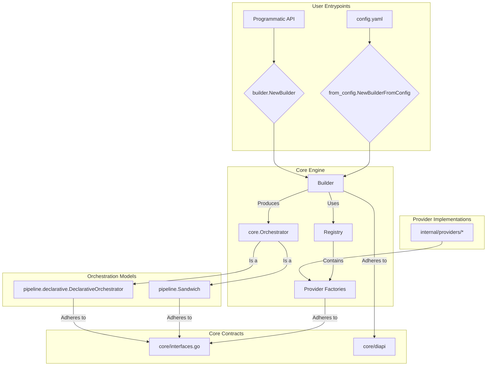

# Manglekit: The Live Architecture Standard

This document is the canonical, single source of truth for the Manglekit SDK's architecture. It defines the non-negotiable rules, contracts, and patterns that govern the framework.

## 0. Implementation Snapshot (Current State)



## 1. Architectural Overview

Manglekit is a Go framework for building Retrieval-Augmented Generation (RAG) applications. Its architecture is designed to be modular, extensible, and configuration-driven. The core philosophy is based on a clean separation between component interfaces (the `core` contracts), component implementations (`internal/providers`), and the orchestration engine (`pipeline`). A central `Builder` is responsible for constructing the final application pipeline from a set of registered providers, handling dependency injection and resource lifecycle management.

## 2. Dependency Rules (Non-Negotiable)

1.  **`internal/providers` depends on `core`; `core` must NOT depend on `internal/providers`.** This is the fundamental rule ensuring modularity.
2.  **`pipeline` depends on `core`; `core` must NOT depend on `pipeline`.** Orchestration logic is separate from core contracts.
3.  **`builder.go` depends on `core` and `registry.go`; `core` must NOT depend on the builder.** The construction mechanism is an external client of the core contracts.
4.  All inter-component dependencies during construction MUST be expressed via the typed structs in `core/diapi`. Direct, cross-provider package imports are forbidden.
5.  Provider factories MUST NOT depend on other concrete provider implementations. They may only depend on `core` interfaces provided via `diapi`.

## 3. Core Contracts

-   **`core.Orchestrator`**: The primary application interface. Defines `Execute` and `Close` methods.
-   **`core.Factory`**: The interface for all component factories. Defines a `Build(ctx, deps, cfg)` method.
-   **Component Interfaces**: `core.Retriever`, `core.Reranker`, `core.LLMClient`, `core.VectorStore`, `ai.Embedder`, `core.StateProvider`. These define the behavior of each component family.
-   **`core.Tool`**: A behavioral interface (`Execute(ctx, execCtx)`) that adapts components for use in the declarative orchestrator.
-   **`core.ResourceCloser`**: A function signature (`func(ctx) error`) used for standardized, graceful shutdown.

## 4. Provider Composition

Providers are self-contained modules in `internal/providers` that implement one or more `core` interfaces. They are registered with a central `Registry` at startup, mapping a string name (e.g., `"openai"`) and a `core.Kind` to a `core.Factory` instance. Composition is achieved at runtime by the `Builder`, which wires providers together based on configuration.

## 5. Configuration Flow

1.  **Loading**: Configuration is loaded from a YAML file or defined programmatically.
2.  **Resolution**: Provider names (e.g., `llm: { provider: "openai" }`) are used to look up the corresponding `Factory` and `Options` struct type in the `Registry`.
3.  **Binding**: Raw configuration options (`map[string]any`) are unmarshaled into the provider's specific, strongly-typed `Options` struct.
4.  **Construction**: The `Builder` receives the typed `Options` struct and uses it to invoke the factory, which constructs the component instance.

## 6. Observability & Resource Lifecycle

-   **Lifecycle**: The `Builder` is responsible for the entire component lifecycle. It invokes factories to create instances and collects `ResourceCloser` functions for any component that requires cleanup.
-   **Shutdown**: The final `Orchestrator` instance holds the list of all collected `ResourceCloser` functions. Its `Close` method must execute these functions to ensure no resources are leaked.
-   **Observability**: A single `core.Observability` struct (containing a logger, tracer, and meter) is passed from the `Builder` to the `Orchestrator` and is made available to all pipeline stages during execution.

## 7. Error & Metric Surfaces

-   **Build Errors**: Factory errors during the build phase are fatal and must immediately halt the application startup.
-   **Execution Errors**: Errors during pipeline execution (e.g., an API call fails) are handled by the `Orchestrator` and returned to the caller. Non-critical errors (e.g., failing to save conversation state) must be logged as warnings but should not fail the primary request.
-   **Metrics**: Each pipeline `Stage` is responsible for emitting its own metrics (e.g., latency, token counts) using the `Meter` from the `core.Observability` struct.

## 8. Testing & Replaceability

-   Component interfaces in `core` are the primary contract for testing.
-   Mock implementations for all core interfaces are provided in `internal/providers/mock`.
-   Tests should construct a `Builder` with mock providers to achieve isolated unit/integration testing of the orchestration logic. Because the `Builder` and `Registry` are configurable, any provider can be replaced with a mock at test time.

## 9. Anti-Patterns (Red Lines)

-   **Global State**: The framework must not use global variables or singletons for component instances. All state must be managed by the `Builder` and contained within the constructed `Orchestrator`.
-   **Type Assertions for DI**: Dependency injection must use the typed `diapi` structs. Using `any` and then performing runtime type assertions in a factory is strictly forbidden.
-   **Hard-Coded Dependencies**: A provider factory must never directly instantiate another provider (e.g., `openai.New()`). All dependencies must be requested via its `diapi` struct.

## 10. Known Gaps

This section tracks architectural gaps identified during code review that deviate from this standard.

1.  **Implicit Dependency Resolution**: The builder's reliance on the "last-built" component for dependency injection is fragile and order-dependent. The architecture should move to explicit, named dependencies in configuration. (Status: Open)
2.  **Monolithic Build Logic**: The builder's `specTable` centralizes all component creation logic, violating the Open/Closed Principle. This logic should be decentralized. (Status: Open)
3.  **Non-Deterministic Orchestrator**: The default `Sandwich` orchestrator arbitrarily picks the first available component from its dependency maps, leading to unpredictable behavior when multiple components of the same kind are configured. (Status: Open)
4.  **Hard-Coded Pipeline Parameters**: Tool adapters for the declarative orchestrator have hard-coded parameters (e.g., `TopK`), which should be configurable at the step level. (Status: Open)
5.  **Hard-Coded Default Orchestrator**: The builder defaults to the `"sandwich"` orchestrator, coupling it to a specific implementation. The choice should be mandatory and explicit. (Status: Open)
7.  **Redundant Builder API**: The builder exposes a legacy `WithKind` method that bypasses the type-safe registry lookup of the primary `With` method, creating an inconsistent and more complex API. (Status: Open)

## 11. Provider Families

-   **LLM**: `core.LLMClient`
-   **Embedder**: `ai.Embedder`
-   **Retriever**: `core.Retriever`
-   **Reranker**: `core.Reranker`
-   **VectorStore**: `core.VectorStore`
-   **StateProvider**: `core.StateProvider`
-   **RuleSet**: `core.RuleSet`
-   **Orchestrator**: `core.Orchestrator`

## 12. Versioning & Compatibility Policy

The framework follows Semantic Versioning (SemVer). Breaking changes to the `core` contracts or `diapi` structs will result in a major version increment. Adding new providers or options is considered a minor version change.

## 13. Machine Appendix (JSON Snapshot v1)

```json
{
  "project": "manglekit",
  "version": "0.4.0",
  "contracts": [
    "core.Orchestrator",
    "core.Factory",
    "core.Retriever",
    "core.Reranker",
    "core.LLMClient",
    "core.VectorStore",
    "ai.Embedder",
    "core.StateProvider",
    "core.Tool",
    "core.ResourceCloser"
  ],
  "dependency_interfaces": [
    "diapi.LLMDeps",
    "diapi.RetrieverDeps",
    "diapi.VectorStoreDeps",
    "diapi.EmbedderDeps",
    "diapi.OpenAIClientProvider"
  ],
  "known_gaps": [
    {
      "id": "GAP-001",
      "smell": "Implicit Dependency Resolution",
      "status": "Open"
    },
    {
      "id": "GAP-002",
      "smell": "Monolithic Build Logic",
      "status": "Open"
    },
    {
      "id": "GAP-003",
      "smell": "Non-Deterministic Orchestrator",
      "status": "Open"
    },
    {
      "id": "GAP-004",
      "smell": "Hard-Coded Pipeline Parameters",
      "status": "Open"
    },
    {
      "id": "GAP-005",
      "smell": "Hard-Coded Default Orchestrator",
      "status": "Open"
    },
    {
      "id": "GAP-006",
      "smell": "Redundant Builder API",
      "status": "Open"
    }
  ],
  "orchestration_models": [
    "pipeline.Sandwich",
    "pipeline.declarative.DeclarativeOrchestrator"
  ]
}
```

## 14. Changelog

-   **2025-10-19**: Regenerated the standard to reflect the data-driven builder and stage-based pipeline architecture. Added JSON appendix and synchronized Known Gaps with the latest code review.
