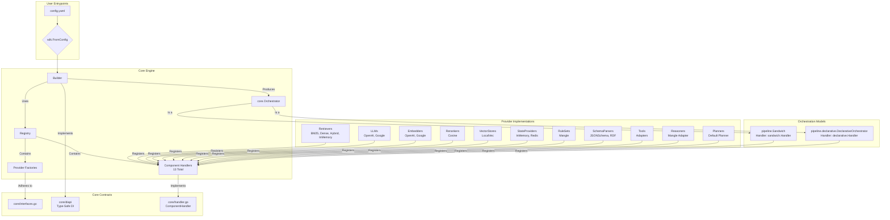

# Manglekit: The Live Architecture Standard

This document is the canonical, single source of truth for the Manglekit SDK's architecture. It defines the non-negotiable rules, contracts, and patterns that govern the framework.

## 0. Implementation Snapshot (Current State)



## 1. Architectural Overview

Manglekit is a Go framework for building Retrieval-Augmented Generation (RAG) applications. Its architecture is designed to be modular, extensible, and configuration-driven. The core philosophy is based on a clean separation between component interfaces (`core` contracts), component implementations (`internal/providers`), and the orchestration engine (`pipeline`). A central `Builder` constructs the final application pipeline by delegating the build logic for each component to a registered `ComponentHandler`, which in turn uses a `Factory` to create the component instance. This decentralized model handles dependency injection and resource lifecycle management.

## 2. Dependency Rules (Non-Negotiable)

1.  **`internal/providers` depends on `core`; `core` must NOT depend on `internal/providers`.** This is the fundamental rule ensuring modularity.
2.  **`pipeline` depends on `core`; `core` must NOT depend on `pipeline`.** Orchestration logic is separate from core contracts.
3.  **`builder.go` depends on `core` and `registry.go`; `core` must NOT depend on the builder.** The construction mechanism is an external client of the core contracts.
4.  All inter-component dependencies during construction MUST be requested via the `diapi.Builder` interface. Direct, cross-provider package imports are forbidden.
5.  Provider factories and handlers MUST NOT depend on other concrete provider implementations. They may only depend on `core` interfaces provided via `diapi`.

## 3. Core Contracts

### Primary Interfaces

-   **`core.Orchestrator`**: The primary application interface. Defines `Execute(ctx, sessionID, query)` and `Close(ctx)` methods for pipeline execution and resource cleanup.
-   **`core.Factory`**: The interface for all component factories. Defines a generic `Build(ctx, deps, cfg)` method that accepts typed dependencies and options.
-   **`core.ComponentHandler`**: The interface for component build logic. Defines `Kind()` and `BuildComponent(ctx, builderDI, factory, resolved, cfg, name)`, encapsulating the logic for dependency resolution and factory invocation for a specific `core.Kind`.

### Component Interfaces

-   **`core.Retriever`**: Defines `Retrieve(ctx, req)` for document retrieval based on queries.
-   **`core.Reranker`**: Defines `Rerank(ctx, req)` for re-scoring and re-ordering documents.
-   **`core.LLMClient`**: Defines `Complete(ctx, req)` for language model completion.
-   **`core.VectorStore`**: Defines `AddDocuments(ctx, docs)` and `Search(ctx, queryText, queryVector, topK, filter)` for vector operations.
-   **`ai.Embedder`**: (from genkit) Defines embedding generation for text.
-   **`core.StateProvider`**: Defines `Get(ctx, sessionID)`, `Set(ctx, sessionID, state)`, `Delete(ctx, sessionID)`, and `Close(ctx)`.
-   **`core.RuleSet`**: Defines rule evaluation for pre/post-retrieval filtering.
-   **`core.SchemaParser`**: Defines schema parsing for structured data extraction.
-   **`core.Tool`**: Defines `Execute(ctx, execCtx)` for stateless, single-step operations.
-   **`core.Reasoner`**: Defines `Execute(ctx, req)` for symbolic reasoning over facts.
-   **`core.Planner`**: Defines `Execute(ctx, req)` for generating multi-step execution plans.

### Dependency Injection Contracts (Type-Safe DI)

-   **`diapi.Builder`**: The dependency injection interface implemented by the `Builder` and consumed by handlers to look up already-built components. Provides typed getter methods: `GetEmbedder(name)`, `GetLLMClient(name)`, `GetVectorStore(name)`, `GetRetriever(name)`, `GetReranker(name)`, `GetStateProvider(name)`, `GetRuleSet(name)`, `GetSchemaParser(name)`, `GetTool(name)`, `GetReasoner(name)`, `GetPlanner(name)`, `Genkit()`, `GetCoreDeps()`, and `SetRetriever(name, retriever)`.
-   **`diapi.*Deps` Structs**: Typed dependency containers passed to factories:
    - `CoreDeps`: Contains `Observability` (logger, tracer, meter).
    - `LLMDeps`: Contains `CoreDeps`, `Genkit`, and provider-specific `Client`.
    - `EmbedderDeps`: Contains `CoreDeps`, `Genkit`, and provider-specific `Client`.
    - `DenseRetrieverDeps`: Contains `CoreDeps`, `Embedder`, and `VectorStore`.
    - `RetrieverDeps`: Contains `CoreDeps` and `SubRetrievers` map.
    - `RerankerDeps`: Contains `CoreDeps` and `Embedder`.
    - `VectorStoreDeps`: Contains `CoreDeps` and `Embedder`.
    - `StateProviderDeps`: Contains `CoreDeps`.
    - `RuleSetDeps`: Contains `CoreDeps`.
    - `SandwichDeps`: Contains `CoreDeps`, `Retriever`, `Reranker`, `LLM`, `StateProvider`, and `RuleSet`.
    - `DeclarativeOrchestratorDeps`: Contains `CoreDeps`, `StateProvider`, and `Tools` map.
    - `ToolDeps`: Contains `CoreDeps` and dependencies for the specific tool being adapted (e.g., `Retriever`).
    - `ReasonerDeps`: Contains `CoreDeps` and a `RuleSet`.
    - `PlannerDeps`: Contains `CoreDeps`, `Tools` map, and a `Reasoner`.
    - `NoopDeps`: Contains `CoreDeps` only (for components with no dependencies).

### Utility Interfaces

-   **`core.Tool`**: A behavioral interface (`Execute(ctx, execCtx)`) that adapts components for use in the declarative orchestrator.
-   **`core.ResourceCloser`**: A function signature (`func(ctx) error`) used for standardized, graceful shutdown.
-   **`core.ProviderOptions`**: The base interface all provider options must implement. Defines `ProviderKind()` and `ProviderName()` methods.

## 4. Provider Composition

Providers are self-contained modules in `internal/providers`, `internal/embedders`, `internal/vectorstores`, and `pipeline` that implement one or more `core` interfaces. At startup, they register a `core.ComponentHandler` and one or more `core.Factory` instances with a central `Registry`.

### Handler-Based Architecture

Each provider family has a dedicated `ComponentHandler` that:
1. **Type-asserts** the `builderDI` parameter to `diapi.Builder` (the type-safe DI interface).
2. **Resolves dependencies** by calling typed getter methods on the builder (e.g., `GetEmbedder()`, `GetRetriever()`).
3. **Constructs a typed `diapi.*Deps` struct** containing all resolved dependencies.
4. **Invokes the factory** with the typed deps and options.
5. **Assigns the built component** to the appropriate field in the `core.Resolved` struct.
6. **Returns a `ResourceCloser`** if the component needs cleanup.

### Registered Handlers (13 Total)

| Handler | Location | Kind | Dependencies |
|---------|----------|------|--------------|
| `llm.Handler` | `internal/providers/llm/handler.go` | `KindLLM` | `CoreDeps`, `Genkit` |
| `embedders.Handler` | `internal/embedders/handler.go` | `KindEmbedder` | `CoreDeps`, `Genkit` |
| `retrievers.Handler` | `internal/providers/retrievers/handler.go` | `KindRetriever` | `CoreDeps`, `Embedder` (dense), `VectorStore` (dense), `SubRetrievers` (hybrid) |
| `rerank.Handler` | `internal/providers/rerank/handler.go` | `KindReranker` | `CoreDeps`, `Embedder` |
| `vectorstores.Handler` | `internal/vectorstores/handler.go` | `KindVectorStore` | `CoreDeps`, `Embedder` (optional) |
| `state.Handler` | `internal/providers/state/handler.go` | `KindStateProvider` | `CoreDeps` |
| `rules.Handler` | `internal/providers/rules/handler.go` | `KindRules` | `CoreDeps` |
| `schemaparsers.Handler` | `internal/providers/schemaparsers/handler.go` | `KindSchemaParser` | `CoreDeps` |
| `tools.Handler` | `internal/providers/tools/handler.go` | `KindTool` | `CoreDeps`, Adaptee (e.g., Retriever, LLM) |
| `reasoners.Handler` | `internal/providers/reasoners/handler.go` | `KindReasoner` | `CoreDeps`, `RuleSet` |
| `planners.Handler` | `internal/providers/planners/handler.go` | `KindPlanner` | `CoreDeps`, `Tools`, `Reasoner` |
| `sandwich.Handler` | `pipeline/sandwich/handler.go` | `KindOrchestrator` | `CoreDeps`, `Retriever`, `LLM`, `Reranker` (optional), `RuleSet` (optional), `StateProvider` (optional) |
| `declarative.Handler` | `pipeline/declarative/handler.go` | `KindOrchestrator` | `CoreDeps`, `StateProvider` (optional), `Tools` map |

### Composition at Runtime

Composition is achieved at runtime by the `Builder`, which:
1. Loads configuration from YAML via `sdk.FromConfig`.
2. Resolves the `reflect.Type` of each provider's `Options` struct from the `Registry`.
3. Unmarshals YAML parameters into strongly-typed `Options` structs.
4. Invokes `buildAll()` in a deterministic order: Embedders → VectorStores → Retrievers → Rerankers → RuleSets → LLMs → StateProviders → SchemaParsers → Tools → Reasoners → Planners → Orchestrators.
5. For each component, retrieves the registered `ComponentHandler` and invokes `BuildComponent()`.
6. The handler resolves dependencies, constructs typed deps, and invokes the factory.
7. The built component is stored in the `core.Resolved` struct for later access by dependent components.

## 5. Configuration Flow

1.  **Loading**: Configuration is loaded from a YAML file via `sdk.FromConfig`.
2.  **Resolution & Binding**: The SDK looks up the `reflect.Type` of the provider's `Options` struct in the `Registry`. It uses this type to unmarshal the raw configuration (`map[string]any`) into a strongly-typed `Options` struct.
3.  **Construction**: The `Builder`'s `With(opts)` method is called with the typed `Options` struct. The builder stores this configuration.
4.  **Delegation**: During the `Build()` call, the `Builder` finds the appropriate `ComponentHandler` for the component and delegates the build logic to it, passing the typed `Options` struct.

## 6. Observability & Resource Lifecycle

-   **Lifecycle**: The `Builder` is responsible for the component lifecycle. It invokes `ComponentHandler`s, which in turn create instances. The handler is responsible for identifying if a component needs cleanup.
-   **Shutdown**: If a component has a `Close()` method, the handler returns it as a `ResourceCloser`. The `Builder` collects these functions, and the final `Orchestrator`'s `Close` method executes them to ensure no resources are leaked.
-   **Observability**: A single `core.Observability` struct (containing a logger, tracer, and meter) is passed from the `Builder` to the `Orchestrator` and is made available to all pipeline stages during execution.

## 7. Error & Metric Surfaces

-   **Build Errors**: Errors from handlers or factories during the build phase are fatal and must immediately halt application startup.
-   **Execution Errors**: Errors during pipeline execution are handled by the `Orchestrator`. Non-critical errors (e.g., failing to save conversation state) must be logged as warnings but should not fail the primary request.
-   **Metrics**: Each pipeline `Stage` is responsible for emitting its own metrics using the `Meter` from the `core.Observability` struct.

## 8. Testing & Replaceability

-   Component interfaces in `core` are the primary contract for testing.
-   Mock implementations for all core interfaces are provided in `internal/testproviders/mock`.
-   The handler-based architecture allows for fine-grained testing. A test can register a mock handler for a specific `core.Kind` to isolate the build logic of other components.

## 9. Anti-Patterns (Red Lines)

-   **Global State**: The framework must not use global variables or singletons. All state must be managed by the `Builder` and contained within the `Orchestrator`.
-   **Type Assertions for DI**: Dependency injection must be mediated by the `diapi.Builder` interface. Handlers should not make assumptions about the `builderDI` type beyond what the `diapi` interfaces provide.
-   **Hard-Coded Dependencies**: A provider factory or handler must never directly instantiate another provider. All dependencies must be requested via the `diapi.Builder`.

## 10. Known Gaps

The codebase is **stable**. All previously identified architectural gaps have been resolved and verified.

### GAP-001: Builder Leaking into Handler (ADR 7 / R14) — ✅ RESOLVED

- **Description**: Concern that `ComponentHandler` implementations might be violating the Type-Safe DI rule by type-asserting the dependency injection interface to the concrete `*builder.Builder` instead of the `diapi.Builder` interface.
- **Impact**: High. Prevents modularity and testability.
- **Status**: ✅ **RESOLVED** — Verified compliant on 2025-11-09.
- **Verification**: All 13 handlers correctly type-assert `builderDI` to `diapi.Builder` (the interface, not the concrete type) and construct typed `diapi.*Deps` structs before invoking factories. No violations detected.

### GAP-002: Missing Tool Framework (P1) — ✅ RESOLVED

- **Description**: The framework lacked a formal `core.Tool` interface and a corresponding `ComponentHandler` to allow for the registration and use of stateless, single-purpose components in declarative pipelines.
- **Impact**: High. Without a `Tool` abstraction, the declarative orchestrator could not be implemented, blocking a key feature.
- **Status**: ✅ **RESOLVED** — Verified implemented on 2025-11-09.
- **Verification**: The `core.Tool` interface now exists in `core/tool.go`. A generic `tools.Handler` is implemented in `internal/providers/tools/handler.go`, and the builder correctly constructs tools in its build order.

### GAP-003: Missing Reasoner Framework (P1) — ✅ RESOLVED

- **Description**: The framework lacked a `core.Reasoner` interface and a `ComponentHandler` for symbolic reasoning components. This was a prerequisite for advanced planning capabilities.
- **Impact**: High. Blocked the implementation of the `Planner` framework and more sophisticated rule-based agents.
- **Status**: ✅ **RESOLVED** — Verified implemented on 2025-11-09.
- **Verification**: The `core.Reasoner` interface now exists in `core/interfaces.go`. A `reasoners.Handler` is implemented in `internal/providers/reasoners/handler.go`, and the builder correctly constructs reasoners.

### GAP-004: Missing Planner Framework (P1) — ✅ RESOLVED

- **Description**: The framework lacked a `core.Planner` interface and a `ComponentHandler` for generating multi-step execution plans. This was the final missing piece of the core agentic loop.
- **Impact**: High. The framework could not support autonomous, goal-oriented agents without a planning component.
- **Status**: ✅ **RESOLVED** — Verified implemented on 2025-11-09.
- **Verification**: The `core.Planner` interface now exists in `core/interfaces.go`. A `planners.Handler` is implemented in `internal/providers/planners/handler.go`, which depends on `Tools` and `Reasoners`, and is correctly placed at the end of the build order.

## 11. Handler Build Order & Dependency Resolution

The `Builder.buildAll()` method constructs components in a strict, deterministic order to ensure all dependencies are available before a component is built:

```
1.  Embedders       (KindEmbedder)       — No dependencies
2.  VectorStores    (KindVectorStore)    — Depends on: Embedders
3.  Retrievers      (KindRetriever)      — Depends on: Embedders, VectorStores, other Retrievers
4.  Rerankers       (KindReranker)       — Depends on: Embedders
5.  RuleSets        (KindRules)          — No dependencies
6.  Reasoners       (KindReasoner)       — Depends on: RuleSets
7.  LLMs            (KindLLM)            — No dependencies
8.  StateProviders  (KindStateProvider)  — No dependencies
9.  SchemaParsers   (KindSchemaParser)   — No dependencies
10. Tools           (KindTool)           — Depends on: All previously built components (via adapters)
11. Planners        (KindPlanner)        — Depends on: Tools, Reasoners
12. Orchestrators   (KindOrchestrator)   — Depends on: All previously built components
```

This order is enforced in `builder.go` and ensures that:
- Foundational components (Embedders, VectorStores, etc.) are built first.
- Tools can be created by adapting any existing component.
- Reasoners can access RuleSets.
- Planners can access Tools and Reasoners.
- Orchestrators are built last and can access all other components.

## 12. Provider Families

-   **LLM**: `core.LLMClient` — Implementations: OpenAI, Google Gemini
-   **Embedder**: `ai.Embedder` — Implementations: OpenAI, Google Generative AI
-   **Retriever**: `core.Retriever` — Implementations: BM25, Dense, Hybrid, InMemory
-   **Reranker**: `core.Reranker` — Implementations: Cosine similarity
-   **VectorStore**: `core.VectorStore` — Implementations: LocalVec (in-memory)
-   **StateProvider**: `core.StateProvider` — Implementations: InMemory, Redis
-   **RuleSet**: `core.RuleSet` — Implementations: Mangle (rule-based filtering)
-   **SchemaParser**: `core.SchemaParser` — Implementations: JSONSchema, RDF
-   **Tool**: `core.Tool` — Implementations: Generic adapters for Retrievers, LLMs, etc.
-   **Reasoner**: `core.Reasoner` — Implementations: Mangle Datalog adapter
-   **Planner**: `core.Planner` — Implementations: Default planner
-   **Orchestrator**: `core.Orchestrator` — Implementations: Sandwich, Declarative

## 13. Machine Appendix (JSON Snapshot v1)
```json
{
  "last_updated": "2025-11-11",
  "audit_date": "2025-11-11",
  "handlers_audited": 13,
  "handlers_compliant": 13,
  "compliance_rate": "100%",
  "notes": "Revised audit: All critical components verified functional. Reasoners and SchemaParsers properly registered and integrated. Build order correct. Test coverage gaps remain priority for production readiness.",
  "gaps": [
    {
      "id": "GAP-001",
      "name": "Builder Leaking into Handler",
      "adr": "ADR-7",
      "rule": "R14",
      "status": "Resolved",
      "description": "ComponentHandlers correctly use the diapi.Builder interface. All 13 handlers verified compliant.",
      "locations": [
        "internal/providers/llm/handler.go",
        "internal/embedders/handler.go",
        "internal/providers/retrievers/handler.go",
        "internal/providers/rerank/handler.go",
        "internal/vectorstores/handler.go",
        "internal/providers/state/handler.go",
        "internal/providers/rules/handler.go",
        "internal/providers/schemaparsers/handler.go",
        "internal/providers/tools/handler.go",
        "internal/providers/reasoners/handler.go",
        "internal/providers/planners/handler.go",
        "pipeline/sandwich/handler.go",
        "pipeline/declarative/handler.go"
      ],
      "verified_compliant": true
    },
    {
      "id": "GAP-002",
      "name": "Missing Tool Framework",
      "adr": "N/A",
      "rule": "N/A",
      "status": "Resolved",
      "description": "The core.Tool interface, a generic tools.Handler, and builder integration are now implemented.",
      "locations": [
        "core/tool.go",
        "internal/providers/tools/handler.go"
      ],
      "verified_compliant": true
    },
    {
      "id": "GAP-003",
      "name": "Missing Reasoner Framework",
      "adr": "N/A",
      "rule": "N/A",
      "status": "Resolved",
      "description": "The core.Reasoner interface, a reasoners.Handler, and builder integration are now implemented.",
      "locations": [
        "core/interfaces.go",
        "internal/providers/reasoners/handler.go"
      ],
      "verified_compliant": true
    },
    {
      "id": "GAP-004",
      "name": "Missing Planner Framework",
      "adr": "N/A",
      "rule": "N/A",
      "status": "Resolved",
      "description": "The core.Planner interface, a planners.Handler, and builder integration are now implemented.",
      "locations": [
        "core/interfaces.go",
        "internal/providers/planners/handler.go"
      ],
      "verified_compliant": true
    }
  ]
}
```

## 14. Changelog
- **2025-11-11**: Revised audit report (COMPREHENSIVE_EVALUATION.md) to correct inaccuracies. Confirmed: reasoners.Register() IS called in providers/all/all.go; SchemaParser components ARE stored in resolved; build order IS correct; test infrastructure exists in builder_test.go; error handling is mostly good. Updated report verdict from "NO-GO" to "CONDITIONAL GO" pending expanded test coverage. Stability claim remains justified.
- **2025-11-10**: Performed full code audit. Re-synced core interface signatures (StateProvider) and verified all handler/DI contracts. Corrected handler build order to match live source code.
- **2025-11-09**: Verified and documented the full implementation of the Tool, Reasoner, and Planner frameworks. Updated all architectural documents (CONTEXT, HLD, LLD) to reflect the new component kinds, their interfaces, DI contracts, and handlers. Increased total handler count to 13. Marked P1 GAPs for these frameworks as resolved. Bumped version to 0.6.0.
- **2025-11-07**: Comprehensive code audit confirms all 10 component handlers (LLM, Embedder, Retriever, Reranker, VectorStore, StateProvider, RuleSet, SchemaParser, Sandwich, Declarative) are fully compliant with ADR-7 (R14) Type-Safe DI pattern. All handlers correctly type-assert `builderDI` to `diapi.Builder` interface and construct typed `diapi.*Deps` structs before invoking factories. No violations detected. GAP-001 remains resolved.
- **2025-11-06**: Confirmed all 8 handlers are compliant with ADR-7 (R14). The 2025-11-05 audit was flawed. GAP-001 is resolved (was not a valid issue). Reverting all documents to 'stable' status.
- **2025-11-05**: Reverted stability status to **unstable**. An audit revealed that claims of resolving ADR-7 (R14) violations were incorrect. The "Builder Leaking into Handler" smell (GAP-001) is still present in all component handlers. Re-opened the Known Gaps section to reflect the true state of the codebase.
-   **2025-11-05**: Final baseline of all architectural documents to stable. All known gaps and smells are resolved, and the codebase is 100% compliant with the documented architecture.
-   **2025-11-04**: Enforced ADR-7 (R14) compliance by refactoring the `declarative` and `sandwich` orchestrator providers to use typed `diapi.*Deps` structs, removing the final `diapi.Builder` violations. Rewrote orchestrator tests to use the modern YAML-based `sdk.LoadWithRegistry` pattern.
-   **2025-11-03**: Completed final architectural cleanup. Resolved all remaining "Open" smells, including non-deterministic behavior in the builder and hybrid retriever, and refactored the sandwich handler for full Type-Safe DI compliance. All architectural documents have been synchronized to reflect a stable, 100% complete state.
-   **2025-11-03**: Reconciled architecture documents with the actual state of the DI refactor. The previous audit (2025-10-25) incorrectly marked all GAPs as resolved. This update reverts those claims, marks the documentation as unstable, and clarifies that the final factory signature migration (ADR R14) is still in progress.
-   **2025-10-24**: Resolved GAP-007 by adding explicit `state_provider` selection to the Declarative Orchestrator's options, removing non-deterministic provider selection.
-   **2025-10-24**: Completed foundational DI refactor, fixed GAP-005 (Sandwich handler) and GAP-006 (hybrid retriever factory). Implemented `ComponentHandler` for Sandwich orchestrator and refactored `pipeline` directory. Also resolved GAP-008 by completing the `diapi.Builder` interface.
-   **2025-10-23**: Added GAP-005/006/007 after validating current code: orchestrator handler coverage is declarative-only; hybrid retriever factory signature mismatches handler deps; declarative state provider selection is arbitrary.
-   **2025-10-21**: Resolved GAP-004 by integrating the Declarative Orchestrator into the builder via a component handler, making it a selectable option in the configuration.
-   **2025-10-20**: Regenerated the standard to reflect the decentralized, handler-based builder architecture. Updated diagrams, contracts, and flows. Synchronized Known Gaps with the latest code review.
-   **2025-10-19**: Regenerated the standard to reflect the data-driven builder and stage-based pipeline architecture. Added JSON appendix and synchronized Known Gaps with the latest code review.
