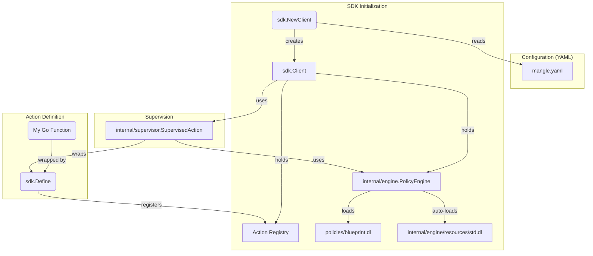

## 1. Executive Summary

Manglekit is a Go-based framework for building neuro-symbolic applications. It provides a "Universal Guarded Action" (UGA) architecture that wraps any unit of work (an `Action`) with a layer of governance enforced by a Datalog-based policy engine (`Evaluator`). This allows for dynamic, rule-based control over application behavior, including input validation, output reflection, dynamic configuration, and state machine-like steering (routing and retries). The core principle is to separate application logic from governance logic, enabling safer, more observable, and adaptable AI and automation systems.

---

## 2. The Complete File Map

```
.
|____.env.example
|____.github
| |____workflows
| | |____context-sync.yml
|____.gitignore
|____AGENTS.md # Instructions for AI agents working on this repo.
|____CONTRIBUTING.md
|____LICENSE
|____Makefile # Build, test, and lint commands.
|____README.md
|____adapters # Connects external systems to the Manglekit core.Action interface.
| |____ai # Adapters for AI models (e.g., Genkit).
| | |____adapter.go
| | |____genkit.go
| | |____utils.go
| |____extractor # Extracts structured data from text.
| | |____adapter.go
| |____func # Wraps plain Go functions as Actions.
| | |____wrapper.go
| |____knowledge # Loads knowledge graphs (RDF).
| | |____graph_loader.go
| | |____nquads.go
| | |____ntriples.go
| | |____rdf.go
| | |____rdf_stub.go
| |____logger # Logging adapters (e.g., Zap).
| | |____zap_adapter.go
| |____mcp # Adapters for the Model Context Protocol (MCP).
| | |____action.go
| | |____loader.go
| |____resilience # Resilience patterns as Actions (e.g., Circuit Breaker).
| | |____circuit_breaker.go
| |____vector # Adapters for vector stores.
| | |____genkit_retriever.go
| | |____retriever_adapter.go
|____cmd # Command-line interface tools.
| |____mkit # The primary CLI tool for Manglekit.
| | |____README.md
| | |____commands
| | | |____eval # Evaluates a policy against input data.
| | | |____gen # Generates rules and schemas.
| | | |____inspect # Inspects data structures.
| | | |____kg # Knowledge graph utilities.
| | | |____serve # Serves the Manglekit SDK over HTTP.
| | |____main.go
|____config # Configuration loading and schema definitions.
| |____loader.go
| |____schema.go
|____core # Foundational interfaces and data structures. The "Constitution" of the framework.
| |____context_facts.go
| |____context_lineage.go
| |____data.go
| |____errors.go
| |____governance.go
| |____infra.go
| |____logger.go
| |____logic.go
| |____memory.go
| |____state.go
| |____tracer.go
| |____types.go
|____docs # Project documentation.
|____examples # Example usage of the Manglekit framework.
|____go.mod # Go module definition.
|____go.sum # Go module checksums.
|____internal # Internal packages not intended for public use.
| |____engine # The Neuro-Symbolic Core (Mangle Runtime)
| | |____evaluator.go
| | |____flattener.go
| | |____memory
| | |____reflection.go
| | |____resources
| | |____runtime.go
| | |____solver.go
| |____logger # Internal logger implementation.
| | |____std.go
| |____resources # Embedded resources (e.g., rule templates).
| |____statehelper # State management utilities.
| |____supervisor # The "Action Sandwich" that enforces governance.
| | |____supervisor.go
| |____telemetry # Telemetry and observability helpers.
| |____testproviders # Mock providers for testing.
| |____tools # Internal tooling.
| |____util # General utility packages.
|____manglekit.go # Public facade for the SDK.
|____providers # Implementations for external services (e.g., Google, OpenAI).
| |____google
| |____memory
| |____openai
|____sdk # The primary Software Development Kit for Manglekit.
| |____client.go # The main client struct.
| |____client_execute.go
| |____config_loader.go
| |____execute_typed.go
| |____executor.go
| |____generics.go
| |____handle.go
| |____helpers.go
| |____loader.go
| |____loop.go # The Semantic State Machine implementation.
| |____options.go
| |____planner.go
| |____policy_generator.go
| |____registry.go
| |____tracing.go
| |____types.go
```

---

## 3. Components (The Logic)

### core

*   **Responsibilities:** Defines the essential contracts (interfaces) and data structures that decouple all other components. It is the abstract core of the framework, containing no concrete implementations.
*   **Structs:**
    *   `Envelope`: The universal data wrapper for all information passed through the system. It contains the `Payload`, `Metadata`, `SecurityLabels`, and other contextual information.
    *   `ActionMetadata`: Describes an `Action`'s properties, like its name, type, and I/O schema.
    *   `Decision`: A structured output from the `Evaluator` indicating the outcome of a policy check (e.g., `PROCEED`, `HALT`, `RETRY`, `ROUTE`).
*   **Key Functions/Interfaces:**
    *   `Action`: The fundamental unit of work. Any component that *does* something (calls an LLM, reads a database, etc.) must implement this interface (`Execute`, `Metadata`).
    *   `Evaluator`: The contract for the policy engine. It defines methods for assessing inputs (`Assess`), reflecting on outputs (`Reflect`), and steering execution flow (`EvaluateSteering`).
    *   `TextGenerator`: An abstraction for Large Language Models.

### internal/engine

*   **Responsibilities:** Provides the concrete implementation of the `core.Evaluator` interface. It wraps the Mangle Datalog engine, manages its runtime state, and translates Go objects into Datalog facts.
*   **Structs:**
    *   `PolicyEngine`: The main implementation of the `core.Evaluator`. It holds the Datalog runtime and provides the logic for assessing policies.
    *   `MangleRuntime`: A thread-safe wrapper around the underlying Mangle Datalog interpreter.
*   **Key Functions:**
    *   `ToFacts` (`reflection.go`): Uses reflection to convert strongly-typed Go structs into Datalog facts. It respects `json` and `mangle` struct tags.
    *   `Flatten` (`flattener.go`): Converts `map[string]any` (JSON-like) structures into a graph of `json_*` Datalog facts.
    *   `solver.go`: Contains the logic for querying the Datalog engine for specific decisions (`halt`, `route`, `retry`).
    *   `std.dl`: The Datalog "standard library" defining primitive predicates for data reflection and system control, automatically loaded into the engine.

### internal/supervisor

*   **Responsibilities:** Implements the "Action Sandwich" pattern. It acts as a decorator (`SupervisedAction`) that wraps any `core.Action` to enforce the governance lifecycle.
*   **Structs:**
    *   `SupervisedAction`: A struct that holds an inner `Action` and an `Evaluator`. Its `Execute` method orchestrates the entire governance flow.
*   **Key Functions:**
    *   `Execute`: The core method that implements the "Trace -> Assess -> Execute -> Reflect -> Steer" lifecycle. It calls the `Evaluator` before and after executing the inner `Action`, propagates security labels (taint), and handles failure modes ('open' vs. 'closed').

### sdk

*   **Responsibilities:** Provides the user-facing API for interacting with the Manglekit framework. It simplifies the process of creating clients, defining actions, and executing them under governance.
*   **Structs:**
    *   `Client`: The main entry point for users. It holds the action registry, the policy engine, and configuration for logging, tracing, and memory.
    *   `Runnable[In, Out]`: A generic wrapper that provides type-safe execution of actions.
*   **Key Functions:**
    *   `NewClient`: The factory function for creating a `Client`, configured using the functional options pattern (e.g., `WithBlueprintPath`, `WithLogger`).
    *   `Define`: Registers a Go function as a type-safe `Action` in the client's registry.
    *   `runLoopInternal` (`loop.go`): The implementation of the Semantic State Machine. It manages the execution loop, handling `RETRY` and `ROUTE` decisions from the `Evaluator`, applying backoff strategies, and managing conversation history.

### adapters, providers, config

*   **Responsibilities:** These components handle the "wiring" of the framework.
    *   `adapters`: Connect external concepts (like Go functions, HTTP endpoints, AI models) to the `core.Action` interface.
    *   `providers`: Concrete implementations for third-party services (e.g., `google`, `openai`).
    *   `config`: Handles loading and parsing of YAML configuration files (`schema.go`) into Go structs that the `sdk` uses to hydrate the `Client`.

---

## 4. CRITICAL PATH & DATA (The Flow)

### Wiring Flow

This diagram shows how components are constructed and wired together at startup.



### Execution Flow

This diagram illustrates the lifecycle of a single `ExecuteByName` call.

```mermaid
graph TD
    Start((Start)) --> A[sdk.Client.ExecuteByName]
    A --> B[sdk.runLoopInternal]
    B --> C{Step < MaxSteps?}
    C -- Yes --> D[supervisor.Execute]
    D --> D1[1. Assess (Pre-Check)]
    D1 -- OK --> D2[2. Execute Inner Action]
    D2 --> D3[3. Reflect (Post-Check)]
    D3 --> D4[4. Evaluate Steering]
    D4 --> E{Decision?}

    E -- PROCEED --> F((End))
    E -- HALT --> G([HALT])

    E -- RETRY --> H{Retry < MaxRetries?}
    H -- Yes --> I[Backoff]
    I --> B
    H -- No --> J([FAIL])

    E -- ROUTE --> K[Set Next Action]
    K --> B
    C -- No --> J
```

*   **Execution Flow:** A request starts at the `sdk.Client`, which enters the `runLoopInternal`. The `SupervisedAction` is executed, which first calls the `PolicyEngine` to `Assess` the input. If allowed, the inner action (e.g., LLM call) is executed. The output is then passed back to the `PolicyEngine` to `Reflect` upon. Finally, the engine evaluates `Steering` rules, which may decide to `RETRY` the same action with feedback, `ROUTE` to a different action, or `PROCEED` to finish the loop.
*   **Data Structures:**
    *   **Envelope:** The single, immutable container for data moving through the system. The `Payload` holds the business data, while `Metadata` is used by the control plane (the engine and SDK) to pass signals like `decision`, `feedback`, and `next_step`.
    *   **Facts:** Datalog facts are string representations of predicates (e.g., `label("pii")`, `json_num("Req", "age", 30)`). They are the logical representation of the `Envelope`'s data, used by the engine for reasoning. There is no persistent "Fact Store"; facts are generated on-the-fly for each execution step.

---

## 5. SOURCE CODE DUMP

---
### [internal/engine/resources/std.dl]
```datalog
% --- Manglekit Standard Library (v2.0) ---
% Auto-loaded on engine startup.

% ==========================================
% 1. DATA REFLECTION (DO NOT REMOVE)
% These predicates allow the engine to read JSON inputs and Graph data.
% ==========================================

% JSON Primitives (Flattened)
Decl json_str(Parent, Key, Val).
Decl json_num(Parent, Key, Val).
Decl json_bool(Parent, Key, Val).
Decl json_link(Parent, Key, Child).
Decl json_null(Parent, Key).

% Knowledge Graph Primitives (N-Quads/Triples)
Decl quad(S, P, O, G).
Decl triple(S, P, O).
triple(S, P, O) :- quad(S, P, O, _).

% ==========================================
% 2. SYSTEM CONTROL (Standard Vocabulary)
% ==========================================

% Arity 1: Global/Single-Context (JSON)
Decl deny(Reason).
Decl halt(Reason).
Decl route(NextStep).
Decl retry(Feedback).

% Arity 2: Entity-Specific (Graph/Batch)
% Allows pinning the decision to a specific node (Entity).
Decl deny(Entity, Reason).
Decl halt(Entity, Reason).
Decl route(Entity, NextStep).
Decl retry(Entity, Feedback).

% Config is always Key-Value (Arity 2) or Entity-Key-Value (Arity 3)
Decl config(Key, Value).
Decl config(Entity, Key, Value).

% Semantic Alias for backward compatibility
halt(Reason) :- deny(Reason).
halt(Entity, Reason) :- deny(Entity, Reason).

% ==========================================
% 3. CONTEXT INJECTION
% These predicates are injected by the runtime environment.
% ==========================================

Decl attempt(N).            % Current retry count (0, 1, 2...).
Decl meta(Key, Value).      % Envelope metadata (e.g., user_id, session_id).
Decl label(Tag).            % Security taint labels (e.g., "pii", "unsafe").

% Telemetry Predicate (Arity 2: Entity, RuleID)
Decl violation_rule(Entity, RuleID).
```
---
### [internal/engine/reflection.go]
```go
package engine

import (
	"fmt"
	"reflect"
	"strings"
)

// ToFacts converts a Go data structure into Mangle Datalog facts.
// It is the entry point for turning runtime objects into logic predicates.
func ToFacts(id string, input any) ([]string, error) {
	if input == nil {
		return nil, nil
	}
	var facts []string
	v := reflect.ValueOf(input)

	// Track visited pointers to prevent infinite recursion (Cycles)
	visited := make(map[uintptr]bool)

	if err := toFactsRecursive(id, "", v, &facts, visited); err != nil {
		return nil, err
	}
	return facts, nil
}

// LabelsToFacts converts a slice of security label strings into Mangle Datalog facts.
func LabelsToFacts(entityID string, labels []string) ([]string, error) {
	var facts []string
	if len(labels) > 0 {
		facts = make([]string, 0, len(labels))
	}
	for _, l := range labels {
		var sb strings.Builder
		sb.WriteString("label(\"")
		sb.WriteString(escapeString(l))
		sb.WriteString("\")")
		facts = append(facts, sb.String())
	}
	return facts, nil
}

func escapeString(s string) string {
	var sb strings.Builder
	sb.Grow(len(s))
	for i := 0; i < len(s); i++ {
		b := s[i]
		switch b {
		case '\\', '"':
			sb.WriteByte('\\')
			sb.WriteByte(b)
		case '\n':
			sb.WriteString("\\n")
		case '\r':
			sb.WriteString("\\r")
		case '\t':
			sb.WriteString("\\t")
		default:
			if b < 32 {
				sb.WriteByte(' ')
			} else {
				sb.WriteByte(b)
			}
		}
	}
	return sb.String()
}

func toFactsRecursive(id, path string, v reflect.Value, facts *[]string, visited map[uintptr]bool, args ...string) error {
	if !v.IsValid() {
		return nil
	}
	for v.Kind() == reflect.Interface {
		if v.IsNil() {
			return nil
		}
		v = v.Elem()
	}

	k := v.Kind()
	if k == reflect.Ptr || k == reflect.Map || k == reflect.Slice {
		if v.IsNil() {
			return nil
		}
		ptr := v.Pointer()
		if visited[ptr] {
			return nil // Cycle detected
		}
		visited[ptr] = true
		defer delete(visited, ptr)
	}

	if k == reflect.Ptr {
		v = v.Elem()
	}

	switch v.Kind() {
	case reflect.Struct:
		t := v.Type()
		for i := 0; i < v.NumField(); i++ {
			field := v.Field(i)
			structField := t.Field(i)
			if !structField.IsExported() {
				continue
			}

			tag := structField.Tag.Get("mangle")
			if tag == "-" {
				continue
			}
			jsonTag := structField.Tag.Get("json")
			if jsonTag == "-" || strings.HasPrefix(jsonTag, "-,") {
				continue
			}

			fieldName := tag
			if fieldName == "" {
				if jsonTag != "" {
					parts := strings.Split(jsonTag, ",")
					fieldName = parts[0]
				}
			}
			if fieldName == "" {
				fieldName = strings.ToLower(structField.Name)
			}
			newPath := path
			isAnonymousUntagged := structField.Anonymous && tag == "" && structField.Tag.Get("json") == ""
			if !isAnonymousUntagged {
				if newPath != "" {
					newPath = newPath + "_" + fieldName
				} else {
					newPath = fieldName
				}
			}
			if err := toFactsRecursive(id, newPath, field, facts, visited, args...); err != nil {
				return err
			}
		}
	case reflect.Map:
		for _, key := range v.MapKeys() {
			val := v.MapIndex(key)
			keyStr := fmt.Sprintf("%v", key.Interface())
			newArgs := make([]string, len(args)+1)
			copy(newArgs, args)
			newArgs[len(args)] = keyStr
			if err := toFactsRecursive(id, path, val, facts, visited, newArgs...); err != nil {
				return err
			}
		}
	case reflect.Slice, reflect.Array:
		for i := 0; i < v.Len(); i++ {
			idxStr := fmt.Sprintf("%d", i)
			newArgs := make([]string, len(args)+1)
			copy(newArgs, args)
			newArgs[len(args)] = idxStr
			if err := toFactsRecursive(id, path, v.Index(i), facts, visited, newArgs...); err != nil {
				return err
			}
		}
	default:
		generatePrimitiveFact(id, path, v, facts, args...)
	}
	return nil
}

func generatePrimitiveFact(id, path string, v reflect.Value, facts *[]string, args ...string) {
	var strVal string
	var isNumeric bool
	switch v.Kind() {
	case reflect.Int, reflect.Int8, reflect.Int16, reflect.Int32, reflect.Int64:
		strVal = fmt.Sprintf("%d", v.Int())
		isNumeric = true
	case reflect.Uint, reflect.Uint8, reflect.Uint16, reflect.Uint32, reflect.Uint64:
		strVal = fmt.Sprintf("%d", v.Uint())
		isNumeric = true
	case reflect.Float32, reflect.Float64:
		strVal = fmt.Sprintf("%g", v.Float())
		isNumeric = true
	case reflect.Bool:
		strVal = fmt.Sprintf("%v", v.Bool())
	default:
		strVal = fmt.Sprintf("%v", v.Interface())
	}

	predicate := path
	if predicate == "" {
		predicate = "value"
	}
	safeID := escapeString(id)
	var sb strings.Builder
	sb.WriteString(predicate)
	sb.WriteByte('(')
	sb.WriteByte('"')
	sb.WriteString(safeID)
	sb.WriteByte('"')
	for _, arg := range args {
		sb.WriteString(", \"")
		sb.WriteString(escapeString(arg))
		sb.WriteByte('"')
	}
	sb.WriteString(", ")
	if isNumeric {
		sb.WriteString(strVal)
	} else {
		sb.WriteByte('"')
		sb.WriteString(escapeString(strVal))
		sb.WriteByte('"')
	}
	sb.WriteByte(')')
	*facts = append(*facts, sb.String())
}
```
---
### [internal/engine/flattener.go]
```go
package engine

import (
	"fmt"
	"reflect"
	"strconv"
)

// Flatten converts ANY dynamic structure (maps, slices of any type) into graph facts.
func Flatten(rootID string, input any) ([]string, error) {
	var facts []string
	if input == nil {
		return facts, nil
	}
	counter := 0
	visited := make(map[uintptr]bool)
	if err := flattenRecursive(rootID, reflect.ValueOf(input), &facts, &counter, visited); err != nil {
		return nil, err
	}
	return facts, nil
}

func flattenRecursive(nodeID string, v reflect.Value, facts *[]string, counter *int, visited map[uintptr]bool) error {
	for v.Kind() == reflect.Ptr || v.Kind() == reflect.Interface {
		if v.IsNil() {
			return nil
		}
		if v.Kind() == reflect.Ptr {
			ptr := v.Pointer()
			if visited[ptr] {
				return nil
			}
			visited[ptr] = true
		}
		v = v.Elem()
	}

	switch v.Kind() {
	case reflect.Map:
		iter := v.MapRange()
		for iter.Next() {
			key := iter.Key()
			val := iter.Value()
			keyStr := fmt.Sprintf("%v", key.Interface())
			safeKey := escapeString(keyStr)
			effVal := val
			for effVal.Kind() == reflect.Interface || effVal.Kind() == reflect.Ptr {
				if effVal.IsNil() {
					break
				}
				effVal = effVal.Elem()
			}
			if isComplexKind(effVal.Kind()) {
				*counter++
				childID := fmt.Sprintf("node_%d", *counter)
				fact := fmt.Sprintf("json_link(\"%s\", \"%s\", \"%s\")", escapeString(nodeID), safeKey, childID)
				*facts = append(*facts, fact)
				if err := flattenRecursive(childID, val, facts, counter, visited); err != nil {
					return err
				}
			} else {
				addPrimitiveReflect(nodeID, safeKey, effVal, facts)
			}
		}
	case reflect.Slice, reflect.Array:
		for i := 0; i < v.Len(); i++ {
			val := v.Index(i)
			keyStr := strconv.Itoa(i)
			effVal := val
			for effVal.Kind() == reflect.Interface || effVal.Kind() == reflect.Ptr {
				if effVal.IsNil() {
					break
				}
				effVal = effVal.Elem()
			}
			if isComplexKind(effVal.Kind()) {
				*counter++
				childID := fmt.Sprintf("node_%d", *counter)
				fact := fmt.Sprintf("json_link(\"%s\", \"%s\", \"%s\")", escapeString(nodeID), keyStr, childID)
				*facts = append(*facts, fact)
				if err := flattenRecursive(childID, val, facts, counter, visited); err != nil {
					return err
				}
			} else {
				addPrimitiveReflect(nodeID, keyStr, effVal, facts)
			}
		}
	}
	return nil
}

func isComplexKind(k reflect.Kind) bool {
	return k == reflect.Map || k == reflect.Slice || k == reflect.Array
}

func addPrimitiveReflect(nodeID, key string, v reflect.Value, facts *[]string) {
	for v.Kind() == reflect.Ptr || v.Kind() == reflect.Interface {
		if v.IsNil() {
			return
		}
		v = v.Elem()
	}
	nodeID = escapeString(nodeID)
	switch v.Kind() {
	case reflect.String:
		fact := fmt.Sprintf("json_str(\"%s\", \"%s\", \"%s\")", nodeID, key, escapeString(v.String()))
		*facts = append(*facts, fact)
	case reflect.Bool:
		sVal := "false"
		if v.Bool() {
			sVal = "true"
		}
		fact := fmt.Sprintf("json_bool(\"%s\", \"%s\", \"%s\")", nodeID, key, sVal)
		*facts = append(*facts, fact)
	case reflect.Int, reflect.Int8, reflect.Int16, reflect.Int32, reflect.Int64:
		fact := fmt.Sprintf("json_num(\"%s\", \"%s\", %d)", nodeID, key, v.Int())
		*facts = append(*facts, fact)
	case reflect.Uint, reflect.Uint8, reflect.Uint16, reflect.Uint32, reflect.Uint64:
		fact := fmt.Sprintf("json_num(\"%s\", \"%s\", %d)", nodeID, key, v.Uint())
		*facts = append(*facts, fact)
	case reflect.Float32, reflect.Float64:
		fact := fmt.Sprintf("json_num(\"%s\", \"%s\", %g)", nodeID, key, v.Float())
		*facts = append(*facts, fact)
	default:
		sVal := fmt.Sprintf("%v", v.Interface())
		fact := fmt.Sprintf("json_str(\"%s\", \"%s\", \"%s\")", nodeID, key, escapeString(sVal))
		*facts = append(*facts, fact)
	}
}
```
---
### [internal/supervisor/supervisor.go]
```go
package supervisor

import (
	"context"
	"errors"
	"fmt"
	"strconv"

	"github.com/duynguyendang/manglekit/core"
	"github.com/duynguyendang/manglekit/internal/telemetry"
	"go.opentelemetry.io/otel"
)

// SupervisedAction is a decorator that wraps any `core.Action` to enforce governance blueprints.
type SupervisedAction struct {
	inner       core.Action
	engine      core.Evaluator
	tracer      core.Tracer
	failureMode string
}

// NewSupervisedAction creates a new SupervisedAction.
func NewSupervisedAction(action core.Action, eng core.Evaluator, failureMode string) *SupervisedAction {
	return &SupervisedAction{
		inner:       action,
		engine:      eng,
		tracer:      &core.NopTracer{},
		failureMode: failureMode,
	}
}

// Execute runs the supervised action, orchestrating the full governance lifecycle.
func (g *SupervisedAction) Execute(ctx context.Context, input core.Envelope) (core.Envelope, error) {
	tracer := g.tracer
	if tracer == nil {
		tracer = telemetry.NewOTelTracer(otel.Tracer("manglekit"))
	}
	meta := g.inner.Metadata()
	ctx, span := tracer.Start(ctx, fmt.Sprintf("Action.%s", meta.Name))
	defer span.End()

	span.SetAttributes(map[string]any{
		"mangle.action_name": meta.Name,
		"mangle.action_type": string(meta.Type),
		"mangle.input_id":    input.ID.String(),
	})

	result, err := g.executeInternal(ctx, input)
	if err != nil {
		span.RecordError(err)
		span.SetStatus("error", err.Error())
		if core.IsAlignmentError(err) {
			span.SetAttributes(map[string]any{core.AttrOutcome: core.OutcomeHalt})
		} else {
			span.SetAttributes(map[string]any{core.AttrOutcome: "ERROR"})
		}
		return core.Envelope{}, err
	}
	span.SetAttributes(map[string]any{core.AttrOutcome: core.OutcomeProceed})
	return result, nil
}

func (g *SupervisedAction) Metadata() core.ActionMetadata {
	return g.inner.Metadata()
}

func (g *SupervisedAction) shouldBlock(err error) bool {
	if err == nil {
		return false
	}
	if core.IsAlignmentError(err) {
		return true
	}
	if g.failureMode == "open" {
		return false
	}
	return true
}

func (g *SupervisedAction) executeInternal(ctx context.Context, input core.Envelope) (core.Envelope, error) {
	ctx = core.ContextWithLogger(ctx, g.engine.Logger())
	logger := core.LoggerFromContext(ctx)
	meta := g.inner.Metadata()

	if err := g.engine.Assess(ctx, g.inner.Metadata(), input); err != nil {
		if g.shouldBlock(err) {
			logger.Warn("assessment failed", "action", meta.Name, "error", err.Error())
			return core.Envelope{}, fmt.Errorf("assessment failed: %w", err)
		}
		logger.Warn("engine assessment failed but Fail-Open active. Proceeding.", "error", err)
	}

	config, err := g.engine.GetActionConfig(ctx, input)
	if err != nil {
		logger.Warn("failed to retrieve action config", "error", err)
	} else if len(config) > 0 {
		if input.Metadata == nil {
			input.Metadata = make(map[string]any)
		}
		for k, v := range config {
			input.Metadata[core.PrefixPromptConfig+k] = v
		}
	}

	childCtx := core.WithParentID(ctx, input.ID.String())
	result, err := g.inner.Execute(childCtx, input)
	if err != nil {
		logger.Error("action execution failed", "action", meta.Name, "error", err.Error())
		return core.Envelope{}, fmt.Errorf("action execution failed: %w", err)
	}

	if len(input.SecurityLabels) > 0 {
		result.MergeLabels(input.SecurityLabels)
	}

	validatedResult, err := g.engine.Reflect(ctx, g.inner.Metadata(), result)
	if err != nil {
		if g.shouldBlock(err) {
			logger.Warn("reflection failed", "action", meta.Name, "error", err.Error())
			return core.Envelope{}, fmt.Errorf("reflection failed: %w", err)
		}
		logger.Warn("engine reflection failed but Fail-Open active. Proceeding.", "error", err)
		validatedResult = result
	}

	decision, steeringMeta, err := g.engine.EvaluateSteering(ctx, validatedResult)
	if err != nil {
		logger.Warn("steering evaluation failed", "action", meta.Name, "error", err.Error())
		return core.Envelope{}, fmt.Errorf("steering evaluation failed: %w", err)
	}

	if validatedResult.Metadata == nil {
		validatedResult.Metadata = make(map[string]any)
	}
	validatedResult.Metadata[core.KeyDecision] = decision
	for k, v := range steeringMeta {
		validatedResult.Metadata[k] = v
	}
	return validatedResult, nil
}
```
---
### [sdk/loop.go]
```go
package sdk

import (
	"context"
	"errors"
	"fmt"
	"strings"
	"time"

	"github.com/duynguyendang/manglekit/core"
	engine_memory "github.com/duynguyendang/manglekit/internal/engine/memory"
)

const (
	DefaultMaxSteps   = 10
	DefaultMaxRetries = 3
	BackoffBase       = 100 * time.Millisecond
)

func (c *Client) runLoopInternal(ctx context.Context, startAction string, payload any, params ExecutionParams) (core.Envelope, error) {
	if c.logger != nil {
		ctx = core.ContextWithLogger(ctx, c.logger)
	}
	// Memory/Store setup omitted for brevity...

	currentAction := startAction
	currentPayload := payload

	for step := 0; step < DefaultMaxSteps; step++ {
		if err := ctx.Err(); err != nil {
			return core.Envelope{}, err
		}
		result, err := c.ExecuteSingleStep(ctx, currentAction, currentPayload, &params)
		if err != nil {
			return core.Envelope{}, err
		}
		decision := result.Metadata[core.KeyDecision]
		if decision == core.DecisionRoute {
			next, ok := result.Metadata[core.KeyNextStep].(string)
			if !ok || next == "" {
				return core.Envelope{}, fmt.Errorf("route decision missing next_step")
			}
			currentAction = next
			currentPayload = result.Payload
			continue
		}
		if decision == core.DecisionRetry {
			continue
		}
		return result, nil
	}
	return core.Envelope{}, fmt.Errorf("max steps exceeded")
}

func (c *Client) ExecuteSingleStep(ctx context.Context, actionName string, payload any, params *ExecutionParams) (core.Envelope, error) {
	action, ok := c.registry[actionName]
	if !ok {
		return core.Envelope{}, fmt.Errorf("action not found: %s", actionName)
	}
	env := core.NewEnvelope(payload)
	env.ContentType = action.Metadata().InputContentType

	// Context/Metadata injection omitted for brevity...

	c.recallContext(ctx, payload, &env)
	if facts := core.ContextFacts(ctx); facts != nil {
		for k, v := range facts {
			env.Metadata[k] = v
		}
	}

	result, err := action.Execute(ctx, env)
	if err != nil {
		var pve *core.AlignmentError
		if errors.As(err, &pve) {
			if params.RetryCount >= DefaultMaxRetries {
				return core.Envelope{}, fmt.Errorf("max retries exceeded: %w", err)
			}
			params.RetryCount++
			params.LastFeedback = pve.Message
			if err := c.backoff(ctx, params.RetryCount); err != nil {
				return core.Envelope{}, err
			}
			res := core.NewEnvelope(payload)
			res.Metadata[core.KeyDecision] = core.DecisionRetry
			return res, nil
		}
		return core.Envelope{}, err
	}

	params.LastFeedback = ""
	// History/Persistence omitted for brevity...

	decision := result.Metadata[core.KeyDecision]
	if err == nil && (decision == "" || decision == core.DecisionProceed) {
		c.asyncMemorize(payload, result.Payload)
	}

	switch decision {
	case core.DecisionRetry:
		if params.RetryCount >= DefaultMaxRetries {
			return core.Envelope{}, fmt.Errorf("max retries exceeded for action %s", actionName)
		}
		params.RetryCount++
		hint := result.GetFeedback()
		params.LastFeedback = hint
		params.FeedbackHistory = append(params.FeedbackHistory, hint)
		if err := c.backoff(ctx, params.RetryCount); err != nil {
			return core.Envelope{}, err
		}
		return result, nil
	case core.DecisionRoute:
		params.RetryCount = 0
		params.FeedbackHistory = nil
		return result, nil
	case core.DecisionProceed, "":
		return result, nil
	case core.DecisionHalt:
		return core.Envelope{}, fmt.Errorf("action halted by blueprint")
	}
	return result, nil
}

func (c *Client) backoff(ctx context.Context, retryCount int) error {
	sleepDuration := time.Duration(retryCount) * BackoffBase
	select {
	case <-ctx.Done():
		return ctx.Err()
	case <-time.After(sleepDuration):
		return nil
	}
}

// Other helpers (safelyStringify, recallContext, asyncMemorize) omitted for brevity...
```
---
### [core/types.go]
```go
package core

import (
	"encoding/json"
	"fmt"
	"github.com/google/uuid"
)

// Standard Metadata Keys
const (
	KeyDecision     = "manglekit.decision"
	KeyFeedback     = "manglekit.feedback"
	KeyPrevFeedback = "prev_feedback"
	KeyNextStep     = "manglekit.next_step"
)

// Standard Decision Values
const (
	DecisionProceed = "PROCEED"
	DecisionHalt    = "HALT"
	DecisionRetry   = "RETRY"
	DecisionRoute   = "ROUTE"
)

// Datalog System Constants
const (
	EntityInput   = "Req"
	EntityOutput  = "Output"
	PredHalt      = "halt"
	PredRetry     = "retry"
	PredRoute     = "route"
	PredViolation = "violation_msg"
)

type ContentType string

const (
	TypeStruct ContentType = "STRUCT"
	TypeJSON   ContentType = "JSON"
)

// Envelope: The unified data container.
type Envelope struct {
	ID             uuid.UUID `json:"id"`
	Payload        any `json:"data"`
	Metadata       map[string]any `json:"metadata,omitempty"`
	Error          error `json:"error,omitempty"`
	SecurityLabels []string `json:"security_labels,omitempty"`
	Facts          []string `json:"facts,omitempty"`
	ContentType    ContentType `json:"content_type,omitempty"`
}

// NewEnvelope creates a new envelope with the provided payload.
func NewEnvelope(payload any) Envelope {
	return Envelope{
		ID:             uuid.New(),
		Payload:        payload,
		Metadata:       make(map[string]any),
		SecurityLabels: []string{},
		ContentType:    TypeStruct,
	}
}

// Decision: Structured result from the Policy Engine.
type Decision struct {
	Outcome string
	Target  string
	Reasons []string
	Meta    map[string]string
}

// ActionMetadata provides metadata about an action.
type ActionMetadata struct {
	Name             string
	Type             string
	InputContentType ContentType
	InputType        string
	OutputType       string
	IsDynamic        bool
}
```
---
### [core/governance.go]
```go
package core

import "context"

// Evaluator: The Mangle Logic Engine.
type Evaluator interface {
	AssessPlan(ctx context.Context, input Envelope) (Decision, error)
	Assess(ctx context.Context, actionMeta ActionMetadata, input Envelope) error
	Reflect(ctx context.Context, actionMeta ActionMetadata, output Envelope) (Envelope, error)
	EvaluateSteering(ctx context.Context, input Envelope) (string, map[string]string, error)
	GetActionConfig(ctx context.Context, input Envelope) (map[string]string, error)
	CheckRequirement(ctx context.Context, input Envelope, reqName string) (bool, error)
	LoadPolicy(ctx context.Context, source string) error
	LoadFacts(facts []string) error
	RegisterAction(meta ActionMetadata) error
	Logger() Logger
}
```
---

## 6. Changelog

*   [2023-10-27]: Kernel Resync. Dumped core logic from `internal/engine`, `internal/supervisor`, and `sdk`. Added Datalog StdLib and Reflection/Flattening logic.
