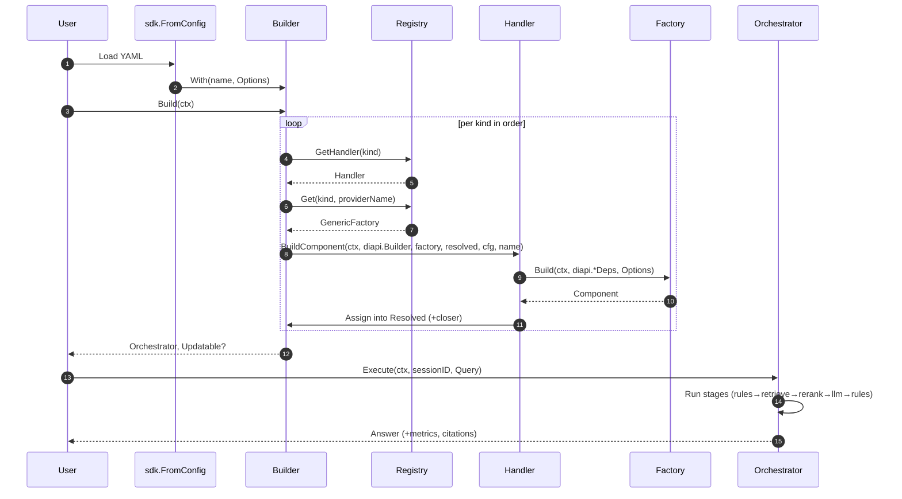

# Manglekit — High‑Level Design (HLD)

**Revision:** Nov 2025 (post-cleanup)
**Scope:** Core SDK (registry, builder, orchestrators, providers, config bridge)
**Audience:** Framework maintainers, provider authors, application teams
**Mission:** A **neuro‑symbolic AI composition framework** for building explainable, policy‑aware systems that combine statistical models (LLMs, embedders) with symbolic reasoning (rules, planners, schema/graph tooling).

---

## 1. Executive Summary

Modern intelligent systems increasingly require **neuro‑symbolic integration** — combining data‑driven neural models with explicit symbolic reasoning and policy layers.  LLMs excel at open‑ended inference but lack verifiability, determinism, and policy control; symbolic systems (rules, planners, logic engines) provide these guarantees but lack contextual flexibility.

**Manglekit** exists to bridge that gap.

It provides a single, composable framework that lets developers declaratively assemble **neural** (LLM, embedder, retriever) and **symbolic** (rules, reasoner, planner, knowledge graph) engines into unified pipelines.  This yields AI applications that are **explainable, auditable, and policy‑compliant**, without giving up adaptability.

The framework supplies:

* A **config‑first**, declarative construction flow.
* A **generic, type‑safe DI system** unifying all component kinds.
* **Composable orchestrators** for hybrid reasoning and data retrieval.
* **Built‑in observability, lifecycle, and policy enforcement**.

**Manglekit’s key purpose**: enable neuro‑symbolic AI composition—where neural models reason under explicit symbolic rules, producing decisions that can be explained, traced, and verified.

---

## 2. Goals & Non‑Goals

### 2.1 Goals

* **Neuro‑symbolic composition:** Blend statistical components (LLM, embedder) with symbolic ones (rules, logic, planners, KGs) in one pipeline.
* **Deterministic control:** Enable explicit, auditable control flow and constraints via the **Declarative Orchestrator** and rule stages.
* **Strong typing:** Compile‑time guarantees for component wiring; no runtime type guessing in orchestrators.
* **Extensibility:** Add new component kinds without editing the core—**Open/Closed** by design.
* **Operational excellence:** Uniform metrics, tracing hooks, structured logs, and graceful shutdown.
* **Reproducibility:** Versionable configs; environment‑portable pipelines.

### 2.2 Non‑Goals

* Building a new LLM or solver: Manglekit **integrates** engines; it doesn’t replace them.
* Vendor lock‑in: contracts remain neutral; provider packages are pluggable.
* One‑size‑fits‑all safety: we provide hooks and contracts, not a prescriptive policy.

---

## 3. Design Tenets

* **Config‑First:** YAML/ENV → validated structs → builder calls (no parsing in the builder).
* **Type‑Safe DI:** Generic registry + unified factory signature.
* **Stages, not god‑methods:** Orchestrators assemble small, testable stages.
* **Context everywhere:** `context.Context` is mandatory for all factories and runtime calls.
* **Observability by default:** Metrics, structured logging, and closers are first‑class.
* **No magic strings:** Typed options/contracts over `map[string]any`.

---

## 4. Component Taxonomy (Neuro‑Symbolic)

Manglekit recognizes the following **kinds**. Each kind is implemented by **providers** registered in the registry.

* **LLM** — Text generation / reasoning engines.
* **Embedder** — Vectorization for dense retrieval/similarity.
* **Retriever** — Evidence discovery (BM25, dense, hybrid, KG search).
* **Reranker** — Re‑ordering / scoring (cosine or learned).
* **RuleSet** — Policy & logic evaluation for Pre/Post stages and mid‑flow guards.
* **Reasoner** — Symbolic/constraint solvers (Datalog, Prolog‑like, SMT wrappers) with structured I/O.
* **Planner** — Task/Tool planners (symbolic or LLM‑assisted) producing execution plans. Framework complete with symbolic reference implementation.
* **Tool** — Executable capabilities (functions, APIs) invoked by orchestrators or planners.
* **SchemaParser** — Validates/parses schemas (JSON Schema, RDF/OWL).
* **FactConverter** — Normalizes/derives facts for the logic layer.
* **KnowledgeStore** — Graph/relational stores and vector stores (KGs, SQL, vector DBs).
* **StateProvider** — Conversation/session state persistence.

> All kinds share the **same factory shape** and DI approach, so adding new kinds is non‑breaking.

### 4.1 First‑Class Integrations: Genkit & Mangle

**Genkit**

* **Role:** Provider family for embedders and tools; optionally a planning layer.
* **How it plugs in:** Ships as providers implementing the standard factory signature. Registered under `embed/` and `tool/` kinds.
* **Contracts:** Uses `diapi.Deps` for logger/metrics/state; honors ctx for timeouts; contributes `ResourceClosers`.
* **Examples:** Genkit tools callable from the Declarative Orchestrator via the **Tool** kind.
* **Why first‑class:** Enables local/offline experimentation, fast iteration, and unified observability with the rest of the stack.

**Mangle (Rules & Converters)**

* **Role:** The built‑in **RuleSet** and **FactConverter** family for policy, gating, redaction, and symbolic normalization.
* **How it plugs in:** Providers under `internal/providers/rules/mangle/*` implement `RuleSet` and `FactConverter`; `SchemaParser` options allow structural validation before/after model calls.
* **Contracts:** Pre/Post rule stages receive typed inputs, may **deny** or **mutate** the flow; denials carry `denial_reason` and redaction metadata into `Answer.Meta`.
* **Declarative Flow:** Rules guard **Planner/Tool** execution; plans must be approved by Mangle rules before side‑effects occur.
* **Why first‑class:** Guarantees explainability and compliance; keeps neural components bounded by explicit symbolic policy.

---

## 5. Core Contracts

### 5.1 Factory & DI Signature (Uniform, Typed)

All component kinds share the **same conceptual factory shape**, but each kind uses a **typed dependency struct** (no generic `any` or untyped `Deps`). At a high level:

```go
// Conceptual shape – T is the concrete contract type for the kind.
func(ctx context.Context, deps diapi.<Kind>Deps, cfg any) (T, error)
```

Typical examples:

```go
// Retriever
func(ctx context.Context, deps diapi.RetrieverDeps, cfg any) (retrieve.Retriever, error)

// Sandwich orchestrator
func(ctx context.Context, deps diapi.SandwichDeps, cfg any) (pipeline.Sandwich, error)
```

* **ctx:** cancellation, deadlines, tracing.
* **deps:** **typed** sub‑dependencies supplied by the builder via DI (e.g., a vector store a retriever needs, a `StateProvider` for orchestrators, a logger, etc.). Handlers are responsible for populating these structs.
* **cfg:** provider options (typed by the caller; registry validates/decodes). The config layer decodes YAML/ENV into concrete `Options` structs **before** any factories are called.

To keep handlers extensible, dependency resolution is delegated to pluggable **dependency resolvers** (see `core/diapi`). A resolver decides whether it can handle a particular options type and, if so, produces the appropriate `diapi.*Deps` instance for the factory. This avoids brittle type‑switches inside handlers and makes it possible to add new provider sub‑families without editing core handler code.

### 5.2 Provider Options Contract (Self‑Identifying)

```go
type ProviderOptions interface {
    ProviderName() string   // e.g., "openai-chat", "bm25", "datalog"
    ProviderKind() Kind     // e.g., KindLLM, KindReasoner
}
```

### 5.3 Orchestrator Contract

Orchestrators accept a **typed Resolved** bundle (no `any`) and drive execution through stages. They must:

* propagate ctx;
* record stage metrics;
* honor rule denials/guards;
* flush resource closers on `Close()`.

---

## 6. Architecture Overview

### 6.1 Build & Run (Happy Path)

1. **Config** is loaded & validated.
2. **Bridge** (`from_config`) converts config to typed options and calls the builder.
3. **Builder** uses the **spec table** and **registry** to construct components in dependency order, accumulating `ResourceClosers`.
4. **Orchestrator** (Sandwich or Declarative) receives a **Resolved** struct and executes stages.
5. **Metrics & Logs** are recorded uniformly; `Close()` drains closers LIFO.

### 6.2 Dependency Rules

Manglekit follows a strict **layered architecture**. At a high level:

* `core` is foundational (no project imports).
* Contracts (`llm`, `retrieve`, `reasoner`, etc.) depend only on `core`.
* Providers implement contracts; they **never** import the builder.
* Orchestrators depend on contracts, not provider implementations.
* Config package depends on nothing but stdlib and its own types.

More concretely, package‑level rules are:

| Layer / Package                 | May import                                   | Must not import                                      |
|---------------------------------|----------------------------------------------|------------------------------------------------------|
| `core/`                         | stdlib                                      | `pipeline/`, `internal/`, root cmd/apps              |
| `pipeline/`                     | `core/`, `config/`                          | concrete providers under `internal/providers/*`      |
| `internal/providers/*`          | `core/`                                     | `builder`, `sdk`, `pipeline`                         |
| `sdk/`                          | `core/`, `builder`, `config`, `providers/all` | `internal/providers/*` directly                      |
| `config/`                       | stdlib, its own subpackages                 | `builder`, `pipeline`, `internal/providers/*`        |

Providers are only discovered via **registration** (e.g., through `providers/all` and blank imports), never by the builder or orchestrators importing provider packages directly. This keeps the boundaries clear and allows the registry to remain the single source of truth for component discovery.

All inter‑component dependencies during construction are obtained via the **DI layer** (`diapi.Builder` + typed `diapi.*Deps` + optional `DependencyResolver` registries). Providers and factories must not directly construct or import other providers; they rely on the builder/handlers to supply dependencies by name and kind.

### 6.3 Component Interaction (Visual)

```mermaid
graph TD
  %% Inputs
  CFG[Config YAML/ENV] -->|Load| SDK[sdk.FromConfig]
  SDK -->|With(opts)| BLD[Builder]

  %% Builder + Registry
  subgraph Construction
    BLD -- GetHandler(kind) --> REG[Registry]
    REG -- Returns --> HND[ComponentHandler]
    BLD -- GetFactory(kind,name) --> REG
    REG -- Returns --> FAC[Typed Factory]
    HND -- BuildComponent(ctx, diapi.*Deps, cfg) --> FAC
    FAC --> RES[core.Resolved]
  end

  %% Orchestrators
  RES --> ORCH_S[Orchestrator: Sandwich]
  RES --> ORCH_D[Orchestrator: Declarative]

  %% Runtime stages
  subgraph Runtime
    ORCH_S --> PR[PreRules]
    PR --> RET[Retrieve]
    RET --> RR[Rerank]
    RR --> LLM[LLM]
    LLM --> PO[PostRules]
    PO --> ANS[Answer]

    ORCH_D --> TOOLS[Tools Sequence]
    TOOLS --> ANS
  end

  %% Observability
  OBS[(Logger/Tracer/Meter)]
  RES -- Obs --> OBS
  PR & RET & RR & LLM & PO -. metrics/logs .-> OBS
```



### 6.4 Component Interaction (Text Diagram)

Build time (config → orchestrator):

```
┌──────────────┐   With(opts)   ┌───────────┐   GetHandler/Factory   ┌──────────┐
│  Config YAML │ ─────────────▶ │  sdk.From │ ──────────────────────▶ │ Registry │
│   / ENV      │                │  Config   │                         └────┬─────┘
└──────┬───────┘                └─────┬─────┘                              │
       │  Parse/Decode                 │ Build(ctx)                         │
       ▼                               ▼                                    │
┌──────────────┐       diapi.*Deps  ┌────────────┐   Build(ctx,deps,cfg)    │
│   Builder    │ ─────────────────▶ │  Handler   │ ────────────────────────▶│
└────┬─────────┘                    └────┬───────┘                          │
     │ Assign into Resolved              │ Component + closer                │
     ▼                                   ▼                                    
 ┌───────────────┐                  ┌──────────────┐
 │ core.Resolved │◀──────────────── │  Factory     │
 └──────┬────────┘                  └──────────────┘
        │
        ▼
   ┌───────────────┐
   │ Orchestrators │ (Sandwich | Declarative)
   └───────────────┘
```

Run time (Sandwich stages):

```
Query → PreRules → Retrieve → Rerank → LLM → PostRules → Answer
        (mutate)   (docs)     (scores)  (text)    (filter)     (text+citations)
```

Run time (Declarative):

```
Query → [Tool 1] → [Tool 2] → ... → [LLM Tool] → Answer
         (params via Options.Steps; shared ExecutionContext across tools)
```

---

## 7. Orchestrators

Orchestrators are responsible for composing stages (rules, retrieval, tools, LLM, reasoning) into end‑to‑end flows. Architecturally, they are treated as another **provider kind** (`KindOrchestrator`): they have options, factories, and handlers, and they are built by the same registry+builder pipeline as all other components.

### 7.1 Orchestrator Contract (Expanded)

An orchestrator factory follows the same typed‑deps pattern as other providers, typically receiving a `diapi.SandwichDeps` or `diapi.DeclarativeDeps` struct populated by the handler. The orchestrator implementation:

* receives a **typed `Resolved` bundle** (or a typed projection of it) from the builder;
* must **not** reach into the registry or builder directly (no late binding);
* is responsible for orchestrating stages, propagating `context.Context`, and emitting stage‑level metrics;
* must honor rule/guard denials as terminal outcomes and ensure all resource closers are invoked on `Close()`.

State handling is unified across orchestrators via the `StateProvider` abstraction. Orchestrator options carry explicit string fields (e.g., `stateProvider`) pointing to a named `StateProvider` implementation in the config, avoiding implicit "first available" selection.

### 7.2 Sandwich (Deterministic RAG‑plus)

A strongly‑typed, fixed‑order pipeline suitable for classic RAG and many hybrid flows:

* **Pre‑Rules → Retrieve → Rerank → (Reasoner optional) → LLM → Post‑Rules**
* Captures timings in `Answer.Meta` and retains `original_docs` for audit.

### 7.3 Declarative (Flow‑Driven, Neuro‑Symbolic)

A first‑class orchestrator for **logic‑rich control flow**:

* **Flow Controller** determines stage order and tool binding.
* **Guards** via `RuleSet` decide skips/denials/mutations.
* **Tool/Planner** integration for agentic sequences with explicit safety gates.
* Keeps a shared, typed execution context (no map‑of‑any), enabling **symbolic constraints** to govern neural calls.

---

## 8. Configuration Model

* Config files define: orchestrator, component kinds & providers, and options.
* The **config→builder bridge** validates and converts into typed options; any failure occurs **before** runtime construction.
* Declarative flows may embed logical predicates/policies and tool plans.
* For each provider referenced in config, three things must be registered (the **3‑part registration rule**):
  1. A **ComponentHandler** for its kind (e.g., retriever handler).
  2. A **Factory** registered under the provider name (e.g., `"hybrid"`).
  3. An **Options** type so the config loader knows what Go struct to decode into.

If any of these are missing, config loading fails early with a clear error instead of producing partially‑constructed components at runtime.

Example sketch:

```yaml
orchestrator: declarative
components:
  - kind: retriever
    use: hybrid
    options: { top_k: 16, rrf_k: 60 }
  - kind: reasoner
    use: datalog
    options: { ruleset: "policies/records.dl" }
  - kind: tool
    use: http
    options: { endpoint: https://api.example.com, auth: env:API_TOKEN }
```

---

## 9. Observability & Lifecycle

Observability is centralized through a shared `core.Observability` struct, which exposes a **Logger**, **Tracer**, and **Meter**. Components access these via DI rather than constructing their own loggers or emitting direct stdout.

* **Logger:** A structured logger is installed if none provided.
* **Metrics:** Stage timings (`retrieve_ms`, `rerank_ms`, `llm_ms`, `rules_pre_ms`, `rules_post_ms`, plus reasoner/planner/tool timings) are standardized. Any stage that calls out to an external system (LLM, retriever, rules engine, tools, knowledge store) should record latency and error counters, and may record token usage where applicable.
* **Tracing Hooks:** Optional interfaces for spans at stage boundaries.
* **Closers:** All providers that hold resources register closers; orchestrators drain LIFO.

---

## 10. Security, Safety, and Policy

Manglekit defines a **safety perimeter** at the orchestrator layer: all side‑effecting operations (tools, external APIs, stateful writes) must be guarded by explicit policy and schema checks before they execute.

* **Pre/Post RuleSets** for content policy, PII redaction, safety blocks. RuleSets are treated as policy infrastructure: they can deny or mutate flows and surface explicit reasons.
* **Schema Parsers** enforce structural constraints on inputs/outputs and tool parameters.
* **State Providers** can implement rate‑limits/quotas per session.
* **Tool Execution** requires explicit allow‑lists and typed inputs; planner outputs are validated by rules before execution. Orchestrators are responsible for ensuring this validation is not bypassed.

---

## 11. Extension & Provider Authoring

### 11.1 Registering a Provider

* Implement the contract interface (e.g., `reasoner.Reasoner`).
* Provide `Options` implementing `ProviderOptions`.
* Register with the registry and (optionally) a helper set like `providers/all`.

### 11.2 Dependencies Between Providers

* Complex providers (e.g., **Hybrid Retriever**, **Tool‑using Reasoner**) receive **builder delegates** in `deps` to build subcomponents without knowing the builder itself.

---

## 12. Example Patterns (Neuro‑Symbolic)

1. **Policy‑Aware Data QA**
   Retrieve records → Reason over constraints (Datalog) → LLM explains discrepancies → Post‑rules redact.

2. **Tool‑Grounded Agent**
   Planner proposes API/tool calls → Rules vet plan → Tools execute → LLM synthesizes response with provenance.

3. **KG‑Augmented Answering**
   Dense retrieval → KG lookup (KnowledgeStore) → Reasoner derives canonical facts → LLM composes answer.

---

## 13. Compatibility & Migration

* Legacy per‑type `With…` builder calls are replaced by **generic `With(opts)`** + spec‑driven build.
* Orchestrators now receive typed **Resolved** deps; remove runtime type assertions.
* Provider factories must adopt the **uniform signature** and `ProviderOptions`.

---

## 14. Performance & Reliability

* **Budgeted stages:** enforce timeouts/token limits via ctx and options.
* **Back‑pressure:** downstream denials/short‑circuiting to preserve quotas.
* **Warm‑ups/caches:** future ADR will cover client warm‑up and connection pooling policies.

---

## 15. Roadmap

* **Centralize conversation/state handling** across orchestrators.
* **Token limit conformance** in LLM clients (honor `MaxTokens`).
* **Schema export** (JSON Schema) for all options.
* **Build‑graph introspection & DOT export**.
* **WASM/plugin sandbox** for untrusted providers.

---

## 16. Appendix — Package Layout (Abstract)

```
github.com/duynguyendang/manglekit
├── core/           # Contracts, types, and DI interfaces (foundational)
├── pipeline/       # Orchestrators and stages (Sandwich, Declarative)
├── internal/       # Concrete providers (retrievers, llm, rerank, rules, schema, state, embedders)
├── config/         # Config loading, normalization, validation
├── sdk/            # Programmatic entrypoints and config bridge
├── providers/      # Convenience registrars for built-in providers
├── examples/       # Runnable examples and sample data
├── docs/           # Architecture and standards (CONTEXT, HLD, LLD, ADR)
├── testdata/       # YAML configs and fixtures for tests
└── cmd/            # Optional CLI/agent runners
```

Layering rules (abstract):
- core/ must not depend on pipeline/ or internal/
- pipeline/ must not import concrete providers in internal/
- internal/ providers depend only on core/ contracts
- config/ and sdk/ bridge configuration to builder without leaking provider internals

This abstract layout communicates responsibilities and dependency boundaries without file-level detail, keeping HLD focused on architecture rather than implementation specifics.

---

## 17. Glossary

* **Neuro‑symbolic:** Systems that combine numerical/statistical methods (e.g., neural nets) with symbolic logic/constraints.
* **Resolved:** The fully constructed, typed set of runtime dependencies provided to an orchestrator.
* **Spec Table:** Data structure describing dependency order and required injections for builder construction.

## 18. Error Handling & Recovery

- Build-time errors (config validation, missing providers, options type resolution):
  - Fail fast: the builder stops on invalid configuration and returns a structured error with component kind/name.
  - Common conditions: unknown provider, options type mismatch, circular dependency in sub-retrievers.
  - Recommended practice: validate config via a preflight step; emit actionable messages and remediation hints.

- Runtime errors (stage timeouts, API failures, rule denials):
  - Orchestrator behavior:
    - Sandwich: if a stage fails, record error in Answer.Meta, degrade gracefully (e.g., skip rerank, fallback retriever) if policy allows.
    - Declarative: flow controller may branch on error predicates, escalate to a safe path/tool, or deny with an explainable message.
  - Error propagation surfaces:
    - Logs: structured error logs with correlation IDs.
    - Metrics: failure counters per stage (retrieve_errors, llm_errors, rules_denials).
    - Answer.Meta: standardized error codes, denials reasons, and safe summary.

- Fallback strategies:
  - Retrieve: switch to simpler retriever (BM25) if dense provider unavailable.
  - LLM: fallback to a cheaper or local model on rate-limit or outage.
  - Rules: when rules deny, return an explainable denial with remediation steps.

- Suggested error schema in Answer.Meta:
  - error_code, stage, message, correlation_id, remediation, denied_by_rule (name), redactions_applied (list), retry_after_ms.

---

## 19. State Management & Sessions

- Session lifecycle:
  - Create: per sessionID at first Execute call.
  - Update: append query/answer, context, denials, and citations.
  - Close: orchestrator Close drains resource closers; state provider may implement TTL eviction.

- Conversation history:
  - Recommended format: bounded list of exchanges with timestamps and optional embeddings for recall.
  - Retention policy: configurable TTL; anonymize sensitive fields; PII redaction at storage boundary.

- Consistency & concurrency:
  - StateProvider contract supports atomic upsert; concurrent requests must serialize by sessionID or use optimistic locking with ETag/version fields.

- Distributed deployments:
  - Use a shared state provider (Redis, SQL) for multi-instance orchestration.
  - Ensure idempotent writes and conflict resolution (last-write-wins or CAS).

---

## 20. Caching & Performance

- Multi-level caches:
  - Query result cache: memoize (normalized_query, scope) → top docs; TTL sensitive to corpus churn.
  - Embedding cache: avoid re-embedding identical text; key by content hash + model.
  - Vector store cache: cache frequent neighborhood searches; invalidate on upsert/replace events.
  - LLM response cache: cache deterministic prompts (policy notices, boilerplate); avoid caching user-sensitive outputs.

- Cache invalidation:
  - Document ingestion events trigger cache bust for affected partitions.
  - Rule changes invalidate query scope results.
  - Model version changes invalidate embedding caches.

- Performance metrics:
  - Cache hit ratios per layer, P95 latencies per stage, throughput (qps), memory usage per cache.

---

## 21. Multi-Tenancy & Isolation

- Tenant context:
  - Propagated through diapi.CoreDeps; handlers may scope providers/resources by tenant_id.
  - Config overlays per tenant (options overrides, provider selection).

- Isolation strategies:
  - Separate indices/stores per tenant; rule sets loaded per tenant.
  - Resource quotas (rate limits, storage caps) per tenant enforced by StateProvider or gateway.

- Audit and cost allocation:
  - Per-tenant metrics and audit logs; attribute LLM/token usage and storage to tenant.

---

## 22. Testing & Debugging

- Provider testing strategies:
  - Internal DI / Config-first: use sdk.LoadWithRegistry and test YAML; register handler, factory, and options sample types for all components under test.
  - External dependency: unit test provider business logic with mocks (HTTP, clients), no DI bridge.

- Orchestrator testing:
  - Sandwich: stage-by-stage assertions; inject mock retriever/reranker/llm/rules.
  - Declarative: flow predicates and tool bindings; test denials/branches with mock tools.

- Rule engine tests:
  - Deterministic evaluation of pre/post rules; validate denials, redactions, annotations.

- Debugging surfaces:
  - Structured logs with correlation IDs; stage-boundary tracing hooks; per-stage metrics.

---

## 23. Versioning & Compatibility Policy

- Semantic Versioning:
  - Major: breaking changes to core contracts, diapi interfaces, ComponentHandler signatures.
  - Minor: new providers, options, non-breaking orchestrator enhancements.
  - Patch: bug fixes, performance improvements, documentation.

- Deprecation:
  - Mark deprecated options/providers with sunset timelines; emit warnings at build time.
  - Migration guides for breaking releases; provide shims where feasible.

- Compatibility matrix:
  - Document minimal versions for provider families (LLM, retriever) and orchestrators across SDK versions.

---

## 24. Security & Access Control (Deep Dive)

- Authentication:
  - API keys, OAuth2, mTLS depending on deployment; inject auth context via CoreDeps.

- Authorization:
  - RBAC/ABAC enforced by pre-rules; deny or mutate query scope before retrieval.

- Secrets management:
  - Prefer vault/secret stores; avoid plaintext env; rotate keys; restrict scope per tenant.

- Input validation:
  - Normalize and sanitize queries; block prompt injection vectors; enforce schema constraints with SchemaParser.

- Output filtering:
  - Post-rules redaction of PII/confidential fields; add watermark/notice for policy reasons.

- Audit logging:
  - Log rule firings, denials, redactions; record provenance and citations; per-tenant audit streams.

- Rate limiting & DDoS protection:
  - Per-tenant and global limits; back-pressure in orchestrators; exponential backoff on external APIs.

---

## 25. Deployment & Operations

- Topologies:
  - Single instance, HA (N replicas), distributed with shared state and vector stores.

- Kubernetes patterns:
  - Health/readiness probes per orchestrator; ConfigMaps/Secrets for options; HPA based on latency/qps.

- Configuration management:
  - Immutable images with external config; config rollout via canary; config validation CI.

- Graceful shutdown:
  - Orchestrator Close drains closers LIFO; ensure in-flight requests complete under timeout budget.

- Rolling updates:
  - Blue/green or canary; manage index migrations; maintain cache coherence across versions.

- Monitoring & alerting:
  - Stage latencies, error rates, denials; token usage; cache hit ratio; vector store IO; SLO dashboards.

---

## 26. Cost & Resource Management

- Budgets & quotas:
  - Token budgets per request/tenant; API call quotas; storage caps; compute limits.

- Tracking:
  - Record per-request token usage, provider costs, cache savings; attribute to tenant.

- Optimization strategies:
  - Prefer retrieval quality to reduce LLM token usage; cache aggressively; use cheaper models with rules-guaranteed safety.

---

## 27. Extensibility & Plugin Architecture

- Adding new kinds:
  - Define contracts, Options implementing ProviderOptions, register handler + factory via Registry.

- Plugin discovery & loading:
  - Convention-based package registration (providers/all) or dynamic via init hooks; future: explicit plugins manifest.

- Sandboxing:
  - Consider WASM/containerized plugins for untrusted providers; restrict capabilities via CoreDeps wrappers.

- Lifecycle:
  - init → build → execute → close; emit closers for managed resources.

---

## 28. Detailed Examples (YAML + Code)

- Sandwich YAML (minimal sketch):
  ```yaml
  orchestrator:
    type: sandwich
  retriever:
    name: bm25
    params: { path: "./data" }
  llm:
    name: openai
    params: { model: "gpt-4o-mini" }
  rules:
    name: mangle
    params: { path: ["./rules/policy.dlog"] }
  ```

- Declarative YAML (flow sketch):
  ```yaml
  orchestrator:
    type: declarative
    flowName: main__flow
  tools:
    doc_retriever: { provider: "bm25", params: { path: "./data" } }
    google_llm: { provider: "google", params: { model: "gemini-1.5-flash" } }
  rules:
    name: mangle
    params: { path: ["./rules/flow.dlog", "./rules/policy.dlog"] }
  ```

---

## 29. Comparison with Alternatives

- Versus LangChain / LlamaIndex:
  - Manglekit emphasizes type-safe DI, deterministic orchestrators, and rule-enforced safety; avoids map-of-any and runtime guessing.

- Versus Semantic Kernel:
  - Go-native, lightweight, embeddable; clearer contracts for providers and handler-driven build order.

- Versus custom RAG:
  - Provides standardized stages, observability, auditability, and composability without bespoke glue code.

---

## 30. Limitations & Known Issues

- Current focus is text-based RAG; multi-modal support is roadmap.
- External provider availability and rate limits can impact latency; use budgets/back-pressure.
- Declarative flows require careful rule design to avoid unintended denials or dead-ends.
- Vector store scalability depends on chosen backend; benchmark for >1M docs and shard appropriately.
