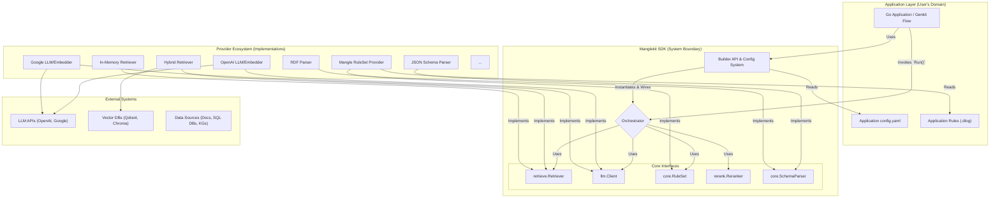

# Manglekit SDK — High-Level Architecture

**Version:** 4.0 (Architectural Blueprint)
**Status:** Final

## **1. Vision & Architectural Principles**

### **1.1. Vision**

Manglekit is an **SDK-first, embeddable Go framework** for building verifiable and controllable neuro-symbolic RAG applications. Its architecture prioritizes a superior developer experience by abstracting complexity, enabling flexibility through a pluggable provider model, and enforcing correctness via a declarative rules engine.

### **1.2. Architectural Principles**

  * **SDK-First, Service-Second:** The core product is a library. A runnable service is a reference implementation, not the primary artifact. This ensures maximum flexibility for integration.
  * **Zero-Wiring & Convention over Configuration:** The primary user interaction is through a fluent `Builder` API that manages all dependency injection and initialization internally. The user declares *what* they want, and the SDK handles *how* to wire it.
  * **Pluggable & Agnostic Core:** All major components (LLM, Retriever, Reranker, Embedder, RuleSet, VectorStore, SchemaParser) are defined by Go interfaces. This decouples the core pipeline logic from specific implementations, making the system provider-agnostic.
  * **Separation of Concerns:** A strict separation exists between:
      * **Orchestration Logic** (the fixed "Sandwich Pipeline" or the dynamic "Declarative Pipeline").
      * **Business Logic** (the pluggable `Providers`).
      * **Declarative Logic** (the external `Mangle` rules and facts, belonging to the application).
  * **Fail Fast, Fail Clear:** The configuration and build process must validate the entire dependency tree at initialization. Missing configurations or incompatible components will result in an immediate, clear error, not a runtime failure deep within the pipeline.
  * **Stateless Pipeline Core:** The core RAG pipeline is stateless, making it inherently scalable. State (like indexes or caches) is managed by stateful providers that are injected into the pipeline.

-----

## **2. System Architecture & Boundaries (C4 Model - Level 2)**

The Manglekit ecosystem consists of the Application Layer, the SDK Core, Pluggable Providers, and External Systems. The SDK Core is the central component, providing the framework and orchestration.

-----

## **3. Component Breakdown & Interaction Patterns**

### **3.1. The Builder & Configuration System**

  * **Responsibility**: To provide the sole, user-facing entry point for constructing a pipeline and to manage all configuration and dependency injection.
  * **Interaction Pattern**:
    1.  The user instantiates the `Builder`.
    2.  The user declaratively configures the pipeline using type-safe `With...` methods (e.g., `WithLLM(&llm.OpenAIOptions{...})`). The provider name is inferred from the options type.
    3.  Optionally, the user provides a `Config` struct via `WithConfig()` for explicit, code-based configuration.
    4.  The user calls `Build()`.
    5.  The `Builder` performs a **layered configuration lookup** (explicit config -> environment variables) for each requested provider.
    6.  It **automatically initializes** any required API clients using the resolved credentials.
    7.  It fetches the provider implementations from an internal **Registry**.
    8.  It **injects** the initialized clients and configurations into the provider constructors using explicit, typed arguments.
    9.  It instantiates the chosen `Orchestrator` with the fully configured providers.
    10. It returns the ready-to-use `Orchestrator` instance or a detailed error.

### **3.2. Orchestrators**

Manglekit supports multiple orchestration strategies.

  * **`SandwichOrchestrator` (Default):** A simple, high-performance orchestrator with a fixed, hardcoded pipeline: `Pre-Process -> Retrieve -> Rerank -> Synthesize -> Post-Process`. It is ideal for standard RAG use cases.
  * **`DeclarativeOrchestrator` (Advanced):** A powerful, data-driven orchestrator.
      * **Interaction Pattern:** It queries the Mangle provider to read a "flow" defined by DLOG facts (e.g., `flow_stage(...)`, `stage_tool(...)`). It then executes this plan step-by-step, dispatching calls to the appropriate providers ("tools") configured in the application's `config.yaml`. This allows for complex, conditional, and dynamically modifiable workflows.

### **3.3. The Mangle Provider & Logic System**

  * **Responsibility**: To provide the symbolic reasoning capabilities of the SDK.
  * **Features**:
      * **Fact Converters**: A pluggable system of converters translates application-level data (queries, documents, user context) into Mangle facts.
      * **Schema Integration**: The provider can use `SchemaParser` extensions (e.g., for JSON Schema, RDF) to automatically ingest data schemas as facts, enabling powerful reasoning over the application's data structures.
      * **Persistent Fact Store (Extension)**: The architecture supports pluggable `FactStore` implementations, such as an extension using **BoltDB** or **BadgerDB**, to manage large, persistent ontologies with fast startup times. This can include a `MutableFactStore` interface for dynamic, runtime updates to the knowledge base.

-----

## **4. Core Operational Modes**

The architecture is designed to support multiple operational modes, providing maximum utility.

### **4.1. Integrated RAG Framework Mode**

  * **Architectural Pattern**: Manglekit acts as a complete, self-contained RAG system. The user configures a `Retriever` that connects to a data source. The application calls `orch.Run(query)`.
  * **Use Case**: Building new, end-to-end RAG applications where Manglekit manages the entire data flow.

### **4.2. Pluggable Logic Layer Mode**

  * **Architectural Pattern**: Manglekit acts as a specialized processing engine. The application layer is responsible for retrieval. It passes a set of pre-retrieved documents to Manglekit via `orch.RunWithContext(query, retrievedDocs)`.
  * **Internal Flow**: The `Orchestrator` detects this mode, bypasses its internal `Retrieve` step, and injects the user-provided documents directly into the `Rerank` stage.
  * **Use Case**: Augmenting existing RAG pipelines with Manglekit's unique symbolic reasoning, guardrail capabilities, and robust LLM generation features.

### **4.3. Validation & Filtering Mode**

  * **Architectural Pattern**: A specialized version of the Logic Layer mode where the `LLM` component is omitted. The pipeline becomes: `Pre-Process -> (User-provided context) -> Rerank -> Post-Process`.
  * **Use Case**: Using Manglekit purely as a data validation and filtering engine. The output is not a generated answer but a vetted and ranked list of documents.

-----

## **5. Non-Functional Requirements (High-Level)**

  * **Performance**: The stateless nature of the core pipeline allows for horizontal scaling. Performance targets (e.g., P99 \<300ms) are the responsibility of the injected providers. The SDK will provide OTel traces to measure and identify bottlenecks in each stage.
  * **Scalability**: The SDK itself is a library and scales with the application it's embedded in. For service mode, standard cloud-native scaling patterns (e.g., Kubernetes replicas) apply.
  * **Security**: Security is addressed at two levels:
      * **SDK Level**: The SDK provides the mechanism for security via `Mangle Post-Rules` (for redaction and policy enforcement). It does not handle transport-level security or user authentication.
      * **Application Level**: The consuming application is responsible for securing its endpoints, managing user identity, and passing user context into the Manglekit pipeline for policy evaluation.