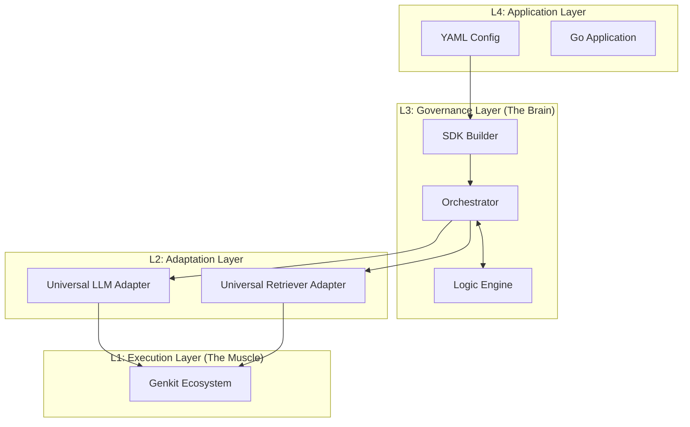

# Manglekit — High‑Level Design (HLD)

**Revision:** 1.0.0 (Architecture Reboot)
**Scope:** Core Framework Architecture, Subsystems & Integration Strategy
**Audience:** Framework Architects, Enterprise Integrators, Platform Engineers
**Mission:** To provide a **Neuro-Symbolic Governance Layer** that enforces policy, safety, and deterministic logic over Generative AI execution engines.

-----

## 1\. Executive Summary

As Generative AI moves from prototypes to production, the primary challenge shifts from **connectivity** (how to call an LLM) to **governance** (how to control it). Enterprises require systems that are verifiable, compliant with security policies, and capable of complex reasoning beyond statistical probability.

**Manglekit** addresses this by architecting a strict separation between **Decision** and **Execution**.

It functions as the **"Brain"**—a logic-driven orchestration layer—that sits atop the **"Muscle"**—the Genkit execution ecosystem. Manglekit leverages Universal Adapters to utilize the full breadth of Genkit plugins (LLMs, Vector Stores, Tools) while enforcing a **"Safety Sandwich"** of symbolic rules and policies around every interaction.

This architecture transforms AI development from writing imperative glue code to defining **declarative policies**, ensuring that every AI response is grounded, explainable, and compliant by design.

-----

## 2. Goals & Non‑Goals

### 2.1 Goals

  * **Governance-First Architecture:** Prioritize safety, compliance (PII redaction, RBAC), and determinism over raw flexibility.
  * **Neuro-Symbolic Fusion:** Seamlessly bridge unstructured data (Neural/Vector) with structured knowledge (Symbolic/Datalog) using automated converters.
  * **Zero-Code Integration:** Enable the use of any Genkit-supported provider (LLM/Retriever) through configuration alone, without writing Go adapters.
  * **Policy-as-Code:** Define business logic and security boundaries in declarative files (Datalog/YAML), decoupling logic from application code.
  * **Type-Safe Composition:** Ensure compile-time safety for dependency injection and pipeline assembly.

### 2.2 Non‑Goals

  * **Reinventing Drivers:** Manglekit will not maintain low-level clients for specific LLMs or Databases. It relies on the Genkit ecosystem for connectivity.
  * **Interactive Agent Frameworks:** While it supports agentic flows, Manglekit targets backend/headless orchestration and governance, not UI-centric chatbots or conversational state management.

-----

## 3. Architectural Principles

  * **The Brain & Muscle Separation:** Logic belongs in Manglekit (Rules, Flows); Execution belongs in Genkit (API calls, Vectors).
  * **Universal Adaptation:** The core never interacts directly with vendor APIs. It interacts exclusively with generic interfaces via Universal Adapters.
  * **Config-First:** Behavior is defined by configuration, making the system hot-reloadable and GitOps-friendly.
  * **Safety by Default:** The architecture forces requests to pass through governance layers; bypassing policy requires explicit opt-out.

-----

## 4. Component Taxonomy

Manglekit organizes the world into strict **Component Kinds**.

### 4.1 Governance Components (The Brain)

  * **RuleSet:** The policy engine (default: Mangle Datalog). Evaluates symbolic facts to permit, deny, or mutate requests.
  * **Orchestrator:** The workflow engine. Manages the lifecycle of a request, enforcing the "Safety Sandwich" pattern.
  * **SchemaParser:** Parses unstructured data (JSON, Code, RDF) into symbolic Facts for the RuleSet.
  * **Struct-to-Fact Converter:** Reflection-based utility that projects runtime application state (Go Structs) into the logic engine.
  * **Planner:** Generates multi-step execution plans based on symbolic reasoning.

### 4.2 Execution Components (The Muscle)

  * **LLM:** Generative models. Integrated via the **GenkitLLMAdapter**.
  * **Retriever:** Evidence discovery. Integrated via the **GenkitRetrieverAdapter** (supporting LocalVec, Pinecone, Weaviate, etc.).
  * **Embedder:** Vector generation. Integrated via Genkit plugins.
  * **Tool:** External capabilities (APIs, Microservices). Integrated via the **HTTPToolAdapter** or Genkit Tools.

-----

## 5. Architecture Overview

### 5.1 Layered Design

Manglekit enforces a strict unidirectional dependency flow to ensure stability and testability.

### 5.2 The Universal Adapter Pattern

To achieve "Zero-Code" integration, Manglekit replaces specific provider implementations with **Universal Adapters**.

  * **Concept:** Instead of writing a `GoogleProvider` and an `OpenAIProvider`, Manglekit implements a single `GenkitLLMAdapter`.
  * **Mechanism:** The adapter wraps the generic `ai.Model` interface from Genkit. It handles Manglekit-specific concerns (Token counting, Prompt marshaling, Error normalization) and delegates execution to the injected Genkit plugin.
  * **Benefit:** Users can use *any* model supported by Genkit immediately. The "Provider Factory" in Manglekit becomes a thin configuration layer (10-15 lines of code).

-----

## 6. Core Subsystems

### 6.1 The "Safety Sandwich" Orchestrator

The fundamental execution pattern of Manglekit is the **Safety Sandwich**. It ensures no AI operation occurs without governance.

1.  **Ingestion:** Request is received. Context and Inputs are converted to **Facts**.
2.  **Pre-Execution Policy:**
      * **Rules** check authorization, validate input data, and perform **Smart Routing** (determining which model/tool to use).
      * *Outcome:* Proceed, Deny, or Mutate Input.
3.  **Execution:**
      * The Universal Adapter calls the underlying Genkit plugin (LLM/Retriever).
4.  **Post-Execution Policy:**
      * Output data is analyzed by **Rules**.
      * *Outcome:* Redact PII, Filter unsafe content, Validate JSON schema, or Deny.
5.  **Audit:** A decision trace is recorded.

### 6.2 Neuro-Symbolic Data Bridge

Manglekit bridges the gap between "Code" and "Logic" via the **Struct-to-Fact Converter**.

  * **Problem:** Rule engines need data in specific formats (tuples/predicates), but applications use Go Structs.
  * **Solution:** The Converter uses Go Reflection to automatically map Struct fields and tags to Datalog Facts.
  * **Usage:** Enables rules to reason about complex application state (e.g., User Profiles, Configs, ASTs) without manual boilerplate code.

### 6.3 Declarative Microservices Orchestration

For complex systems, Manglekit acts as an intelligent Gateway.

  * **Symbolic Routing:** Instead of hard-coded logic, Manglekit uses rules to route requests.
      * *Example:* "If query difficulty is High, route to GPT-4. If contains PII, route to On-Prem Model."
  * **Tool Abstraction:** Microservices are treated as `Tools`. The **Declarative Orchestrator** executes tools based on a logical flow defined in Datalog/YAML, supporting parallel execution and retries (roadmap).

-----

## 7\. Configuration & Construction

### 7.1 Config-First Philosophy

Manglekit is designed to be driven by configuration. The `config.yaml` acts as the blueprint for the entire AI pipeline.

  * **Validation:** The configuration loader performs deep validation (circular dependencies, type checks) *before* any resource is allocated.
  * **Binding:** Configuration maps directly to typed Options structs, ensuring type safety.

### 7.2 The 3-Part Registration Rule

To maintain the integrity of the generic registry, adding a new provider requires three distinct registrations:

1.  **Handler:** Defines *how* to build the component kind (Logic).
2.  **Factory:** Defines *what* to build (Implementation).
3.  **Options Type:** Defines *how* to configure it (Schema).

-----

## 8\. Observability & Audit

Governance requires visibility. Manglekit prioritizes **Auditability** over simple logging.

  * **Decision Traces:** Unlike standard logs, Manglekit records *why* a decision was made (e.g., "Rule \#123 fired causing Request Denial").
  * **Unified Metrics:** Latency, Token Usage, and Error Rates are standardized across all providers via the Adapter layer.
  * **OpenTelemetry:** Native integration for distributed tracing of logic flows.

-----

## 9\. Extensibility

### 9.1 Zero-Code Extension (Genkit)

Developers can extend capabilities without touching Manglekit core code:

1.  Initialize a Genkit plugin in the application `main.go`.
2.  Reference it in `config.yaml` via the `genkit-retriever` or `genkit-llm` provider.

### 9.2 Custom Logic Extension

For logic not supported by Genkit (e.g., proprietary algorithms):

1.  Implement the `core` interface in the application codebase.
2.  Register the factory at runtime using the public Registry API.

-----

## 10\. Deployment Model

  * **Single Binary:** The entire framework compiles into a static Go binary. No Python runtime, JVM, or heavy sidecars required.
  * **Hot-Reload Capable:** Because logic is defined in Data (Rules/Config), policies can be updated without recompiling the binary.
  * **Edge Ready:** The architecture supports `localvec` and in-memory providers, making it suitable for air-gapped or edge environments.

-----

## 11\. Glossary

  * **Neuro-Symbolic:** Systems combining statistical AI (Neural) with logic-based AI (Symbolic).
  * **Universal Adapter:** A generic wrapper converting external ecosystem interfaces into Manglekit contracts.
  * **Safety Sandwich:** The architectural pattern of wrapping execution with Pre- and Post-policy checks.
  * **Governance Layer:** The logical layer responsible for policy, control, and audit (Manglekit's role).
  * **Execution Layer:** The infrastructure layer responsible for raw compute and I/O (Genkit's role).