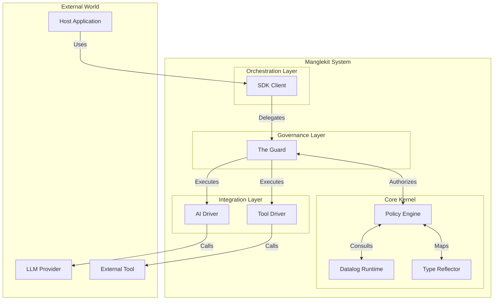

Bạn rất đúng. HLD (High-Level Design) cần nằm ở tầng **Logic** và **System Component**, không phải là tầng **Physical File** hay **Package**.

Nhiệm vụ của HLD là trả lời câu hỏi: *"Hệ thống bao gồm những khối (Block) nào và chúng nói chuyện với nhau bằng giao thức gì?"*. Nó định hướng cho LLD (nơi sẽ quyết định `package`, `struct`, `interface`), và Code (nơi hiện thực hóa LLD).

Dưới đây là bản **HLD chuẩn mực** cho Manglekit v3. Nó trừu tượng hóa các chi tiết implementation (như tên file, folder) thành các **Component** và **Layer**.

-----

# High-Level Design (HLD) — Manglekit

**Project:** Manglekit (Genesis v3)
**Type:** Architecture Document
**Scope:** System Components, Logical Layers, & Data Flow
**Status:** Approved

-----

## 1. Introduction

Manglekit is an **Embedded AI Control Plane**. Its primary purpose is to provide deterministic governance (Security, Compliance, Observability) over probabilistic AI components (LLMs, Agents).

It functions as a **Kernel**, enforcing a strict separation between **Decision Making** (Logic) and **Task Execution** (Drivers).

-----

## 2. Architectural Style: Hexagonal Architecture

The system adopts the **Ports and Adapters** (Hexagonal) pattern to ensure the core logic remains isolated from external technologies.

  * **The Core (Center):** The Logic Kernel. Pure, stateless, and deterministic.
  * **The Ports (Interface):** The Guard and Action Contracts.
  * **The Adapters (Outer Ring):** Integrations with Genkit, MCP, Vector DBs, and Native Functions.

<!-- end list -->

-----

## 3. Logical Component View

This section decomposes the system into functional blocks (Black Boxes) regardless of their code location.

### 3.1 Orchestration Layer (The Client)

  * **Responsibility:** Provides the public API and manages the "Semantic State Machine".
  * **Components:**
      * **Config Loader:** Bootstraps the system from declarative configuration (YAML).
      * **Loop Manager:** Handles the retry/route logic for autonomous agents based on Kernel signals.
      * **Volatile Memory:** Manages transient session state during an execution loop.

### 3.2 Governance Layer (The Interceptor)

  * **Responsibility:** Enforces the "Guarded Action" lifecycle. This is the **Policy Enforcement Point (PEP)**.
  * **Components:**
      * **The Guard:** A decorator that intercepts execution requests.
      * **Tracer:** Emits observability data (Spans, Logs) linked to logic execution.
      * **Fail-Safe Mechanism:** Decides whether to block or allow execution if the Kernel fails (Open/Closed mode).

### 3.3 The Logic Kernel (The Brain)

  * **Responsibility:** The **Policy Decision Point (PDP)**. Pure logic execution.
  * **Components:**
      * **Policy Solver:** The coordinator that runs logic queries (`allow?`, `deny?`, `next_step?`).
      * **Reflector:** A translation engine that converts Domain Objects (Application State) into Logical Facts.
      * **Knowledge Base:** An in-memory graph store for static facts (RDF/Turtle).

### 3.4 Integration Layer (The Drivers)

  * **Responsibility:** Translates internal commands into external API calls.
  * **Components:**
      * **AI Driver:** Adapts the internal protocol to AI Frameworks (e.g., Genkit).
      * **MCP Driver:** Connects to Model Context Protocol servers.
      * **Native Driver:** Wraps standard business logic functions.

-----

## 4. Process View (Data Flow)

### 4.1 Flow A: The Guarded Action Lifecycle

This is the atomic flow for a single operation.

1.  **Ingest:** The Guard receives an **Envelope** containing the request payload.
2.  **Contextualize:** Trace IDs and Lineage Metadata are injected.
3.  **Reflection (Input):** The Payload is converted into a set of **Input Facts**.
4.  **Authorization:** The Kernel evaluates `deny(Input)`.
      * *Deny:* Return `PolicyViolationError`.
      * *Allow:* Proceed.
5.  **Execution:** The payload is passed to the selected **Driver**.
6.  **Reflection (Output):** The Driver's result is converted into **Output Facts**.
7.  **Validation:** The Kernel evaluates `deny(Output)` and checks for Data Leakage.
8.  **Return:** The validated Envelope is returned to the caller.

### 4.2 Flow B: The Semantic Control Loop

This flow describes how the Orchestrator manages an Agentic workflow.

1.  **Start:** Orchestrator calls an Action.
2.  **Evaluate:** After the Action returns, the Orchestrator asks the Kernel for **Steering**.
3.  **Decision:** The Kernel returns a signal:
      * **`STOP`**: Task complete. Return result.
      * **`RETRY`**: A validation error occurred. Inject feedback and re-run the *same* Action.
      * **`ROUTE(X)`**: Logic dictates the next step is Action X. Switch context and run Action X.
4.  **Loop:** Repeat until `STOP` or `MaxSteps` exceeded.

-----

## 5. Data Model (Logical)

### 5.1 The Envelope (Universal Protocol)

Components communicate exclusively via Envelopes to remain loosely coupled.

| Field | Type | Description |
| :--- | :--- | :--- |
| **ID** | UUID | Unique correlation ID for lineage tracking. |
| **Payload** | Generic | The actual domain data (Struct, Map, or String). |
| **Metadata** | Key-Value | Control signals (Latency, Model Params, Audit Tags). |
| **Labels** | List | Security tags (e.g., `CONFIDENTIAL`, `PII`) propagated through the flow. |

### 5.2 The Fact Base (State Representation)

The Kernel views the world as a flat list of Predicates (Datalog Facts).

  * **Transient Facts:** Derived from the current Envelope (e.g., `request.amount(100)`).
  * **Static Facts:** Loaded from Knowledge Base (e.g., `user.role("alice", "admin")`).
  * **Steering Facts:** Derived signals (e.g., `decision.next_step("approval_tool")`).

-----

## 6. Deployment View

  * **Packaging:** The system is compiled as a standard library.
  * **Runtime:** Runs within the host Application Process (In-Process).
  * **Isolation:** Logic execution is CPU-bound and memory-safe (No external sidecars or network calls required for policy checks).
  * **Configuration:** Behavior is defined by external YAML and `.dl` files, loaded at startup.

-----

## 7. Quality Attributes (Non-Functional Requirements)

  * **Determinism:** Given the same Input and Policy, the Kernel MUST always produce the same Decision.
  * **Latency:** The Authorization and Validation overhead MUST be sub-millisecond (excluding Driver execution time).
  * **Observability:** Every Logic Decision MUST be traceable to a specific Policy Rule ID.
  * **Fail-Safety:** The system MUST support a configurable "Failure Mode" (Open/Closed) to handle Kernel panics or timeouts gracefully.