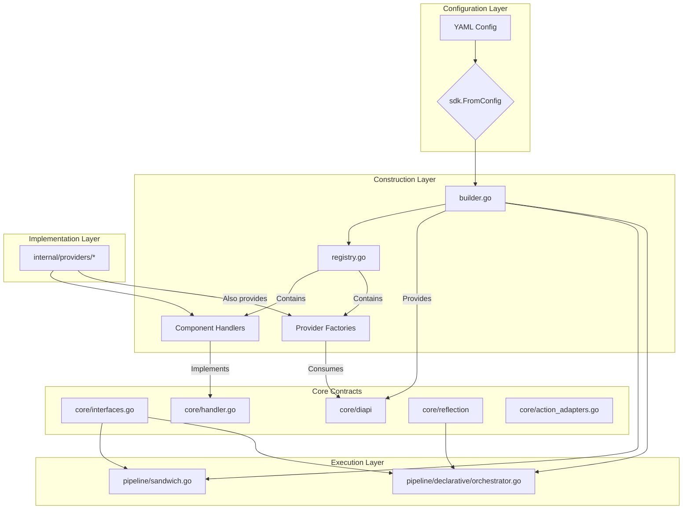
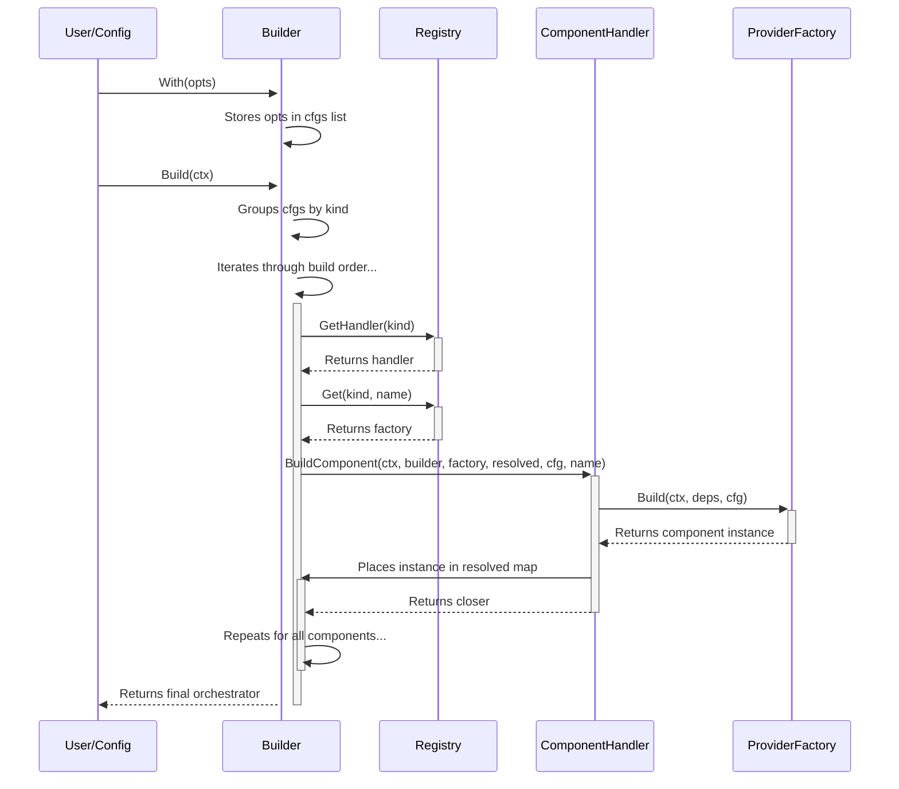

# 1. Purpose & Scope

This document provides a detailed low-level design for the Manglekit SDK's core framework components. It covers the decentralized, handler-based Builder, the Registry, provider factories, the dependency injection mechanism, and the stage-based pipeline architecture. It is intended to be a technical reference for developers extending the framework or diagnosing its behavior.

# 2. Component Diagram



# 3. Core Utilities

### 3.1 Reflection Utility (`core/reflection`)
- **Purpose**: Provides a mechanism to project arbitrary Go structs (Application State) into Mangle logic facts (Logic State).
- **Core Function**: `ToFacts(id string, entity any) ([]ast.Atom, error)`
- **Mechanism**:
  - Uses runtime reflection (`reflect` package).
  - Inspects struct fields for the `mangle:"predicate_name"` tag.
  - Converts Go types (string, int, bool) to Mangle `ast.Constant` types.
  - Generates atoms in the format: `predicate_name(id, value)`.
- **Usage**: Intended for use by Orchestrators (specifically the Declarative Orchestrator's Pre-Check phase) to expose runtime state to the logic engine for governance checks.

# 4. Builder Subsystem
The `Builder` is the central component for constructing an orchestrator. It follows a handler-based process that is decentralized and respects the Open/Closed Principle.

**Process Flow:**
1.  **Configuration:** The builder is configured programmatically via `With(opts)` calls. The `sdk.FromConfig` function translates YAML into these calls.
2.  **Component Grouping:** All configured components are grouped by their `core.Kind`.
3.  **Ordered Build:** The builder iterates through a hard-coded build order (`Embedder` -> `Retriever`, etc.).
4.  **Handler Invocation:** For each component, it looks up the corresponding `core.ComponentHandler` in the `Registry`.
5.  **Delegated Build:** The builder calls the handler's `BuildComponent` method, passing itself as a dependency provider (`builderDI`), the component's factory, its configuration, and the map of already resolved components.
6.  **Component Construction:** The handler is responsible for creating the dependency struct, calling the factory, and placing the resulting component instance into the resolved map.
7.  **Orchestrator Creation:** After all components are built, the `Resolved` struct is assembled and passed to the selected orchestrator's factory.



# 5. Factory Interface Layer

All component factories must adhere to the `core.Factory` interface.

```go
// core/factory.go
type Factory interface {
	Build(ctx context.Context, deps any, cfg any) (any, error)
}
```

This generic interface is made type-safe by the `ComponentHandler`, which is responsible for creating the specific, typed dependency (`diapi.*`) and configuration structs required by the factory.

The handler uses a **DependencyResolver pattern**: it type-asserts the `cfg` parameter to `diapi.ProviderWithOptions`, calls `GetProviderOptions()` to extract the actual options, and then delegates to registered resolvers to determine which dependency struct to construct. This pattern allows new provider types to be supported by registering new resolvers without modifying the handler code.

### 5.1 Typed Dependency Structs

Each component kind has one or more corresponding **typed dependency structs** in `core/diapi/di.go`. These structs ensure that factories receive exactly the dependencies they need, with full compile-time type safety.

**Key Deps Structs:**

```go
// LLMDeps: Used by all LLM providers (Google, OpenAI, generic Genkit).
// Provides access to the Genkit instance and core observability.
type LLMDeps struct {
    CoreDeps
    Genkit *genkit.Genkit  // Initialized genkit instance
    Client any             // Provider-specific client (e.g., *openai.Client)
}

// GenkitRetrieverDeps: Used by Genkit-based retrievers.
// Provides access to the Embedder (needed by LocalVec and other Genkit plugins).
type GenkitRetrieverDeps struct {
    CoreDeps
    Embedder ai.Embedder  // Embedder instance, required by Genkit retriever plugins
}

// RetrieverDeps: Used by multi-retriever families (e.g., Hybrid).
// Provides access to subordinate retrievers.
type RetrieverDeps struct {
    CoreDeps
    SubRetrievers map[string]core.Retriever  // Named retriever instances
}

// SandwichDeps: Used by the Sandwich orchestrator.
// Provides all pipeline components the orchestrator may need.
type SandwichDeps struct {
    CoreDeps
    Action         core.Action        // Generic action (typically adapted Retriever)
    LLM            core.LLMClient
    Reranker       core.Reranker      // Optional
    RuleSet        core.RuleSet       // Optional
    StateProvider  core.StateProvider // Optional
}

// DeclarativeOrchestratorDeps: Used by the Declarative orchestrator.
// Provides access to the tool registry and optional state provider.
type DeclarativeOrchestratorDeps struct {
    CoreDeps
    Tools         map[string]core.Tool  // Named tool instances
    StateProvider core.StateProvider    // Optional
}
```

Additional structs: `RerankerDeps`, `StateProviderDeps`, `RuleSetDeps`, `ToolDeps`, `PlannerDeps`, `ReasonerDeps`, `SchemaParsersDepse`, `EmbedderDeps`, etc. (12 total for all component kinds).

### 5.2 Resolver Pattern

Instead of using type-switches in handlers, resolvers determine which `Deps` struct to construct based on the provider options type:

```go
// internal/providers/retrievers/handler.go
type RetrieverResolver interface {
    Matches(opts any) bool
    Resolve(ctx context.Context, builderDI any, opts any) (any, error)
}

// GenkitRetrieverResolver handles genkitretriever.GenkitRetrieverOptions
type GenkitRetrieverResolver struct{}
func (r *GenkitRetrieverResolver) Matches(opts any) bool {
    _, ok := opts.(diapi.EmbedderDep)  // Check if it requires an embedder
    return ok
}
func (r *GenkitRetrieverResolver) Resolve(ctx context.Context, builderDI any, opts any) (any, error) {
    b := builderDI.(diapi.Builder)
    o := opts.(*genkitretriever.GenkitRetrieverOptions)
    embedder, _ := b.GetEmbedder(o.Embedder)
    return diapi.GenkitRetrieverDeps{
        CoreDeps:  b.GetCoreDeps(),
        Embedder:  embedder,
    }, nil
}

// SubRetrieverResolver handles hybrid.HybridOptions
type SubRetrieverResolver struct{}
func (r *SubRetrieverResolver) Matches(opts any) bool {
    _, ok := opts.(diapi.SubRetrieversDep)  // Check if it has sub-retrievers
    return ok
}
func (r *SubRetrieverResolver) Resolve(ctx context.Context, builderDI any, opts any) (any, error) {
    b := builderDI.(diapi.Builder)
    o := opts.(*hybrid.HybridOptions)
    subs := make(map[string]core.Retriever)
    for _, name := range o.Retrievers {
        r, _ := b.GetRetriever(name)
        subs[name] = r
    }
    return diapi.RetrieverDeps{
        CoreDeps:      b.GetCoreDeps(),
        SubRetrievers: subs,
    }, nil
}
```

The handler maintains a list of resolvers and iterates through them until a match is found. This allows new provider sub-families to be supported without modifying the core handler.

### 5.3 Handler Execution Example

```go
// internal/providers/retrievers/handler.go
func (h *Handler) BuildComponent(ctx, builderDI, factory, resolved, cfg, name) (core.ResourceCloser, error) {
    // The handler knows the specific types needed.
    b, _ := builderDI.(diapi.Builder)
    f, _ := factory.(core.Factory)

    // It extracts the actual options via the ProviderWithOptions interface.
    providerWithOptions, _ := cfg.(diapi.ProviderWithOptions)
    opts := providerWithOptions.GetProviderOptions()

    // It delegates to registered resolvers to determine dependencies.
    // This pattern eliminates the need for type-switch statements in handlers.
    deps, err := h.resolver.Resolve(ctx, core.KindRetriever, builderDI, opts)
    if err != nil {
        return nil, fmt.Errorf("failed to resolve dependencies for retriever '%s': %w", name, err)
    }

    // It calls the factory with the typed structs.
    built, err := f.Build(ctx, deps, cfg)
    // Register the component via builder DI, not direct map assignment
    b.SetRetriever(name, built.(core.Retriever))
    // ...
}
```

---

# 6. Dependency Injection Layer

The builder implements the `diapi.Builder` interface, which exposes methods like `GetEmbedder(name)` and `GetRetriever(name)`. This allows component handlers and factories to request specific, named dependencies.

*   `diapi.Builder`: The core DI interface, implemented by `manglekit.Builder`.
*   The handler for a given component is responsible for using the `diapi.Builder` to construct the correct dependency struct for its factory.

Circular dependencies are prevented by the hard-coded linear build order defined in `builder.go`.

# 7. Provider Family Details

### 7.1 LLM Providers (All Use Universal Adapter Pattern)

**Overview:** All LLM providers (Google, OpenAI, custom Genkit) follow the thin factory pattern. The handler constructs `diapi.LLMDeps`, passes it to the factory, and the factory returns a `core.LLMClient` instance (typically wrapping a `GenkitLLMAdapter`).

**Thin Factory Flow:**
```
Config YAML (provider: "google", model: "gemini-2.0-flash")
  ↓
Handler looks up LLM handler from registry
  ↓
Handler constructs LLMDeps { CoreDeps, Genkit, Client }
  ↓
Handler invokes Factory(ctx, deps, opts)
  ↓
Factory validates opts, creates Genkit plugin instance
  ↓
Factory calls adapters.NewGenkitLLMAdapter(plugin, opts)
  ↓
Adapter returns core.LLMClient (implements complete generation logic)
```

#### `openai` Provider (Thin Factory with Universal Adapter)
*   **Handler:** `internal/providers/llm/handler.go`
*   **Factory Location:** `internal/providers/llm/openai.go` (registered via `func RegisterOpenAI()`)
*   **Registered Key:** `openai`
*   **Config Struct:** `openai.OpenAIOptions` with fields: `Model`, `APIKey`, `BaseURL`, `Temperature`, `MaxOutputTokens`, `SkipModelCheck`
*   **Factory Logic (12 lines):**
    1. Validate options (check APIKey is set)
    2. Create OpenAI Genkit plugin: `openaimodel.OpenAIModel(deps.Genkit, opts.Model, opts.APIKey, ...)`
    3. Return `adapters.NewGenkitLLMAdapter(plugin, opts)` — delegates all logic
*   **Dependencies:** `diapi.LLMDeps` (contains CoreDeps, Genkit instance, optional Client)
*   **Execution:** Adapter handles Complete() calls, prompt formatting, response parsing, token extraction
*   **Pattern:** Minimal factory code (configuration + plugin creation) → Universal adapter handles all business logic

#### `google` Provider (Thin Factory with Universal Adapter)
*   **Handler:** `internal/providers/llm/handler.go`
*   **Factory Location:** `internal/providers/llm/google.go` (registered via `func RegisterGoogle()`)
*   **Registered Key:** `google`
*   **Config Struct:** `google.GoogleOptions` with fields: `Model`, `Temperature`, `MaxOutputTokens`
*   **Factory Logic (10 lines):**
    1. Validate options (check Model is set)
    2. Create Google GenAI plugin: `googlegenai.GoogleAIModel(deps.Genkit, opts.Model)` (reads `GOOGLE_API_KEY` from environment automatically)
    3. Return `adapters.NewGenkitLLMAdapter(plugin, opts)` — delegates all logic
*   **Dependencies:** `diapi.LLMDeps` (contains CoreDeps, Genkit instance)
*   **Execution:** Adapter handles Complete() calls with Google's API
*   **Pattern:** Simplest LLM provider (only 10 lines) — environment-based auth, thin factory, universal adapter

#### `genkit-llm` Provider (Placeholder)
*   **Location:** `internal/providers/llm/genkit/factory.go`
*   **Status:** Registered but returns error; pending future Genkit API enhancements
*   **Intent:** Allow dynamic model lookup from Genkit's model registry (when supported by Genkit)
*   **Helper:** `CustomModelLLMAdapter()` available for applications that register custom Genkit models

### 7.2 Retriever Providers

**Overview:** Retrievers use handler-based resolution to support multiple sub-families (multi-retriever orchestration, Genkit plugins, no-op). Each sub-family has a dedicated resolver that constructs the appropriate `diapi.*Deps` struct.

#### `hybrid` Provider
*   **Handler:** `internal/providers/retrievers/handler.go` + `SubRetrieverResolver`
*   **Factory Location:** `internal/providers/retrievers/hybrid/hybrid.go`
*   **Registered Key:** `hybrid`
*   **Config Struct:** `hybrid.HybridOptions` with fields: `Retrievers` (list of sub-retriever names), `RRF_K`, `FusionStrategy`
*   **Resolver Logic:** Constructs `diapi.RetrieverDeps` by looking up sub-retrievers from builder DI via `builder.GetRetriever(name)` for each configured retriever
*   **Dependencies:** `diapi.RetrieverDeps` (contains CoreDeps, `SubRetrievers map[string]core.Retriever`)
*   **Factory Logic:** Implements RRF (Reciprocal Rank Fusion) or other fusion strategies to combine results from multiple retrievers
*   **Use Case:** Combine BM25 (lexical) + dense retrieval (semantic) for best of both worlds

#### `genkit-retriever` Provider (Thin Factory with Universal Adapter)
*   **Handler:** `internal/providers/retrievers/handler.go` + `GenkitRetrieverResolver`
*   **Factory Location:** `internal/providers/retrievers/genkitretriever/factory.go` (197 lines)
*   **Registered Key:** `genkit-retriever`
*   **Config Struct:** `genkitretriever.GenkitRetrieverOptions` with fields: `Plugin` (e.g., "local-vec"), `Embedder` (name of embedder to use), plugin-specific options
*   **Resolver Logic:** Constructs `diapi.GenkitRetrieverDeps` by looking up the named embedder via `builder.GetEmbedder(opts.Embedder)`
*   **Factory Logic (30 lines):**
    1. Validate options (check Plugin and Embedder are set)
    2. Dispatch to plugin-specific initialization (LocalVec, Pinecone, etc.)
    3. Create Genkit retriever plugin instance with embedder
    4. Return `adapters.NewGenkitRetrieverAdapter(plugin, embedder)` — delegates all logic
*   **Dependencies:** `diapi.GenkitRetrieverDeps` (contains CoreDeps, Embedder instance)
*   **Adapter:** `internal/adapters/GenkitRetrieverAdapter` wraps Genkit retriever and implements `core.Retriever`
*   **Execution:** Adapter handles Retrieve(), Upsert(), Replace() calls with Genkit plugin
*   **Pattern:** Thin factory with resolver pattern for embedder dependency; universal adapter handles all retriever logic
*   **Plugins Supported:** LocalVec (default), with extensibility for Pinecone, Weaviate, etc. via Genkit plugin ecosystem

#### Other Retriever Providers
- **`bm25`**: Full-text search using BM25 algorithm; direct `core.Retriever` implementation
- **`inmemory`**: Simple in-memory key-value storage; direct implementation
- **`inmemory-vector`**: In-memory vector search (embeddings stored as JSON in memory); direct implementation

# 8. Configuration Binding

Configuration from YAML is mapped to provider-specific `Options` structs using `mapstructure`. The `builder.fromConfig()` function performs a type-to-name lookup: it iterates through all registered types in the registry's `OptionsTypeToName` map, matches them by both name and kind, and uses the matched type to decode the raw `map[string]any` from the YAML.

**YAML Example (`config.yaml`):**
```yaml
retrievers:
  - name: my_hybrid
    provider: hybrid
    options:
      retrievers: ["bm25", "genkit-retriever"]
      rrf_k: 60.0
```

**Go Mapping:**
The loader iterates through registered types and finds the `hybrid.HybridOptions` type by matching the provider name `hybrid` and kind `retriever` against the registry's type mappings. It creates an instance of the matched type and uses `mapstructure` to decode the `options` map into the struct. This typed options object is then passed to `builder.WithOptions()`.

# 9. Lifecycle & Resource Management

Resource cleanup is handled via the `core.ResourceCloser` function type.

1.  A `ComponentHandler` is responsible for determining if a newly built component requires cleanup.
2.  If cleanup is needed, the handler returns the component's `Close` method (or a wrapper) as a `core.ResourceCloser`.
3.  The `Builder` collects all returned `ResourceCloser` functions in its `opts.ResourceClosers` list.
4.  The `Builder` manages resource cleanup directly via the `closeResources()` method, which is called during error handling or when the builder is destroyed.
5.  Orchestrator closers are returned as individual `ResourceCloser` functions from their handlers and are managed separately by the builder.

**Component Closer Expectations:**
- **StateProvider:** Expected to have a `Close(ctx) error` method; handler returns `stateProvider.Close`.
- **Reranker, Retriever, Embedder, VectorStore, RuleSet, SchemaParser:** Return `core.NopCloser` unless they implement custom cleanup logic.
- **Orchestrator:** Returns its own `Close` method as a `ResourceCloser`.

Note: The `core.Resolved` struct has a `Closers` field, but it is not populated during the build process. Resource management is handled by the builder, not through the `Resolved` struct.

# 10. Logging & Observability Hooks

The `core.Observability` struct (logger, tracer, meter) is the central point for instrumentation. It is configured on the `Builder` and passed to the final orchestrator via the `core.Resolved` struct. The `Sandwich` orchestrator then passes the logger and meter to each of its pipeline stages.

# 11. Example Construction Path

Tracing the `hybrid` retriever:
1.  **Config:** YAML defines a retriever named `my_hybrid` with provider `hybrid`.
2.  **SDK Loader:** `builder.fromConfig()` finds the `hybrid.HybridOptions` type by iterating through registered types and matching by name and kind. It decodes the YAML into the matched type and calls `builder.WithOptions("my_hybrid", hybrid.HybridOptions{...})`.
3.  **Build Process:**
    *   The `buildAll` method reaches `core.KindRetriever`.
    *   It gets the retriever `ComponentHandler` from the registry.
    *   It calls `handler.BuildComponent` for the `my_hybrid` component.
4.  **Handler Execution (Indirect Multiplexing):**
    *   The `retrievers.Handler` acts as a multiplexer using an indirect pattern: it type-asserts `cfg` to `diapi.ProviderWithOptions`, calls `GetProviderOptions()` to extract the actual options, and then delegates to registered resolvers.
    *   For `hybrid.HybridOptions`, it constructs `diapi.RetrieverDeps`, resolving the sub-retrievers named in the config (e.g., `bm25`, `genkit-retriever`) via `builder.GetRetriever(subName)` (builder DI lookup), NOT from the `resolved` map.
    *   For `genkitretriever.GenkitRetrieverOptions`, it constructs `diapi.NoopDeps` and the factory handles Genkit provider dispatch internally.
5.  **Factory Execution:**
    *   The handler gets the `hybrid` factory from the registry.
    *   It calls `factory.Build(ctx, diapi.RetrieverDeps{...}, cfg)`.
    *   The factory correctly consumes the `diapi.RetrieverDeps` struct to access its sub-retrievers.
6.  **Instance Registration:** The fully constructed `hybrid` retriever is returned to the handler, which calls `builder.SetRetriever(name, retriever)` to register it with the builder's internal `retrievers` map. This map is later copied to the `Resolved` struct during the build process.

# 12. Resolved Struct

The `core.Resolved` struct is the final, strongly-typed container of all built components and configuration settings. It is passed to the orchestrator factory, ensuring that orchestrators receive their dependencies in a type-safe manner.

**Fields:**
- `Retrievers map[string]Retriever` - All built retriever instances, indexed by name.
- `Rerankers map[string]Reranker` - All built reranker instances, indexed by name.
- `Rules map[string]RuleSet` - All built rule set instances, indexed by name.
- `LLMs map[string]LLMClient` - All built LLM client instances, indexed by name.
- `Embedders map[string]ai.Embedder` - All built embedder instances, indexed by name.
- `StateProviders map[string]StateProvider` - All built state provider instances, indexed by name.
- `Orchestrators map[string]Orchestrator` - All built orchestrator instances, indexed by name.
- `SchemaParsers map[string]SchemaParser` - All built schema parser instances, indexed by name.
- `Tools map[string]Tool` - Tool adapters for use by the declarative orchestrator.
- `Reasoners map[string]Reasoner` - All built reasoner instances, indexed by name.
- `Planners map[string]Planner` - All built planner instances, indexed by name.
- `Obs core.Observability` - The observability struct (logger, tracer, meter) for the entire pipeline.
- `TopK int` - Default top-K value for retrieval operations.
- `MaxTokens int` - Default maximum tokens for LLM generation.
- `FallbackThreshold float64` - Threshold for fallback behavior in the pipeline.
- `Closers []ResourceCloser` - **Note:** This field is not populated during the build process; resource management is handled by the builder.

**Usage:**
The `Resolved` struct is passed to orchestrator factories, which use it to access their dependencies. The declarative orchestrator uses the `GetToolByName()` method to resolve tool names to `core.Tool` adapters.

# 13. Special Cases & Patterns

### SkipModelCheckProvider Pattern

The embedder handler supports a special `diapi.SkipModelCheckProvider` interface that allows embedders to skip model validation during initialization. If an embedder's options implement this interface and `ShouldSkipModelCheck()` returns `true`, the handler returns early without building the embedder.

```go
if p, ok := cfg.(diapi.SkipModelCheckProvider); ok {
    if p.ShouldSkipModelCheck() {
        return core.NopCloser, nil
    }
}
```

This pattern is useful for testing or when model validation is not required.

# 14. Design Constraints & Guardrails

*   **No Global Singletons:** All component instances are managed by the builder and contained within the orchestrator.
*   **Stateless Factories & Handlers:** Provider factories and handlers should be stateless.
*   **Type-Safe DI:** The combination of `ComponentHandler` and `diapi` structs ensures that dependency injection is type-safe without runtime reflection.

# 15. Deviations & Blockers

The codebase is **stable** post-cleanup. VectorStore components removed; Genkit retriever adapter now primary semantic search solution.

# 16. Changelog
*   **2025-11-20**: Added `core/reflection` package for Struct-to-Fact conversion, resolving the missing governance link. Updated Component Diagram and added Core Utilities section.
*   **2025-11-19 (Evening)**: Refactored Google and OpenAI LLM providers to use thin factory pattern with universal adapter. All LLM logic now in `internal/adapters/GenkitLLMAdapter`; providers focus on configuration and plugin initialization. Added `genkit-llm` placeholder provider. Updated adapter registration in `internal/providers/llm/register.go`.
*   **2025-11-19**: Documentation sync. Clarified `InMemory` retriever availability and `genkit-retriever` dynamic dispatch capabilities.
*   **2025-11-17**: Documentation sync after cleanup. Removed vectorstores references, updated retriever implementations (dense→genkit-retriever), confirmed 12 handlers total.
*   **2025-11-12**: Updated `last_updated` timestamp. All architectural patterns documented in AGENTS.md §15 (Resolved Patterns, Anti-Patterns, Known Limitations).
*   **2025-11-09**: Updated document to include the Tool, Reasoner, and Planner frameworks. Added `Reasoners` and `Planners` to the `Resolved` struct, and included the new handlers and provider implementations in the developer reference.
*   **2025-11-07**: Comprehensive documentation update to reflect actual implementation. Corrected descriptions of handler multiplexing pattern, sub-retriever resolution via builder DI, lifecycle management, configuration binding, and factory registration. Added documentation for `Resolved` struct fields and `SkipModelCheckProvider` pattern.
*   **2025-11-06**: Verified code compliance with ADR-7 (R14). Reverted 'unstable' status. The system is stable and compliant with the LLD.
*   **2025-11-05**: Reverted stability status to **unstable**. Updated "Deviations & Blockers" to reflect that the "Builder Leaking into Handler" violation (ADR 7 / R14) is present in the codebase, which is a direct contradiction of the design specified in this document.
*   **2025-11-05**: Final baseline of all architectural documents to stable.
*   **2025-11-04**: Enforced ADR-7 (R14) compliance by refactoring the `declarative` and `sandwich` orchestrator providers to use typed `diapi.*Deps` structs, removing the final `diapi.Builder` violations. Rewrote orchestrator tests to use the modern YAML-based `sdk.LoadWithRegistry` pattern.
*   **2025-11-03**: Completed final architectural cleanup and document synchronization. Aligned this LLD with the stable, 100% complete state of the codebase.
*   **2025-11-03**: Reconciled LLD with the actual (in-progress) state of the DI refactor. The previous audit claim that all GAPs were resolved has been reverted, and the document is marked as unstable pending completion of the factory signature migration.
*   **2025-10-23**: Updated deviations to reflect current gaps (orchestrator handler coverage, hybrid factory signature, declarative state selection). Clarified hybrid construction path note.
*   **2025-10-20**: Regenerated LLD to reflect the decentralized, handler-based builder architecture. Updated diagrams and construction path to show the new flow. Synchronized deviations with the latest code review.
*   **2025-10-19**: Initial draft of the LLD.

# 17. Project Layout (Developer Reference)

This section provides a concise, developer-focused view of the repository layout to support day-to-day navigation and extension work. It complements the abstract layout in HLD with concrete entrypoints and responsibilities.

## 17.1 High-Level Structure

```
manglekit/
├── core/         # Foundational contracts, types, DI interfaces
├── pipeline/     # Orchestrators and stage implementations
├── internal/     # Concrete providers (retrievers, llm, rerank, rules, schema, state, embedders)
├── config/       # YAML/ENV loading, normalization, validation
├── sdk/          # Programmatic entrypoints and config bridge
├── providers/    # Convenience registrars for built-in providers
├── examples/     # Runnable examples and sample data
├── docs/         # Architecture and standards (CONTEXT, HLD, LLD, ADR)
├── testdata/     # YAML configs and fixtures for tests
└── cmd/          # Optional CLI/agent runners
```

Layering rules (enforced):
- core/ must not depend on pipeline/ or internal/
- pipeline/ must not import concrete providers under internal/
- internal/ providers depend only on core/ contracts
- sdk/ and config/ bridge configuration to the builder without leaking provider internals

## 17.2 Key Developer Entry Points

- Builder and Registry
  - [`builder.go`](builder.go)
  - [`registry.go`](registry.go)

- SDK bridge and examples
  - [`sdk/sdk.go`](sdk/sdk.go)
  - [`examples/README.md`](examples/README.md)

- Core contracts and DI interfaces
  - [`core/interfaces.go`](core/interfaces.go)
  - [`core/diapi/di.go`](core/diapi/di.go)

- Orchestrators (runtime)
  - Sandwich: [`pipeline/sandwich/sandwich.go`](pipeline/sandwich/sandwich.go)
  - Declarative: [`pipeline/declarative/orchestrator.go`](pipeline/declarative/orchestrator.go)

- Component handlers (build-time wiring)
  - Retrievers: [`internal/providers/retrievers/handler.go`](internal/providers/retrievers/handler.go)
  - LLM: [`internal/providers/llm/handler.go`](internal/providers/llm/handler.go)
  - Rerank: [`internal/providers/rerank/handler.go`](internal/providers/rerank/handler.go)
  - Rules: [`internal/providers/rules/handler.go`](internal/providers/rules/handler.go)
  - Embedders: [`internal/embedders/handler.go`](internal/embedders/handler.go)
  - State: [`internal/providers/state/handler.go`](internal/providers/state/handler.go)
  - Schema Parsers: [`internal/providers/schemaparsers/handler.go`](internal/providers/schemaparsers/handler.go)
  - Tools: [`internal/providers/tools/handler.go`](internal/providers/tools/handler.go)
  - Reasoners: [`internal/providers/reasoners/handler.go`](internal/providers/reasoners/handler.go)
  - Planners: [`internal/providers/planners/handler.go`](internal/providers/planners/handler.go)
  - Orchestrators: [`pipeline/sandwich/handler.go`](pipeline/sandwich/handler.go), [`pipeline/declarative/handler.go`](pipeline/declarative/handler.go)

- Provider implementations (examples)
  - BM25: [`internal/providers/retrievers/bm25/bm25.go`](internal/providers/retrievers/bm25/bm25.go)
  - Genkit Retriever (NEW): [`internal/providers/retrievers/genkitretriever/factory.go`](internal/providers/retrievers/genkitretriever/factory.go)
  - Hybrid: [`internal/providers/retrievers/hybrid/hybrid.go`](internal/providers/retrievers/hybrid/hybrid.go)
  - OpenAI LLM: [`internal/providers/llm/openai.go`](internal/providers/llm/openai.go)
  - Google LLM: [`internal/providers/llm/google.go`](internal/providers/llm/google.go)
  - Cosine Rerank: [`internal/providers/rerank/cosine/cosine.go`](internal/providers/rerank/cosine/cosine.go)
  - Mangle Ruleset: [`internal/providers/rules/mangle/rules.go`](internal/providers/rules/mangle/rules.go)
  - JSONSchema Parser: [`internal/providers/schemaparsers/jsonschema/parser.go`](internal/providers/schemaparsers/jsonschema/parser.go)
  - RDF Parser: [`internal/providers/schemaparsers/rdf/parser.go`](internal/providers/schemaparsers/rdf/parser.go)
  - InMemory State Provider: [`internal/providers/state/inmemory/provider.go`](internal/providers/state/inmemory/provider.go)
  - Redis State Provider: [`internal/providers/state/redis/provider.go`](internal/providers/state/redis/provider.go)
  - Embedders: [`internal/embedders/openai/openai.go`](internal/embedders/openai/openai.go), [`internal/embedders/google/google.go`](internal/embedders/google/google.go)
  - Mangle Reasoner: [`internal/providers/reasoners/mangle/reasoner.go`](internal/providers/reasoners/mangle/reasoner.go)
  - Symbolic Planner: [`internal/providers/planners/symbolic/planner.go`](internal/providers/planners/symbolic/planner.go)
  - Tool Adapters: [`internal/providers/tools/http/factory.go`](internal/providers/tools/http/factory.go), [`core/tool_adapters.go`](core/tool_adapters.go)

## 17.3 Quick Tasks Cheat Sheet

- Add a new provider:
  1. Define Options (implements ProviderOptions) under appropriate internal family
  2. Implement factory adhering to core.Factory
  3. Register handler + factory in Registry (or via [`providers/all/all.go`](providers/all/all.go))
  4. Add tests in the provider folder

- Wire pipeline from YAML:
  - Use [`sdk/sdk.go`](sdk/sdk.go) to load and build orchestrator from `config.yaml`
  - See sample configs in [`testdata/`](testdata/)

- Programmatic build:
  - Start from [`builder.go`](builder.go) and orchestrator options in [`pipeline/sandwich/options.go`](pipeline/sandwich/options.go) or [`pipeline/declarative/options.go`](pipeline/declarative/options.go)

- Debug build wiring:
  - Inspect handlers for the component kind (e.g., [`internal/providers/retrievers/handler.go`](internal/providers/retrievers/handler.go))
  - Verify DI calls to `diapi.Builder` and typed `diapi.*Deps` construction

This developer-oriented layout keeps LLD focused on practical navigation and extension, while HLD remains abstract and architecture-centric.
