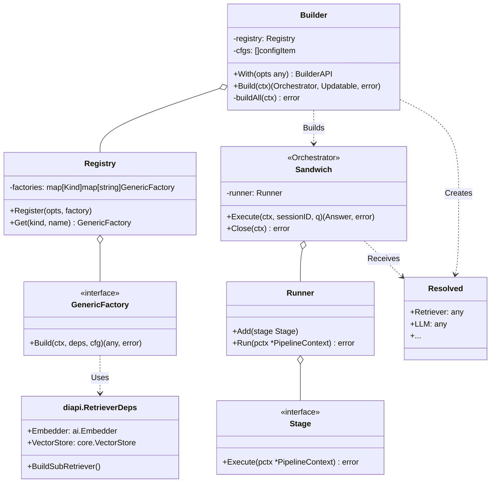
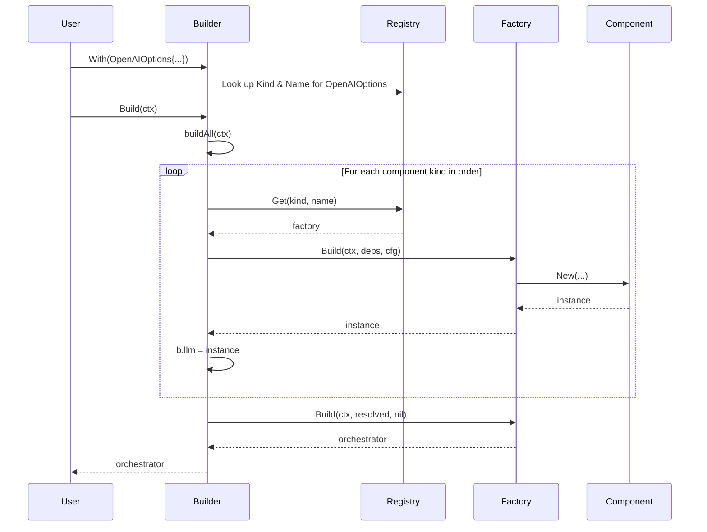

### 1. Purpose & Scope

This Low-Level Design (LLD) document details the technical implementation of the Manglekit SDK's core systems as of version 0.4.0. It covers the `Builder` subsystem, the generic `Registry`, provider factory signatures, the `diapi` dependency injection layer, and the lifecycle of components within the functioning `Sandwich` orchestrator. It serves as a bridge between the high-level architecture in `CONTEXT.md` and the Go source code.

### 2. Component Diagram

This diagram shows the key structs and interfaces and their relationships during the build and execution process.



### 3. Builder Subsystem

The build process is orchestrated by `manglekit.Builder`. It is a stateful object that collects component configurations and then instantiates them in a specific, hard-coded order to resolve dependencies.

**Sequence:**
1.  **Initialization**: `NewBuilder(registry)` creates a builder instance.
2.  **Configuration**: The user calls `With(opts)` for each component. The builder uses the `reflect.TypeOf(opts)` to look up the component's `Kind` and `Name` in the registry.
3.  **Build Trigger**: The user calls `Build(ctx)`.
4.  **`buildAll` Execution**: The builder iterates through a hard-coded `order` of `core.Kind`s (Embedder -> VectorStore -> Retriever, etc.).
5.  **Factory Invocation**: For each component, it:
    a. Creates the required dependency struct (e.g., `diapi.RetrieverDeps`).
    b. Fetches the `GenericFactory` from the registry.
    c. Calls `factory.Build(ctx, deps, cfg)`.
6.  **Assignment**: The returned component instance is assigned to a field on the builder (e.g., `b.retriever = ...`).
7.  **Orchestrator Creation**: After all components are built, they are packaged into a `core.Resolved` struct, which is passed to the orchestrator's factory.



### 4. Factory Interface Layer

All provider factories conform to a generic signature, which is wrapped by `manglekit.typedFactory`.

**Generic Signature:**
`func(ctx context.Context, deps D, cfg O) (T, error)`

-   `T`: The component's interface type (e.g., `llm.Client`).
-   `D`: The component's specific dependency struct from `diapi` (e.g., `diapi.LLMDeps`).
-   `O`: The component's specific options struct, which must implement `core.ProviderOptions`.

**Example Snippet (OpenAI LLM Factory):**
```go
// From: internal/providers/llm/openai.go
manglekit.Register(r, llm.OpenAIOptions{},
    func(ctx context.Context, deps diapi.LLMDeps, cfg llm.OpenAIOptions) (llm.Client, error) {
        // ... factory logic ...
    },
)
```

### 5. Dependency Injection Layer

Dependencies are provided to factories via typed structs defined in the `core/diapi` package. This avoids long, untyped function signatures.

-   **`diapi.EmbedderDeps`**: `{ Genkit: *genkit.Genkit }`
-   **`diapi.VectorStoreDeps`**: `{ Embedder: ai.Embedder }`
-   **`diapi.RetrieverDeps`**: `{ Embedder: ai.Embedder, VectorStore: core.VectorStore, BuildSubRetriever: func(...) }`
-   **`diapi.LLMDeps`**: `{ Genkit: *genkit.Genkit }`
-   **`diapi.RerankerDeps`**: `{ Embedder: ai.Embedder }`
-   **`diapi.StateProviderDeps`**: `{}` (empty)
-   **`diapi.RuleSetDeps`**: `{}` (empty)

**Initialization Order:** The `builder.go:buildAll` method defines a hard-coded build order to satisfy these dependencies implicitly. For example, `KindEmbedder` is always built before `KindVectorStore`.

### 6. Provider Family Details

#### Retriever: `hybrid`
-   **Factory Entrypoint**: `internal/providers/hybrid/Register`
-   **Registered Key**: `hybrid` (from `retrieve.HybridOptions{}.ProviderName()`)
-   **Config Struct**: `retrieve.HybridOptions`
-   **Dependencies**: `diapi.RetrieverDeps`. Notably uses `deps.BuildSubRetriever` to construct its children.

#### LLM: `openai`
-   **Factory Entrypoint**: `internal/providers/llm/RegisterOpenAI`
-   **Registered Key**: `openai-chat` (from `llm.OpenAIOptions{}.ProviderName()`)
-   **Config Struct**: `llm.OpenAIOptions`
-   **Dependencies**: `diapi.LLMDeps`.

### 7. Configuration Binding

Configuration from `config.yaml` is mapped to provider `Options` structs by the `FromConfig` function in `from_config.go`. This process relies on `mapstructure` tags.

**YAML Example:**
```yaml
llm:
  provider: openai-chat
  config:
    apiKey: ${OPENAI_API_KEY}
    model: "gpt-4-turbo"
```

**Go Mapping (`llm.OpenAIOptions`):**
```go
type OpenAIOptions struct {
	Model         string  `yaml:"model"`
	APIKey        string  `yaml:"apiKey"`
	// ... other fields
}
```
The `FromConfig` loader finds the `openai-chat` provider, gets its associated `Options` type from the registry, and uses `yaml.Unmarshal` to populate it.

### 8. Lifecycle & Resource Management

1.  **Creation**: All components are created once during the `Builder.Build` call.
2.  **Reuse**: The same component instances are used for the lifetime of the orchestrator.
3.  **Closure**: **(CURRENTLY BROKEN)** Components that need cleanup (e.g., database clients) are supposed to have their `Close` methods collected by the builder as `core.ResourceCloser` functions. The orchestrator's `Close` method is then supposed to invoke all of them. This connection is currently missing, and resources are not cleaned up.

### 9. Logging & Observability Hooks

The `core.Observability` struct is the single injection point for logging, tracing, and metrics. The `Builder` creates a default `zap` logger if none is provided. This struct is passed down to every component factory via its `deps` struct.

### 10. Example Construction Path

1.  **Config**: `config.yaml` specifies `retriever: hybrid`.
2.  **Builder**: `FromConfig` calls `builder.With(retrieve.HybridOptions{...})`.
3.  **Registry**: The builder looks up `retrieve.HybridOptions` and finds the `hybrid` retriever factory.
4.  **Build `hybrid`**: The builder invokes the hybrid factory.
5.  **Factory Logic**: The hybrid factory calls `deps.BuildSubRetriever` for "bm25" and "dense".
6.  **Instance**: The factory returns a `hybrid.Retriever` instance containing the bm25 and dense sub-retrievers.
7.  **Final Assembly**: The `hybrid.Retriever` instance is placed in the `core.Resolved` struct, which is then used to build the `Sandwich` orchestrator.

### 11. Design Constraints & Guardrails

-   The build order is rigidly defined in `builder.go:buildAll`. A component cannot depend on another component that is later in the build order.
-   All provider options structs *must* embed `core.ProviderOptions` to be compatible with the registry.
-   Factories must not panic; they should return errors.

### 12. Deviations & Pending Refactors

This section mirrors the "Known Gaps" in `CONTEXT.md` and the findings in `code-review.md`.

-   **`core.Resolved` Type Safety**: The `any` types in `core.Resolved` should be replaced with concrete interface types to eliminate runtime type assertions in factories.
-   **Resource Cleanup**: The `ResourceCloser` functions collected by the builder must be passed to and used by the orchestrator.
-   **Declarative Pipeline**: The `declarative` orchestrator is non-functional and needs to be either fully implemented within the builder system or removed.
-   **Hybrid Retriever Composition**: The `hybrid` retriever's dependencies should be specified in its configuration, not hard-coded in its factory.
-   **DI for Shared Clients**: Shared clients (like the OpenAI client) should be created once by the builder and injected into providers, not created by each provider factory.

### 13. Changelog

-   **2025-10-17**: Created LLD to document the v0.4.0 implementation. Detailed the builder, registry, and DI systems. Captured the current, flawed resource management lifecycle and the non-functional state of the declarative pipeline. Aligned design constraints and deviations with `CONTEXT.md`.