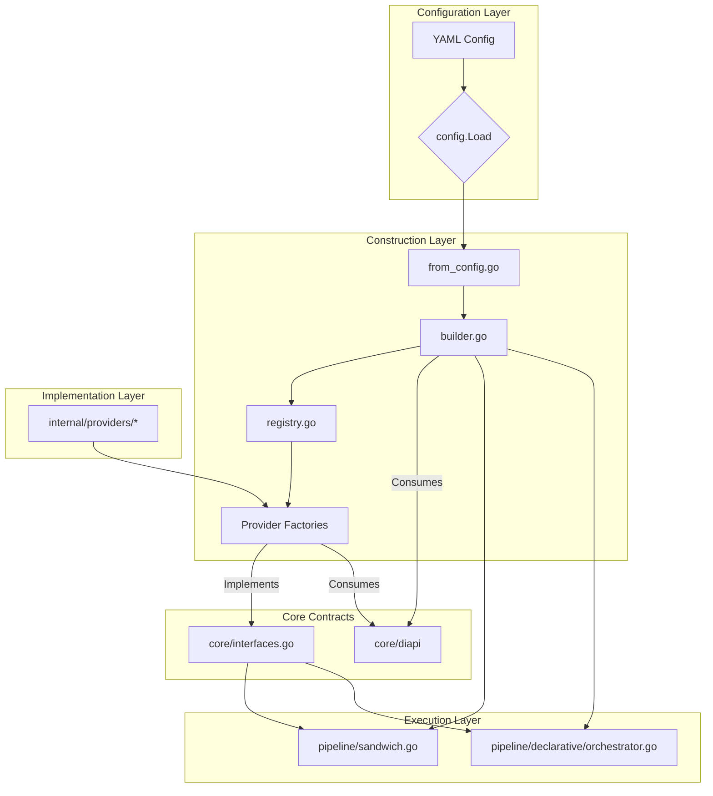
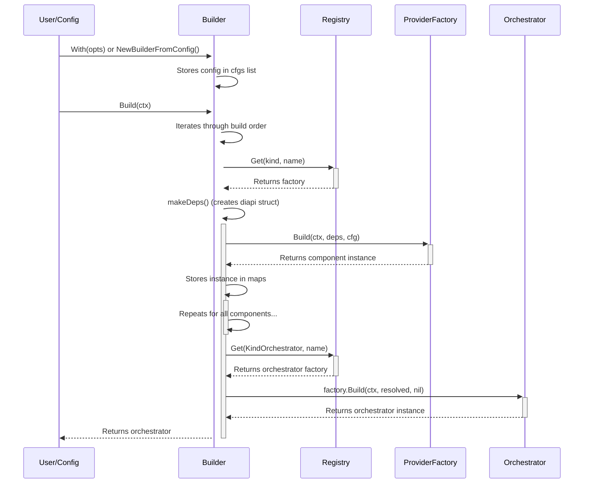

# 1. Purpose & Scope

This document provides a detailed low-level design for the Manglekit SDK's core framework components. It covers the Builder, Registry, provider factories, dependency injection mechanism, and the stage-based pipeline architecture. It is intended to be a technical reference for developers extending the framework or diagnosing its behavior.

# 2. Component Diagram



# 3. Builder Subsystem

The `Builder` is the central component for constructing an orchestrator. It follows a data-driven process where component specifications are defined in a `specTable`, ensuring a predictable build order and handling of dependencies.

**Process Flow:**
1.  **Configuration:** The builder is configured either programmatically via `With(opts)` calls or from a YAML file via `NewBuilderFromConfig`.
2.  **Component Grouping:** All configured components are grouped by their `core.Kind`.
3.  **Ordered Build:** The builder iterates through a hard-coded build order (`Embedder` -> `VectorStore` -> `Retriever`, etc.).
4.  **Factory Invocation:** For each component, it looks up the corresponding factory in the `Registry`, creates a typed dependency struct (`diapi.*Deps`), and invokes the factory's `Build` method.
5.  **Instance Caching:** The newly built component instance is stored in two places: a map of all components of that kind (e.g., `b.retrievers`) and a single-instance field (e.g., `b.retriever`). The latter serves as the default dependency for subsequent components.
6.  **Orchestrator Creation:** After all components are built, the `Resolved` struct is assembled and passed to the selected orchestrator's factory.



# 4. Factory Interface Layer

All component factories must adhere to the `core.Factory` interface.

```go
// core/provider.go
type Factory interface {
	Build(ctx context.Context, deps any, cfg any) (any, error)
}
```

Dependencies are provided via typed structs defined in the `core/diapi` package. This provides type safety and avoids reflection-based dependency injection.

```go
// core/diapi/deps.go

// LLMDeps provides dependencies for LLMClient factories.
type LLMDeps struct {
	Genkit *genkit.Genkit
}

// RetrieverDeps provides dependencies for Retriever factories.
type RetrieverDeps struct {
	Embedder          ai.Embedder
	VectorStore       core.VectorStore
	BuildSubRetriever func(ctx context.Context, name string, params map[string]any) (core.Retriever, error)
}
```

# 5. Dependency Injection Layer

The builder manages dependency injection. The primary mechanism is providing the *last-built* component of a given kind as a default dependency for subsequent components.

*   `diapi.EmbedderDeps`: No Manglekit dependencies.
*   `diapi.VectorStoreDeps`: Receives the last-built `ai.Embedder`.
*   `diapi.RetrieverDeps`: Receives the last-built `ai.Embedder` and `core.VectorStore`.
*   `diapi.LLMDeps`: For OpenAI-compatible providers, it receives a shared `*openai.OpenAI` client via the `diapi.OpenAIClientProvider` interface, which the builder itself implements.

This implicit, order-dependent injection is a known design constraint. Circular dependencies are prevented by the hard-coded linear build order.

# 6. Provider Family Details

### LLM: `openai`
*   **Factory Entrypoint:** `llm.NewOpenAI`
*   **Registered Key:** `openai`
*   **Config Struct:** `llm.Options`
*   **Dependencies:** `diapi.LLMDeps`, `diapi.OpenAIClientProvider`

### Retriever: `bm25`
*   **Factory Entrypoint:** `retrievers.NewBM25`
*   **Registered Key:** `bm25`
*   **Config Struct:** `retrievers.BM25Options`
*   **Dependencies:** `diapi.RetrieverDeps` (though it doesn't use them)

### Retriever: `hybrid`
*   **Factory Entrypoint:** `hybrid.NewHybrid`
*   **Registered Key:** `hybrid`
*   **Config Struct:** `hybrid.HybridOptions`
*   **Dependencies:** `diapi.RetrieverDeps`. Critically uses `deps.BuildSubRetriever` to construct its underlying retrievers by name.

# 7. Configuration Binding

Configuration from YAML files is mapped to provider-specific `Options` structs via `json.Unmarshal`. Field names in the YAML should be `camelCase`.

**YAML Example (`config.yaml`):**
```yaml
llm:
  provider: openai
  options:
    apiKey: "${OPENAI_API_KEY}"
    model: "gpt-4-turbo"
```

**Go Mapping:**
The `resolveOptions` function in `from_config.go` finds the registered `Options` struct for the `openai` provider (`internal/providers/llm/openai.Options`) and unmarshals the `options` map into it.

```go
// internal/providers/llm/openai/openai.go
type Options struct {
	APIKey   string `json:"apiKey"`
	Model    string `json:"model"`
	BaseURL  string `json:"baseURL"`
}
```

# 8. Lifecycle & Resource Management

Resource cleanup is handled via the `core.ResourceCloser` function type (`func(ctx context.Context) error`).

1.  Factories for components that manage external resources (like a database connection) can return a value that implements an optional `Close(ctx) error` method.
2.  The builder's `specTable` contains logic to check for this method. If it exists, the method is appended to a list of `ResourceCloser` functions (`b.opts.ResourceClosers`).
3.  This list is passed to the final orchestrator inside the `core.Resolved` struct.
4.  The orchestrator's `Close` method is responsible for iterating through these functions and executing them, ensuring graceful shutdown.

# 9. Logging & Observability Hooks

The `core.Observability` struct, containing a logger, tracer, and meter, is the central point for instrumentation.

*   It is configured on the `Builder` via `WithObservability()`.
*   It is stored in `b.opts`.
*   It is passed to the final orchestrator via the `core.Resolved` struct.
*   Individual pipeline stages and components receive the logger and meter from the orchestrator during execution.

# 10. Example Construction Path

Tracing the `hybrid` retriever:
1.  **Config:** YAML defines a retriever with `provider: hybrid` and `options: { retrievers: ["bm25", "dense"], rrf_k: 60.0 }`.
2.  **Builder Init:** `NewBuilderFromConfig` resolves the provider name and options, calling `b.WithKind(core.KindRetriever, "hybrid", hybrid.HybridOptions{...})`.
3.  **Build Process:**
    *   The `buildAll` method reaches `core.KindRetriever`.
    *   It gets the `hybrid` factory from the registry.
    *   It creates `diapi.RetrieverDeps`, which includes the last-built embedder/vectorstore and the `b.BuildRetriever` function.
    *   It calls `hybrid.NewHybrid.Build(ctx, deps, cfg)`.
4.  **Factory Execution:**
    *   The `hybrid` factory receives the deps and config.
    *   It iterates through its configured sub-retriever names (`"bm25"`, `"dense"`).
    *   For each name, it calls the `deps.BuildSubRetriever` function.
    *   This function in the builder finds the `bm25` factory, builds it, and returns the instance.
    *   The `hybrid` retriever stores the returned sub-retriever instances.
5.  **Instance:** The fully constructed `hybrid` retriever is returned to the builder and stored.

# 11. Design Constraints & Guardrails

*   **No Runtime Type Switches for DI:** Dependencies are passed via strongly-typed `diapi` structs, not `map[string]any` or runtime reflection.
*   **No Global Singletons:** Component instances are managed by the builder and contained within the orchestrator. There are no package-level global instances.
*   **Stateless Factories:** Provider factories should be stateless. All configuration and dependencies are passed in via the `Build` method.
*   **Explicit Dependency Resolution:** While the current model is order-dependent, the goal is to move towards explicit, named dependency resolution in configuration.

# 12. Deviations & Pending Refactors

This section lists technical debt and deviations from the ideal architecture, sourced from the code review.
*   **Hard-Coded Default Orchestrator:** The builder defaults to `"sandwich"`, which should be an explicit choice.
*   **Arbitrary Component Selection:** The `Sandwich` orchestrator non-deterministically picks the first available component from its dependencies.
*   **Redundant `WithKind` Method:** The builder supports a legacy `WithKind` method alongside the preferred type-safe `With` method, increasing API complexity.
*   **Implicit Dependency Injection:** The "last-built" component injection pattern is fragile and relies on configuration order.
*   **Monolithic `specTable`:** The builder's core build logic is centralized, violating the Open/Closed principle.
*   **Hard-coded `TopK` in Tooling:** Declarative pipeline tools have hard-coded parameters, limiting configurability.

# 13. Changelog

*   **2025-10-19:** Initial draft of the LLD. Documented the data-driven builder, registry, factory patterns, and pipeline execution flow. Synchronized deviations with the formal code review.
