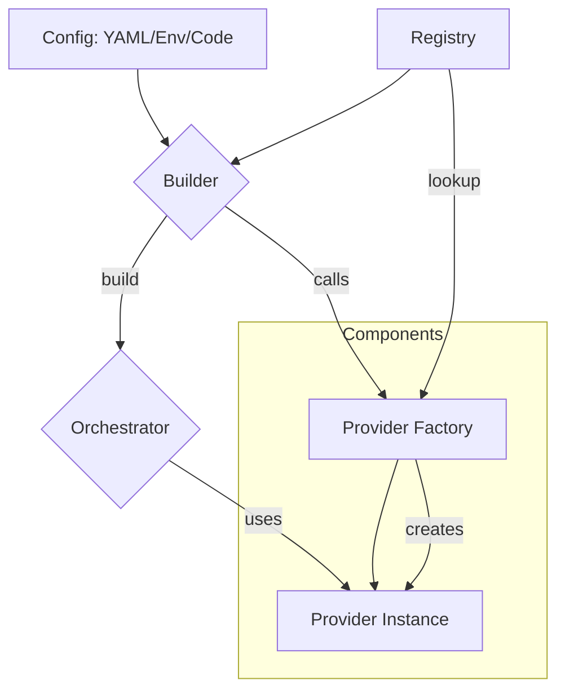

## 0. Implementation Snapshot (Current State)

The Manglekit SDK is currently in a partially stable state. A major refactoring has introduced a factory-based architecture, which is a significant improvement. However, several architectural smells remain, impacting type safety, maintainability, and developer experience.

- **Builder (`builder.go`):** The `Builder` uses a fluent API to configure an orchestrator. It relies on a `Registry` to find and instantiate components via strongly-typed factories. It correctly uses a `SubRetrieverBuilder` interface to prevent leaking the full builder API to composite components. However, its public API is inconsistent (`WithEmbedder` behaves differently), and it has an unusable internal `clients` map for dependency injection.

- **Config (`config.go`):** Configuration is handled by `NewBuilderFromYAML` and `NewBuilderFromEnv`. These functions are tightly coupled to the builder, reading configuration and directly calling builder methods. This violates the Single Responsibility Principle and involves significant code duplication.

- **Pipelines:**
    - **`pipeline/sandwich.go`:** The `Sandwich` orchestrator is the default pipeline. Its `Execute` method is a "god method" that handles all aspects of the RAG flow, from state management to rule evaluation. It uses "magic strings" for metadata keys, which is error-prone.
    - **`pipeline/declarative/orchestrator.go`:** This pipeline is currently disabled and stubbed out.

- **Rules Engine (`internal/providers/mangle`):** The Mangle Datalog engine is integrated as a `RuleSet` provider. It evaluates rules at `pre` and `post` stages of the `Sandwich` pipeline.

- **Provider Structure:** Providers are registered in `providers/all/all.go`. Each provider has a corresponding `Options` struct and a `Factory` function. Factories receive dependencies via a `FactoryDeps` map.

## 1. Architectural Overview

Manglekit is a Go framework for building Retrieval-Augmented Generation (RAG) applications. It uses a modular, component-based architecture where different parts of the RAG pipeline (e.g., retriever, LLM) can be swapped out. The system is configured via a fluent builder, which can be populated programmatically, from a YAML file, or from environment variables.



## 2. Dependency Rules (Non-Negotiable)

| From            | To              | Allowed | Rationale                               |
|-----------------|-----------------|---------|-----------------------------------------|
| `core`          | `any other pkg` | **No**  | Core must be dependency-free.           |
| `builder`       | `registry`      | Yes     | Builder needs to look up factories.     |
| `builder`       | `pipeline`      | **No**  | Builder constructs, does not depend on. |
| `pipeline`      | `core`          | Yes     | Pipelines use core types.               |
| `providers`     | `core`          | Yes     | Providers implement core interfaces.    |
| `providers`     | `builder`       | **No**  | Providers must not know about the builder. |

- **Type Safety:** The use of `any` to break import cycles is forbidden. Define minimal interfaces in `core` if necessary.
- **Capabilities:** Components must receive dependencies (e.g., `embedder`) via the `FactoryDeps` map, not through global variables or other side channels.

## 3. Core Contracts

- **Builder:** The `Builder`'s responsibility is to construct an `Orchestrator`. It must not contain any business logic. It provides capabilities like `WithRetriever(opts any)`.

- **Registry:** The `Registry` is a container for component factories. It provides `Register...` methods for each component type and `lookup` capabilities for the builder.

- **Factory Signatures:** All component factories must adhere to a consistent signature:
  `func(ctx context.Context, opts any, deps FactoryDeps) (ComponentType, error)`
  - `opts`: A pointer to the component-specific options struct.
  - `deps`: A map containing any required dependencies (e.g., `deps["embedder"]`).

## 4. Provider Composition

Composition of providers (e.g., a hybrid retriever using a dense and a sparse retriever) must happen inside the composite provider's factory. The factory can use the `SubRetrieverBuilder` interface, passed via `FactoryDeps`, to build its children.

## 5. Configuration Flow

A minimal YAML config maps directly to builder calls. The `name` field in the config is used to look up the corresponding factory in the registry. The `params` map is deserialized into the provider's `Options` struct.

```yaml
retriever:
  name: "bm25"
  params:
    indexPath: "/data/bm25.json"
```
This maps to: `builder.WithRetriever(&retrieve.BM25Options{IndexPath: "/data/bm25.json"})`.

## 6. Observability & Resource Lifecycle

- **Observability:** Logging, tracing, and metrics are handled via the `core.Observability` struct.
- **Resource Lifecycle:** Components that need cleanup must implement a `Close(ctx context.Context) error` method. The builder collects these as `core.ResourceCloser` functions and the orchestrator is responsible for calling them on shutdown.

## 7. Error & Metric Surfaces

- **Sentinel Errors:** `core.ErrDenied`, `core.ErrNoEvidence`.
- **Metrics:** `manglekit.rules_pre_ms`, `manglekit.retrieve_ms`, `manglekit.rerank_ms`, `manglekit.llm_ms`, `manglekit.rules_post_ms`.

## 8. Testing & Replaceability

Dependencies should be mocked at the interface level in unit tests. For example, to test a component that requires a retriever, provide a fake implementation of `retrieve.Retriever`.

## 9. Anti-Patterns (Red Lines)

- **Builder in Deps:** Passing the `Builder` instance in `FactoryDeps` is forbidden. Use narrowly-scoped interfaces like `SubRetrieverBuilder`.
- **Type Erasure:** Using `any` in core interfaces to avoid import cycles is an anti-pattern.
- **Provider Branching:** Providers must not have `if/else` or `switch` statements that branch on their own configuration. This logic belongs in the builder or a factory.

## 10. Known Gaps

| Severity | Issue                                | File(s)                                | Status |
|----------|--------------------------------------|----------------------------------------|--------|
| High     | Tight Coupling in Configuration      | `config.go`                            | Open   |
| High     | Interface Pollution & Type Safety    | `core/types.go`                        | Open   |
| High     | God Method & Magic Strings           | `pipeline/sandwich.go`                 | Open   |
| Medium   | Inconsistent Factory Signatures      | `registry.go`                          | Open   |
| Medium   | Inconsistent Builder API             | `builder.go`                           | Open   |
| Medium   | Hybrid Retriever Configuration Flaws | `internal/providers/hybrid/hybrid.go`  | Open   |
| Low      | Dead Code                            | `builder.go`, `registry.go`            | Open   |
| Low      | Disabled Declarative Orchestrator    | `pipeline/declarative/orchestrator.go` | Open   |

## 11. Provider Families

- **Retrievers:** `bm25`, `dense`, `hybrid`, `in-memory`
- **Embedders:** `google`, `openai`
- **LLMs:** `google`, `openai`
- **Rerankers:** `cosine`
- **Vector Stores:** `localvec`
- **State Providers:** `in-memory`, `redis`
- **Rule Sets:** `mangle`

## 12. Versioning & Compatibility Policy

- The project follows `semver`.
- Breaking changes to core interfaces or public APIs must result in a major version bump.
- The `context.md` file must be updated in the same commit as any architectural changes.

## 13. Machine Appendix (JSON Snapshot v1)

```json
{
  "version": "4.0.0",
  "capabilities": {
    "retrievers": ["bm25", "dense", "hybrid", "in-memory"],
    "llms": ["google", "openai"],
    "embedders": ["google", "openai"],
    "rerankers": ["cosine"],
    "vector_stores": ["localvec"],
    "state_providers": ["in-memory", "redis"],
    "rules": ["mangle"]
  },
  "factory_signatures": {
    "RetrieverFactory": "func(context.Context, any, FactoryDeps) (retrieve.Retriever, error)",
    "LLMFactory": "func(context.Context, any, FactoryDeps) (llm.Client, error)"
  },
  "registry_keys": {
    "retriever": "name",
    "llm": "name"
  },
  "metrics": [
    "manglekit.rules_pre_ms",
    "manglekit.retrieve_ms",
    "manglekit.rerank_ms",
    "manglekit.llm_ms",
    "manglekit.rules_post_ms"
  ],
  "errors": [
    "core.ErrDenied",
    "core.ErrNoEvidence"
  ]
}
```

## 14. Changelog

- **2025-10-16:** Performed a full, deep-dive code review. Updated `code-review.md` with detailed findings. Regenerated `context.md` to the "Live Standard" format, ensuring it is self-contained, up-to-date, and reflects the true state of the codebase. Synchronized "Known Gaps" with the code review. Added Mermaid diagram and JSON appendix.