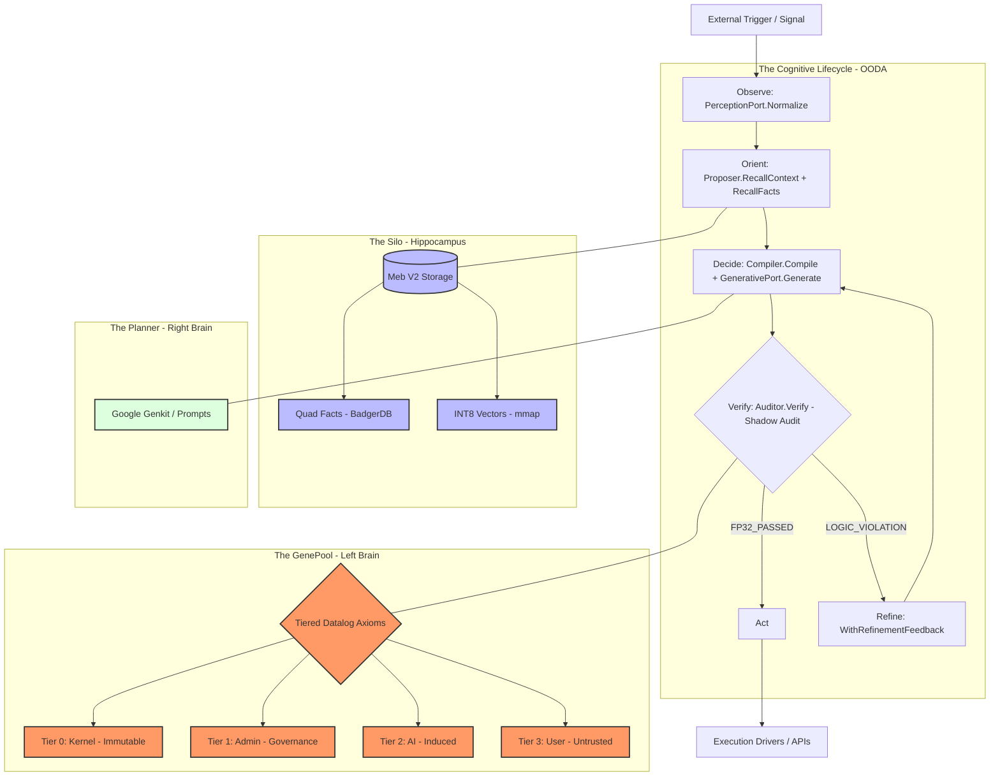

# Manglekit (Sovereign Logic Kernel) — High-Level Design (HLD)

## 1. Introduction

Manglekit v2 is an embedded **Neuro-Symbolic Sovereign Logic Kernel** for Go applications. It provides the absolute control plane for probabilistic AI systems (LLMs), executing a strict **OODA (Observe, Orient, Decide, Verify, Act)** loop.

This document outlines the high-level architecture synthesizing the best-tested implementations of Manglekit v1 (cognitive loops, ports, steering) and MEB (storage engine, vector search, concurrency).

## 2. Core Tenets

1. **Sovereign Segregation**: The Planner (LLM) proposes; the Engine (Datalog) disposes. An LLM can never execute an action directly.
2. **Deterministic State Retrieval**: Context is hydrated not just via semantic vectors, but through hard structural logic facts (SPOg Quads).
3. **Zero-Trust Execution**: Every external capability is guarded. Execution requires a valid Datalog proof.
4. **Self-Correction**: Logic constraint failures are automatically fed back to the LLM (Teacher-Student loop) for correction without application crashes.
5. **Mixed-Precision Safety**: Critical axioms (FP32) halt on violation; soft heuristics (INT8) warn but proceed.

## 3. High-Level Architecture (The OODA Loop)

Manglekit is an interception middleware pipeline representing the biological cognitive cycle.

## 4. Hexagonal Port Architecture

Manglekit's core domain has zero dependencies on external infrastructure. All capabilities are accessed through clean port interfaces (Manglekit Hexagonal pattern).

### 4.1 Port Registry

| Port Interface | Methods | Responsibility |
|----------------|---------|----------------|
| **ReasoningPort** | `Verify`, `VerifyAtoms`, `Query` | Datalog logic verification via Mangle |
| **GenerativePort** | `Generate`, `Induce`, `Embed` | LLM synthesis, knowledge distillation, embeddings |
| **GenePoolPort** | `ActiveGenes`, `Reload` | Tiered knowledge retrieval and hot-reloading |
| **PerceptionPort** | `Normalize` | Signal → Atom stream normalization |
| **GenomeStoragePort** | `MapGene`, `ReadManifest`, `CalculateFileHash`, `PersistKnowledge`, `PersistAsync`, `Flush` | Gene CRUD, mmap zero-copy, SHA256 integrity, async I/O |
| **EvidenceStorePort** | `SaveBatch`, `Load`, `FindSimilar` | Evidence storage with fuzzy deduplication |
| **CompilerPort** | `Compile` | Prompt assembly from CognitiveFrame |
| **PresentationPort** | `Render` | Decision output → Markdown formatting |
| **VectorStorePort** | `Insert`, `Search` | Semantic vector CRUD |
| **EmbeddingPort** | `Embed` | Text → vector conversion |
| **StoragePort** | `SaveTrace` | Reasoning trace persistence |
| **AuditorPort** | `Verify`, `GenerateTrace` | Abstracts verification from orchestrator |

### 4.2 Adapter Examples

| Port | Production Adapter | Mock Adapter |
|------|--------------------|--------------|
| `GenerativePort` | `gemini/adapter.go` | `mock/generator.go` |
| `ReasoningPort` | `mangle/adapter.go` | N/A (Mangle is lightweight) |
| `VectorStorePort` | `vector/flat_adapter.go` | N/A |
| `PerceptionPort` | `system/markdown_adapter.go` | N/A |

## 5. Subsystem Components

### 5.1 Memory Layer: The Silo (MEB V2)

The Silo holds all persistent state and agent working memory.

- **Quad Store**: Stores structural graphs `quad(Subject, Predicate, Object, Graph)`. Uses 33-byte **Big-Endian** prefix encoding in BadgerDB for correct lexicographic ordering.
- **Vector Store**: Maintains Matryoshka-reduced (64-d) INT8 quantized vectors memory-mapped directly into RAM for <5ms semantic searches.
- **Dictionary**: Sharded (32 buckets via FNV-1a) string-to-uint64 interning with per-shard `sync.RWMutex`.
- **VLog GC**: Background goroutine probes every 15 minutes with `RunValueLogGC(0.5)`.

### 5.2 Reasoning Layer: The GenePool & LFTJ

- **Rule Tiers (4 Levels)**: Tier 0 (Kernel/Immutable) → Tier 1 (Admin/Governance) → Tier 2 (AI/Induced) → Tier 3 (User/Untrusted).
- **Execution**: Leapfrog Triejoin (LFTJ) query engine for worst-case optimal join performance.
- **Integrity**: SHA256 signature verification on every gene at boot time via `GeneManifest`.
- **Circuit Breakers**: 5-level recursion depth limit + 2,000ms global timeout.

### 5.3 Neural Layer: The Planner & Prompt Compiler

- **Prompt Compiler**: Assembles prompts using functional options (`WithGenes`, `WithAxioms`, `WithContext`, `WithFacts`, `WithSteeringMagnitude`, `WithRefinementFeedback`, `WithSessionHistory`).
- **Attention Sink**: Tier 0 axioms are pinned at the prompt's start, exploiting transformer attention bias toward early tokens.
- **Context Manager**: Dynamic token budget with sharpening (budget tightens as `LogicSuccess` drops). "Strategic Summoning" filters by intent. "Intelligent Shaving" drops `Weight < 0.5` atoms above 24k tokens.
- **EAST Steering**: `P = exp(1-L) / N`. When `P > 0.8`, injects "Cognitive Paradoxes" forcing conservative LLM output.

### 5.4 Guard Layer: The Zero-Trust Supervisor

- Implements the `SupervisedAction` hook wrapping any `core.Action`.
- **Pre-Execution:** Flattens payload to facts → Shadow Audit via Datalog.
- **Post-Execution:** Reflects on output for compliance validation.
- **Teacher-Student:** Failed audits feed violation details back to the Compiler for LLM self-correction (max 3 iterations, then deadlock halt).

### 5.5 Knowledge Induction Pipeline

Converts unstructured text into verified Datalog genes:

1. `PerceptionPort.Normalize()` → Stream of `Atom` payloads.
2. Evidence extraction and deduplication via `SimilarityStorePort`.
3. `GenerativePort.Induce()` → LLM distills Datalog rules.
4. Post-generation sanitization (strip fences, validate syntax).
5. `Auditor.Verify()` → Shadow Audit against Tier 0/1 axioms.
6. `GenomeStoragePort.PersistKnowledge()` → Gene crystallized as `.dl` file.

### 5.6 Proposer Service (Tri-Stream Context Recall)

During Orient, the Proposer fetches context from two parallel streams:
- **Semantic Stream:** Vector similarity via `chunker.RetrieveContext(query, limit=5)`.
- **Fact Stream:** N-Quads file retrieval via `storage.ReadFile(nqPath)`.

Both streams merge into `CognitiveFrame.Context`.

## 6. Flow Specification: The Teacher-Student Correction

1. **Planner Generates Plan**: LLM proposes `DeleteUser(user="duyng")`.
2. **Supervisor Intercepts**: Flattens payload to facts → `quad("payload_user", "is", "duyng", "temporal")`.
3. **GenePool Evaluates**: `halt("Unauthorized") :- quad("payload_user", "is", U, _), not quad("user", "owns", U, _).`
4. **Audit Fails**: Rule evaluates to true. Returns `AuditResult{Pass: false, ViolationTier: TIER_0}`.
5. **Refinement**: Compiler re-invoked with `WithRefinementFeedback(auditResult, previousDraft)`.
6. **Planner Adapts**: LLM tries alternative or gracefully informs user.
7. **Deadlock Guard**: If loop > 3 iterations → Epoch terminated.

## 7. Deployment Architecture

Manglekit is a Go library. It compiles natively directly into the target binary.

- **Standalone Daemon**: Runs as the main loop via `manglekit serve`.
- **Embedded Module**: Middleware via `Supervise(Action)` wrapping inside web servers.
- **REPL Mode**: Interactive Datalog shell for live inspection.

## 8. Boot Sequence

1. **Integrity Shield**: Verify `genomes/core/` SHA256 signatures against `manifest.yaml`.
2. **Memory Map**: `GenomeStoragePort.MapGene()` returns `([]byte, uintptr)` for zero-copy access.
3. **Port Handshake**: Verify Gemini/Mangle adapter connectivity.
4. **Gene Pinning**: Load Tier 0 genes into `AttentionSink`.
5. **VLog GC**: Start background BadgerDB garbage collection ticker.
6. **Ready**: Enable Global Observer, accept Signals.
